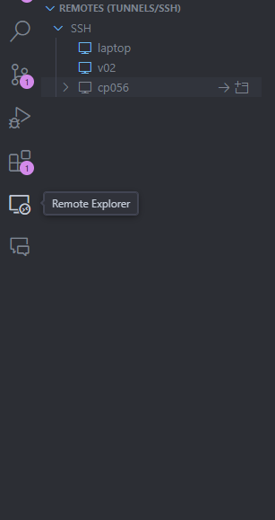
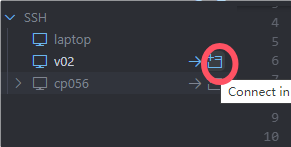

项目操作

step 01:

打开VS code

step 02:

点击Remote Explorer




step 03:

点击




这样我们就启动了一个新的窗口


step 04:

Enter password: 110


这样看到如下界面表示连接成功


step 05:

点击上面的terminal

New terminal

这样我们就打开了一个终端窗口


step 06:

输入如下命令:

``` bash

source ~/.bash_profile

```


这个命令是第一次创建anna会话时使用的命令

``` bash

tmux new -s anna

```

``` bash

start56

```


``` bash

source ~/.bash_profile

```

这样就进入了56号节点


创建完成后第二次如果希望使用anno会话，则使用如下命令

``` bash

tmux ls

```

这个命令是查看有哪些会话


找到名称为anna的会话后使用下面命令进入该会话

``` bash

tmux attach -t anna

```


step 07:

在进入会话后，使用如下命令进入自己的项目文件夹


``` bash

cd /home/cuis/common/projects/IBDNanostring/RawData/scLIHC/AnnaProjects

```

这里需要学习到第一个命令就是cd命令

cd命令代表change directory

在linux系统中操作切换目录的方式就是cd命令


step 08:

创建第一个项目文件夹

我们第一个项目叫做scESCC，所以我们需要创建一个文件夹名称为scESCC的文件夹

``` bash

mkdir -p scESCC

```

如何查看该文件夹是否创建呢?

``` bash

ls -alh

```

结果为

``` text

$ls -alh
total 7.5K
drwxr-xr-x 3 cuis gid-caserodlab 24 Jan  2 20:08 .
drwx------ 4 cuis gid-caserodlab 52 Jan  2 20:02 ..
drwxr-xr-x 2 cuis gid-caserodlab  0 Jan  2 20:08 scESCC


```


再创建1个文件夹

第一个是Results


``` bash

mkdir -p Results

```


**********************


如何操作使用文档


第一步打开运行环境，这里使用ipython命令

``` bash

source activate rapid

ipython

```

这样就进入了运行环境


每次进入环境，第一步就是切换到项目目录

使用如下python命令

``` python

import os

os.chdir("/home/cuis/common/projects/IBDNanostring/RawData/scLIHC/AnnaProjects/scESCC/Results")

```


如何确认自己目前的工作文件夹，使用如下命令:


``` python

os.getcwd()

```

下面使用一个scvi-tools给的测试数据进行项目环境测试


导入python的包

``` python

import os
import tempfile

import scanpy as sc
import scvi
import seaborn as sns
import torch


sc.set_figure_params(figsize=(6, 6), frameon=False)
sns.set_theme()
torch.set_float32_matmul_precision("high")
save_dir = tempfile.TemporaryDirectory()

%config InlineBackend.print_figure_kwargs={"facecolor": "w"}
%config InlineBackend.figure_format="retina"

```

下载所需要的单细胞数据

``` python

os.chdir("/home/cuis/common/projects/IBDNanostring/RawData/scLIHC/AnnaProjects/scESCC/Results")

adata = scvi.data.heart_cell_atlas_subsampled(save_path=save_dir.name)
adata

```


``` python
adata.layers["counts"] = adata.X.copy()  # preserve counts
sc.pp.normalize_total(adata, target_sum=1e4)
sc.pp.log1p(adata)
adata.raw = adata  # freeze the state in `.raw`


scvi.model.SCVI.setup_anndata(
    adata,
    layer="counts",
    categorical_covariate_keys=["cell_source", "donor"],
    continuous_covariate_keys=["percent_mito", "percent_ribo"],
)

sc.tl.pca(adata)
sc.pp.neighbors(adata, n_pcs=30, n_neighbors=20)
sc.tl.umap(adata, min_dist=0.3)

```

画图

``` python

sc.pl.umap(
    adata,
    color=["cell_type"],
    frameon=False,
    save = "test.png"
)
sc.pl.umap(
    adata,
    color=["donor", "cell_source"],
    ncols=2,
    frameon=False,
    save = "test2.png"
)

```


