### Fig.1a

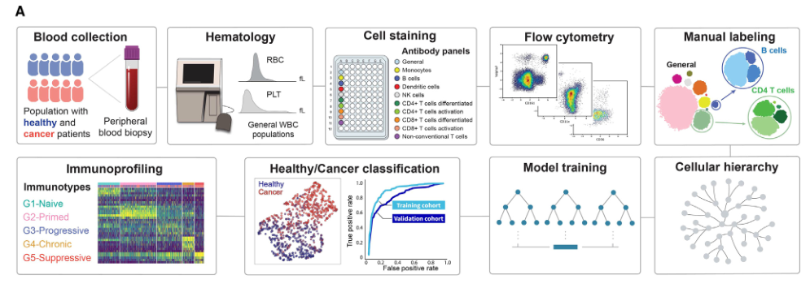

结果描述：
在图1A中，免疫分析管道开发的工作流程如下：
1. 从健康供体和癌症患者采集的外周血样品中分离白细胞（WBC）。
2. 使用血液分析仪测量全血细胞计数（CBC）。
3. 使用自定义抗体面板在96孔板中对WBC进行染色。
4. 使用多参数流式细胞术处理WBC。
5. 手动标记的流式细胞术数据用于训练机器学习模型，自动识别细胞群体。
6. 最后，实施健康/癌症和免疫类型的分类。

图例描述：
1. 工作流程图展示了从外周血样品中分离WBC到最终分类的全过程。WBC从健康供体和癌症患者中收集，通过血液分析仪进行全血细胞计数，然后在96孔板中使用自定义抗体面板染色。
2. 染色后的WBC通过多参数流式细胞术处理，生成流式细胞术数据。
3. 手动标记的流式细胞术数据用于训练机器学习模型，自动识别细胞群体。
4. 最后，通过这些机器学习模型，进行健康/癌症和免疫类型的分类。

关键结论:
图1A展示了一个综合免疫分析平台的开发流程，这个平台利用多参数流式细胞术对健康供体和癌症患者的外周血中的免疫细胞进行表征。通过手动标记的流式细胞术数据训练机器学习模型，可以自动识别细胞群体，实现了健康/癌症和免疫类型的分类。

分析目的：
图1A的目的是展示开发和实施一个综合免疫分析管道的步骤，该管道结合了湿实验室和干实验室系统，用于样品处理、数据采集、细胞群体识别、标记和量化，所有这些步骤都通过多个层次的样本和数据质量控制支持。这一流程的开发旨在创建一个自动化、高通量的流式细胞术分析平台，用于评估癌症患者的系统免疫特征，并将其与健康供体进行比较，从而揭示具有诊断或预后意义的差异。

*****

### Figure 1A方法描述：

1. **样品收集与处理**：
- 从健康供体和癌症患者的外周血样品中分离白细胞（WBC）。
- 使用血液分析仪测量全血细胞计数（CBC）。

2. **抗体染色**：
- 在96孔板中使用自定义抗体面板对WBC进行染色。设计了十个抗体面板，包括九个特定细胞类型的面板和一个通用的支架面板。

3. **流式细胞术**：
- 使用多参数流式细胞术处理染色后的WBC，获取每个样本的详细细胞数据。

4. **数据分析**：
- 手动标记流式细胞术数据，用于训练机器学习模型。
- 通过这些机器学习模型，自动识别和分类细胞群体。

5. **免疫分类**：
- 最终，通过这些机器学习模型，进行健康/癌症和免疫类型的分类。

### 比喻讲解：

1. **样品收集与处理**：
- 想象你在一个水果市场，你需要先从市场上收集不同种类的水果（健康供体和癌症患者的外周血样品）。然后你用一个天平（血液分析仪）来称重每种水果的数量（全血细胞计数）。

2. **抗体染色**：
- 接下来，你将每种水果放入不同的篮子中（96孔板），并用不同颜色的标签（抗体面板）来标记这些水果。每个标签代表一种特定的特性，例如水果的颜色、形状和大小。

3. **流式细胞术**：
- 之后，你通过一个高科技扫描仪（多参数流式细胞术）来扫描每个篮子中的水果。这个扫描仪会详细记录每个水果的特征数据。

4. **数据分析**：
- 你手动检查一些水果的特征数据（手动标记流式细胞术数据），并用这些数据来训练一个智能系统（机器学习模型）。这个智能系统能够自动识别和分类所有水果。

5. **免疫分类**：
- 最终，你使用这个智能系统来自动分类市场上的所有水果（健康/癌症和免疫类型分类）。这样，你就能轻松地知道每种水果的种类和特性，而不需要手动一个一个地检查。

通过这种方式，科学家们能够有效地分析大量样品中的免疫细胞，自动化地识别和分类不同的细胞群体，从而更好地理解健康和癌症患者的免疫系统特征。

*****

### Fig.1b

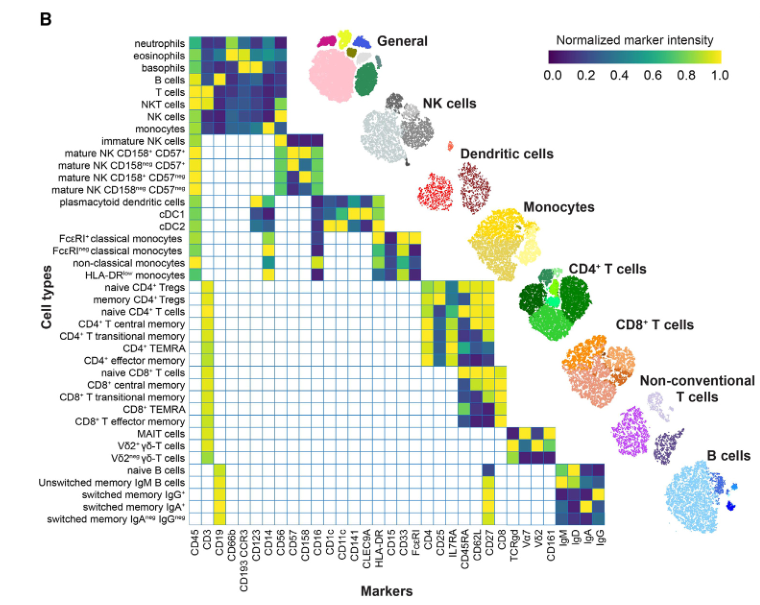

### 结果描述：
图1B展示了用于免疫细胞分析的十个抗体面板的设计及其应用。每个抗体面板包含一组特定的细胞表面标志物，用于识别和量化主要免疫细胞亚群。这些抗体面板覆盖了自然杀伤（NK）细胞、树突状细胞、单核细胞、CD4+ T细胞、CD8+ T细胞、非传统T细胞和B细胞等多种免疫细胞类型。通过多参数流式细胞术测定标记的WBC，结合机器学习模型自动识别和分类细胞群体。

### 图例描述：
1. **抗体面板示意图**：
- 热图展示了十个抗体面板中部分标志物的标准化信号强度（x轴为标志物，y轴为标记的细胞类型）。
- 热图显示了不同抗体面板中所识别的细胞类型。

2. **代表性tSNE图**：
- 右侧展示了使用这种策略识别出的免疫细胞家族的tSNE图，包括不同免疫细胞的分布情况。

### 关键结论:
图1B展示了一个综合的抗体面板设计，该面板能够广泛覆盖不同的免疫细胞亚群。通过多参数流式细胞术和机器学习模型的结合，可以自动化地识别和量化外周血样品中的650种细胞类型及其活化状态。这一方法确保了广泛的免疫细胞覆盖，并为后续的系统性免疫分析提供了基础。

### 分析目的：
图1B的目的是展示用于免疫细胞分析的详细抗体面板设计及其应用，通过多参数流式细胞术和机器学习模型，自动识别和量化外周血样品中的各种免疫细胞类型。这一分析管道的开发旨在提供一个高通量、自动化且准确的工具，用于系统性地评估健康供体和癌症患者的免疫特征，从而揭示具有诊断或预后意义的免疫细胞群体差异。

*****

### 方法描述：
Figure 1B展示了免疫分析中使用的十个抗体面板的设计和应用过程。具体方法包括：

1. **抗体面板设计**：设计了十个抗体面板，包括九个特定细胞类型的面板和一个通用的支架面板。这些面板包含了用于识别主要免疫细胞亚群的特定细胞表面标志物。
2. **细胞标记和流式细胞术**：将白细胞（WBC）与这些抗体面板进行染色，然后使用多参数流式细胞术对染色的WBC进行分析，获取每个样本的详细细胞数据。
3. **数据分析和细胞分类**：使用tSNE等方法对流式细胞术数据进行可视化，并结合机器学习模型自动识别和分类不同的免疫细胞亚群。

### 比喻讲解：
1. **抗体面板设计**：
- 想象你正在组织一个大型水果市场展览。为了方便参观者识别和了解不同种类的水果，你设计了十个展示区，每个展示区都专门展示一种特定类型的水果（如苹果、香蕉、橙子等）。在每个展示区，你都放置了对应的标签，标明每种水果的特征。

2. **细胞标记和流式细胞术**：
- 你在每个水果上贴上了标签，这些标签上详细标明了水果的种类和特性（如颜色、形状、大小等）。然后，你使用一个高科技的扫描仪（流式细胞术）来扫描这些水果，记录下每个水果的详细信息。

3. **数据分析和细胞分类**：
- 扫描后，你将这些详细信息输入到一个智能分类系统中。这个系统通过分析水果的特性，自动将它们分类，并生成一幅展示图（tSNE图），让你可以直观地看到不同种类水果的分布情况。

通过这种方式，科学家们能够利用抗体面板和流式细胞术，准确地识别和分类外周血样品中的各种免疫细胞类型，并通过数据分析和可视化技术，直观地展示免疫细胞的分布和差异。这不仅提高了分析的效率和准确性，还为进一步的免疫研究提供了宝贵的参考数据。

*****

### Fig.1c

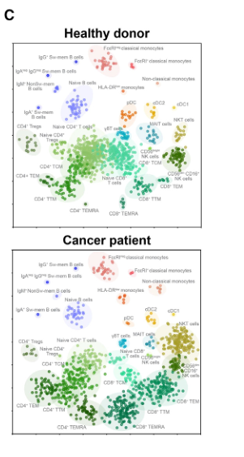

### 结果描述：

Figure 1C展示了健康供体和癌症患者的免疫状态的差异。具体来说，图中以极坐标图的形式展示了每种细胞群体在外周血单个核细胞（PBMCs）中的相对频率差异。健康供体和癌症患者在单核细胞、初始CD4+和CD8+ T细胞、中央记忆CD4+和CD8+ T细胞、终末分化CD4+和CD8+ T细胞的频率上有显著差异。

### 图例描述：

1. **极坐标图**：
- 每个极坐标图展示了一个代表性健康供体和一个癌症患者的免疫状态。每个点代表外周血单个核细胞（PBMCs）中某一细胞群体的频率。
- 图中显示了200个细胞群体的百分比，每个点代表0.5%的细胞比例。

### 关键结论:

健康供体和癌症患者在单核细胞、初始CD4+和CD8+ T细胞、中央记忆CD4+和CD8+ T细胞、终末分化CD4+和CD8+ T细胞的相对频率上存在显著差异。这些差异显示了健康供体和癌症患者的系统免疫特征的明显不同。

### 分析目的：

Figure 1C的目的是比较健康供体和癌症患者的免疫细胞组成，以揭示两者在免疫状态上的显著差异。通过这种比较，研究人员能够初步验证他们的免疫分析平台，确认其在识别和量化健康供体和癌症患者之间的免疫差异方面的有效性。这些差异可能有助于进一步研究癌症患者的免疫特征，进而用于诊断和预后分析。

*****

### Figure 1c的方法描述：
图1C展示了使用流式细胞术进行的免疫状态差异分析，该分析在以下几个步骤中实现：
1. 通过多参数流式细胞术测量健康供体和癌症患者的外周血单个核细胞（PBMC）的细胞群体。
2. 利用自定义抗体面板对不同的免疫细胞亚群进行标记和量化。
3. 将流式细胞术数据整合，使用机器学习模型自动识别和分类细胞亚群。
4. 生成雷达图（polar plot），展示了健康供体和癌症患者在不同细胞群体中的相对频率分布。每个点代表总PBMC分数的0.5%。

### 比喻讲解：
想象你在一个大型超市里购物，超市里有不同的商品分类，如水果、蔬菜、饮料等。现在，你需要比较两个购物车，一个是健康饮食者的购物车（健康供体），另一个是爱吃零食的人的购物车（癌症患者）。

1. 首先，你拿到两个购物车，分别代表健康供体和癌症患者的血液样本。
2. 你使用不同颜色的标签（自定义抗体面板）标记购物车中的商品，以便识别每种商品的类别。例如，水果标签是红色，蔬菜标签是绿色，饮料标签是蓝色。
3. 接着，你通过一台扫描器（流式细胞术）扫描每个购物车中的商品，记录每种商品的数量。扫描器不仅记录每个商品的标签，还可以识别它们属于哪个具体的子类别，如苹果、橙子（不同免疫细胞亚群）。
4. 你把扫描结果输入到一台智能计算机（机器学习模型）中，计算机会根据你的标记和记录，自动分类和计算每种商品的相对数量。
5. 最后，你生成了一个雷达图（polar plot），就像一个商品类别的分布图表。在这个图表中，每个点代表一种商品的相对频率，例如健康购物车中水果的频率较高，而零食购物车中饮料的频率较高。

通过这种方法，你可以直观地看到健康饮食者和爱吃零食者在购物车中的商品分布差异，类似地，在图1C中，你可以看到健康供体和癌症患者在不同免疫细胞亚群中的相对频率分布差异。

*****

### Fig.2a

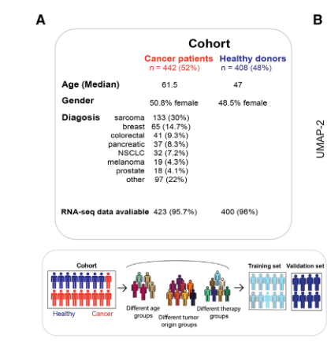

### 结果描述：
图2A展示了用于建立和评估健康/癌症分类器的队列描述。这个队列包含408名健康供体和442名癌症患者，癌症患者涵盖了84种不同的实体肿瘤诊断，并分为七个主要治疗组。队列首先根据不同的临床组进行分类，然后再分成训练集和验证集，用于构建和评估健康/癌症分类器。

### 图例描述：
1. **左图（队列描述）**：
- 队列总数为850人，其中包括408名健康供体和442名癌症患者。
- 癌症患者包含84种不同的实体肿瘤诊断，分为七个主要治疗组。
- 图中每个块表示一个特定的临床组，块的大小与组内样本数量成正比。
- 颜色编码代表不同的癌症类型和治疗组。
2. **右图（训练和验证集的划分）**：
- 队列被分成训练集和验证集，以构建和评估健康/癌症分类器。
- 图中展示了训练集和验证集的比例，确保在每个组中的样本数量足够，以便于分类器的训练和评估。

### 关键结论:
图2A明确了用于开发和验证健康/癌症分类器的队列组成和样本分布。通过合理的样本分配和详细的临床分类，确保了分类器的训练和验证过程具有代表性和科学性。

### 分析目的：
图2A的目的是展示用于构建健康/癌症分类器的队列组成和样本分布情况。通过详细的队列描述和合理的训练/验证集划分，确保分类器的开发和评估过程具有足够的样本量和代表性，从而提高分类器的准确性和可靠性。这一图例帮助理解队列的多样性和结构，为后续分析和结果解读提供了重要的背景信息。

*****

### 方法描述：
Figure 2A中的方法描述如下：

1. **队列描述**：首先，将整个队列分成不同的临床组，根据疾病的不同类型进行分类。
2. **分割数据集**：将队列划分为训练集和验证集，以构建和评估健康/癌症分类器。
3. **特征选择**：使用Max-Relevance and Min-Redundancy (MRMR)算法选择最具代表性的细胞群体，以区分健康供体和癌症患者。
4. **分类器训练**：使用选定的特征在训练集上训练一个二元分类器模型，以区分健康供体和癌症患者。
5. **模型评估**：在验证集上评估分类器的性能，通过接收者操作特征曲线下面积（ROC-AUC）指标衡量分类器的表现。

### 比喻讲解：
1. **队列描述**：
想象一下，我们要挑选一组运动员来参加不同的体育比赛。我们首先根据他们擅长的运动类型，将运动员分成不同的组，比如篮球、足球和网球。

2. **分割数据集**：
现在，我们要训练这些运动员以提高他们的技能。为此，我们将运动员分成两部分：一部分用于训练（训练集），另一部分用于测试他们的技能（验证集）。这样，我们可以确保他们在比赛中的表现是经过充分准备的。

3. **特征选择**：
接下来，我们需要找出每个运动员最擅长的技能（特征），比如跑步速度、投篮命中率、传球准确性等。我们使用一种特殊的方法（MRMR算法）来挑选出最能代表他们技能的特征，以便我们能更好地了解他们的能力。

4. **分类器训练**：
我们现在有了运动员的技能数据，接下来就是训练他们。我们利用这些特征，在训练集上训练一个模型，就像教练训练运动员一样，以便这个模型能够准确地区分哪些运动员擅长某项运动。

5. **模型评估**：
训练完成后，我们需要测试这些运动员的技能（模型的表现）。我们让他们进行模拟比赛（在验证集上测试），并通过一种评分系统（ROC-AUC）来评估他们的表现。这样，我们就能知道他们在真实比赛中能有多好的表现。

通过这些步骤，我们就能有效地将健康供体和癌症患者区分开来，就像能够挑选出最适合不同体育比赛的运动员一样。

*****

### Fig.2b

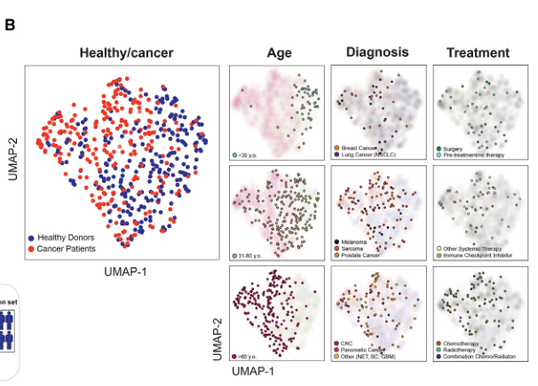

### 结果描述：
Figure 2B展示了对原始流式细胞术数据的Uniform Manifold Approximation and Projection (UMAP)分析结果，数据包括所有细胞群体。在UMAP投影中，样本根据不同变量（如是否患有癌症、年龄、诊断类型和治疗组别）进行分布可视化。分析发现，癌症患者和健康供体形成了明显的分离簇，而相似诊断的患者并未形成独特的聚类。健康供体和癌症患者之间形成了清晰的聚类分离，患者在不同年龄组中也有聚类趋势。

### 图例描述：
1. **UMAP投影图**：展示了所有细胞群体的UMAP分析结果。
2. **颜色编码**：
- 蓝色表示健康供体。
- 红色表示癌症患者。
- 不同颜色表示不同的年龄、诊断或治疗组别。
3. **数据分布**：
- 根据癌症存在与否进行的样本分布。
- 根据年龄进行的样本分布。
- 根据诊断类型进行的样本分布。
- 根据治疗组别进行的样本分布。

### 关键结论：
1. 健康供体和癌症患者在UMAP投影中形成了明显的分离簇。
2. 患者的年龄对UMAP投影中的分布有显著影响，年龄较小的健康供体和年龄较大的癌症患者分别形成聚类。
3. 相似诊断类型的患者并未形成明显的聚类，表明诊断类型在流式细胞术数据中的特征并不明显。

### 分析目的：
Figure 2B的目的是通过UMAP分析对原始流式细胞术数据进行可视化，以观察不同变量（如是否患有癌症、年龄、诊断类型和治疗组别）对样本分布的影响。通过这一分析，可以直观地展示健康供体和癌症患者之间在免疫细胞组成上的差异，进而验证和支持使用流式细胞术数据进行癌症与健康状态区分的有效性。

*****

### 方法描述：
在Figure 2B中，使用了UMAP（Uniform Manifold Approximation and Projection）分析方法对原始流式细胞术数据进行可视化。UMAP是一种非线性降维技术，可以将高维数据嵌入到二维空间中，从而揭示数据中的结构和模式。在这项研究中，UMAP分析用于评估不同变量对这一内部队列中免疫细胞异质性的影响，例如疾病的有无、患者年龄、实体瘤类型和所用治疗方法。

### 比喻讲解：
想象你是一个侦探，正在调查一个复杂的案件。你有一个房间，里面堆满了各种各样的证据，每一件都代表一个不同的信息片段（就像流式细胞术数据中的不同细胞类型）。这些证据非常多，而且每件看起来都很复杂（高维数据），让人无法一眼看清所有的关系和线索。

为了更好地理解和分析这些证据，你决定把它们排列在一个巨大的拼图板上（降维）。UMAP就像是一种神奇的工具，它能帮你把这些复杂的证据转换成一个二维的拼图图像。这个拼图图像并不直接显示所有的细节，而是揭示出其中的整体结构和模式，让你能够看到证据之间的关系和群体（细胞群体的异质性）。

在这个拼图图像中，你可以看到不同的证据簇（数据点），这些簇代表不同的病例特点（如健康和癌症患者、不同年龄段的患者、不同类型的实体瘤以及不同治疗方法的患者）。通过观察这些簇的分布和形状，你可以快速了解哪种证据类型（细胞类型）在不同情况下（例如疾病状态、年龄、治疗方法）是如何变化的。这就好比通过拼图图像，你可以看到案件的整体轮廓，并根据这些线索进一步深入调查。

通过这种方式，UMAP帮助研究人员揭示了健康供体和癌症患者之间免疫细胞组成的显著差异，并发现不同的诊断和治疗方法对免疫细胞异质性有何影响，为进一步的免疫学研究和临床应用提供了重要的洞察。

*****

### Fig.2c

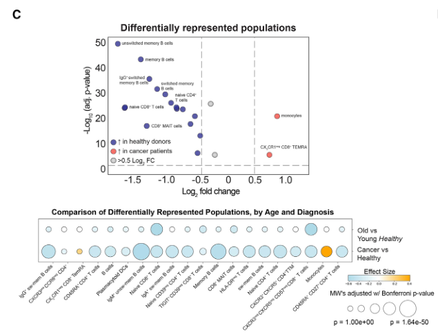

### 结果描述：
Figure 2C展示了通过使用最大相关性最小冗余（MRMR）算法和逐步留一交叉验证（stepwise leave-one-out cross-validation）从健康供体和癌症患者的流式细胞术数据中识别出的最显著不同的20种细胞群体。火山图（Volcano plot）显示了这些细胞群体在健康供体和癌症患者之间的差异，具体通过差异的对数倍数变化（log fold change）和统计显著性（p值）来表示。此外，还展示了这些细胞群体在不同年龄组（45岁为界的“年轻”和“老年”）以及健康供体和癌症患者之间的分布。

### 图例描述：
1. **火山图**展示了使用MRMR算法选出的20种显著不同的细胞群体，x轴表示log fold change，y轴表示-log10(p值)，每个点代表一个细胞群体。点的大小和颜色表示细胞群体在不同年龄组和健康/癌症状态之间的差异。
2. **两个系列的气泡图**展示了细胞群体在不同年龄组和健康供体与癌症患者之间的分布，气泡的大小表示相对频率，颜色表示统计显著性。

### 关键结论:
MRMR算法识别出20种在健康供体和癌症患者之间显著不同的细胞群体，其中包括CX3CR1阴性CD8+终末分化效应记忆T细胞（TEMRA）和单核细胞在癌症患者中显著增多，而在健康供体中，初始CD4+和CD8+ T细胞以及记忆B细胞的比例较高。这些细胞群体的分布在不同年龄组之间也存在差异，但疾病状态（健康或癌症）是更主要的变异驱动因素。

### 分析目的：
Figure 2C的目的是通过使用MRMR算法和逐步留一交叉验证，从健康供体和癌症患者的流式细胞术数据中识别出显著不同的细胞群体，并通过火山图和气泡图展示这些细胞群体的差异。通过这种分析，可以揭示健康和癌症状态下免疫细胞组成的显著差异，并评估年龄对这些差异的影响，为进一步的免疫学研究提供了关键的细胞群体目标。

*****

### 方法描述：
Figure 2c 使用了Max-Relevance和Min-Redundancy（MRMR）算法来选择在健康供体和癌症患者之间差异显著的细胞群体。具体步骤如下：
1. 使用MRMR算法根据细胞群体的相关性和冗余性进行特征选择。MRMR算法旨在最大化特征与类别之间的相关性，同时最小化特征之间的冗余性。
2. 使用逐步留一法交叉验证（stepwise leave-one-out cross-validation）评估和验证选择的特征。
3. 使用Mann-Whitney U检验和Bonferroni校正，识别健康供体和癌症患者之间显著不同的20个细胞群体。
4. 制作火山图（volcano plot），显示这些细胞群体的log fold变化和统计显著性。
5. 用气泡图展示不同年龄组和健康供体与癌症患者之间的细胞群体分布差异。

### 比喻讲解：
想象你是一位音乐指挥家，负责挑选一支交响乐团的成员，并希望这支乐团能够在一场重要的演出中完美无瑕地演奏。你的目标是挑选出那些对乐团整体表现最重要的乐手，同时避免选出演奏风格过于相似的乐手，以保持乐团的多样性和整体协调。

1. **挑选乐手：** 首先，你会评估每位乐手的独特才能以及他们对乐团整体表现的重要性。这就像使用MRMR算法选择特征时，确保选出的细胞群体与健康或疾病状态有很强的关联性。

2. **避免重复：** 同时，你还要确保挑选的乐手演奏风格各异，避免冗余。这类似于MRMR算法中的最小冗余性，确保选出的细胞群体彼此之间的信息不重复。

3. **逐步测试：** 为了确认你的选择，你会让每位乐手逐一演奏，看看他们在整个乐团中的表现。这类似于逐步留一法交叉验证，通过逐一评估每个细胞群体，确保他们在分类健康供体和癌症患者时的有效性。

4. **统计分析：** 接下来，你会使用一些音乐评审标准来确定哪些乐手的表现差异显著。这相当于使用Mann-Whitney U检验和Bonferroni校正，统计分析细胞群体在健康供体和癌症患者之间的差异。

5. **结果展示：** 最后，你会将这些乐手的表现用图表展示出来，比如一个展示每个乐手贡献的图表。对应地，研究中使用火山图和气泡图展示细胞群体的显著性差异和分布差异。

通过这个过程，你就能够组成一支多样性和协调性兼备的交响乐团，准备在演出中大放异彩。同样，通过这种方法选择的细胞群体，可以准确区分健康供体和癌症患者，具有重要的诊断和预后意义。

*****

### Fig.2d

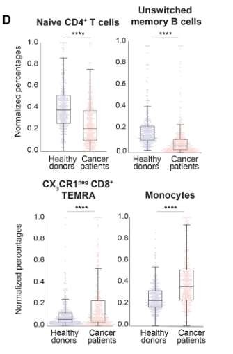

### 结果描述：
在Figure 2d中，展示了在健康供体和癌症患者之间的四种特定细胞群体的分布差异。这些细胞群体包括CX3CR1阴性的CD8+终末分化效应记忆T细胞（TEMRA）、单核细胞、幼稚型CD4+ T细胞和未转换的记忆B细胞。健康供体和癌症患者在这些细胞群体的相对频率上存在显著差异。具体结果如下：
- CX3CR1阴性的CD8+ TEMRA细胞和单核细胞在癌症患者中显著过表达。
- 幼稚型CD4+ T细胞和未转换的记忆B细胞在健康供体中显著过表达。

### 图例描述：
1. **图例描述部分：** 
- **顶部：** 显示CX3CR1阴性的CD8+ TEMRA细胞的分布情况。横轴表示健康供体和癌症患者，纵轴表示细胞群体的相对频率。
- **第二行：** 显示单核细胞的分布情况。横轴表示健康供体和癌症患者，纵轴表示细胞群体的相对频率。
- **第三行：** 显示幼稚型CD4+ T细胞的分布情况。横轴表示健康供体和癌症患者，纵轴表示细胞群体的相对频率。
- **底部：** 显示未转换的记忆B细胞的分布情况。横轴表示健康供体和癌症患者，纵轴表示细胞群体的相对频率。

2. **统计标记：** 图中使用了Mann-Whitney U检验，标记了统计显著性（****p < 0.0001），表明这些细胞群体在健康供体和癌症患者之间的分布差异显著。

### 关键结论：
健康供体和癌症患者在CX3CR1阴性的CD8+ TEMRA细胞、单核细胞、幼稚型CD4+ T细胞和未转换的记忆B细胞的相对频率上存在显著差异。具体来说，CX3CR1阴性的CD8+ TEMRA细胞和单核细胞在癌症患者中显著过表达，而幼稚型CD4+ T细胞和未转换的记忆B细胞在健康供体中显著过表达。

### 分析目的：
Figure 2d的目的是展示健康供体和癌症患者在特定细胞群体分布上的显著差异。这些差异不仅有助于理解健康和疾病状态下免疫系统的变化，还能为进一步的诊断和治疗决策提供依据。通过识别这些显著不同的细胞群体，研究人员可以更好地了解癌症对免疫系统的影响，并可能发现新的生物标志物用于癌症的早期诊断和疗效监测。

*****

### Figure 2d的方法描述：

方法描述：
Figure 2d展示了将健康供体和癌症患者根据免疫细胞组成差异进行分类的方法。具体步骤如下：
1. 从408名健康供体和442名癌症患者的外周血中采集样本，并进行完全血细胞计数（CBC）。
2. 使用流式细胞术分析每个样本的外周血免疫细胞分布。
3. 通过手动标记和机器学习模型对流式细胞术数据进行细胞类型的分类，最终识别出650种细胞类型和活化状态。
4. 使用无偏光谱聚类对34种细胞类型的标准化频率进行分析，以识别五种不同的免疫类型（G1-G5）。
5. 对健康供体和癌症患者的免疫细胞频率进行统一流形逼近和投影（UMAP）分析，将这些特征绘制在二维图中，以评估疾病的存在与否、患者年龄、实体瘤类型以及接受的治疗对免疫细胞异质性的影响。

比喻讲解：
想象你是一位侦探，需要调查一大群人（健康供体和癌症患者）的特征。为了更好地了解他们，你决定用一个高科技工具（流式细胞术）来分析他们的血液样本。这就像你用一个超级放大镜仔细观察每个人的独特指纹（免疫细胞组成）。

首先，你从每个人那里收集到他们的指纹图案（血液样本），并用放大镜仔细分析每个图案的细节（使用流式细胞术分析免疫细胞）。你发现这些指纹图案中有很多细节（650种细胞类型和活化状态），你需要对这些细节进行分类和标记（手动标记和机器学习模型）。

接下来，你将所有这些指纹图案放在一个大桌子上（使用无偏光谱聚类分析细胞类型的标准化频率），通过观察和比较，找出了五种主要的图案类型（五种不同的免疫类型G1-G5）。

然后，你使用一个特殊的地图绘制工具（UMAP分析），将这些指纹图案映射到一个二维图上，这样你可以更直观地看到每个人的特征是如何分布的。这张地图不仅展示了健康和患病人群的不同，还展示了年龄、疾病类型和治疗对这些指纹图案的影响。

通过这种方法，你就能够像侦探一样，找到健康供体和癌症患者在免疫细胞组成上的关键差异，从而帮助你更好地理解这些人群的免疫状态。这就像通过观察指纹图案的不同，发现哪些人可能有某种疾病，哪些人可能更健康一样。

*****

### Fig.2e

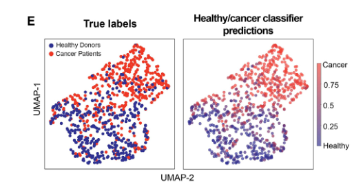

### Figure 2e的结果和图例描述

结果描述：
Figure 2e展示了使用20种选定细胞群体的频率来训练一个TabPFN分类器模型，并对内部队列的503个样本进行留一交叉验证。生成的统一流形逼近和投影（UMAP）图展示了通过分类器模型预测的标签与真实标签的比较。这些UMAP图显示出健康供体和癌症患者在选定细胞群体特征上的分布和分类准确性。

图例描述：
1. 左图展示了使用20种选定细胞群体频率的UMAP分析，比较分类器模型预测的标签与真实标签。
2. 右图展示了健康供体和癌症患者的UMAP分布图。颜色代表模型预测的标签（健康或癌症），与真实标签的匹配程度用颜色深浅表示。
3. 图中颜色梯度表示分类器模型对每个样本的预测概率，显示了健康和癌症患者之间的概率差异。

关键结论：
1. 使用选定的20种细胞群体频率，训练的TabPFN分类器模型能够有效地区分健康供体和癌症患者。
2. 模型在训练数据集上的分类表现良好，显示出高准确性和高ROC-AUC值，反映了分类器对健康和癌症状态的有效区分能力。

分析目的：
Figure 2e的目的是展示利用选定的20种细胞群体频率训练的TabPFN分类器模型在区分健康供体和癌症患者方面的有效性和准确性。通过UMAP分析和分类器模型预测标签与真实标签的比较，验证了该分类器模型在内部队列中的表现，展示了其在免疫细胞特征分析中的应用潜力。这一分析为开发基于免疫细胞群体特征的癌症诊断和预测工具提供了支持。

*****

### 方法描述：
Figure 2E 展示了使用选择的细胞群体特征进行训练的TabPFN分类器模型对训练数据集进行留一法交叉验证的结果。通过在训练数据集中留出一个样本作为测试样本，其余样本用于训练模型，然后重复此过程直到每个样本都被用作一次测试样本，评估模型的性能。使用UMAP方法对选择的细胞群体特征进行二维可视化，以显示真实标签和预测标签之间的关系，从而展示健康供体和癌症患者的分类效果。

### 比喻讲解：
想象你在一个大花园里，有各种各样的花朵，分别代表健康供体和癌症患者的不同免疫细胞群体。你想训练一只机器人（TabPFN分类器模型）来识别和分类这些花朵，以便它可以自动区分哪些花朵来自健康供体，哪些花朵来自癌症患者。

1. **采集样本**：首先，你从花园中采集了很多花朵样本（细胞群体特征）。
2. **训练机器人**：为了训练机器人，你决定采取一种特殊的方法：留一法交叉验证。这就像是你在训练机器人时，每次从花园里拿出一朵花，然后用剩下的花朵来教机器人如何区分它们。你重复这个过程，直到每朵花都被用作测试样本。
3. **创建花朵地图**：为了更好地理解机器人是如何做出分类的，你决定创建一个花朵地图（UMAP二维可视化）。这就像是你在一张大纸上绘制每朵花的位置，使得相似的花朵聚集在一起，而不同的花朵分开。
4. **查看结果**：在花朵地图上，你用不同的颜色标记出花朵的真实类别（健康供体或癌症患者），然后查看机器人的预测结果。你希望看到机器人在分类时，预测的颜色与真实的颜色尽量一致，这意味着它可以正确地识别和分类花朵。

通过这种方法，你可以看到机器人在识别花朵时的表现，了解它是否能够准确地将健康供体和癌症患者的细胞群体区分开来，并找到需要改进的地方。最终，这个训练好的机器人可以帮助你在未来的研究中快速、准确地分类新的花朵样本。

*****

### Fig.2f

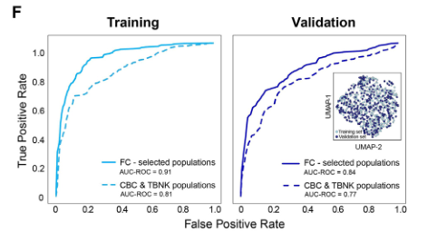

### 结果描述：
Figure 2F 展示了使用选择的20个细胞群体的标准化百分比作为特征建立的健康/癌症分类器的性能，与使用临床常用的TBNK面板和CBC分析中的主要细胞群体建立的基本模型进行比较。在训练集（n = 503）和验证集（n = 347）的表现如图所示，ROC-AUC指标用于评估模型性能。

在训练集上，基于20个选定细胞群体的分类器的ROC-AUC为0.91，而TBNK/CBC面板的ROC-AUC为0.81。在验证集上，基于20个选定细胞群体的分类器的ROC-AUC为0.84，而TBNK/CBC面板的ROC-AUC为0.77。

### 图例描述：
(A) 描述了队列和临床注释，首先将队列分类为不同的临床组，然后分为训练和验证子集，用于构建和评估健康/癌症分类器。
(B) 展示了基于原始细胞术数据的UMAP分析，数据包括所有细胞群体（选择前）。队列分布基于癌症的存在与否、年龄、诊断或治疗组。
(C) 火山图展示了使用MRMR算法选择的20个在健康供体和癌症患者之间差异显著的细胞群体，这些群体用于构建二分类健康/癌症分类器。气泡图展示了在不同年龄组（以45岁为界的“年轻”和“年老”）以及健康供体和癌症患者之间的细胞群体分布差异的统计显著性。
(D) 显示了健康供体和癌症患者之间的不同细胞群体的分布。
(E) 选择的细胞群体的UMAP分析，用于比较真实标签和预测标签，展示了患者和健康个体之间的概率梯度。
(F) 使用20个选择的细胞群体的标准化百分比作为特征建立的健康/癌症分类器的性能展示，与使用TBNK面板和CBC分析中的主要细胞群体建立的基本模型进行比较。ROC-AUC指标用于评估模型在训练集和验证集上的表现。

### 关键结论:
基于选择的20个细胞群体的标准化百分比建立的健康/癌症分类器，在训练集和验证集上的分类性能均显著优于基于临床常用的TBNK面板和CBC分析中的主要细胞群体的基本模型。具体表现为更高的ROC-AUC值，表明该分类器在健康供体和癌症患者的区分上具有更高的准确性和特异性。

### 分析目的：
Figure 2F 的目的是评估并展示使用选择的20个细胞群体的标准化百分比建立的健康/癌症分类器的性能，并与基于临床常用的TBNK面板和CBC分析中的主要细胞群体的基本模型进行比较。通过ROC-AUC指标对模型性能的评估，展示新分类器在健康供体和癌症患者分类中的优越性，以证明其在临床应用中的潜力。

*****

### Figure 2f 方法描述

#### 方法描述：

在Figure 2f中，研究人员构建并评估了一个用于区分健康供体和癌症患者的分类器模型。具体方法如下：

1. **数据集的准备**：
- 从内部队列中收集503个样本作为训练集，347个样本作为验证集。

2. **特征选择**：
- 通过MRMR算法选择了20个差异显著的细胞群体，作为分类器的特征。

3. **模型构建**：
- 使用这些特征构建一个二元分类模型，用于区分健康供体和癌症患者。

4. **模型训练与验证**：
- 在训练集上训练模型，并在验证集上评估其性能。
- 同时，使用TBNK面板和标准CBC分析中的主要细胞群体，构建一个基础模型进行比较。

5. **性能评估**：
- 通过ROC-AUC（接收者操作特征曲线下面积）评估模型的性能。
- 将分类器在训练集和验证集上的表现与基础模型进行比较。

#### 比喻讲解：

**比喻讲解**：

想象一下，你正在举办一个水果分类比赛，你需要区分苹果和橘子。你决定通过水果的颜色、形状、大小等特征来进行分类。以下是如何实现这一过程的详细比喻：

1. **数据集的准备**：
- 你从市场上收集了许多水果样本（总共850个），其中一部分（503个）用来训练你的分类器，另一部分（347个）用来验证你的分类器。

2. **特征选择**：
- 你发现某些特征，比如颜色、形状、大小，对区分苹果和橘子非常重要。通过分析，你挑选了20个最具区分度的特征，这些特征就像水果的不同属性，例如颜色的深浅、形状的圆润度、大小等。

3. **模型构建**：
- 你使用这些选定的特征，设计了一个水果分类器。这个分类器就像一个智能的筛选器，可以根据输入的特征，判断出水果是苹果还是橘子。

4. **模型训练与验证**：
- 你用收集的503个水果样本来训练这个分类器，让它学会如何根据这些特征来区分苹果和橘子。接着，你用另外347个水果样本来验证分类器的表现，看它在新的水果样本上是否也能准确分类。
- 同时，你也用一些简单的特征，比如水果的基本形状和颜色，构建了一个基础模型。这就像只根据水果的基本外观来进行分类，而不考虑更细致的特征。

5. **性能评估**：
- 最后，你通过绘制一条曲线，展示分类器在不同分类阈值下的表现，这就是ROC曲线。曲线下面积（AUC）越大，表示分类器的性能越好。
- 你比较了智能分类器和基础模型在训练集和验证集上的表现，发现智能分类器在区分苹果和橘子上表现更好。

通过这个过程，你成功地构建并验证了一个高效的分类器，可以准确地区分健康供体和癌症患者，类似于你在水果分类比赛中用智能筛选器准确分类苹果和橘子。

*****

### Figure 2 (Fig.2a-Fig.2f) 重要结论总结

#### Fig. 2a: Cohort Description
- 描述了研究队列的组成，包括健康供体和癌症患者的数量、年龄范围和临床注释。
- 研究队列总共包含850个样本，其中包括84种不同的实体肿瘤诊断。

#### Fig. 2b: UMAP Visualization
- 使用UMAP对所有样本的原始流式细胞术数据进行可视化。
- 分析显示健康供体和癌症患者在免疫细胞组成上的显著差异，这些差异独立于年龄、诊断和治疗类型。

#### Fig. 2c: Feature Selection
- 使用MRMR算法从健康供体和癌症患者中选择出20个显著不同的细胞群体作为分类特征。
- 确定了癌症患者中CX3CR1阴性CD8+ TEMRA细胞和单核细胞的显著增多，而健康供体中则表现出更多的初始CD4+和CD8+ T细胞以及初始和记忆B细胞。

#### Fig. 2d: Distribution of Key Cell Populations
- 展示了初始CD4+ T细胞、未切换记忆B细胞、CX3CR1阴性CD8+ TEMRA细胞和单核细胞在健康供体和癌症患者中的分布情况。
- 强调了健康供体和癌症患者在这些细胞群体上的显著差异。

#### Fig. 2e: UMAP of Selected Cell Populations
- 使用UMAP对选择的20个细胞群体进行可视化，以比较真实标签和预测标签。
- 结果显示分类模型能够准确区分健康供体和癌症患者。

#### Fig. 2f: Classifier Performance
- 构建并评估了一个基于20个选定细胞群体的健康/癌症分类器模型。
- 在训练集和验证集上的ROC-AUC分别为0.91和0.84，表现优于基础模型（TBNK面板和CBC分析），其ROC-AUC分别为0.81和0.77。
- 结果表明，使用这些特征可以高精度地将健康供体和癌症患者分类。

### 重要结论：
1. **免疫细胞组成的显著差异**：健康供体和癌症患者在外周血中的免疫细胞组成上存在显著差异，特别是在某些关键细胞群体上，例如CX3CR1阴性CD8+ TEMRA细胞和单核细胞。
2. **特征选择的有效性**：通过MRMR算法选择的20个细胞群体特征，能够显著区分健康供体和癌症患者，这些特征在分类器模型中表现出色。
3. **分类器的高性能**：基于选定特征构建的健康/癌症分类器在训练集和验证集上均表现出高精度的分类能力，其性能优于传统的基础模型。
4. **潜在的临床应用**：研究结果表明，这种基于免疫细胞特征的分类器可以作为评估癌症患者系统性免疫状态的有效工具，具有潜在的诊断和预后应用价值。

*****

### Fig.3a

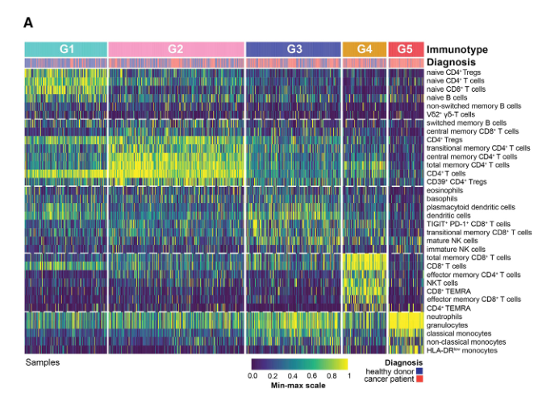

### Figure 3a 结果和图例描述

#### 结果描述：
在Figure 3a中，研究人员应用无监督谱聚类分析外周血免疫细胞分布数据，识别出五种不同的免疫类型（G1-G5）。这些免疫类型显示了健康供体和癌症患者在不同细胞群体频率上的显著差异。具体结果如下：
- **G1免疫类型**：高频的初始CD4+ T细胞、初始CD8+ T细胞和初始B细胞。
- **G2免疫类型**：更高比例的分化CD4+中心和过渡性记忆T细胞，以及CD39+调节性T细胞（Tregs）。
- **G3免疫类型**：成熟NK细胞、CD8+过渡性记忆和PD-1+ TIGIT+ CD8+ T细胞频率增加。
- **G4免疫类型**：NKT细胞、末端分化效应记忆CD45RA+（TEMRA）和CD45RA-（TEM） CD4+和CD8+ T细胞频率增加。
- **G5免疫类型**：经典单核细胞、HLA-DR低单核细胞和中性粒细胞丰富，淋巴细胞比例较小。

#### 图例描述：
1. 图中的饼图和条形图展示了五种免疫类型（G1-G5）的细胞群体频率分布。
2. 饼图显示每种免疫类型中健康供体和癌症患者的比例。
3. 条形图展示了各个免疫类型中的主要细胞群体频率分布情况。
4. 图中不同颜色和图案代表不同的免疫细胞群体和免疫类型。
5. 图例显示了健康供体和癌症患者在不同免疫类型中的分布。

#### 关键结论:
- 五种不同的免疫类型（G1-G5）在健康供体和癌症患者中具有显著差异。
- G1类型中初始T和B淋巴细胞比例最高，主要是健康供体。
- G4和G5类型中终末分化的CD8+ T细胞和经典单核细胞分别占主要比例，这两种类型中健康供体极少。
- 癌症类型并不是免疫类型分布的主要驱动因素。

#### 分析目的：
Figure 3a的目的是通过无监督谱聚类分析，识别出健康供体和癌症患者外周血中不同的免疫类型，以揭示免疫细胞组成的异质性及其与健康和疾病状态的关联。这一分析帮助研究人员理解不同免疫类型在健康供体和癌症患者中的分布差异，为进一步探索系统性免疫状态对癌症治疗和预后的影响提供基础。

*****

### 方法描述：
Figure 3a的方法涉及以下步骤：
1. **样本收集和处理**：从健康供体和癌症患者处采集外周血样本，使用流式细胞术进行分析。
2. **细胞类型频率测定**：使用多参数流式细胞术和自定义抗体面板，测定样本中34种细胞类型的频率。
3. **数据标准化和聚类分析**：对这些细胞类型频率进行标准化处理，然后应用无监督的光谱聚类方法，将样本分类为五种不同的免疫类型（G1-G5）。
4. **免疫类型特征**：每种免疫类型根据其独特的细胞类型分布进行定义。例如，G1富含初始T细胞和B细胞，G5则富含单核细胞和中性粒细胞。
5. **样本分类和分析**：将健康供体和癌症患者的样本分类为五种免疫类型，比较健康供体和癌症患者在这些免疫类型中的分布情况。

### 比喻讲解：
比喻讲解：

1. **样本收集和处理**：
想象你是一名厨师，需要从市场上收集各种蔬菜和水果（代表健康供体和癌症患者的血样）。你将这些蔬菜和水果带回厨房，准备进行详细的分类和分析（使用流式细胞术进行分析）。

2. **细胞类型频率测定**：
现在，你有了一套专门的刀具和工具（自定义抗体面板），用来切割和识别每种蔬菜和水果的不同部分（细胞类型）。你精确地切割并测量每种蔬菜和水果的不同部分的数量（测定34种细胞类型的频率）。

3. **数据标准化和聚类分析**：
接下来，你将所有测量数据进行标准化处理，就像把切好的蔬菜和水果都按照相同的大小和重量进行处理。然后，你使用一种特殊的方法（无监督的光谱聚类）将这些蔬菜和水果分类为五组（免疫类型G1-G5）。

4. **免疫类型特征**：
每组蔬菜和水果都有其独特的特点。例如，第一组（G1）可能主要包含青菜和苹果，第二组（G2）则可能主要包含胡萝卜和香蕉。你详细记录每组的组成成分（每种免疫类型根据其独特的细胞类型分布进行定义）。

5. **样本分类和分析**：
最后，你将市场上的所有蔬菜和水果（所有血样）都分类到这五组中。然后，你比较市场上不同摊位（健康供体和癌症患者）中，这些蔬菜和水果在五组中的分布情况，看看哪些摊位的蔬菜和水果更容易归属于某一组，从而揭示有趣的差异和特点。

*****

### Fig。3b

### 结果描述：
Figure 3b展示了不同免疫类型（G1-G5）中的年龄分布情况。每个免疫类型的样本按年龄进行分组，并显示这些样本的频率。结果显示，各个免疫类型中存在明显的年龄分布差异，表明某些免疫类型在特定年龄组中更为常见。例如，G1类型主要集中在较年轻的个体，而G4和G5类型更多出现在较年长的个体中。

### 图例描述：
Figure 3b的图例展示了五种免疫类型（G1-G5）的年龄分布情况。每个免疫类型的分布用条形图表示，其中x轴表示年龄组，y轴表示样本的频率。每个条形图代表一个免疫类型的样本在不同年龄组中的分布，颜色编码对应于五种不同的免疫类型。

### 关键结论:
不同免疫类型在年龄分布上存在显著差异，表明年龄是影响免疫类型的重要因素。年轻个体更可能属于G1类型，而年长个体更可能属于G4或G5类型。

### 分析目的：
Figure 3b的目的是揭示不同免疫类型在年龄上的分布特征，以确定年龄在免疫类型分类中的作用。通过分析不同年龄组中免疫类型的分布，可以更好地理解年龄对免疫系统特征的影响，并为进一步的研究提供基础。

*****

方法描述：
在Figure 3B中，研究者使用直方图展示了不同免疫类型中的年龄分布。首先，从健康供体和癌症患者中收集外周血样品，并进行流式细胞术分析。然后，使用无监督谱聚类方法对这些样品中的免疫细胞亚群进行分类，得到五种免疫类型（G1到G5）。每种免疫类型中包含不同的免疫细胞群体。这些免疫类型中的个体按照年龄进行分组，并在直方图中展示每种免疫类型的年龄分布，以观察不同免疫类型与年龄之间的关系。

比喻讲解：
想象一下你在一个大城市的公园里，公园里有来自不同年龄段的人群。你想了解这些人群的分布情况，以及他们年龄的差异。

1. 首先，你要做的就是观察公园里的所有人。你注意到有各种各样的人群，有些人在跑步，有些人在散步，还有些人在聊天。你将这些人群看作是你的数据样本，来自健康的供体和癌症患者。

2. 接下来，你开始用不同的特征将这些人群分成几个类别，比如根据他们的活动类型（跑步的、散步的、聊天的）来分类。这就类似于研究人员使用流式细胞术分析不同的免疫细胞群体。

3. 然后，你使用一种叫做无监督谱聚类的方法，就像你根据观察到的特征（活动类型）将人群分成几个类别（跑步者、散步者、聊天者）。这样，你得到了五个类别的免疫类型，每个类别中都有不同的人群，就像图中显示的五个免疫类型（G1到G5）。

4. 最后，你决定了解这些不同类别中人的年龄分布情况。你开始记录每个类别中人的年龄，并用直方图展示出来。你看到在某些类别中，年轻人占多数，而在其他类别中，老年人更多。通过这种方式，你可以看到不同类别中的人群年龄分布情况。

这种方法帮助你理解了公园里不同人群的分布以及他们的年龄差异，这与研究者通过直方图展示不同免疫类型中的年龄分布非常相似。这种分析方式可以帮助研究者了解不同免疫类型与年龄之间的关系，从而更好地理解免疫系统的变化规律。

*****

### Fig.3c

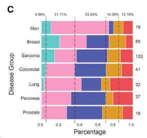

任务描述：请根据描述详细讲解Figure 3c的结果和图例描述（不要用比喻的方式），并根据结果和图例描述讲解完成这个图例的目的。

结果描述：
在Figure 3c中，研究者展示了五种免疫类型在七种主要实体癌诊断组中的分布情况。条形图显示了每种免疫类型（G1到G5）在不同癌症类型中的频率分布。七种主要癌症类型包括：乳腺癌、肺癌、结直肠癌、前列腺癌、卵巢癌、胰腺癌和头颈癌。图中的虚线表示每种癌症类型的中位分布边界。

图例描述：
1. 条形图展示了五种免疫类型（G1到G5）在七种主要实体癌诊断组中的分布情况。
2. 每个条形图表示一种癌症类型中不同免疫类型的分布频率。
3. 虚线表示每种癌症类型的中位分布边界。

关键结论：
1. 不同免疫类型在各种癌症类型中的分布存在显著差异。
2. 没有一种特定的癌症类型主要驱动某一特定免疫类型的分布，说明免疫类型的分布与癌症类型之间没有明显的关联。
3. 一些免疫类型（如G1和G2）在多数癌症类型中都有较高的频率，而其他免疫类型（如G4和G5）则在某些癌症类型中较为稀少。

分析目的：
Figure 3c的目的是展示五种免疫类型在不同实体癌症类型中的分布情况，旨在评估癌症类型是否对免疫类型的分布有显著影响。通过展示不同癌症类型中的免疫类型分布，可以帮助研究者理解不同癌症患者的系统免疫状态，从而为个性化免疫治疗提供依据。这种分析可以揭示免疫类型与癌症类型之间的关系，有助于开发基于免疫特征的诊断和治疗策略。

*****

### Figure 3c 方法描述：
在图3C中，研究人员将健康供体和癌症患者的免疫细胞分布数据用于识别不同的免疫类型。具体步骤如下：

1. **样本收集和处理：** 研究人员从408名健康供体和442名癌症患者（总共850名个体）的外周血样本中收集白细胞。
2. **免疫细胞分布分析：** 使用多参数流式细胞术分析每个样本中的免疫细胞亚群，量化650种细胞类型和活化状态。
3. **UMAP降维分析：** 使用UMAP（Uniform Manifold Approximation and Projection）方法，将这些免疫细胞的特征在二维空间中进行可视化。
4. **免疫类型识别：** 应用无监督的谱聚类方法，将这些细胞类型的频率标准化并识别出五种不同的免疫类型（G1-G5）。
5. **结果验证：** 使用配对的RNA-seq数据，通过细胞去卷积方法（Kassandra），验证由流式细胞术识别的细胞群体。
6. **差异分析：** 比较健康供体和癌症患者在免疫细胞分布上的差异，并将不同的癌症类型和治疗组进行分类。

### 比喻讲解：
1. **样本收集和处理：**
想象你在一个果园中收集了两类苹果：健康的苹果（健康供体）和患病的苹果（癌症患者）。你把这些苹果分别放在两个大筐里，每个筐中有408个健康苹果和442个患病苹果。

2. **免疫细胞分布分析：**
接下来，你把每个苹果切成薄片（多参数流式细胞术），观察每片苹果中的不同部分（免疫细胞亚群），并记录下每个部分的数量（量化650种细胞类型和活化状态）。

3. **UMAP降维分析：**
然后，你把这些记录下来的数据（免疫细胞特征）通过一种特殊的图表（UMAP方法）展示出来，使得原本复杂的三维数据在一个二维图表上显示（可视化）。

4. **免疫类型识别：**
接下来，你使用一种方法（谱聚类），根据苹果薄片中的不同部分，把这些苹果分成五类不同的类型（G1-G5）。这就像是根据苹果的不同颜色、味道和质地，把它们分成不同的组别。

5. **结果验证：**
为了确保你分组的正确性，你用另一种方法（RNA-seq数据和Kassandra细胞去卷积）再次分析这些苹果中的成分，并验证你之前的分组结果。

6. **差异分析：**
最后，你比较健康苹果和患病苹果在不同组别中的分布情况，并对不同类型的苹果（不同癌症类型）和不同处理方法（治疗组）进行分类。通过这种方式，你能更好地理解哪些苹果更健康，哪些苹果更容易生病，以及不同处理方法对苹果的影响。

*****

### Fig.3d

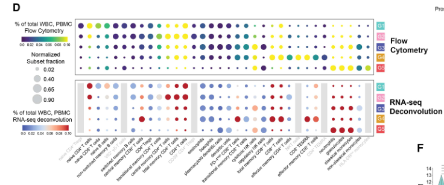

### Figure 3d 结果描述：
在图3D中，研究人员展示了基于流式细胞术和RNA-seq解卷积结果之间的中位细胞百分比的一致性。通过细胞去卷积（Kassandra）对RNA-seq数据的分析与流式细胞术的结果进行比较。结果显示，两种方法在识别免疫细胞群体的频率上具有高度一致性。这证明了RNA-seq数据通过Kassandra解卷积能够准确反映出流式细胞术检测到的细胞群体分布。

### 图例描述：
图3D包含两个部分：
1. **上半部分：** 热图显示了基于流式细胞术数据的中位细胞百分比。颜色梯度表示细胞类型在总WBC或PBMC群体中的百分比。
2. **下半部分：** 热图显示了通过RNA-seq数据解卷积得到的中位细胞百分比。颜色梯度与流式细胞术部分相同，表示细胞类型在总WBC或PBMC群体中的百分比。气泡的大小表示在整个队列中的标准化细胞分数百分比。

### 关键结论:
流式细胞术和RNA-seq解卷积方法在免疫细胞群体的分布上显示出高度一致性。流式细胞术和RNA-seq解卷积都能够准确地识别和量化外周血中的免疫细胞类型和状态。这验证了RNA-seq解卷积的可靠性，并支持其作为流式细胞术分析的替代或补充方法的有效性。

### 分析目的：
图3D的目的是验证通过RNA-seq数据进行的细胞解卷积是否能够准确反映流式细胞术所识别的细胞群体分布。通过比较两种方法得到的中位细胞百分比，研究人员展示了它们在免疫细胞类型频率上的一致性，从而证明了RNA-seq解卷积方法在细胞群体分析中的可靠性和有效性。这一验证为在大规模研究中应用RNA-seq解卷积方法提供了理论基础。

*****

### 方法描述：
图3D的方法包括以下步骤：
1. 从我们内部队列的流式细胞术样本中提取外周血单个核细胞（PBMC），并通过多参数流式细胞术进行分析。
2. 通过Kassandra进行RNA-seq的细胞去卷积，将这些样本制备成批量mRNA-seq文库，并进行测序。
3. 对这些RNA-seq数据进行细胞去卷积，匹配流式细胞术识别的细胞群体。
4. 比较从RNA-seq和流式细胞术中获得的细胞群体频率，验证两者的一致性。

### 比喻讲解：
可以将这个过程比作准备和整理一个大型音乐会的排练和演出：

1. **排练阶段（提取和分析PBMC）**：
就像排练中的乐队成员（外周血单个核细胞，PBMC）被从乐队成员列表中（血样）选出，并在不同的部分进行练习（多参数流式细胞术分析）。在每个部分中，每个成员都根据他们的角色（细胞类型）进行识别和分类。

2. **录制阶段（RNA-seq文库制备和测序）**：
接下来，乐队成员的演奏（细胞的RNA表达）被录制下来，制作成一个完整的音乐专辑（批量mRNA-seq文库）。这个专辑然后被拿到录音室进行精细录制和混音（测序）。

3. **混音和去卷积（Kassandra去卷积RNA-seq数据）**：
在录音室中，音响工程师（Kassandra）对录音进行处理，将每个乐器的音轨分离出来（细胞去卷积），确保每个部分（细胞群体）的声音清晰可辨。

4. **比较和验证（比较RNA-seq和流式细胞术数据）**：
最后，音响工程师对比现场排练的声音（流式细胞术数据）和录音室的录音（RNA-seq数据），检查两者的一致性，确保在最终的音乐会上，每个乐队成员的表现（细胞群体频率）都符合预期，并能够和谐地融合在一起。

这个比喻帮助我们理解如何从流式细胞术和RNA-seq两种不同的方法中获取和验证免疫细胞的信息，确保两者的一致性，从而准确地反映细胞群体的特征。

*****

### Fig.3e

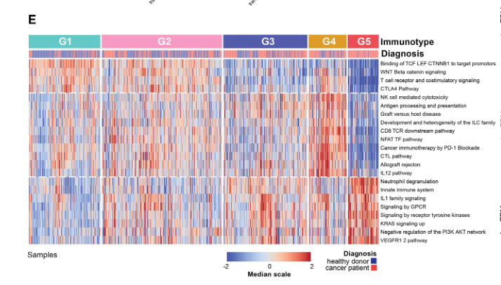

### Figure 3e 结果和图例描述

#### 结果描述：
Figure 3e展示了基于基因集富集分析（GSEA）的RNA-seq数据分组的免疫类型（immunotypes）热图。热图展示了五个免疫类型（G1, G2, G3, G4, G5）中，不同功能性基因签名的富集分数。每个免疫类型在不同的功能性基因路径上的富集分数都有所不同，这些路径包括与免疫反应和细胞功能相关的基因集。

#### 图例描述：
- 热图纵轴表示不同的功能性基因签名，这些签名涉及多种免疫和细胞功能路径。
- 热图横轴表示五个免疫类型（G1到G5）。
- 颜色渐变表示基因签名的富集分数，颜色越深表示富集程度越高。
- 每个格子中显示的数值表示对应基因签名在相应免疫类型中的富集分数。

#### 关键结论:
- G1和G2免疫类型在涉及转录调控（如TCF、LEF、CTNNB1）、T细胞受体（TCR）和WNT/β-catenin信号传导的基因路径上显示出高富集分数。
- G4免疫类型在与细胞毒性效应T细胞反应相关的基因上显示出高富集分数。
- G5免疫类型在与固有免疫感知和髓样细胞相关的信号传导路径上的基因显示出高富集分数。

#### 分析目的：
Figure 3e的目的是通过基因集富集分析（GSEA）验证和解释不同免疫类型（immunotypes）的功能特性。通过将RNA-seq数据分组并对其进行功能性基因签名的富集分析，可以揭示每种免疫类型在不同免疫反应和细胞功能路径上的特征。这种分析有助于理解免疫类型的生物学功能，并为其在免疫治疗中的潜在应用提供依据。

*****

方法描述：
Figure 3E的方法涉及对RNA-seq数据进行基因集合富集分析（Gene Set Enrichment Analysis, GSEA），以评估不同免疫类型的基因表达模式。具体步骤如下：
1. 从流式细胞术数据中定义的五种免疫类型（G1-G5）中选择样本。
2. 对每个免疫类型的样本进行RNA-seq，生成基因表达数据。
3. 对RNA-seq数据进行差异基因表达分析，识别每个免疫类型相对于其他免疫类型独特的差异基因。
4. 从每个免疫类型中选择200个最显著的差异表达基因。
5. 使用这些差异基因进行GSEA，比较不同免疫类型的功能基因签名。
6. 使用MsigDB中与免疫相关的功能基因集合进行富集分析，评估各免疫类型在不同免疫路径中的富集程度。
7. 使用热图展示每个免疫类型在特定免疫路径中的富集分数，显示不同免疫类型的功能特征。

比喻讲解：
想象你是一位厨师，负责研究五种不同类型的菜肴（代表五种免疫类型：G1到G5）。你想知道每种菜肴中的主要成分是什么，以及这些成分如何影响菜肴的味道和功能（代表基因功能）。

1. **收集样本**：首先，你从每种类型的菜肴中挑选出样本（代表RNA-seq样本）。
2. **记录成分**：你记录下每个样本中包含的所有成分（代表基因表达数据）。
3. **识别独特成分**：然后，你分析每种类型菜肴中的独特成分，即那些在其他菜肴中不常见的成分（代表差异基因表达分析）。
4. **选择关键成分**：你从每种类型中选择200个最具代表性的独特成分（代表最显著的差异表达基因）。
5. **功能分析**：接下来，你想知道这些成分在烹饪过程中的具体作用。你使用一个大型食谱数据库（代表MsigDB）来查找这些成分与各种烹饪技术和菜肴类型的关联（代表GSEA分析）。
6. **富集分析**：你进行富集分析，看看哪些成分在特定的烹饪技术中被高频使用（代表功能基因集合的富集分析）。
7. **展示结果**：最后，你使用热图展示每种类型菜肴的功能特征，显示不同类型菜肴在特定烹饪技术中的使用频率和重要性（代表富集分数的热图）。

通过这种方法，你不仅了解了每种类型菜肴的独特成分，还理解了这些成分在不同烹饪技术中的重要性和作用，就像研究不同免疫类型的基因功能特征一样。

*****

### Fig.3f

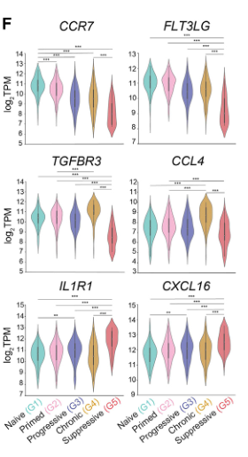

### Figure 3F 结果和图例描述

#### 结果描述：
Figure 3F展示了不同免疫类型（G1-G5）中细胞因子和趋化因子信号相关基因的个体基因表达模式。具体结果如下：
1. **FLT3LG和CCR7**：在G1免疫类型中表达最高，随着向G4和G5类型的转变，表达水平逐渐降低，在G5中表达最少。
2. **CCL4和TGFBR3**：在G4免疫类型中表达最高，特别是富含终末分化的CD4+和CD8+ T细胞的G4类型。
3. **CXCL16和IL1R1**：在G5免疫类型中表达最高，与G5类型中的单核细胞和中性粒细胞相一致。

#### 图例描述：
图3F展示了六个基因（FLT3LG、CCR7、CCL4、TGFBR3、CXCL16和IL1R1）在五种不同免疫类型（G1-G5）中的基因表达水平。每个基因的表达数据用箱线图表示，展示了其在每个免疫类型中的中位数、四分位数范围和极值。每个箱线图代表一个基因在不同免疫类型中的表达变化。

#### 关键结论:
1. **G1类型富含幼稚和中央记忆T细胞**：FLT3LG和CCR7在G1类型中的高表达反映了幼稚和中央记忆CD4+和CD8+ T细胞的特征。
2. **G4类型富含终末分化的效应T细胞**：CCL4和TGFBR3在G4类型中的高表达与终末分化的CD4+和CD8+ T细胞相关。
3. **G5类型富含单核细胞和中性粒细胞**：CXCL16和IL1R1在G5类型中的高表达与单核细胞和中性粒细胞的特征一致。

#### 分析目的：
图3F的目的是展示不同免疫类型中细胞因子和趋化因子信号相关基因的特异性表达模式。通过比较这些基因在五种免疫类型中的表达差异，研究者能够确定每种免疫类型的功能特征和潜在的免疫应答机制。这些信息对于理解不同免疫类型在抗肿瘤免疫中的作用以及预测免疫治疗反应具有重要意义。

*****

### 方法描述：
Figure 3f 中的方法是基于基因表达分析，比较不同免疫类型（immunotypes）之间特定细胞因子和趋化因子信号相关基因的表达水平。具体步骤如下：
1. 使用RNA-seq数据进行基因表达分析。
2. 选择与细胞因子和趋化因子信号相关的基因。
3. 比较不同免疫类型（G1、G2、G3、G4、G5）之间这些基因的表达水平。
4. 使用统计测试（如Dwass-Steel-Critchlow-Fligner all-pairs comparison test）评估基因表达水平的显著性差异。
5. 将基因表达水平的结果可视化，以便直观展示不同免疫类型之间的差异。

### 比喻讲解：
假设你在一个大家庭聚会中，大家都带来了自己最拿手的菜肴，大家庭中有五个主要的家庭成员（对应于五个免疫类型）。每个家庭成员带来的菜肴都各具特色，且各家庭成员之间的拿手菜肴有显著差异。

首先，你作为大厨，想要了解每个家庭成员带来的菜肴有什么特别之处（类似于基因表达分析）。你决定从每个家庭成员的菜肴中挑选出一些关键成分（对应于细胞因子和趋化因子信号相关的基因）进行比较。

接下来，你逐一品尝每个家庭成员的菜肴，记录下每道菜中关键成分的味道强度（类似于基因表达水平）。然后，你将这些记录进行整理，并比较每个家庭成员之间在这些关键成分上的差异。

为了确定这些差异是否显著，你请来了一位专业美食评论家，他用专业的味觉测试方法（如Dwass-Steel-Critchlow-Fligner all-pairs comparison test）来评估每个家庭成员之间的菜肴差异是否显著。

最后，你将这些比较结果制作成一张详细的图表，将每个家庭成员的菜肴中关键成分的味道强度清晰地展示出来（类似于可视化基因表达水平的结果）。通过这张图表，你可以直观地看到每个家庭成员在关键成分上的独特之处，以及这些成分在不同家庭成员之间的显著差异。

总结起来，这个比喻展示了如何通过比较和分析五个家庭成员的菜肴（不同免疫类型）中的关键成分（特定基因表达水平），来揭示它们之间的显著差异，并将这些差异直观地展示出来。

*****

Figure 3 (Fig. 3a-Fig. 3f)中的重要结论总结如下：

### Fig. 3a:
- **结论**：通过无监督光谱聚类分析，将样本分为五种不同的免疫类型（G1-G5），每种免疫类型都具有特定的细胞群体分布。
- **细节**：不同的免疫类型展示了特定细胞群体的富集，例如，G1中富集了较高比例的初始T细胞和B细胞，而G5中富集了经典单核细胞和中性粒细胞。

### Fig. 3b:
- **结论**：不同免疫类型的年龄分布不均衡。
- **细节**：G1和G2类型的患者主要集中在年轻群体中，而G4和G5类型的患者则主要集中在老年群体中。

### Fig. 3c:
- **结论**：不同癌症类型的患者在免疫类型分布上没有显著差异。
- **细节**：尽管存在一些差异，但总体上不同癌症类型的患者在五种免疫类型中的分布相对一致。

### Fig. 3d:
- **结论**：通过流式细胞术和RNA-seq去卷积方法获得的细胞群体分布一致。
- **细节**：流式细胞术数据和RNA-seq去卷积数据的比较显示，细胞群体分布在这两种分析方法中高度一致，验证了流式细胞术的结果。

### Fig. 3e:
- **结论**：不同免疫类型在基因集富集分析中表现出独特的基因表达模式。
- **细节**：例如，G1和G2富集了与T细胞受体（TCR）和WNT/β-catenin信号通路相关的基因，而G4富集了与细胞毒性效应T细胞反应相关的基因，G5则富集了与先天免疫感知和髓细胞相关的基因。

### Fig. 3f:
- **结论**：不同免疫类型在细胞因子和趋化因子信号相关基因的表达上具有显著差异。
- **细节**：例如，G1中FLT3LG和CCR7的表达最高，而这些基因的表达在G4和G5中逐渐减少。G4中CCL4和TGFBR3的表达最高，而G5中CXCL16和IL1R1的表达最高。这些差异显示了不同免疫类型在基因表达水平上的独特性。

### 总结：
通过无监督聚类和基因表达分析，研究者们成功地将患者样本分为五种具有独特免疫特征的免疫类型（G1-G5）。这些免疫类型不仅在细胞群体分布上存在显著差异，而且在基因表达和信号通路富集上也表现出不同的特征。这一发现为进一步理解癌症患者的免疫状态及其对治疗的反应提供了重要线索。

*****

### Fig.4a

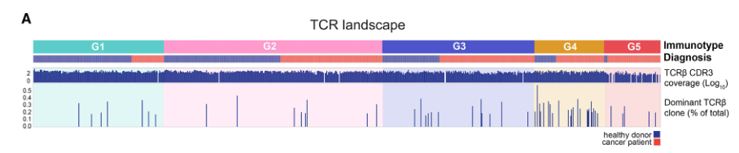

### 结果描述：
Figure 4a显示了不同免疫类型（G1-G5）中T细胞受体β链（TCRβ）CDR3序列的覆盖范围和主导克隆的分布情况。上图展示了每个样本中TCRβ CDR3序列的覆盖范围，反映了每个样本中T细胞的总体频率。下图显示了在每个患者中占据总CDR3序列超过10%的主导克隆的分布情况，这些主导克隆在整个队列中虽少见，但在G4免疫类型中富集。

### 图例描述：
1. **上图**：展示了不同免疫类型（G1-G5）中TCRβ CDR3序列的覆盖范围。每个数据点代表一个样本，显示了样本中TCRβ CDR3序列的总体覆盖情况。
2. **下图**：展示了在每个患者中占据总CDR3序列超过10%的主导克隆的分布情况。不同免疫类型的样本按类别分组，展示了主导克隆的丰度分布情况。

### 关键结论:
1. TCRβ CDR3序列的覆盖范围在所有免疫类型中一致，反映了总体T细胞频率在各个样本中的一致性。
2. 主导克隆在G4免疫类型中显著富集，表明这一免疫类型中存在更高比例的特定T细胞克隆扩增现象。

### 分析目的：
Figure 4a的目的是评估不同免疫类型中的T细胞受体（TCR）克隆性和多样性，特别是TCRβ链的组成和主导克隆的分布情况。通过分析TCRβ CDR3序列的覆盖范围和主导克隆的丰度，研究者可以了解不同免疫类型在T细胞克隆扩增和多样性方面的特征，这对于理解免疫反应和免疫治疗的潜在机制具有重要意义。

*****

### 方法描述：

Figure 4A 中的方法主要集中在对T细胞受体（TCR）β链的序列覆盖率和克隆多样性的分析。具体步骤如下：

1. **TCRβ链序列覆盖率**：利用RNA-seq数据提取TCRβ链的CDR3序列，并计算每个样本中这些序列的覆盖范围。覆盖范围反映了样本中TCRβ链序列的广度和深度。
2. **TCRβ链克隆多样性**：分析每个样本中TCRβ链的克隆组成，计算主要克隆（即占样本中总CDR3序列的10%以上的克隆）的丰度，并评估克隆的多样性指数，如Chao1指数。克隆多样性反映了样本中T细胞受体的复杂性和变异性。
3. **免疫类型关联分析**：将样本根据之前定义的五种免疫类型（G1至G5）进行分类，并比较不同免疫类型间的TCRβ链序列覆盖率和克隆多样性，评估其在不同免疫类型中的分布情况。

### 比喻讲解：

为了更好地理解Figure 4A的方法，可以将TCRβ链序列覆盖率和克隆多样性分析比作图书馆中的书籍分类和借阅情况。

1. **TCRβ链序列覆盖率**：
- **比喻**：想象你在一个巨大的图书馆里，图书馆有很多书架，每个书架上有不同的书。TCRβ链序列覆盖率就像统计图书馆里所有书架上书的数量和种类。覆盖率高意味着你能找到很多不同种类的书（即TCRβ链序列），覆盖范围广泛。
- **实现过程**：研究人员利用RNA-seq技术“扫描”整个图书馆，记录下每本书的详细信息（TCRβ链的CDR3序列），然后计算这些书在图书馆中出现的频率和分布。

2. **TCRβ链克隆多样性**：
- **比喻**：图书馆中的某些书可能非常受欢迎，借阅频率很高（即占样本中总CDR3序列的10%以上的克隆），而有些书可能很少有人借阅。TCRβ链克隆多样性分析就是在研究图书馆中不同书籍的借阅情况，评估图书馆藏书的多样性和受欢迎程度。
- **实现过程**：研究人员统计每本书的借阅次数（即主要克隆的丰度），并计算多样性指数（如Chao1指数）来反映图书馆的藏书情况。如果图书馆中的书籍种类和借阅情况非常多样化，这说明克隆多样性高。

3. **免疫类型关联分析**：
- **比喻**：图书馆中的读者可以根据他们的兴趣和阅读习惯分成不同的组（即五种免疫类型）。有的读者喜欢看小说，有的喜欢看科学书，有的则偏好历史书。不同读者组的阅读习惯和借阅情况会有所不同。
- **实现过程**：研究人员将图书馆中的读者按照他们的阅读兴趣分成五组，然后比较这些组之间的借阅情况和书籍种类，看看哪些组更喜欢哪种类型的书（即TCRβ链序列覆盖率和克隆多样性在不同免疫类型中的分布）。

通过这种比喻，可以更直观地理解Figure 4A中TCRβ链序列覆盖率和克隆多样性分析的方法及其实现过程。

*****

### Fig.4b

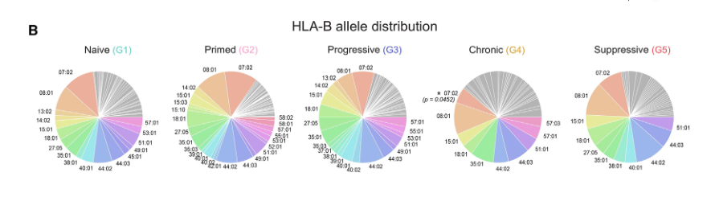

### 结果描述：

Figure 4B显示了不同免疫类型中HLA-B等位基因的分布。具体分析了HLA-A、-B、-C基因的等位基因频率，特别指出了在G4-chronic免疫类型中HLA-B07:02等位基因的显著减少。

### 图例描述：

1. **主图**：
- 展示了不同免疫类型（G1、G2、G3、G4、G5）中HLA-B等位基因的频率分布。每个等位基因用不同颜色表示。
- 图中用灰色表示频率低于5次的等位基因。
- 一个饼状图单独显示了G4-chronic免疫类型中HLA-B07:02等位基因的频率，并用*表示显著差异。

2. **统计方法**：
- 使用Fisher's精确检验分析等位基因频率的统计显著性。

### 关键结论:

在不同免疫类型中，HLA-B等位基因的分布具有显著差异。特别是，HLA-B07:02等位基因在G4-chronic免疫类型中的频率显著低于其他免疫类型。这表明HLA-B07:02等位基因可能与G4-chronic免疫类型相关的TCR克隆多样性和免疫响应特征有一定联系。

### 分析目的：

Figure 4B的目的是通过分析HLA等位基因的分布，探讨不同免疫类型中的HLA差异是否可能解释TCR谱系组成的不同。这一分析有助于理解HLA类型与免疫类型之间的关系，从而揭示特定HLA等位基因在免疫反应和疾病状态中的潜在影响。

*****

### 方法描述：
在Figure 4B中，研究人员分析了内部队列中HLA-B等位基因在不同免疫类型之间的分布情况。具体方法如下：
1. **样本收集**：从研究内部队列中收集包含HLA-B基因数据的样本。
2. **HLA分型**：通过测序或基因分型技术确定每个样本的HLA-B等位基因。
3. **数据整理**：统计各个HLA-B等位基因在不同免疫类型中的频率。
4. **数据可视化**：使用饼图展示每个HLA-B等位基因在不同免疫类型中的分布情况，并用灰色表示低频率的等位基因。
5. **统计分析**：使用Fisher确切检验分析不同免疫类型中HLA-B07:02等位基因频率的显著性差异，确定是否存在统计显著性。

### 比喻讲解：
为了更好地理解Figure 4B中的方法和实现过程，可以把这个过程比喻成分析学校里不同年级学生的兴趣爱好分布情况。

1. **样本收集**：首先，你需要收集各个年级学生的兴趣爱好数据，就像研究人员收集包含HLA-B基因数据的样本一样。
2. **兴趣分型**：然后，你对每个学生进行调查，确定他们的具体兴趣爱好（如篮球、绘画、音乐等），就像研究人员通过测序或基因分型技术确定每个样本的HLA-B等位基因。
3. **数据整理**：接下来，你统计每个年级中每种兴趣爱好的学生人数和比例，就像统计各个HLA-B等位基因在不同免疫类型中的频率。
4. **数据可视化**：为了更清晰地展示结果，你可以使用饼图表示每个年级中各种兴趣爱好的分布情况，其中灰色代表那些不太常见的兴趣爱好，这与研究人员用饼图展示每个HLA-B等位基因在不同免疫类型中的分布情况类似。
5. **统计分析**：最后，你使用统计方法（如卡方检验）来分析各个年级之间某种特定兴趣爱好（如篮球）的比例是否存在显著差异，就像研究人员使用Fisher确切检验分析不同免疫类型中HLA-B07:02等位基因频率的显著性差异。

通过这个比喻，我们可以更容易地理解Figure 4B中的方法和实现过程。研究人员像分析学生兴趣爱好分布一样，系统地收集、分析和展示了不同免疫类型中HLA-B等位基因的分布情况，并进行了统计显著性分析。

*****

### Fig.4c

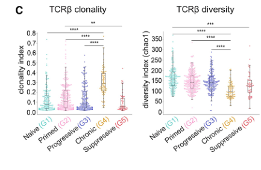

### 结果描述：
在Figure 4C中，研究人员比较了不同免疫类型（G1、G2、G3、G4、G5）中TCRβ克隆多样性和克隆性指数的分布情况。结果显示：
1. **TCRβ克隆性**：G4-慢性免疫类型的TCRβ克隆性指数显著高于其他免疫类型（p<0.01），表明G4-慢性免疫类型中的T细胞具有较高的克隆扩增。
2. **TCRβ多样性**：G1-初始免疫类型和G2-原发免疫类型的TCRβ多样性指数显著高于G4-慢性和G5-抑制免疫类型（p<0.01），表明前两者具有较高的TCRβ多样性。

### 图例描述：
1. **左图**：散点图展示了不同免疫类型中TCRβ克隆性指数的分布，每个点代表一个样本，颜色表示不同的免疫类型。统计分析表明，G4-慢性免疫类型的TCRβ克隆性指数显著高于其他免疫类型（p<0.01）。
2. **右图**：散点图展示了不同免疫类型中TCRβ多样性指数（Chao1）的分布，每个点代表一个样本，颜色表示不同的免疫类型。统计分析表明，G1-初始免疫类型和G2-原发免疫类型的TCRβ多样性显著高于G4-慢性和G5-抑制免疫类型（p<0.01）。

### 关键结论:
1. G4-慢性免疫类型的TCRβ克隆性显著高于其他免疫类型，表明该类型中的T细胞经历了较强的克隆扩增。
2. G1-初始免疫类型和G2-原发免疫类型具有显著更高的TCRβ多样性，表明这些类型的T细胞库更为多样化，可能具有更广泛的抗原识别能力。

### 分析目的：
Figure 4C的目的是比较不同免疫类型中TCRβ克隆性和多样性指数，以揭示免疫类型间的T细胞克隆扩增和多样性的差异。这些差异可能与各免疫类型的功能状态和对免疫治疗的反应相关，有助于理解不同免疫类型在肿瘤免疫应答中的角色和潜在机制。

*****

### 方法描述：
Figure 4C中的方法涉及T细胞受体（TCR）β链克隆性和多样性的分析。具体步骤如下：
1. 使用内部队列的RNA-seq数据评估TCRβ链的覆盖范围。
2. 计算每个样本中占总CDR3序列超过10%的主要克隆数量，并在整个队列中显示这些克隆的分布。
3. 分析不同免疫类型间的TCRβ克隆性指数和多样性（Chao1指数）。
4. 进行Games-Howell事后检验，确定不同免疫类型之间的显著性差异。

### 比喻讲解：
我们可以将TCRβ链克隆性和多样性的分析比作一个图书馆的书籍分类和流行度调查：

1. **评估TCRβ链的覆盖范围：** 想象我们有一个大型图书馆（代表我们的样本队列），其中有各种类型的书籍（代表TCRβ链的CDR3序列）。我们首先对整个图书馆的所有书籍进行盘点，了解每种书籍的种类和数量。

2. **计算主要克隆数量：** 接下来，我们寻找在图书馆中占比超过10%的热门书籍（代表主要克隆）。这些热门书籍是非常受欢迎的，借阅量很高。我们统计这些热门书籍在不同图书馆中的数量和分布情况。

3. **分析克隆性指数和多样性：** 然后，我们分析这些热门书籍的克隆性和多样性。克隆性（Clonality）就像是我们查看某一特定类型的书籍有多少个不同的版本或副本。如果某一种书籍有很多不同的版本或副本，那么克隆性就高。多样性（Chao1指数）则是指图书馆中书籍种类的丰富程度。如果图书馆中有很多种不同类型的书籍，那么多样性就高。

4. **进行统计检验：** 最后，我们使用统计方法（Games-Howell事后检验）比较不同图书馆（代表不同免疫类型）之间的热门书籍的克隆性和多样性，看看它们是否存在显著差异。

通过这个比喻，我们可以理解TCRβ链克隆性和多样性分析的过程，就像是在分析图书馆中书籍的种类和流行度，并比较不同图书馆之间的差异。

*****

### Fig.4d

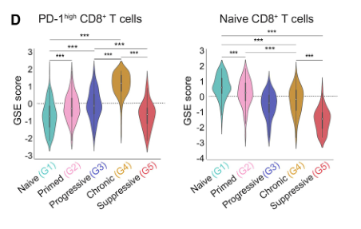

### 结果描述：
Figure 4D展示了基于GSEA（基因集富集分析）的免疫类型特异性基因表达特征。左侧的图表展示了PD-1高表达CD8+ T细胞基因签名（GSE26495）的富集得分，右侧的图表展示了一般T细胞分化签名（GSE14699）的富集得分。不同免疫类型之间的显著性差异通过Dwass-Steel-Critchlow-Fligner全对比检验确定。

### 图例描述：
1. 左侧图表：展示了PD-1高表达CD8+ T细胞基因签名（GSE26495）的GSEA富集得分在不同免疫类型之间的分布情况。不同颜色表示不同的免疫类型（G1到G5），箱线图展示了每个免疫类型的中位数和四分位数范围，须线表示1.5倍四分位距范围内的数据。
2. 右侧图表：展示了一般T细胞分化基因签名（GSE14699）的GSEA富集得分在不同免疫类型之间的分布情况。图表的布局和颜色编码同左侧图表。

### 关键结论:
1. PD-1高表达CD8+ T细胞基因签名在G4-慢性免疫类型中显著富集，表明该免疫类型具有较高水平的T细胞耗竭特征。
2. 一般T细胞分化签名在G1-初始免疫类型和G2-初级免疫类型中显著富集，表明这些免疫类型中存在较高水平的未分化或早期分化的T细胞。

### 分析目的：
Figure 4D的目的是通过基因集富集分析，揭示不同免疫类型之间的特异性基因表达特征，特别是与T细胞分化状态和PD-1高表达相关的基因签名。这有助于理解不同免疫类型在功能上的差异，并为免疫治疗响应预测提供潜在的分子标志。

*****

### 方法描述：

在Figure 4D中，作者使用基因集富集分析（Gene Set Enrichment Analysis, GSEA）方法，评估不同免疫类型中的基因表达特征。具体步骤如下：

1. **基因表达数据获取**：从RNA-seq数据中获取所有样本的基因表达水平。
2. **选择基因集**：选择与T细胞分化状态和PD-1表达相关的基因集（如GSE26495和GSE14699）。
3. **计算富集分数**：使用GSEA方法计算每个样本在所选基因集上的富集分数。
4. **比较分析**：将富集分数按免疫类型分组，比较不同免疫类型之间的差异。
5. **统计检验**：使用Dwass-Steel-Critchlow-Fligner全对比较检验，评估各免疫类型之间富集分数的显著性差异。

### 比喻讲解：

想象你是一位书评家，受邀对一批书籍进行评价，每本书都是一个RNA-seq样本，而书中的每一个章节则代表基因的表达水平。现在，你需要评估这些书中是否包含某些特定主题的内容，比如“英雄的成长”或“逆境中的友谊”。这就像是在寻找与T细胞分化和PD-1表达相关的基因集在这些样本中的富集情况。

首先，你会：
1. **收集书籍内容**：获取所有书籍中的所有章节（基因表达数据）。
2. **选择主题**：确定你感兴趣的特定主题（选择与T细胞分化和PD-1表达相关的基因集）。
3. **评估主题出现频率**：阅读每本书，并计算每个主题在书中出现的频率（使用GSEA方法计算富集分数）。
4. **分类比较**：将书籍按类型分组，比如小说、传记、科幻等（将样本按免疫类型分组），然后比较这些类型中不同主题的出现频率（比较富集分数）。
5. **统计分析**：进行详细的统计分析，看看哪些类型的书中，某些主题的出现频率显著高于其他类型（使用统计检验评估差异显著性）。

通过这种方法，你可以系统地了解不同类型的书籍中，特定主题的普及程度，从而得出关于这些书籍的有价值的见解。类似地，GSEA方法帮助科学家理解不同免疫类型中，特定基因表达特征的富集情况，从而揭示这些免疫类型的生物学特征。

*****

###  Fig.4e

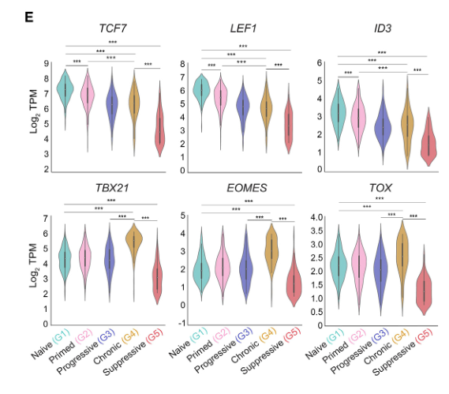

### Figure 4e 讲解

#### 结果描述：
Figure 4e展示了与T细胞分化和功能相关的几个关键转录因子在不同免疫类型中的基因表达水平。具体来说：
- 在G1-naive和G2-primed免疫类型中，与T细胞初始分化和记忆细胞自我更新相关的转录因子（TCF-7、LEF1、ID3）的表达水平最高。
- G4-chronic免疫类型中的TBX21、EOMES和TOX的表达水平最高，这些基因与效应T细胞分化和衰竭相关。

#### 图例描述：
- 图中展示了两个不同的转录因子组的基因表达水平：
- 上排图：显示了TCF-7、LEF1和ID3的表达水平，这些基因与初始T细胞和记忆细胞的自我更新有关。
- 下排图：显示了TBX21、EOMES和TOX的表达水平，这些基因与效应T细胞分化和衰竭有关。
- X轴表示不同的免疫类型（G1-naive, G2-primed, G3-progressive, G4-chronic, G5-suppressive），Y轴表示这些转录因子的基因表达水平（以log2 TPM为单位）。
- 使用Dwass-Steel-Critchlow-Fligner全对比较检验评估各免疫类型之间的显著性差异，显著性差异通过*p值表示。

#### 关键结论:
- G1-naive和G2-primed免疫类型中的TCF-7、LEF1、ID3表达水平显著高于其他免疫类型，这表明这些免疫类型具有更高的初始T细胞和记忆细胞自我更新潜力。
- G4-chronic免疫类型中的TBX21、EOMES和TOX表达水平显著高于其他免疫类型，表明这些免疫类型中的T细胞更倾向于分化为效应细胞并处于衰竭状态。

#### 分析目的：
本图的目的是通过比较不同免疫类型中关键转录因子的表达水平，揭示各免疫类型在T细胞分化和功能方面的特征差异。这有助于理解不同免疫类型在适应性免疫反应中的角色，并提供关于免疫治疗反应的潜在线索。

*****

### 方法描述：
Figure 4E的方法主要包括以下几个步骤：
1. **基因表达分析**：从RNA-seq数据中提取基因表达水平，以获得特定基因的转录本数。
2. **转录因子选择**：选择与T细胞分化和疲劳相关的关键转录因子（例如，TCF-7、LEF1、ID3、TBX21、EOMES和TOX）。
3. **数据分组**：将样本按免疫类型（G1-naive、G2-primed、G3-progressive、G4-chronic、G5-suppressive）分组。
4. **统计分析**：使用Dwass-Steel-Critchlow-Fligner检验比较不同免疫类型之间这些转录因子的基因表达水平。
5. **数据可视化**：用箱线图展示每个免疫类型中这些转录因子的基因表达水平，显示不同免疫类型之间的差异。

### 比喻讲解：
想象你是一位厨师，想了解在不同的烹饪风格中，某些关键调料的使用情况。例如，你有五种不同的烹饪风格：中式、法式、意式、泰式和印度式。你想知道每种风格中，盐、胡椒、姜、蒜、罗勒和咖喱粉的使用量。

1. **收集数据**：你从厨房的记录中收集每种烹饪风格中使用这些调料的具体量（就像从RNA-seq数据中提取基因表达水平）。
2. **选择调料**：你选择了六种关键调料，认为它们对每种烹饪风格的独特性有重要影响（就像选择关键转录因子）。
3. **分组数据**：你把数据按照烹饪风格分类，分别统计每种调料在五种烹饪风格中的使用量（类似于按免疫类型分组）。
4. **进行分析**：你用统计方法比较每种调料在不同烹饪风格中的使用量，找出显著差异（就像使用统计检验比较不同免疫类型中的基因表达水平）。
5. **展示结果**：你制作了一个图表，每个烹饪风格都有一个箱线图，显示这些调料的使用情况，这样你可以直观地看到每种烹饪风格中调料使用的差异（就像用箱线图展示基因表达水平）。

通过这种方式，你不仅能够清楚地了解每种烹饪风格的特点，还可以根据这些调料的使用情况预测和优化你的烹饪。这就像通过分析转录因子的表达水平，可以理解不同免疫类型的特征，并利用这些信息进行治疗反应的预测。

*****

### Fig.4f

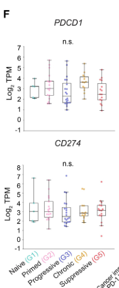

### 结果描述：
在Figure 4F中，展示了PD-1（PDCD1）和PD-L1（CD274）基因在不同免疫类型（G1-naive、G2-primed、G3-progressive、G4-chronic、G5-suppressive）中的基因表达水平。结果显示，各免疫类型之间PD-1和PD-L1基因表达没有显著差异。

### 图例描述：
1. **基因表达水平**：图中展示了PDCD1和CD274基因在不同免疫类型中的表达水平。数据以箱线图形式表示，其中每个箱线图展示了基因表达水平的中位数、25th和75th百分位数，以及最小值和最大值。
2. **统计分析**：图中包含了基于Dwass-Steel-Critchlow-Fligner检验的统计显著性标记，用以比较不同免疫类型之间的基因表达水平。

### 关键结论:
PD-1和PD-L1基因在不同免疫类型中的表达水平没有显著差异。这表明尽管不同免疫类型在其他基因表达和细胞组成上存在显著差异，但在PD-1和PD-L1的表达上没有显著变化。

### 分析目的：
图4F的目的是比较不同免疫类型中PD-1（PDCD1）和PD-L1（CD274）基因的表达水平，以确定这些基因在不同免疫类型中的差异情况。通过这种分析，可以评估PD-1和PD-L1在不同免疫类型中的表达是否存在显著差异，从而为进一步的免疫治疗研究提供数据支持。这有助于理解PD-1和PD-L1在不同免疫背景下的作用，并评估其作为免疫治疗靶点的普遍性。

*****

### 方法描述：
Figure 4F展示了PD-1信号通路中两个基因的基因表达水平：PDCD1（PD-1）和CD274（PD-L1）。这些基因的表达水平在70名接受免疫检查点抑制剂（ICB）治疗的癌症患者中进行了分析。具体方法如下：
1. 从患者样本中提取RNA。
2. 使用RNA测序技术（RNA-seq）测量PDCD1和CD274基因的表达水平。
3. 对基因表达数据进行标准化和归一化处理。
4. 使用Dwass-Steel-Critchlow-Fligner（DSCF）检验进行统计分析，以比较不同免疫类型之间的基因表达差异。

### 比喻讲解：
想象你在一个大型图书馆里，有许多书架，每个书架上都有不同类型的书。你需要找出特定类型的书（例如PD-1和PD-L1相关的书），并比较这些书在不同书架上的数量和分布情况。

1. 首先，你需要从图书馆的每个书架上收集所有的书（提取RNA）。
2. 然后，你使用一个特殊的扫描仪来扫描每本书的条形码，这样你就可以知道每本书的具体信息和类型（RNA测序）。
3. 接下来，你需要将扫描结果进行整理和标准化，以确保数据的准确性和可比性（数据标准化和归一化）。
4. 最后，你使用一种统计方法来比较不同书架上的书的数量和分布情况，从而找出在哪些书架上这些特定类型的书更多，在哪些书架上更少（DSCF检验）。

通过这种方式，你可以详细了解图书馆中PD-1和PD-L1相关书籍的分布情况，就像在分析不同患者样本中PDCD1和CD274基因的表达水平一样。这个比喻帮助我们理解如何通过复杂的生物信息学方法，揭示特定基因在不同样本中的表达差异，从而为癌症治疗提供有价值的信息。

*****

### Fig.4g

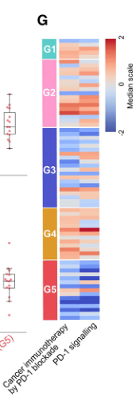

### 结果描述：
Figure 4G显示了与PD-1阻断和PD-1信号通路相关的基因表达特征在不同免疫类型（G1至G5）中的表达情况。热图展示了这些基因在70名接受免疫检查点抑制剂（ICB）治疗的癌症患者中的表达模式。每一列代表一个患者样本，每一行代表一个基因。颜色梯度表示基因表达水平的高低：红色表示高表达，蓝色表示低表达。

### 图例描述：
1. 热图显示了与PD-1信号和PD-1阻断相关的基因在不同免疫类型（G1-G5）中的表达情况。
2. 每列代表一个患者样本，每行代表一个基因。
3. 颜色梯度从蓝色（低表达）到红色（高表达），表示基因的表达水平。
4. 基因包括PDCD1、CD274及其他与PD-1信号相关的基因。
5. 热图中的分类显示了不同免疫类型（G1-G5）样本的基因表达特征。

### 关键结论:
Figure 4G的分析表明，不同免疫类型在PD-1信号和阻断相关基因的表达水平上存在显著差异。具体而言，G1-naive、G2-primed和G4-chronic免疫类型在这些基因的表达上显示出不同的模式，这些差异可能与患者对免疫检查点抑制剂的响应有关。

### 分析目的：
Figure 4G的目的是分析和展示与PD-1信号通路相关的基因在不同免疫类型中的表达模式。通过这一分析，可以了解不同免疫类型在基因表达水平上的差异，从而为评估患者对免疫检查点抑制剂治疗的响应提供线索。这种分析有助于理解免疫类型与治疗响应之间的关系，进而支持个性化治疗策略的制定。

*****

### 方法描述：
Figure 4G的方法涉及对不同免疫类型（immunotypes）中的基因表达进行分析，以确定与PD-1阻断和PD-1信号传导相关的基因表达模式。具体步骤如下：

1. **样本准备与RNA测序**：收集来自癌症患者的外周血样本，通过RNA测序（RNA-seq）获取基因表达数据。
2. **基因表达分析**：使用RNA-seq数据进行基因表达水平的测定。
3. **基因集合富集分析（GSEA）**：采用GSEA方法分析这些基因表达数据，以识别与PD-1信号传导和PD-1阻断相关的基因集合。
4. **热图展示**：将不同免疫类型中显著富集的基因表达模式通过热图形式展示。

### 比喻讲解：
想象你是一位园艺师，负责照顾一个大型花园，其中种植了不同种类的植物。每种植物都需要特定的养分和环境条件才能健康成长。

1. **样本准备与RNA测序**：就像你在花园中收集各种植物的叶子，RNA测序相当于对这些叶子的营养成分进行详细分析，了解每种植物中有哪些营养物质（基因表达）。
2. **基因表达分析**：你将这些营养分析结果记录下来，这一步相当于确定每种植物所含的具体营养物质的含量。
3. **基因集合富集分析（GSEA）**：接下来，你想知道哪些植物对某种肥料（PD-1阻断和PD-1信号传导）反应最好。你把所有植物按反应分类，并对每类植物的反应进行统计。这就像是分析基因表达数据，以识别哪些基因集合在不同的免疫类型中与PD-1信号传导相关。
4. **热图展示**：最终，你制作了一张图表，展示哪些植物在施用特定肥料后表现最佳。这张图表展示了不同植物对肥料的反应情况，就像热图展示了不同免疫类型中基因表达模式的变化。

通过这种比喻，可以更容易理解Figure 4G的方法，即通过分析RNA-seq数据，识别与PD-1阻断和信号传导相关的基因表达模式，并通过热图展示这些模式在不同免疫类型中的分布情况。

*****

### Figure 4 (Fig. 4a-Fig. 4g)中的重要结论：

1. **TCRβ序列覆盖与分布（Fig. 4a）**：
- TCRβ的CDR3序列覆盖在整个队列中一致，反映了每个样本中T细胞的总体频率。
- G4-chronic免疫类型中占据超过10%总CDR3序列的优势克隆在整个队列中较少但在G4中富集。

2. **HLA等位基因分布（Fig. 4b）**：
- 不同免疫类型间的HLA-A、HLA-B和HLA-C等位基因分布存在异质性。
- G4-chronic免疫类型中HLA-B07:02等位基因的频率显著低于其他免疫类型。

3. **TCRβ克隆性与多样性（Fig. 4c）**：
- G4-chronic免疫类型的TCRβ克隆性指数约为其他免疫类型的三倍。
- G1-naive、G2-primed和G3-progressive免疫类型的TCRβ多样性显著高于G4-chronic和G5-suppressive免疫类型。

4. **T细胞分化与PD-1高表达CD8+ T细胞基因集合富集分析（Fig. 4d）**：
- T细胞分化基因集合在G1-naive和G2-primed免疫类型中富集，反映了较高的TCRβ多样性。
- PD-1高表达CD8+ T细胞基因集合在G4-chronic免疫类型中富集，与高TCRβ克隆性一致。

5. **关键转录因子基因表达水平（Fig. 4e）**：
- 与初始和自我更新的中心记忆T细胞相关的转录因子（如TCF-7、LEF1和ID3）在G1-naive和G2-primed免疫类型中表达最高。
- 与效应T细胞分化和耗竭相关的转录因子（如TBX21、EOMES和TOX）在G4-chronic免疫类型中表达最高。

6. **PDCD1和CD274基因表达（Fig. 4f）**：
- PDCD1（PD-1）和CD274（PD-L1）的基因表达在不同免疫类型间没有显著差异。

7. **与PD-1信号传导和阻断相关的基因表达模式（Fig. 4g）**：
- 不同免疫类型中PD-1信号传导和阻断相关的基因表达模式存在差异，表明这些免疫类型在PD-1抑制剂治疗中的响应可能不同。

### 关键结论：

- G4-chronic免疫类型展示了显著的TCRβ克隆性和较低的多样性，提示这些患者可能具有抗原驱动的T细胞扩展。
- 不同免疫类型间的HLA等位基因分布差异提示了HLA基因可能在免疫类型形成中起到重要作用。
- T细胞分化状态和PD-1信号传导相关基因表达的差异反映了不同免疫类型在应对免疫检查点抑制治疗时的功能差异。
- G1-naive和G2-primed免疫类型中高多样性的T细胞可能预示更好的免疫反应能力，而G4-chronic和G5-suppressive类型则可能反映了耗竭或抑制状态的免疫反应。

*****

### Fig.5a

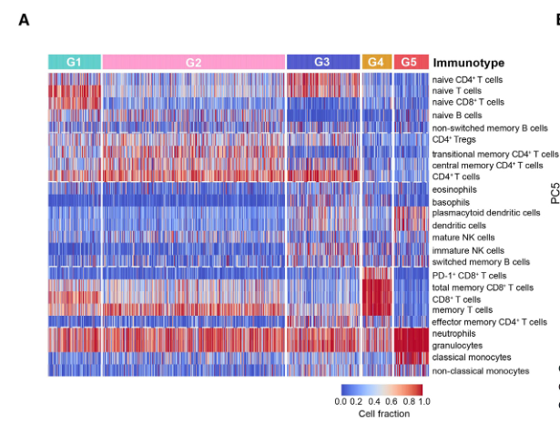

### 结果描述：
Figure 5A的结果展示了对17,800个开放来源的全血RNA-seq样本进行的无监督光谱聚类分析，揭示了五种免疫类型（immunotypes）。每个点代表一个样本，不同颜色表示不同的免疫类型。分析显示，这些样本可以根据免疫细胞类型的分布分成五个不同的群体。

### 图例描述：
- **Unsupervised spectral clustering analysis**：无监督光谱聚类分析应用于17,800个RNA-seq全血样本的标准化细胞百分比。图中仅显示了1,000个随机选择的样本，以减少图表复杂性。
- **五种免疫类型（immunotypes）**：每个点代表一个样本，点的颜色表示不同的免疫类型。五种免疫类型分别用不同颜色区分，并标注在图的右侧。

### 关键结论：
- 五种免疫类型通过无监督光谱聚类方法成功识别，并在一个包含17,800个样本的庞大数据集中得到验证。
- 这些免疫类型在标准化细胞百分比上表现出显著的分布差异，反映了不同样本之间在免疫细胞组成上的多样性。

### 分析目的：
Figure 5A的目的是通过无监督光谱聚类分析验证五种免疫类型的存在，并在一个包含大量样本的开放来源数据集中确认这些免疫类型的可重复性和稳定性。这一分析旨在展示免疫类型分类的广泛适用性，证明其在不同数据集和免疫学相关疾病中的一致性和可用性。

*****

### 方法描述：
图5A展示了一个用于从开源数据集中免疫分析的流程。具体方法包括以下步骤：
1. 从GEO和ArrayExpress数据库收集了17,800个外周血转录组数据样本。
2. 使用Kassandra算法对这些样本进行了细胞解卷积，从转录组数据中推导出免疫细胞亚群的频率。
3. 对标准化后的细胞频率数据进行无监督光谱聚类，识别免疫细胞亚群的分布，并将样本分为五个免疫类型。
4. 随后使用三维主成分分析（PCA）对样本进行投影，以可视化免疫类型的分布。

### 比喻讲解：
想象你正在一个巨大的图书馆工作，这个图书馆有成千上万本书，但这些书都是用一种你不熟悉的语言写的。你的任务是了解这些书的内容，并将它们分类。

1. **收集样本：** 首先，你从图书馆的各个角落收集了许多书籍，就像从GEO和ArrayExpress数据库收集了17,800个转录组数据样本。这些书籍来自不同的作者和不同的主题。

2. **解卷积：** 接下来，你使用一种特殊的翻译工具（Kassandra算法），这工具可以帮助你从书籍中提取出有用的信息，比如书中提到的不同主题和关键词。这就类似于从转录组数据中推导出不同的免疫细胞亚群。

3. **光谱聚类：** 然后，你将这些提取出来的信息进行整理和分类。你使用一种先进的分类方法（无监督光谱聚类），这就好比你用一种高级的图书分类系统来将书籍按照主题和关键词进行归类，最后你把这些书籍分成五个不同的类别（免疫类型）。

4. **主成分分析（PCA）：** 最后，你使用一个三维可视化工具，将这些分类后的书籍在一个三维空间中进行展示。通过这种方式，你可以很直观地看到这些书籍在不同类别中的分布情况，就像使用PCA来可视化免疫类型的分布。

通过这种方式，你不仅能有效地整理和分类这些大量的书籍，还能更好地理解它们之间的关系和差异，这在研究中是非常有用的。

*****

### Fig.5b

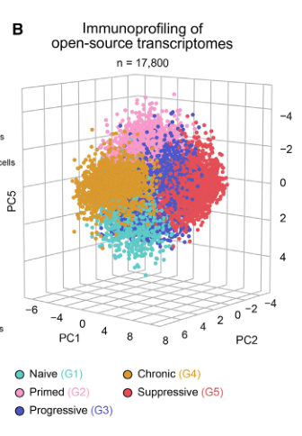

*****

*****

