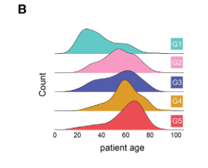

# Comprehensive peripheral blood immunoprofiling reveals five immunotypes with immunotherapy response characteristics in patients with cancer

## summary

### 讲解：

目前，缺乏全面的诊断方法和共识分析模型来评估患者的免疫系统状态，这阻碍了免疫图谱分析在癌症患者治疗监测和反应预测中的广泛应用。为了解决这一未满足的需求，我们开发了一种免疫图谱分析平台，使用多参数流式细胞术来表征健康供体和晚期癌症患者外周血中的免疫细胞异质性。通过无监督聚类分析，我们识别出五种具有不同细胞类型分布和基因表达谱的免疫类型。对17,800个开放资源转录组的独立分析也验证了这些发现。

我们开发了连续的免疫类型基础特征分数，将系统免疫与患者对不同癌症治疗（包括免疫疗法）的反应进行预后和预测性相关联。我们的方法和发现展示了一种简单的血液测试作为灵活工具的潜在用途，可根据系统免疫图谱将癌症患者分为不同的治疗反应组。

- **背景问题**：目前缺乏全面的诊断方法和共识分析模型，影响了免疫图谱分析在癌症患者治疗中的应用。
- **研究方法**：开发了一个基于多参数流式细胞术的免疫图谱分析平台。
- **发现**：通过无监督聚类，识别了五种独特的免疫类型。
- **验证**：对17,800个开放资源转录组进行了独立验证。
- **应用**：开发了连续的免疫类型特征分数，用于预测和预后癌症患者对治疗的反应。
- **潜在用途**：展示了一种简单的血液测试作为分类癌症患者治疗反应组的灵活工具的潜力。

*****

### 比喻讲解：

想象一下，你在一个大花园里，花园里有各种各样的花朵和植物，但你并不知道每种植物的具体信息，只能大致看到它们的形态和颜色。现在，你希望通过观察这些植物来了解整个花园的健康状态，以及如何照顾这些植物使它们更好地生长。

**现状问题**：目前，花园里缺乏一个系统的方法来全面评估每种植物的健康状态，这使得我们很难知道该如何更好地照顾它们，就像我们在癌症治疗中缺乏全面的诊断方法来评估患者的免疫系统状态。

**研究方法**：我们开发了一种新的工具，就像是一个高科技的显微镜，能够仔细观察和分析每种植物的细胞结构和生长特征。通过这个工具，我们可以更详细地了解每种植物的健康状态和需要的养分，就像我们使用多参数流式细胞术来分析免疫细胞的异质性。

**发现**：通过仔细观察和分析，我们发现花园里的植物可以分成五种不同的类型，每种类型的植物有其独特的生长模式和需求，就像我们通过无监督聚类分析识别出了五种具有不同细胞类型分布和基因表达谱的免疫类型。

**验证**：为了确认我们的发现，我们对来自不同花园的许多植物进行了同样的分析，发现它们也可以归类到这五种类型中，这证明了我们的发现是可靠的。就像我们对17,800个开放资源转录组进行了独立验证，验证了我们的免疫类型发现。

**应用**：接下来，我们根据这些类型为每种植物开发了一个特定的养护计划，这些计划帮助我们更好地照顾每种植物，使它们更好地生长和开花。就像我们开发了连续的免疫类型特征分数，用于预测和预后癌症患者对治疗的反应。

**潜在用途**：通过这种方法，我们可以通过简单地观察花园中的几种植物，就能够了解整个花园的健康状态，并根据不同的类型调整养护策略，使整个花园更加美丽和健康。就像我们的方法展示了一种简单的血液测试作为分类癌症患者治疗反应组的灵活工具的潜力。

*****

### 问题：

如何通过免疫图谱分析平台来预测癌症患者对不同治疗的反应，并且这种方法的潜在应用是什么？

### 答案和讲解：

**答案**：通过使用多参数流式细胞术来表征健康供体和癌症患者外周血中的免疫细胞异质性，我们可以识别出具有不同细胞类型分布和基因表达谱的免疫类型。然后，通过分析这些免疫类型的特征分数，可以将系统免疫与患者对不同癌症治疗（包括免疫疗法）的反应进行预后和预测性相关联。这种方法展示了一种简单的血液测试作为分类癌症患者治疗反应组的灵活工具的潜力。

**讲解**：我们开发了一种免疫图谱分析平台，通过多参数流式细胞术，能够详细分析外周血中的免疫细胞。通过无监督聚类分析，我们识别出了五种具有独特分布和基因表达的免疫类型。这些类型帮助我们了解不同患者的免疫状态，并通过免疫类型特征分数，预测他们对不同治疗的反应。这种方法可以有效地将患者分组，帮助医生制定个性化的治疗方案，最终提高治疗效果。

### 比喻讲解：

想象你在一个大花园里，想知道每种植物的健康状况和需要的养分。你开发了一种高科技显微镜，通过仔细观察每种植物的细胞结构和生长特征，将它们分成五种不同的类型，每种类型有其独特的生长模式和需求。然后，你根据这些类型为每种植物制定了特定的养护计划，使它们更好地生长和开花。通过简单观察几种植物，你就能了解整个花园的健康状态，并调整养护策略，使整个花园更加美丽和健康。类似地，我们通过分析患者的免疫细胞，将他们分成不同的免疫类型，预测他们对不同治疗的反应，从而制定个性化的治疗方案。

*****

## Introduction

### 讲解：

人类的免疫系统由于基因和发育的多样性，以及老化、微生物暴露、代谢变化和慢性疾病（如癌症）的免疫挑战，具有独特的组成。每个免疫系统的组成决定了个体对不同免疫刺激（包括抗癌治疗）的反应。

近年来，免疫疗法已成为治疗晚期实体肿瘤患者的重要部分，通常与化疗和放疗结合使用。这些治疗会影响患者的免疫系统，并可能干扰其对后续治疗的反应。尽管免疫检查点阻断（ICB）在过去十年中取得了临床成功，但大多数患者的反应率仍难以预测，而且常会出现严重的免疫相关不良事件。对PD-L1、微卫星不稳定性（MSI）、DNA错配修复改变（dMMR）和肿瘤突变负荷（TMB）等肿瘤分子生物标志物的分析只在某些癌症中略微改善了反应率，未能全面反映患者功能性免疫的复杂性。

最近，对肿瘤微环境（TME）的表征，包括肿瘤浸润T细胞的分析、RNA表达的功能基因组特征，以及不同组织微域内炎症和免疫抑制细胞的分布，改善了ICB反应的正预测值。尽管直接表征肿瘤组织中的免疫反应在临床上有用，但仅限于组织的方法仍存在局限性，包括肿瘤异质性、采样偏差、样本获取和纵向监测。此外，这些方法无法评估与肿瘤发展、预后和治疗反应密切相关的患者系统免疫状态。

越来越多的证据表明，对外周血白细胞的分析可以为实体肿瘤患者的免疫疗法选择提供信息。一项泛癌研究发现，外周血中高水平的初生B细胞与ICB治疗后的生存改善相关。树突细胞的高水平与非小细胞肺癌（NSCLC）和胰腺导管腺癌（PDAC）患者对ICB的良好反应相关。接受抗PD-1治疗的NSCLC患者在治疗四周后外周血中PD-1+ CD8+ T细胞增殖，而外周血中功能失调的CD4+ T细胞的患者对PD-1通路抑制无反应。因此，这一新兴共识表明，ICB治疗的有效性需要肿瘤特异性T细胞在外周的早期激活，这些T细胞理想情况下应分化成耐疲劳亚型，能够进入TME并执行其抗肿瘤功能。

目前，在评估癌症患者时，全面的系统免疫分析并不常规。而且，没有共识方法来描绘患者的免疫系统。大多数关注单一细胞群体的方法容易受到技术和自然变异的影响，常导致相似队列中结果的矛盾。另一方面，无偏但资源密集的方法如单细胞RNA测序（RNA-seq）在样本/数据处理和生物信息学分析方面面临重大挑战，因其低通量、高变异系数和每个样本的高成本。这种技术虽然在假设生成和发现方面是最佳选择，但目前在前瞻性验证和最终临床部署方面并不现实。

最近，系统免疫学的出现填补了人类免疫学研究中的关键空白，应用多维度机器学习（ML）技术分析复杂的临床数据。重要的是，这些方法使用外周血免疫表型数据开发了预测模型，用于预测患者对不同免疫刺激（包括疫苗接种）的反应。然而，系统免疫学在更广泛的临床问题（包括评估癌症患者的免疫疗法反应）中的应用受制于缺乏可支持大型生物标志物验证试验的标准化方法。

总体而言，本研究的目标是了解是否可以在不同患者群体中识别出核心免疫反应模块，用标准化平台和灵活的分析框架进行量化，并用于将不同晚期癌症患者分成特定治疗反应组。为实现这些目标，我们建立了一种临床免疫图谱分析，通过将多参数流式细胞术与自动化高通量细胞分析平台相结合。然后，利用该平台评估癌症患者的免疫变异，并确定这种变异与不同癌症治疗（包括免疫疗法）临床显著反应之间的关联。

*****

### 比喻讲解：

想象你是一个园艺师，管理一个大型植物园。植物园里的植物种类繁多，每种植物对环境和养分的需求各不相同。这些植物的健康状态受到天气变化、土壤成分、害虫和疾病的影响。为了使这些植物健康生长，你需要了解每种植物的具体需求，并制定相应的养护计划。

**现状问题**：目前，你缺乏系统的方法来全面评估每种植物的健康状态，就像我们在癌症治疗中缺乏评估患者免疫系统状态的系统方法。虽然你可以通过观察植物的外观（如叶子颜色、花朵数量）来判断一些问题，但这些方法不够全面，无法提供所有必要的信息。

**研究方法**：为了更好地管理植物园，你开发了一种新的工具，就像是一个高科技的显微镜，能够深入分析植物的细胞结构和生长特征。通过这个工具，你可以识别出植物园中植物的不同类型，了解它们的独特需求。

**发现**：通过详细分析植物的细胞结构，你发现植物园中的植物可以分为五种不同的类型，每种类型的植物有其独特的生长模式和需求。就像我们通过分析患者的免疫细胞，识别出不同的免疫类型，每种类型对治疗的反应也不同。

**验证**：为了确认这些发现，你在其他植物园也进行了相同的分析，发现这些植物也可以归类到这五种类型中。这证明了你的分析方法是可靠的。同样，我们通过分析大量的外周血白细胞数据，验证了免疫类型与治疗反应的关联性。

**应用**：根据这些类型，你为每种植物制定了特定的养护计划，使它们在不同环境下都能健康生长。就像我们根据免疫类型特征，预测患者对不同治疗的反应，并制定个性化的治疗方案。

**潜在用途**：通过这种方法，你可以通过简单地观察几种植物的细胞结构，就能了解整个植物园的健康状态，并根据不同类型的植物调整养护策略，使整个植物园更加美丽和健康。类似地，我们的方法展示了一种简单的血液测试，通过分析外周血白细胞，预测癌症患者对不同治疗的反应，从而制定个性化的治疗方案，提高治疗效果。

这样一来，你不仅能更好地照顾植物园中的每种植物，还能在面对新的植物时迅速制定出合适的养护计划，使整个植物园蓬勃发展。就像我们通过系统免疫分析，能够更好地评估癌症患者的免疫状态，并提高治疗成功率。

*****

### 问题：

为什么仅仅分析肿瘤组织的免疫反应是不够的，而需要结合外周血免疫细胞的分析来评估癌症患者对免疫疗法的反应？

### 答案和讲解：

**答案**：仅分析肿瘤组织的免疫反应存在局限性，因为肿瘤组织内存在异质性、采样偏差、样本获取困难和纵向监测难等问题。此外，这些方法无法评估患者的系统性免疫状态，而系统性免疫状态与肿瘤的发展、预后和治疗反应密切相关。外周血免疫细胞的分析可以提供关于系统性免疫状态的重要信息，有助于更全面地评估癌症患者对免疫疗法的反应。

**讲解**：虽然直接分析肿瘤组织中的免疫反应在临床上有用，但肿瘤内部的细胞组成可能会因位置和时间而有所不同，导致采样结果不具有代表性。同时，肿瘤组织采样和持续监测在实际操作中也存在困难。此外，肿瘤组织的分析无法反映患者整体免疫系统的状态，而系统性免疫状态在肿瘤的发生、发展和对治疗的反应中起着重要作用。通过分析外周血中的免疫细胞，我们可以获得关于患者系统性免疫状态的重要信息，从而更准确地预测患者对免疫疗法的反应，提高治疗的成功率。

### 比喻讲解：

想象你是一个园艺师，想要了解一个大型植物园的健康状态。你可以通过检查几棵植物的叶子来了解它们的健康状况，但这样做有很多局限性。比如，植物的健康状况可能因位置和时间不同而变化，仅通过几棵植物的叶子无法全面了解整个植物园的健康。此外，获取这些叶子样本和持续监测它们的变化也很困难。

相反，你可以通过分析植物的根系和土壤中的养分来获得更全面的信息。根系和土壤中的养分反映了植物整体的健康状况，而不仅仅是某一部分的情况。通过这种方式，你可以更全面地了解植物园的健康状态，并制定更有效的养护计划。

同样地，分析癌症患者的肿瘤组织虽然有用，但存在很多局限性。外周血免疫细胞的分析则提供了关于患者整体免疫状态的重要信息，有助于更全面地评估患者对免疫疗法的反应。

*****

## Results

### Fig.1a

结果描述：
在图1A中，免疫分析管道开发的工作流程如下：
1. 从健康供体和癌症患者采集的外周血样品中分离白细胞（WBC）。
2. 使用血液分析仪测量全血细胞计数（CBC）。
3. 使用自定义抗体面板在96孔板中对WBC进行染色。
4. 使用多参数流式细胞术处理WBC。
5. 手动标记的流式细胞术数据用于训练机器学习模型，自动识别细胞群体。
6. 最后，实施健康/癌症和免疫类型的分类。

图例描述：
1. 工作流程图展示了从外周血样品中分离WBC到最终分类的全过程。WBC从健康供体和癌症患者中收集，通过血液分析仪进行全血细胞计数，然后在96孔板中使用自定义抗体面板染色。
2. 染色后的WBC通过多参数流式细胞术处理，生成流式细胞术数据。
3. 手动标记的流式细胞术数据用于训练机器学习模型，自动识别细胞群体。
4. 最后，通过这些机器学习模型，进行健康/癌症和免疫类型的分类。

关键结论:
图1A展示了一个综合免疫分析平台的开发流程，这个平台利用多参数流式细胞术对健康供体和癌症患者的外周血中的免疫细胞进行表征。通过手动标记的流式细胞术数据训练机器学习模型，可以自动识别细胞群体，实现了健康/癌症和免疫类型的分类。

分析目的：
图1A的目的是展示开发和实施一个综合免疫分析管道的步骤，该管道结合了湿实验室和干实验室系统，用于样品处理、数据采集、细胞群体识别、标记和量化，所有这些步骤都通过多个层次的样本和数据质量控制支持。这一流程的开发旨在创建一个自动化、高通量的流式细胞术分析平台，用于评估癌症患者的系统免疫特征，并将其与健康供体进行比较，从而揭示具有诊断或预后意义的差异。

*****

### Figure 1A方法描述：

1. **样品收集与处理**：
- 从健康供体和癌症患者的外周血样品中分离白细胞（WBC）。
- 使用血液分析仪测量全血细胞计数（CBC）。

2. **抗体染色**：
- 在96孔板中使用自定义抗体面板对WBC进行染色。设计了十个抗体面板，包括九个特定细胞类型的面板和一个通用的支架面板。

3. **流式细胞术**：
- 使用多参数流式细胞术处理染色后的WBC，获取每个样本的详细细胞数据。

4. **数据分析**：
- 手动标记流式细胞术数据，用于训练机器学习模型。
- 通过这些机器学习模型，自动识别和分类细胞群体。

5. **免疫分类**：
- 最终，通过这些机器学习模型，进行健康/癌症和免疫类型的分类。

### 比喻讲解：

1. **样品收集与处理**：
- 想象你在一个水果市场，你需要先从市场上收集不同种类的水果（健康供体和癌症患者的外周血样品）。然后你用一个天平（血液分析仪）来称重每种水果的数量（全血细胞计数）。

2. **抗体染色**：
- 接下来，你将每种水果放入不同的篮子中（96孔板），并用不同颜色的标签（抗体面板）来标记这些水果。每个标签代表一种特定的特性，例如水果的颜色、形状和大小。

3. **流式细胞术**：
- 之后，你通过一个高科技扫描仪（多参数流式细胞术）来扫描每个篮子中的水果。这个扫描仪会详细记录每个水果的特征数据。

4. **数据分析**：
- 你手动检查一些水果的特征数据（手动标记流式细胞术数据），并用这些数据来训练一个智能系统（机器学习模型）。这个智能系统能够自动识别和分类所有水果。

5. **免疫分类**：
- 最终，你使用这个智能系统来自动分类市场上的所有水果（健康/癌症和免疫类型分类）。这样，你就能轻松地知道每种水果的种类和特性，而不需要手动一个一个地检查。

通过这种方式，科学家们能够有效地分析大量样品中的免疫细胞，自动化地识别和分类不同的细胞群体，从而更好地理解健康和癌症患者的免疫系统特征。

*****

### Fig.1b

### 结果描述：
图1B展示了用于免疫细胞分析的十个抗体面板的设计及其应用。每个抗体面板包含一组特定的细胞表面标志物，用于识别和量化主要免疫细胞亚群。这些抗体面板覆盖了自然杀伤（NK）细胞、树突状细胞、单核细胞、CD4+ T细胞、CD8+ T细胞、非传统T细胞和B细胞等多种免疫细胞类型。通过多参数流式细胞术测定标记的WBC，结合机器学习模型自动识别和分类细胞群体。

### 图例描述：
1. **抗体面板示意图**：
- 热图展示了十个抗体面板中部分标志物的标准化信号强度（x轴为标志物，y轴为标记的细胞类型）。
- 热图显示了不同抗体面板中所识别的细胞类型。

2. **代表性tSNE图**：
- 右侧展示了使用这种策略识别出的免疫细胞家族的tSNE图，包括不同免疫细胞的分布情况。

### 关键结论:
图1B展示了一个综合的抗体面板设计，该面板能够广泛覆盖不同的免疫细胞亚群。通过多参数流式细胞术和机器学习模型的结合，可以自动化地识别和量化外周血样品中的650种细胞类型及其活化状态。这一方法确保了广泛的免疫细胞覆盖，并为后续的系统性免疫分析提供了基础。

### 分析目的：
图1B的目的是展示用于免疫细胞分析的详细抗体面板设计及其应用，通过多参数流式细胞术和机器学习模型，自动识别和量化外周血样品中的各种免疫细胞类型。这一分析管道的开发旨在提供一个高通量、自动化且准确的工具，用于系统性地评估健康供体和癌症患者的免疫特征，从而揭示具有诊断或预后意义的免疫细胞群体差异。

*****

### 方法描述：
Figure 1B展示了免疫分析中使用的十个抗体面板的设计和应用过程。具体方法包括：

1. **抗体面板设计**：设计了十个抗体面板，包括九个特定细胞类型的面板和一个通用的支架面板。这些面板包含了用于识别主要免疫细胞亚群的特定细胞表面标志物。
2. **细胞标记和流式细胞术**：将白细胞（WBC）与这些抗体面板进行染色，然后使用多参数流式细胞术对染色的WBC进行分析，获取每个样本的详细细胞数据。
3. **数据分析和细胞分类**：使用tSNE等方法对流式细胞术数据进行可视化，并结合机器学习模型自动识别和分类不同的免疫细胞亚群。

### 比喻讲解：
1. **抗体面板设计**：
- 想象你正在组织一个大型水果市场展览。为了方便参观者识别和了解不同种类的水果，你设计了十个展示区，每个展示区都专门展示一种特定类型的水果（如苹果、香蕉、橙子等）。在每个展示区，你都放置了对应的标签，标明每种水果的特征。

2. **细胞标记和流式细胞术**：
- 你在每个水果上贴上了标签，这些标签上详细标明了水果的种类和特性（如颜色、形状、大小等）。然后，你使用一个高科技的扫描仪（流式细胞术）来扫描这些水果，记录下每个水果的详细信息。

3. **数据分析和细胞分类**：
- 扫描后，你将这些详细信息输入到一个智能分类系统中。这个系统通过分析水果的特性，自动将它们分类，并生成一幅展示图（tSNE图），让你可以直观地看到不同种类水果的分布情况。

通过这种方式，科学家们能够利用抗体面板和流式细胞术，准确地识别和分类外周血样品中的各种免疫细胞类型，并通过数据分析和可视化技术，直观地展示免疫细胞的分布和差异。这不仅提高了分析的效率和准确性，还为进一步的免疫研究提供了宝贵的参考数据。

*****

### Fig.1c

### 结果描述：

Figure 1C展示了健康供体和癌症患者的免疫状态的差异。具体来说，图中以极坐标图的形式展示了每种细胞群体在外周血单个核细胞（PBMCs）中的相对频率差异。健康供体和癌症患者在单核细胞、初始CD4+和CD8+ T细胞、中央记忆CD4+和CD8+ T细胞、终末分化CD4+和CD8+ T细胞的频率上有显著差异。

### 图例描述：

1. **极坐标图**：
- 每个极坐标图展示了一个代表性健康供体和一个癌症患者的免疫状态。每个点代表外周血单个核细胞（PBMCs）中某一细胞群体的频率。
- 图中显示了200个细胞群体的百分比，每个点代表0.5%的细胞比例。

### 关键结论:

健康供体和癌症患者在单核细胞、初始CD4+和CD8+ T细胞、中央记忆CD4+和CD8+ T细胞、终末分化CD4+和CD8+ T细胞的相对频率上存在显著差异。这些差异显示了健康供体和癌症患者的系统免疫特征的明显不同。

### 分析目的：

Figure 1C的目的是比较健康供体和癌症患者的免疫细胞组成，以揭示两者在免疫状态上的显著差异。通过这种比较，研究人员能够初步验证他们的免疫分析平台，确认其在识别和量化健康供体和癌症患者之间的免疫差异方面的有效性。这些差异可能有助于进一步研究癌症患者的免疫特征，进而用于诊断和预后分析。

*****

### Figure 1c的方法描述：
图1C展示了使用流式细胞术进行的免疫状态差异分析，该分析在以下几个步骤中实现：
1. 通过多参数流式细胞术测量健康供体和癌症患者的外周血单个核细胞（PBMC）的细胞群体。
2. 利用自定义抗体面板对不同的免疫细胞亚群进行标记和量化。
3. 将流式细胞术数据整合，使用机器学习模型自动识别和分类细胞亚群。
4. 生成雷达图（polar plot），展示了健康供体和癌症患者在不同细胞群体中的相对频率分布。每个点代表总PBMC分数的0.5%。

### 比喻讲解：
想象你在一个大型超市里购物，超市里有不同的商品分类，如水果、蔬菜、饮料等。现在，你需要比较两个购物车，一个是健康饮食者的购物车（健康供体），另一个是爱吃零食的人的购物车（癌症患者）。

1. 首先，你拿到两个购物车，分别代表健康供体和癌症患者的血液样本。
2. 你使用不同颜色的标签（自定义抗体面板）标记购物车中的商品，以便识别每种商品的类别。例如，水果标签是红色，蔬菜标签是绿色，饮料标签是蓝色。
3. 接着，你通过一台扫描器（流式细胞术）扫描每个购物车中的商品，记录每种商品的数量。扫描器不仅记录每个商品的标签，还可以识别它们属于哪个具体的子类别，如苹果、橙子（不同免疫细胞亚群）。
4. 你把扫描结果输入到一台智能计算机（机器学习模型）中，计算机会根据你的标记和记录，自动分类和计算每种商品的相对数量。
5. 最后，你生成了一个雷达图（polar plot），就像一个商品类别的分布图表。在这个图表中，每个点代表一种商品的相对频率，例如健康购物车中水果的频率较高，而零食购物车中饮料的频率较高。

通过这种方法，你可以直观地看到健康饮食者和爱吃零食者在购物车中的商品分布差异，类似地，在图1C中，你可以看到健康供体和癌症患者在不同免疫细胞亚群中的相对频率分布差异。

*****

### Fig.2a

### 结果描述：
图2A展示了用于建立和评估健康/癌症分类器的队列描述。这个队列包含408名健康供体和442名癌症患者，癌症患者涵盖了84种不同的实体肿瘤诊断，并分为七个主要治疗组。队列首先根据不同的临床组进行分类，然后再分成训练集和验证集，用于构建和评估健康/癌症分类器。

### 图例描述：
1. **左图（队列描述）**：
- 队列总数为850人，其中包括408名健康供体和442名癌症患者。
- 癌症患者包含84种不同的实体肿瘤诊断，分为七个主要治疗组。
- 图中每个块表示一个特定的临床组，块的大小与组内样本数量成正比。
- 颜色编码代表不同的癌症类型和治疗组。
2. **右图（训练和验证集的划分）**：
- 队列被分成训练集和验证集，以构建和评估健康/癌症分类器。
- 图中展示了训练集和验证集的比例，确保在每个组中的样本数量足够，以便于分类器的训练和评估。

### 关键结论:
图2A明确了用于开发和验证健康/癌症分类器的队列组成和样本分布。通过合理的样本分配和详细的临床分类，确保了分类器的训练和验证过程具有代表性和科学性。

### 分析目的：
图2A的目的是展示用于构建健康/癌症分类器的队列组成和样本分布情况。通过详细的队列描述和合理的训练/验证集划分，确保分类器的开发和评估过程具有足够的样本量和代表性，从而提高分类器的准确性和可靠性。这一图例帮助理解队列的多样性和结构，为后续分析和结果解读提供了重要的背景信息。

*****

### 方法描述：
Figure 2A中的方法描述如下：

1. **队列描述**：首先，将整个队列分成不同的临床组，根据疾病的不同类型进行分类。
2. **分割数据集**：将队列划分为训练集和验证集，以构建和评估健康/癌症分类器。
3. **特征选择**：使用Max-Relevance and Min-Redundancy (MRMR)算法选择最具代表性的细胞群体，以区分健康供体和癌症患者。
4. **分类器训练**：使用选定的特征在训练集上训练一个二元分类器模型，以区分健康供体和癌症患者。
5. **模型评估**：在验证集上评估分类器的性能，通过接收者操作特征曲线下面积（ROC-AUC）指标衡量分类器的表现。

### 比喻讲解：
1. **队列描述**：
想象一下，我们要挑选一组运动员来参加不同的体育比赛。我们首先根据他们擅长的运动类型，将运动员分成不同的组，比如篮球、足球和网球。

2. **分割数据集**：
现在，我们要训练这些运动员以提高他们的技能。为此，我们将运动员分成两部分：一部分用于训练（训练集），另一部分用于测试他们的技能（验证集）。这样，我们可以确保他们在比赛中的表现是经过充分准备的。

3. **特征选择**：
接下来，我们需要找出每个运动员最擅长的技能（特征），比如跑步速度、投篮命中率、传球准确性等。我们使用一种特殊的方法（MRMR算法）来挑选出最能代表他们技能的特征，以便我们能更好地了解他们的能力。

4. **分类器训练**：
我们现在有了运动员的技能数据，接下来就是训练他们。我们利用这些特征，在训练集上训练一个模型，就像教练训练运动员一样，以便这个模型能够准确地区分哪些运动员擅长某项运动。

5. **模型评估**：
训练完成后，我们需要测试这些运动员的技能（模型的表现）。我们让他们进行模拟比赛（在验证集上测试），并通过一种评分系统（ROC-AUC）来评估他们的表现。这样，我们就能知道他们在真实比赛中能有多好的表现。

通过这些步骤，我们就能有效地将健康供体和癌症患者区分开来，就像能够挑选出最适合不同体育比赛的运动员一样。

*****

### Fig.2b

### 结果描述：
Figure 2B展示了对原始流式细胞术数据的Uniform Manifold Approximation and Projection (UMAP)分析结果，数据包括所有细胞群体。在UMAP投影中，样本根据不同变量（如是否患有癌症、年龄、诊断类型和治疗组别）进行分布可视化。分析发现，癌症患者和健康供体形成了明显的分离簇，而相似诊断的患者并未形成独特的聚类。健康供体和癌症患者之间形成了清晰的聚类分离，患者在不同年龄组中也有聚类趋势。

### 图例描述：
1. **UMAP投影图**：展示了所有细胞群体的UMAP分析结果。
2. **颜色编码**：
- 蓝色表示健康供体。
- 红色表示癌症患者。
- 不同颜色表示不同的年龄、诊断或治疗组别。
3. **数据分布**：
- 根据癌症存在与否进行的样本分布。
- 根据年龄进行的样本分布。
- 根据诊断类型进行的样本分布。
- 根据治疗组别进行的样本分布。

### 关键结论：
1. 健康供体和癌症患者在UMAP投影中形成了明显的分离簇。
2. 患者的年龄对UMAP投影中的分布有显著影响，年龄较小的健康供体和年龄较大的癌症患者分别形成聚类。
3. 相似诊断类型的患者并未形成明显的聚类，表明诊断类型在流式细胞术数据中的特征并不明显。

### 分析目的：
Figure 2B的目的是通过UMAP分析对原始流式细胞术数据进行可视化，以观察不同变量（如是否患有癌症、年龄、诊断类型和治疗组别）对样本分布的影响。通过这一分析，可以直观地展示健康供体和癌症患者之间在免疫细胞组成上的差异，进而验证和支持使用流式细胞术数据进行癌症与健康状态区分的有效性。

*****

### 方法描述：
在Figure 2B中，使用了UMAP（Uniform Manifold Approximation and Projection）分析方法对原始流式细胞术数据进行可视化。UMAP是一种非线性降维技术，可以将高维数据嵌入到二维空间中，从而揭示数据中的结构和模式。在这项研究中，UMAP分析用于评估不同变量对这一内部队列中免疫细胞异质性的影响，例如疾病的有无、患者年龄、实体瘤类型和所用治疗方法。

### 比喻讲解：
想象你是一个侦探，正在调查一个复杂的案件。你有一个房间，里面堆满了各种各样的证据，每一件都代表一个不同的信息片段（就像流式细胞术数据中的不同细胞类型）。这些证据非常多，而且每件看起来都很复杂（高维数据），让人无法一眼看清所有的关系和线索。

为了更好地理解和分析这些证据，你决定把它们排列在一个巨大的拼图板上（降维）。UMAP就像是一种神奇的工具，它能帮你把这些复杂的证据转换成一个二维的拼图图像。这个拼图图像并不直接显示所有的细节，而是揭示出其中的整体结构和模式，让你能够看到证据之间的关系和群体（细胞群体的异质性）。

在这个拼图图像中，你可以看到不同的证据簇（数据点），这些簇代表不同的病例特点（如健康和癌症患者、不同年龄段的患者、不同类型的实体瘤以及不同治疗方法的患者）。通过观察这些簇的分布和形状，你可以快速了解哪种证据类型（细胞类型）在不同情况下（例如疾病状态、年龄、治疗方法）是如何变化的。这就好比通过拼图图像，你可以看到案件的整体轮廓，并根据这些线索进一步深入调查。

通过这种方式，UMAP帮助研究人员揭示了健康供体和癌症患者之间免疫细胞组成的显著差异，并发现不同的诊断和治疗方法对免疫细胞异质性有何影响，为进一步的免疫学研究和临床应用提供了重要的洞察。

*****

### Fig.2c

### 结果描述：
Figure 2C展示了通过使用最大相关性最小冗余（MRMR）算法和逐步留一交叉验证（stepwise leave-one-out cross-validation）从健康供体和癌症患者的流式细胞术数据中识别出的最显著不同的20种细胞群体。火山图（Volcano plot）显示了这些细胞群体在健康供体和癌症患者之间的差异，具体通过差异的对数倍数变化（log fold change）和统计显著性（p值）来表示。此外，还展示了这些细胞群体在不同年龄组（45岁为界的“年轻”和“老年”）以及健康供体和癌症患者之间的分布。

### 图例描述：
1. **火山图**展示了使用MRMR算法选出的20种显著不同的细胞群体，x轴表示log fold change，y轴表示-log10(p值)，每个点代表一个细胞群体。点的大小和颜色表示细胞群体在不同年龄组和健康/癌症状态之间的差异。
2. **两个系列的气泡图**展示了细胞群体在不同年龄组和健康供体与癌症患者之间的分布，气泡的大小表示相对频率，颜色表示统计显著性。

### 关键结论:
MRMR算法识别出20种在健康供体和癌症患者之间显著不同的细胞群体，其中包括CX3CR1阴性CD8+终末分化效应记忆T细胞（TEMRA）和单核细胞在癌症患者中显著增多，而在健康供体中，初始CD4+和CD8+ T细胞以及记忆B细胞的比例较高。这些细胞群体的分布在不同年龄组之间也存在差异，但疾病状态（健康或癌症）是更主要的变异驱动因素。

### 分析目的：
Figure 2C的目的是通过使用MRMR算法和逐步留一交叉验证，从健康供体和癌症患者的流式细胞术数据中识别出显著不同的细胞群体，并通过火山图和气泡图展示这些细胞群体的差异。通过这种分析，可以揭示健康和癌症状态下免疫细胞组成的显著差异，并评估年龄对这些差异的影响，为进一步的免疫学研究提供了关键的细胞群体目标。

*****

### 方法描述：
Figure 2c 使用了Max-Relevance和Min-Redundancy（MRMR）算法来选择在健康供体和癌症患者之间差异显著的细胞群体。具体步骤如下：
1. 使用MRMR算法根据细胞群体的相关性和冗余性进行特征选择。MRMR算法旨在最大化特征与类别之间的相关性，同时最小化特征之间的冗余性。
2. 使用逐步留一法交叉验证（stepwise leave-one-out cross-validation）评估和验证选择的特征。
3. 使用Mann-Whitney U检验和Bonferroni校正，识别健康供体和癌症患者之间显著不同的20个细胞群体。
4. 制作火山图（volcano plot），显示这些细胞群体的log fold变化和统计显著性。
5. 用气泡图展示不同年龄组和健康供体与癌症患者之间的细胞群体分布差异。

### 比喻讲解：
想象你是一位音乐指挥家，负责挑选一支交响乐团的成员，并希望这支乐团能够在一场重要的演出中完美无瑕地演奏。你的目标是挑选出那些对乐团整体表现最重要的乐手，同时避免选出演奏风格过于相似的乐手，以保持乐团的多样性和整体协调。

1. **挑选乐手：** 首先，你会评估每位乐手的独特才能以及他们对乐团整体表现的重要性。这就像使用MRMR算法选择特征时，确保选出的细胞群体与健康或疾病状态有很强的关联性。

2. **避免重复：** 同时，你还要确保挑选的乐手演奏风格各异，避免冗余。这类似于MRMR算法中的最小冗余性，确保选出的细胞群体彼此之间的信息不重复。

3. **逐步测试：** 为了确认你的选择，你会让每位乐手逐一演奏，看看他们在整个乐团中的表现。这类似于逐步留一法交叉验证，通过逐一评估每个细胞群体，确保他们在分类健康供体和癌症患者时的有效性。

4. **统计分析：** 接下来，你会使用一些音乐评审标准来确定哪些乐手的表现差异显著。这相当于使用Mann-Whitney U检验和Bonferroni校正，统计分析细胞群体在健康供体和癌症患者之间的差异。

5. **结果展示：** 最后，你会将这些乐手的表现用图表展示出来，比如一个展示每个乐手贡献的图表。对应地，研究中使用火山图和气泡图展示细胞群体的显著性差异和分布差异。

通过这个过程，你就能够组成一支多样性和协调性兼备的交响乐团，准备在演出中大放异彩。同样，通过这种方法选择的细胞群体，可以准确区分健康供体和癌症患者，具有重要的诊断和预后意义。

*****

### Fig.2d

### 结果描述：
在Figure 2d中，展示了在健康供体和癌症患者之间的四种特定细胞群体的分布差异。这些细胞群体包括CX3CR1阴性的CD8+终末分化效应记忆T细胞（TEMRA）、单核细胞、幼稚型CD4+ T细胞和未转换的记忆B细胞。健康供体和癌症患者在这些细胞群体的相对频率上存在显著差异。具体结果如下：
- CX3CR1阴性的CD8+ TEMRA细胞和单核细胞在癌症患者中显著过表达。
- 幼稚型CD4+ T细胞和未转换的记忆B细胞在健康供体中显著过表达。

### 图例描述：
1. **图例描述部分：** 
- **顶部：** 显示CX3CR1阴性的CD8+ TEMRA细胞的分布情况。横轴表示健康供体和癌症患者，纵轴表示细胞群体的相对频率。
- **第二行：** 显示单核细胞的分布情况。横轴表示健康供体和癌症患者，纵轴表示细胞群体的相对频率。
- **第三行：** 显示幼稚型CD4+ T细胞的分布情况。横轴表示健康供体和癌症患者，纵轴表示细胞群体的相对频率。
- **底部：** 显示未转换的记忆B细胞的分布情况。横轴表示健康供体和癌症患者，纵轴表示细胞群体的相对频率。

2. **统计标记：** 图中使用了Mann-Whitney U检验，标记了统计显著性（****p < 0.0001），表明这些细胞群体在健康供体和癌症患者之间的分布差异显著。

### 关键结论：
健康供体和癌症患者在CX3CR1阴性的CD8+ TEMRA细胞、单核细胞、幼稚型CD4+ T细胞和未转换的记忆B细胞的相对频率上存在显著差异。具体来说，CX3CR1阴性的CD8+ TEMRA细胞和单核细胞在癌症患者中显著过表达，而幼稚型CD4+ T细胞和未转换的记忆B细胞在健康供体中显著过表达。

### 分析目的：
Figure 2d的目的是展示健康供体和癌症患者在特定细胞群体分布上的显著差异。这些差异不仅有助于理解健康和疾病状态下免疫系统的变化，还能为进一步的诊断和治疗决策提供依据。通过识别这些显著不同的细胞群体，研究人员可以更好地了解癌症对免疫系统的影响，并可能发现新的生物标志物用于癌症的早期诊断和疗效监测。

*****

### Figure 2d的方法描述：

方法描述：
Figure 2d展示了将健康供体和癌症患者根据免疫细胞组成差异进行分类的方法。具体步骤如下：
1. 从408名健康供体和442名癌症患者的外周血中采集样本，并进行完全血细胞计数（CBC）。
2. 使用流式细胞术分析每个样本的外周血免疫细胞分布。
3. 通过手动标记和机器学习模型对流式细胞术数据进行细胞类型的分类，最终识别出650种细胞类型和活化状态。
4. 使用无偏光谱聚类对34种细胞类型的标准化频率进行分析，以识别五种不同的免疫类型（G1-G5）。
5. 对健康供体和癌症患者的免疫细胞频率进行统一流形逼近和投影（UMAP）分析，将这些特征绘制在二维图中，以评估疾病的存在与否、患者年龄、实体瘤类型以及接受的治疗对免疫细胞异质性的影响。

比喻讲解：
想象你是一位侦探，需要调查一大群人（健康供体和癌症患者）的特征。为了更好地了解他们，你决定用一个高科技工具（流式细胞术）来分析他们的血液样本。这就像你用一个超级放大镜仔细观察每个人的独特指纹（免疫细胞组成）。

首先，你从每个人那里收集到他们的指纹图案（血液样本），并用放大镜仔细分析每个图案的细节（使用流式细胞术分析免疫细胞）。你发现这些指纹图案中有很多细节（650种细胞类型和活化状态），你需要对这些细节进行分类和标记（手动标记和机器学习模型）。

接下来，你将所有这些指纹图案放在一个大桌子上（使用无偏光谱聚类分析细胞类型的标准化频率），通过观察和比较，找出了五种主要的图案类型（五种不同的免疫类型G1-G5）。

然后，你使用一个特殊的地图绘制工具（UMAP分析），将这些指纹图案映射到一个二维图上，这样你可以更直观地看到每个人的特征是如何分布的。这张地图不仅展示了健康和患病人群的不同，还展示了年龄、疾病类型和治疗对这些指纹图案的影响。

通过这种方法，你就能够像侦探一样，找到健康供体和癌症患者在免疫细胞组成上的关键差异，从而帮助你更好地理解这些人群的免疫状态。这就像通过观察指纹图案的不同，发现哪些人可能有某种疾病，哪些人可能更健康一样。

*****

### Fig.2e

### Figure 2e的结果和图例描述

结果描述：
Figure 2e展示了使用20种选定细胞群体的频率来训练一个TabPFN分类器模型，并对内部队列的503个样本进行留一交叉验证。生成的统一流形逼近和投影（UMAP）图展示了通过分类器模型预测的标签与真实标签的比较。这些UMAP图显示出健康供体和癌症患者在选定细胞群体特征上的分布和分类准确性。

图例描述：
1. 左图展示了使用20种选定细胞群体频率的UMAP分析，比较分类器模型预测的标签与真实标签。
2. 右图展示了健康供体和癌症患者的UMAP分布图。颜色代表模型预测的标签（健康或癌症），与真实标签的匹配程度用颜色深浅表示。
3. 图中颜色梯度表示分类器模型对每个样本的预测概率，显示了健康和癌症患者之间的概率差异。

关键结论：
1. 使用选定的20种细胞群体频率，训练的TabPFN分类器模型能够有效地区分健康供体和癌症患者。
2. 模型在训练数据集上的分类表现良好，显示出高准确性和高ROC-AUC值，反映了分类器对健康和癌症状态的有效区分能力。

分析目的：
Figure 2e的目的是展示利用选定的20种细胞群体频率训练的TabPFN分类器模型在区分健康供体和癌症患者方面的有效性和准确性。通过UMAP分析和分类器模型预测标签与真实标签的比较，验证了该分类器模型在内部队列中的表现，展示了其在免疫细胞特征分析中的应用潜力。这一分析为开发基于免疫细胞群体特征的癌症诊断和预测工具提供了支持。

*****

### 方法描述：
Figure 2E 展示了使用选择的细胞群体特征进行训练的TabPFN分类器模型对训练数据集进行留一法交叉验证的结果。通过在训练数据集中留出一个样本作为测试样本，其余样本用于训练模型，然后重复此过程直到每个样本都被用作一次测试样本，评估模型的性能。使用UMAP方法对选择的细胞群体特征进行二维可视化，以显示真实标签和预测标签之间的关系，从而展示健康供体和癌症患者的分类效果。

### 比喻讲解：
想象你在一个大花园里，有各种各样的花朵，分别代表健康供体和癌症患者的不同免疫细胞群体。你想训练一只机器人（TabPFN分类器模型）来识别和分类这些花朵，以便它可以自动区分哪些花朵来自健康供体，哪些花朵来自癌症患者。

1. **采集样本**：首先，你从花园中采集了很多花朵样本（细胞群体特征）。
2. **训练机器人**：为了训练机器人，你决定采取一种特殊的方法：留一法交叉验证。这就像是你在训练机器人时，每次从花园里拿出一朵花，然后用剩下的花朵来教机器人如何区分它们。你重复这个过程，直到每朵花都被用作测试样本。
3. **创建花朵地图**：为了更好地理解机器人是如何做出分类的，你决定创建一个花朵地图（UMAP二维可视化）。这就像是你在一张大纸上绘制每朵花的位置，使得相似的花朵聚集在一起，而不同的花朵分开。
4. **查看结果**：在花朵地图上，你用不同的颜色标记出花朵的真实类别（健康供体或癌症患者），然后查看机器人的预测结果。你希望看到机器人在分类时，预测的颜色与真实的颜色尽量一致，这意味着它可以正确地识别和分类花朵。

通过这种方法，你可以看到机器人在识别花朵时的表现，了解它是否能够准确地将健康供体和癌症患者的细胞群体区分开来，并找到需要改进的地方。最终，这个训练好的机器人可以帮助你在未来的研究中快速、准确地分类新的花朵样本。

*****

### Fig.2f

### 结果描述：
Figure 2F 展示了使用选择的20个细胞群体的标准化百分比作为特征建立的健康/癌症分类器的性能，与使用临床常用的TBNK面板和CBC分析中的主要细胞群体建立的基本模型进行比较。在训练集（n = 503）和验证集（n = 347）的表现如图所示，ROC-AUC指标用于评估模型性能。

在训练集上，基于20个选定细胞群体的分类器的ROC-AUC为0.91，而TBNK/CBC面板的ROC-AUC为0.81。在验证集上，基于20个选定细胞群体的分类器的ROC-AUC为0.84，而TBNK/CBC面板的ROC-AUC为0.77。

### 图例描述：
(A) 描述了队列和临床注释，首先将队列分类为不同的临床组，然后分为训练和验证子集，用于构建和评估健康/癌症分类器。
(B) 展示了基于原始细胞术数据的UMAP分析，数据包括所有细胞群体（选择前）。队列分布基于癌症的存在与否、年龄、诊断或治疗组。
(C) 火山图展示了使用MRMR算法选择的20个在健康供体和癌症患者之间差异显著的细胞群体，这些群体用于构建二分类健康/癌症分类器。气泡图展示了在不同年龄组（以45岁为界的“年轻”和“年老”）以及健康供体和癌症患者之间的细胞群体分布差异的统计显著性。
(D) 显示了健康供体和癌症患者之间的不同细胞群体的分布。
(E) 选择的细胞群体的UMAP分析，用于比较真实标签和预测标签，展示了患者和健康个体之间的概率梯度。
(F) 使用20个选择的细胞群体的标准化百分比作为特征建立的健康/癌症分类器的性能展示，与使用TBNK面板和CBC分析中的主要细胞群体建立的基本模型进行比较。ROC-AUC指标用于评估模型在训练集和验证集上的表现。

### 关键结论:
基于选择的20个细胞群体的标准化百分比建立的健康/癌症分类器，在训练集和验证集上的分类性能均显著优于基于临床常用的TBNK面板和CBC分析中的主要细胞群体的基本模型。具体表现为更高的ROC-AUC值，表明该分类器在健康供体和癌症患者的区分上具有更高的准确性和特异性。

### 分析目的：
Figure 2F 的目的是评估并展示使用选择的20个细胞群体的标准化百分比建立的健康/癌症分类器的性能，并与基于临床常用的TBNK面板和CBC分析中的主要细胞群体的基本模型进行比较。通过ROC-AUC指标对模型性能的评估，展示新分类器在健康供体和癌症患者分类中的优越性，以证明其在临床应用中的潜力。

*****

### Figure 2f 方法描述

#### 方法描述：

在Figure 2f中，研究人员构建并评估了一个用于区分健康供体和癌症患者的分类器模型。具体方法如下：

1. **数据集的准备**：
- 从内部队列中收集503个样本作为训练集，347个样本作为验证集。

2. **特征选择**：
- 通过MRMR算法选择了20个差异显著的细胞群体，作为分类器的特征。

3. **模型构建**：
- 使用这些特征构建一个二元分类模型，用于区分健康供体和癌症患者。

4. **模型训练与验证**：
- 在训练集上训练模型，并在验证集上评估其性能。
- 同时，使用TBNK面板和标准CBC分析中的主要细胞群体，构建一个基础模型进行比较。

5. **性能评估**：
- 通过ROC-AUC（接收者操作特征曲线下面积）评估模型的性能。
- 将分类器在训练集和验证集上的表现与基础模型进行比较。

#### 比喻讲解：

**比喻讲解**：

想象一下，你正在举办一个水果分类比赛，你需要区分苹果和橘子。你决定通过水果的颜色、形状、大小等特征来进行分类。以下是如何实现这一过程的详细比喻：

1. **数据集的准备**：
- 你从市场上收集了许多水果样本（总共850个），其中一部分（503个）用来训练你的分类器，另一部分（347个）用来验证你的分类器。

2. **特征选择**：
- 你发现某些特征，比如颜色、形状、大小，对区分苹果和橘子非常重要。通过分析，你挑选了20个最具区分度的特征，这些特征就像水果的不同属性，例如颜色的深浅、形状的圆润度、大小等。

3. **模型构建**：
- 你使用这些选定的特征，设计了一个水果分类器。这个分类器就像一个智能的筛选器，可以根据输入的特征，判断出水果是苹果还是橘子。

4. **模型训练与验证**：
- 你用收集的503个水果样本来训练这个分类器，让它学会如何根据这些特征来区分苹果和橘子。接着，你用另外347个水果样本来验证分类器的表现，看它在新的水果样本上是否也能准确分类。
- 同时，你也用一些简单的特征，比如水果的基本形状和颜色，构建了一个基础模型。这就像只根据水果的基本外观来进行分类，而不考虑更细致的特征。

5. **性能评估**：
- 最后，你通过绘制一条曲线，展示分类器在不同分类阈值下的表现，这就是ROC曲线。曲线下面积（AUC）越大，表示分类器的性能越好。
- 你比较了智能分类器和基础模型在训练集和验证集上的表现，发现智能分类器在区分苹果和橘子上表现更好。

通过这个过程，你成功地构建并验证了一个高效的分类器，可以准确地区分健康供体和癌症患者，类似于你在水果分类比赛中用智能筛选器准确分类苹果和橘子。

*****

### Figure 2 (Fig.2a-Fig.2f) 重要结论总结

#### Fig. 2a: Cohort Description
- 描述了研究队列的组成，包括健康供体和癌症患者的数量、年龄范围和临床注释。
- 研究队列总共包含850个样本，其中包括84种不同的实体肿瘤诊断。

#### Fig. 2b: UMAP Visualization
- 使用UMAP对所有样本的原始流式细胞术数据进行可视化。
- 分析显示健康供体和癌症患者在免疫细胞组成上的显著差异，这些差异独立于年龄、诊断和治疗类型。

#### Fig. 2c: Feature Selection
- 使用MRMR算法从健康供体和癌症患者中选择出20个显著不同的细胞群体作为分类特征。
- 确定了癌症患者中CX3CR1阴性CD8+ TEMRA细胞和单核细胞的显著增多，而健康供体中则表现出更多的初始CD4+和CD8+ T细胞以及初始和记忆B细胞。

#### Fig. 2d: Distribution of Key Cell Populations
- 展示了初始CD4+ T细胞、未切换记忆B细胞、CX3CR1阴性CD8+ TEMRA细胞和单核细胞在健康供体和癌症患者中的分布情况。
- 强调了健康供体和癌症患者在这些细胞群体上的显著差异。

#### Fig. 2e: UMAP of Selected Cell Populations
- 使用UMAP对选择的20个细胞群体进行可视化，以比较真实标签和预测标签。
- 结果显示分类模型能够准确区分健康供体和癌症患者。

#### Fig. 2f: Classifier Performance
- 构建并评估了一个基于20个选定细胞群体的健康/癌症分类器模型。
- 在训练集和验证集上的ROC-AUC分别为0.91和0.84，表现优于基础模型（TBNK面板和CBC分析），其ROC-AUC分别为0.81和0.77。
- 结果表明，使用这些特征可以高精度地将健康供体和癌症患者分类。

### 重要结论：
1. **免疫细胞组成的显著差异**：健康供体和癌症患者在外周血中的免疫细胞组成上存在显著差异，特别是在某些关键细胞群体上，例如CX3CR1阴性CD8+ TEMRA细胞和单核细胞。
2. **特征选择的有效性**：通过MRMR算法选择的20个细胞群体特征，能够显著区分健康供体和癌症患者，这些特征在分类器模型中表现出色。
3. **分类器的高性能**：基于选定特征构建的健康/癌症分类器在训练集和验证集上均表现出高精度的分类能力，其性能优于传统的基础模型。
4. **潜在的临床应用**：研究结果表明，这种基于免疫细胞特征的分类器可以作为评估癌症患者系统性免疫状态的有效工具，具有潜在的诊断和预后应用价值。

*****

### Fig.3a

### Figure 3a 结果和图例描述

#### 结果描述：
在Figure 3a中，研究人员应用无监督谱聚类分析外周血免疫细胞分布数据，识别出五种不同的免疫类型（G1-G5）。这些免疫类型显示了健康供体和癌症患者在不同细胞群体频率上的显著差异。具体结果如下：
- **G1免疫类型**：高频的初始CD4+ T细胞、初始CD8+ T细胞和初始B细胞。
- **G2免疫类型**：更高比例的分化CD4+中心和过渡性记忆T细胞，以及CD39+调节性T细胞（Tregs）。
- **G3免疫类型**：成熟NK细胞、CD8+过渡性记忆和PD-1+ TIGIT+ CD8+ T细胞频率增加。
- **G4免疫类型**：NKT细胞、末端分化效应记忆CD45RA+（TEMRA）和CD45RA-（TEM） CD4+和CD8+ T细胞频率增加。
- **G5免疫类型**：经典单核细胞、HLA-DR低单核细胞和中性粒细胞丰富，淋巴细胞比例较小。

#### 图例描述：
1. 图中的饼图和条形图展示了五种免疫类型（G1-G5）的细胞群体频率分布。
2. 饼图显示每种免疫类型中健康供体和癌症患者的比例。
3. 条形图展示了各个免疫类型中的主要细胞群体频率分布情况。
4. 图中不同颜色和图案代表不同的免疫细胞群体和免疫类型。
5. 图例显示了健康供体和癌症患者在不同免疫类型中的分布。

#### 关键结论:
- 五种不同的免疫类型（G1-G5）在健康供体和癌症患者中具有显著差异。
- G1类型中初始T和B淋巴细胞比例最高，主要是健康供体。
- G4和G5类型中终末分化的CD8+ T细胞和经典单核细胞分别占主要比例，这两种类型中健康供体极少。
- 癌症类型并不是免疫类型分布的主要驱动因素。

#### 分析目的：
Figure 3a的目的是通过无监督谱聚类分析，识别出健康供体和癌症患者外周血中不同的免疫类型，以揭示免疫细胞组成的异质性及其与健康和疾病状态的关联。这一分析帮助研究人员理解不同免疫类型在健康供体和癌症患者中的分布差异，为进一步探索系统性免疫状态对癌症治疗和预后的影响提供基础。

*****

### 方法描述：
Figure 3a的方法涉及以下步骤：
1. **样本收集和处理**：从健康供体和癌症患者处采集外周血样本，使用流式细胞术进行分析。
2. **细胞类型频率测定**：使用多参数流式细胞术和自定义抗体面板，测定样本中34种细胞类型的频率。
3. **数据标准化和聚类分析**：对这些细胞类型频率进行标准化处理，然后应用无监督的光谱聚类方法，将样本分类为五种不同的免疫类型（G1-G5）。
4. **免疫类型特征**：每种免疫类型根据其独特的细胞类型分布进行定义。例如，G1富含初始T细胞和B细胞，G5则富含单核细胞和中性粒细胞。
5. **样本分类和分析**：将健康供体和癌症患者的样本分类为五种免疫类型，比较健康供体和癌症患者在这些免疫类型中的分布情况。

### 比喻讲解：
比喻讲解：

1. **样本收集和处理**：
想象你是一名厨师，需要从市场上收集各种蔬菜和水果（代表健康供体和癌症患者的血样）。你将这些蔬菜和水果带回厨房，准备进行详细的分类和分析（使用流式细胞术进行分析）。

2. **细胞类型频率测定**：
现在，你有了一套专门的刀具和工具（自定义抗体面板），用来切割和识别每种蔬菜和水果的不同部分（细胞类型）。你精确地切割并测量每种蔬菜和水果的不同部分的数量（测定34种细胞类型的频率）。

3. **数据标准化和聚类分析**：
接下来，你将所有测量数据进行标准化处理，就像把切好的蔬菜和水果都按照相同的大小和重量进行处理。然后，你使用一种特殊的方法（无监督的光谱聚类）将这些蔬菜和水果分类为五组（免疫类型G1-G5）。

4. **免疫类型特征**：
每组蔬菜和水果都有其独特的特点。例如，第一组（G1）可能主要包含青菜和苹果，第二组（G2）则可能主要包含胡萝卜和香蕉。你详细记录每组的组成成分（每种免疫类型根据其独特的细胞类型分布进行定义）。

5. **样本分类和分析**：
最后，你将市场上的所有蔬菜和水果（所有血样）都分类到这五组中。然后，你比较市场上不同摊位（健康供体和癌症患者）中，这些蔬菜和水果在五组中的分布情况，看看哪些摊位的蔬菜和水果更容易归属于某一组，从而揭示有趣的差异和特点。

*****

### Fig。3b

### 结果描述：
Figure 3b展示了不同免疫类型（G1-G5）中的年龄分布情况。每个免疫类型的样本按年龄进行分组，并显示这些样本的频率。结果显示，各个免疫类型中存在明显的年龄分布差异，表明某些免疫类型在特定年龄组中更为常见。例如，G1类型主要集中在较年轻的个体，而G4和G5类型更多出现在较年长的个体中。

### 图例描述：
Figure 3b的图例展示了五种免疫类型（G1-G5）的年龄分布情况。每个免疫类型的分布用条形图表示，其中x轴表示年龄组，y轴表示样本的频率。每个条形图代表一个免疫类型的样本在不同年龄组中的分布，颜色编码对应于五种不同的免疫类型。

### 关键结论:
不同免疫类型在年龄分布上存在显著差异，表明年龄是影响免疫类型的重要因素。年轻个体更可能属于G1类型，而年长个体更可能属于G4或G5类型。

### 分析目的：
Figure 3b的目的是揭示不同免疫类型在年龄上的分布特征，以确定年龄在免疫类型分类中的作用。通过分析不同年龄组中免疫类型的分布，可以更好地理解年龄对免疫系统特征的影响，并为进一步的研究提供基础。

*****

方法描述：
在Figure 3B中，研究者使用直方图展示了不同免疫类型中的年龄分布。首先，从健康供体和癌症患者中收集外周血样品，并进行流式细胞术分析。然后，使用无监督谱聚类方法对这些样品中的免疫细胞亚群进行分类，得到五种免疫类型（G1到G5）。每种免疫类型中包含不同的免疫细胞群体。这些免疫类型中的个体按照年龄进行分组，并在直方图中展示每种免疫类型的年龄分布，以观察不同免疫类型与年龄之间的关系。

比喻讲解：
想象一下你在一个大城市的公园里，公园里有来自不同年龄段的人群。你想了解这些人群的分布情况，以及他们年龄的差异。

1. 首先，你要做的就是观察公园里的所有人。你注意到有各种各样的人群，有些人在跑步，有些人在散步，还有些人在聊天。你将这些人群看作是你的数据样本，来自健康的供体和癌症患者。

2. 接下来，你开始用不同的特征将这些人群分成几个类别，比如根据他们的活动类型（跑步的、散步的、聊天的）来分类。这就类似于研究人员使用流式细胞术分析不同的免疫细胞群体。

3. 然后，你使用一种叫做无监督谱聚类的方法，就像你根据观察到的特征（活动类型）将人群分成几个类别（跑步者、散步者、聊天者）。这样，你得到了五个类别的免疫类型，每个类别中都有不同的人群，就像图中显示的五个免疫类型（G1到G5）。

4. 最后，你决定了解这些不同类别中人的年龄分布情况。你开始记录每个类别中人的年龄，并用直方图展示出来。你看到在某些类别中，年轻人占多数，而在其他类别中，老年人更多。通过这种方式，你可以看到不同类别中的人群年龄分布情况。

这种方法帮助你理解了公园里不同人群的分布以及他们的年龄差异，这与研究者通过直方图展示不同免疫类型中的年龄分布非常相似。这种分析方式可以帮助研究者了解不同免疫类型与年龄之间的关系，从而更好地理解免疫系统的变化规律。

*****

### Fig.3c

任务描述：请根据描述详细讲解Figure 3c的结果和图例描述（不要用比喻的方式），并根据结果和图例描述讲解完成这个图例的目的。

结果描述：
在Figure 3c中，研究者展示了五种免疫类型在七种主要实体癌诊断组中的分布情况。条形图显示了每种免疫类型（G1到G5）在不同癌症类型中的频率分布。七种主要癌症类型包括：乳腺癌、肺癌、结直肠癌、前列腺癌、卵巢癌、胰腺癌和头颈癌。图中的虚线表示每种癌症类型的中位分布边界。

图例描述：
1. 条形图展示了五种免疫类型（G1到G5）在七种主要实体癌诊断组中的分布情况。
2. 每个条形图表示一种癌症类型中不同免疫类型的分布频率。
3. 虚线表示每种癌症类型的中位分布边界。

关键结论：
1. 不同免疫类型在各种癌症类型中的分布存在显著差异。
2. 没有一种特定的癌症类型主要驱动某一特定免疫类型的分布，说明免疫类型的分布与癌症类型之间没有明显的关联。
3. 一些免疫类型（如G1和G2）在多数癌症类型中都有较高的频率，而其他免疫类型（如G4和G5）则在某些癌症类型中较为稀少。

分析目的：
Figure 3c的目的是展示五种免疫类型在不同实体癌症类型中的分布情况，旨在评估癌症类型是否对免疫类型的分布有显著影响。通过展示不同癌症类型中的免疫类型分布，可以帮助研究者理解不同癌症患者的系统免疫状态，从而为个性化免疫治疗提供依据。这种分析可以揭示免疫类型与癌症类型之间的关系，有助于开发基于免疫特征的诊断和治疗策略。

*****

### Figure 3c 方法描述：
在图3C中，研究人员将健康供体和癌症患者的免疫细胞分布数据用于识别不同的免疫类型。具体步骤如下：

1. **样本收集和处理：** 研究人员从408名健康供体和442名癌症患者（总共850名个体）的外周血样本中收集白细胞。
2. **免疫细胞分布分析：** 使用多参数流式细胞术分析每个样本中的免疫细胞亚群，量化650种细胞类型和活化状态。
3. **UMAP降维分析：** 使用UMAP（Uniform Manifold Approximation and Projection）方法，将这些免疫细胞的特征在二维空间中进行可视化。
4. **免疫类型识别：** 应用无监督的谱聚类方法，将这些细胞类型的频率标准化并识别出五种不同的免疫类型（G1-G5）。
5. **结果验证：** 使用配对的RNA-seq数据，通过细胞去卷积方法（Kassandra），验证由流式细胞术识别的细胞群体。
6. **差异分析：** 比较健康供体和癌症患者在免疫细胞分布上的差异，并将不同的癌症类型和治疗组进行分类。

### 比喻讲解：
1. **样本收集和处理：**
想象你在一个果园中收集了两类苹果：健康的苹果（健康供体）和患病的苹果（癌症患者）。你把这些苹果分别放在两个大筐里，每个筐中有408个健康苹果和442个患病苹果。

2. **免疫细胞分布分析：**
接下来，你把每个苹果切成薄片（多参数流式细胞术），观察每片苹果中的不同部分（免疫细胞亚群），并记录下每个部分的数量（量化650种细胞类型和活化状态）。

3. **UMAP降维分析：**
然后，你把这些记录下来的数据（免疫细胞特征）通过一种特殊的图表（UMAP方法）展示出来，使得原本复杂的三维数据在一个二维图表上显示（可视化）。

4. **免疫类型识别：**
接下来，你使用一种方法（谱聚类），根据苹果薄片中的不同部分，把这些苹果分成五类不同的类型（G1-G5）。这就像是根据苹果的不同颜色、味道和质地，把它们分成不同的组别。

5. **结果验证：**
为了确保你分组的正确性，你用另一种方法（RNA-seq数据和Kassandra细胞去卷积）再次分析这些苹果中的成分，并验证你之前的分组结果。

6. **差异分析：**
最后，你比较健康苹果和患病苹果在不同组别中的分布情况，并对不同类型的苹果（不同癌症类型）和不同处理方法（治疗组）进行分类。通过这种方式，你能更好地理解哪些苹果更健康，哪些苹果更容易生病，以及不同处理方法对苹果的影响。

*****

### Fig.3d

### Figure 3d 结果描述：
在图3D中，研究人员展示了基于流式细胞术和RNA-seq解卷积结果之间的中位细胞百分比的一致性。通过细胞去卷积（Kassandra）对RNA-seq数据的分析与流式细胞术的结果进行比较。结果显示，两种方法在识别免疫细胞群体的频率上具有高度一致性。这证明了RNA-seq数据通过Kassandra解卷积能够准确反映出流式细胞术检测到的细胞群体分布。

### 图例描述：
图3D包含两个部分：
1. **上半部分：** 热图显示了基于流式细胞术数据的中位细胞百分比。颜色梯度表示细胞类型在总WBC或PBMC群体中的百分比。
2. **下半部分：** 热图显示了通过RNA-seq数据解卷积得到的中位细胞百分比。颜色梯度与流式细胞术部分相同，表示细胞类型在总WBC或PBMC群体中的百分比。气泡的大小表示在整个队列中的标准化细胞分数百分比。

### 关键结论:
流式细胞术和RNA-seq解卷积方法在免疫细胞群体的分布上显示出高度一致性。流式细胞术和RNA-seq解卷积都能够准确地识别和量化外周血中的免疫细胞类型和状态。这验证了RNA-seq解卷积的可靠性，并支持其作为流式细胞术分析的替代或补充方法的有效性。

### 分析目的：
图3D的目的是验证通过RNA-seq数据进行的细胞解卷积是否能够准确反映流式细胞术所识别的细胞群体分布。通过比较两种方法得到的中位细胞百分比，研究人员展示了它们在免疫细胞类型频率上的一致性，从而证明了RNA-seq解卷积方法在细胞群体分析中的可靠性和有效性。这一验证为在大规模研究中应用RNA-seq解卷积方法提供了理论基础。

*****

### 方法描述：
图3D的方法包括以下步骤：
1. 从我们内部队列的流式细胞术样本中提取外周血单个核细胞（PBMC），并通过多参数流式细胞术进行分析。
2. 通过Kassandra进行RNA-seq的细胞去卷积，将这些样本制备成批量mRNA-seq文库，并进行测序。
3. 对这些RNA-seq数据进行细胞去卷积，匹配流式细胞术识别的细胞群体。
4. 比较从RNA-seq和流式细胞术中获得的细胞群体频率，验证两者的一致性。

### 比喻讲解：
可以将这个过程比作准备和整理一个大型音乐会的排练和演出：

1. **排练阶段（提取和分析PBMC）**：
就像排练中的乐队成员（外周血单个核细胞，PBMC）被从乐队成员列表中（血样）选出，并在不同的部分进行练习（多参数流式细胞术分析）。在每个部分中，每个成员都根据他们的角色（细胞类型）进行识别和分类。

2. **录制阶段（RNA-seq文库制备和测序）**：
接下来，乐队成员的演奏（细胞的RNA表达）被录制下来，制作成一个完整的音乐专辑（批量mRNA-seq文库）。这个专辑然后被拿到录音室进行精细录制和混音（测序）。

3. **混音和去卷积（Kassandra去卷积RNA-seq数据）**：
在录音室中，音响工程师（Kassandra）对录音进行处理，将每个乐器的音轨分离出来（细胞去卷积），确保每个部分（细胞群体）的声音清晰可辨。

4. **比较和验证（比较RNA-seq和流式细胞术数据）**：
最后，音响工程师对比现场排练的声音（流式细胞术数据）和录音室的录音（RNA-seq数据），检查两者的一致性，确保在最终的音乐会上，每个乐队成员的表现（细胞群体频率）都符合预期，并能够和谐地融合在一起。

这个比喻帮助我们理解如何从流式细胞术和RNA-seq两种不同的方法中获取和验证免疫细胞的信息，确保两者的一致性，从而准确地反映细胞群体的特征。

*****

### Fig.3e

### Figure 3e 结果和图例描述

#### 结果描述：
Figure 3e展示了基于基因集富集分析（GSEA）的RNA-seq数据分组的免疫类型（immunotypes）热图。热图展示了五个免疫类型（G1, G2, G3, G4, G5）中，不同功能性基因签名的富集分数。每个免疫类型在不同的功能性基因路径上的富集分数都有所不同，这些路径包括与免疫反应和细胞功能相关的基因集。

#### 图例描述：
- 热图纵轴表示不同的功能性基因签名，这些签名涉及多种免疫和细胞功能路径。
- 热图横轴表示五个免疫类型（G1到G5）。
- 颜色渐变表示基因签名的富集分数，颜色越深表示富集程度越高。
- 每个格子中显示的数值表示对应基因签名在相应免疫类型中的富集分数。

#### 关键结论:
- G1和G2免疫类型在涉及转录调控（如TCF、LEF、CTNNB1）、T细胞受体（TCR）和WNT/β-catenin信号传导的基因路径上显示出高富集分数。
- G4免疫类型在与细胞毒性效应T细胞反应相关的基因上显示出高富集分数。
- G5免疫类型在与固有免疫感知和髓样细胞相关的信号传导路径上的基因显示出高富集分数。

#### 分析目的：
Figure 3e的目的是通过基因集富集分析（GSEA）验证和解释不同免疫类型（immunotypes）的功能特性。通过将RNA-seq数据分组并对其进行功能性基因签名的富集分析，可以揭示每种免疫类型在不同免疫反应和细胞功能路径上的特征。这种分析有助于理解免疫类型的生物学功能，并为其在免疫治疗中的潜在应用提供依据。

*****

方法描述：
Figure 3E的方法涉及对RNA-seq数据进行基因集合富集分析（Gene Set Enrichment Analysis, GSEA），以评估不同免疫类型的基因表达模式。具体步骤如下：
1. 从流式细胞术数据中定义的五种免疫类型（G1-G5）中选择样本。
2. 对每个免疫类型的样本进行RNA-seq，生成基因表达数据。
3. 对RNA-seq数据进行差异基因表达分析，识别每个免疫类型相对于其他免疫类型独特的差异基因。
4. 从每个免疫类型中选择200个最显著的差异表达基因。
5. 使用这些差异基因进行GSEA，比较不同免疫类型的功能基因签名。
6. 使用MsigDB中与免疫相关的功能基因集合进行富集分析，评估各免疫类型在不同免疫路径中的富集程度。
7. 使用热图展示每个免疫类型在特定免疫路径中的富集分数，显示不同免疫类型的功能特征。

比喻讲解：
想象你是一位厨师，负责研究五种不同类型的菜肴（代表五种免疫类型：G1到G5）。你想知道每种菜肴中的主要成分是什么，以及这些成分如何影响菜肴的味道和功能（代表基因功能）。

1. **收集样本**：首先，你从每种类型的菜肴中挑选出样本（代表RNA-seq样本）。
2. **记录成分**：你记录下每个样本中包含的所有成分（代表基因表达数据）。
3. **识别独特成分**：然后，你分析每种类型菜肴中的独特成分，即那些在其他菜肴中不常见的成分（代表差异基因表达分析）。
4. **选择关键成分**：你从每种类型中选择200个最具代表性的独特成分（代表最显著的差异表达基因）。
5. **功能分析**：接下来，你想知道这些成分在烹饪过程中的具体作用。你使用一个大型食谱数据库（代表MsigDB）来查找这些成分与各种烹饪技术和菜肴类型的关联（代表GSEA分析）。
6. **富集分析**：你进行富集分析，看看哪些成分在特定的烹饪技术中被高频使用（代表功能基因集合的富集分析）。
7. **展示结果**：最后，你使用热图展示每种类型菜肴的功能特征，显示不同类型菜肴在特定烹饪技术中的使用频率和重要性（代表富集分数的热图）。

通过这种方法，你不仅了解了每种类型菜肴的独特成分，还理解了这些成分在不同烹饪技术中的重要性和作用，就像研究不同免疫类型的基因功能特征一样。

*****

### Fig.3f

### Figure 3F 结果和图例描述

#### 结果描述：
Figure 3F展示了不同免疫类型（G1-G5）中细胞因子和趋化因子信号相关基因的个体基因表达模式。具体结果如下：
1. **FLT3LG和CCR7**：在G1免疫类型中表达最高，随着向G4和G5类型的转变，表达水平逐渐降低，在G5中表达最少。
2. **CCL4和TGFBR3**：在G4免疫类型中表达最高，特别是富含终末分化的CD4+和CD8+ T细胞的G4类型。
3. **CXCL16和IL1R1**：在G5免疫类型中表达最高，与G5类型中的单核细胞和中性粒细胞相一致。

#### 图例描述：
图3F展示了六个基因（FLT3LG、CCR7、CCL4、TGFBR3、CXCL16和IL1R1）在五种不同免疫类型（G1-G5）中的基因表达水平。每个基因的表达数据用箱线图表示，展示了其在每个免疫类型中的中位数、四分位数范围和极值。每个箱线图代表一个基因在不同免疫类型中的表达变化。

#### 关键结论:
1. **G1类型富含幼稚和中央记忆T细胞**：FLT3LG和CCR7在G1类型中的高表达反映了幼稚和中央记忆CD4+和CD8+ T细胞的特征。
2. **G4类型富含终末分化的效应T细胞**：CCL4和TGFBR3在G4类型中的高表达与终末分化的CD4+和CD8+ T细胞相关。
3. **G5类型富含单核细胞和中性粒细胞**：CXCL16和IL1R1在G5类型中的高表达与单核细胞和中性粒细胞的特征一致。

#### 分析目的：
图3F的目的是展示不同免疫类型中细胞因子和趋化因子信号相关基因的特异性表达模式。通过比较这些基因在五种免疫类型中的表达差异，研究者能够确定每种免疫类型的功能特征和潜在的免疫应答机制。这些信息对于理解不同免疫类型在抗肿瘤免疫中的作用以及预测免疫治疗反应具有重要意义。

*****

### 方法描述：
Figure 3f 中的方法是基于基因表达分析，比较不同免疫类型（immunotypes）之间特定细胞因子和趋化因子信号相关基因的表达水平。具体步骤如下：
1. 使用RNA-seq数据进行基因表达分析。
2. 选择与细胞因子和趋化因子信号相关的基因。
3. 比较不同免疫类型（G1、G2、G3、G4、G5）之间这些基因的表达水平。
4. 使用统计测试（如Dwass-Steel-Critchlow-Fligner all-pairs comparison test）评估基因表达水平的显著性差异。
5. 将基因表达水平的结果可视化，以便直观展示不同免疫类型之间的差异。

### 比喻讲解：
假设你在一个大家庭聚会中，大家都带来了自己最拿手的菜肴，大家庭中有五个主要的家庭成员（对应于五个免疫类型）。每个家庭成员带来的菜肴都各具特色，且各家庭成员之间的拿手菜肴有显著差异。

首先，你作为大厨，想要了解每个家庭成员带来的菜肴有什么特别之处（类似于基因表达分析）。你决定从每个家庭成员的菜肴中挑选出一些关键成分（对应于细胞因子和趋化因子信号相关的基因）进行比较。

接下来，你逐一品尝每个家庭成员的菜肴，记录下每道菜中关键成分的味道强度（类似于基因表达水平）。然后，你将这些记录进行整理，并比较每个家庭成员之间在这些关键成分上的差异。

为了确定这些差异是否显著，你请来了一位专业美食评论家，他用专业的味觉测试方法（如Dwass-Steel-Critchlow-Fligner all-pairs comparison test）来评估每个家庭成员之间的菜肴差异是否显著。

最后，你将这些比较结果制作成一张详细的图表，将每个家庭成员的菜肴中关键成分的味道强度清晰地展示出来（类似于可视化基因表达水平的结果）。通过这张图表，你可以直观地看到每个家庭成员在关键成分上的独特之处，以及这些成分在不同家庭成员之间的显著差异。

总结起来，这个比喻展示了如何通过比较和分析五个家庭成员的菜肴（不同免疫类型）中的关键成分（特定基因表达水平），来揭示它们之间的显著差异，并将这些差异直观地展示出来。

*****

Figure 3 (Fig. 3a-Fig. 3f)中的重要结论总结如下：

### Fig. 3a:
- **结论**：通过无监督光谱聚类分析，将样本分为五种不同的免疫类型（G1-G5），每种免疫类型都具有特定的细胞群体分布。
- **细节**：不同的免疫类型展示了特定细胞群体的富集，例如，G1中富集了较高比例的初始T细胞和B细胞，而G5中富集了经典单核细胞和中性粒细胞。

### Fig. 3b:
- **结论**：不同免疫类型的年龄分布不均衡。
- **细节**：G1和G2类型的患者主要集中在年轻群体中，而G4和G5类型的患者则主要集中在老年群体中。

### Fig. 3c:
- **结论**：不同癌症类型的患者在免疫类型分布上没有显著差异。
- **细节**：尽管存在一些差异，但总体上不同癌症类型的患者在五种免疫类型中的分布相对一致。

### Fig. 3d:
- **结论**：通过流式细胞术和RNA-seq去卷积方法获得的细胞群体分布一致。
- **细节**：流式细胞术数据和RNA-seq去卷积数据的比较显示，细胞群体分布在这两种分析方法中高度一致，验证了流式细胞术的结果。

### Fig. 3e:
- **结论**：不同免疫类型在基因集富集分析中表现出独特的基因表达模式。
- **细节**：例如，G1和G2富集了与T细胞受体（TCR）和WNT/β-catenin信号通路相关的基因，而G4富集了与细胞毒性效应T细胞反应相关的基因，G5则富集了与先天免疫感知和髓细胞相关的基因。

### Fig. 3f:
- **结论**：不同免疫类型在细胞因子和趋化因子信号相关基因的表达上具有显著差异。
- **细节**：例如，G1中FLT3LG和CCR7的表达最高，而这些基因的表达在G4和G5中逐渐减少。G4中CCL4和TGFBR3的表达最高，而G5中CXCL16和IL1R1的表达最高。这些差异显示了不同免疫类型在基因表达水平上的独特性。

### 总结：
通过无监督聚类和基因表达分析，研究者们成功地将患者样本分为五种具有独特免疫特征的免疫类型（G1-G5）。这些免疫类型不仅在细胞群体分布上存在显著差异，而且在基因表达和信号通路富集上也表现出不同的特征。这一发现为进一步理解癌症患者的免疫状态及其对治疗的反应提供了重要线索。

*****

### Fig.4a

### 结果描述：
Figure 4a显示了不同免疫类型（G1-G5）中T细胞受体β链（TCRβ）CDR3序列的覆盖范围和主导克隆的分布情况。上图展示了每个样本中TCRβ CDR3序列的覆盖范围，反映了每个样本中T细胞的总体频率。下图显示了在每个患者中占据总CDR3序列超过10%的主导克隆的分布情况，这些主导克隆在整个队列中虽少见，但在G4免疫类型中富集。

### 图例描述：
1. **上图**：展示了不同免疫类型（G1-G5）中TCRβ CDR3序列的覆盖范围。每个数据点代表一个样本，显示了样本中TCRβ CDR3序列的总体覆盖情况。
2. **下图**：展示了在每个患者中占据总CDR3序列超过10%的主导克隆的分布情况。不同免疫类型的样本按类别分组，展示了主导克隆的丰度分布情况。

### 关键结论:
1. TCRβ CDR3序列的覆盖范围在所有免疫类型中一致，反映了总体T细胞频率在各个样本中的一致性。
2. 主导克隆在G4免疫类型中显著富集，表明这一免疫类型中存在更高比例的特定T细胞克隆扩增现象。

### 分析目的：
Figure 4a的目的是评估不同免疫类型中的T细胞受体（TCR）克隆性和多样性，特别是TCRβ链的组成和主导克隆的分布情况。通过分析TCRβ CDR3序列的覆盖范围和主导克隆的丰度，研究者可以了解不同免疫类型在T细胞克隆扩增和多样性方面的特征，这对于理解免疫反应和免疫治疗的潜在机制具有重要意义。

*****

### 方法描述：

Figure 4A 中的方法主要集中在对T细胞受体（TCR）β链的序列覆盖率和克隆多样性的分析。具体步骤如下：

1. **TCRβ链序列覆盖率**：利用RNA-seq数据提取TCRβ链的CDR3序列，并计算每个样本中这些序列的覆盖范围。覆盖范围反映了样本中TCRβ链序列的广度和深度。
2. **TCRβ链克隆多样性**：分析每个样本中TCRβ链的克隆组成，计算主要克隆（即占样本中总CDR3序列的10%以上的克隆）的丰度，并评估克隆的多样性指数，如Chao1指数。克隆多样性反映了样本中T细胞受体的复杂性和变异性。
3. **免疫类型关联分析**：将样本根据之前定义的五种免疫类型（G1至G5）进行分类，并比较不同免疫类型间的TCRβ链序列覆盖率和克隆多样性，评估其在不同免疫类型中的分布情况。

### 比喻讲解：

为了更好地理解Figure 4A的方法，可以将TCRβ链序列覆盖率和克隆多样性分析比作图书馆中的书籍分类和借阅情况。

1. **TCRβ链序列覆盖率**：
- **比喻**：想象你在一个巨大的图书馆里，图书馆有很多书架，每个书架上有不同的书。TCRβ链序列覆盖率就像统计图书馆里所有书架上书的数量和种类。覆盖率高意味着你能找到很多不同种类的书（即TCRβ链序列），覆盖范围广泛。
- **实现过程**：研究人员利用RNA-seq技术“扫描”整个图书馆，记录下每本书的详细信息（TCRβ链的CDR3序列），然后计算这些书在图书馆中出现的频率和分布。

2. **TCRβ链克隆多样性**：
- **比喻**：图书馆中的某些书可能非常受欢迎，借阅频率很高（即占样本中总CDR3序列的10%以上的克隆），而有些书可能很少有人借阅。TCRβ链克隆多样性分析就是在研究图书馆中不同书籍的借阅情况，评估图书馆藏书的多样性和受欢迎程度。
- **实现过程**：研究人员统计每本书的借阅次数（即主要克隆的丰度），并计算多样性指数（如Chao1指数）来反映图书馆的藏书情况。如果图书馆中的书籍种类和借阅情况非常多样化，这说明克隆多样性高。

3. **免疫类型关联分析**：
- **比喻**：图书馆中的读者可以根据他们的兴趣和阅读习惯分成不同的组（即五种免疫类型）。有的读者喜欢看小说，有的喜欢看科学书，有的则偏好历史书。不同读者组的阅读习惯和借阅情况会有所不同。
- **实现过程**：研究人员将图书馆中的读者按照他们的阅读兴趣分成五组，然后比较这些组之间的借阅情况和书籍种类，看看哪些组更喜欢哪种类型的书（即TCRβ链序列覆盖率和克隆多样性在不同免疫类型中的分布）。

通过这种比喻，可以更直观地理解Figure 4A中TCRβ链序列覆盖率和克隆多样性分析的方法及其实现过程。

*****

### Fig.4b

### 结果描述：

Figure 4B显示了不同免疫类型中HLA-B等位基因的分布。具体分析了HLA-A、-B、-C基因的等位基因频率，特别指出了在G4-chronic免疫类型中HLA-B07:02等位基因的显著减少。

### 图例描述：

1. **主图**：
- 展示了不同免疫类型（G1、G2、G3、G4、G5）中HLA-B等位基因的频率分布。每个等位基因用不同颜色表示。
- 图中用灰色表示频率低于5次的等位基因。
- 一个饼状图单独显示了G4-chronic免疫类型中HLA-B07:02等位基因的频率，并用*表示显著差异。

2. **统计方法**：
- 使用Fisher's精确检验分析等位基因频率的统计显著性。

### 关键结论:

在不同免疫类型中，HLA-B等位基因的分布具有显著差异。特别是，HLA-B07:02等位基因在G4-chronic免疫类型中的频率显著低于其他免疫类型。这表明HLA-B07:02等位基因可能与G4-chronic免疫类型相关的TCR克隆多样性和免疫响应特征有一定联系。

### 分析目的：

Figure 4B的目的是通过分析HLA等位基因的分布，探讨不同免疫类型中的HLA差异是否可能解释TCR谱系组成的不同。这一分析有助于理解HLA类型与免疫类型之间的关系，从而揭示特定HLA等位基因在免疫反应和疾病状态中的潜在影响。

*****

### 方法描述：
在Figure 4B中，研究人员分析了内部队列中HLA-B等位基因在不同免疫类型之间的分布情况。具体方法如下：
1. **样本收集**：从研究内部队列中收集包含HLA-B基因数据的样本。
2. **HLA分型**：通过测序或基因分型技术确定每个样本的HLA-B等位基因。
3. **数据整理**：统计各个HLA-B等位基因在不同免疫类型中的频率。
4. **数据可视化**：使用饼图展示每个HLA-B等位基因在不同免疫类型中的分布情况，并用灰色表示低频率的等位基因。
5. **统计分析**：使用Fisher确切检验分析不同免疫类型中HLA-B07:02等位基因频率的显著性差异，确定是否存在统计显著性。

### 比喻讲解：
为了更好地理解Figure 4B中的方法和实现过程，可以把这个过程比喻成分析学校里不同年级学生的兴趣爱好分布情况。

1. **样本收集**：首先，你需要收集各个年级学生的兴趣爱好数据，就像研究人员收集包含HLA-B基因数据的样本一样。
2. **兴趣分型**：然后，你对每个学生进行调查，确定他们的具体兴趣爱好（如篮球、绘画、音乐等），就像研究人员通过测序或基因分型技术确定每个样本的HLA-B等位基因。
3. **数据整理**：接下来，你统计每个年级中每种兴趣爱好的学生人数和比例，就像统计各个HLA-B等位基因在不同免疫类型中的频率。
4. **数据可视化**：为了更清晰地展示结果，你可以使用饼图表示每个年级中各种兴趣爱好的分布情况，其中灰色代表那些不太常见的兴趣爱好，这与研究人员用饼图展示每个HLA-B等位基因在不同免疫类型中的分布情况类似。
5. **统计分析**：最后，你使用统计方法（如卡方检验）来分析各个年级之间某种特定兴趣爱好（如篮球）的比例是否存在显著差异，就像研究人员使用Fisher确切检验分析不同免疫类型中HLA-B07:02等位基因频率的显著性差异。

通过这个比喻，我们可以更容易地理解Figure 4B中的方法和实现过程。研究人员像分析学生兴趣爱好分布一样，系统地收集、分析和展示了不同免疫类型中HLA-B等位基因的分布情况，并进行了统计显著性分析。

*****

### Fig.4c

### 结果描述：
在Figure 4C中，研究人员比较了不同免疫类型（G1、G2、G3、G4、G5）中TCRβ克隆多样性和克隆性指数的分布情况。结果显示：
1. **TCRβ克隆性**：G4-慢性免疫类型的TCRβ克隆性指数显著高于其他免疫类型（p<0.01），表明G4-慢性免疫类型中的T细胞具有较高的克隆扩增。
2. **TCRβ多样性**：G1-初始免疫类型和G2-原发免疫类型的TCRβ多样性指数显著高于G4-慢性和G5-抑制免疫类型（p<0.01），表明前两者具有较高的TCRβ多样性。

### 图例描述：
1. **左图**：散点图展示了不同免疫类型中TCRβ克隆性指数的分布，每个点代表一个样本，颜色表示不同的免疫类型。统计分析表明，G4-慢性免疫类型的TCRβ克隆性指数显著高于其他免疫类型（p<0.01）。
2. **右图**：散点图展示了不同免疫类型中TCRβ多样性指数（Chao1）的分布，每个点代表一个样本，颜色表示不同的免疫类型。统计分析表明，G1-初始免疫类型和G2-原发免疫类型的TCRβ多样性显著高于G4-慢性和G5-抑制免疫类型（p<0.01）。

### 关键结论:
1. G4-慢性免疫类型的TCRβ克隆性显著高于其他免疫类型，表明该类型中的T细胞经历了较强的克隆扩增。
2. G1-初始免疫类型和G2-原发免疫类型具有显著更高的TCRβ多样性，表明这些类型的T细胞库更为多样化，可能具有更广泛的抗原识别能力。

### 分析目的：
Figure 4C的目的是比较不同免疫类型中TCRβ克隆性和多样性指数，以揭示免疫类型间的T细胞克隆扩增和多样性的差异。这些差异可能与各免疫类型的功能状态和对免疫治疗的反应相关，有助于理解不同免疫类型在肿瘤免疫应答中的角色和潜在机制。

*****

### 方法描述：
Figure 4C中的方法涉及T细胞受体（TCR）β链克隆性和多样性的分析。具体步骤如下：
1. 使用内部队列的RNA-seq数据评估TCRβ链的覆盖范围。
2. 计算每个样本中占总CDR3序列超过10%的主要克隆数量，并在整个队列中显示这些克隆的分布。
3. 分析不同免疫类型间的TCRβ克隆性指数和多样性（Chao1指数）。
4. 进行Games-Howell事后检验，确定不同免疫类型之间的显著性差异。

### 比喻讲解：
我们可以将TCRβ链克隆性和多样性的分析比作一个图书馆的书籍分类和流行度调查：

1. **评估TCRβ链的覆盖范围：** 想象我们有一个大型图书馆（代表我们的样本队列），其中有各种类型的书籍（代表TCRβ链的CDR3序列）。我们首先对整个图书馆的所有书籍进行盘点，了解每种书籍的种类和数量。

2. **计算主要克隆数量：** 接下来，我们寻找在图书馆中占比超过10%的热门书籍（代表主要克隆）。这些热门书籍是非常受欢迎的，借阅量很高。我们统计这些热门书籍在不同图书馆中的数量和分布情况。

3. **分析克隆性指数和多样性：** 然后，我们分析这些热门书籍的克隆性和多样性。克隆性（Clonality）就像是我们查看某一特定类型的书籍有多少个不同的版本或副本。如果某一种书籍有很多不同的版本或副本，那么克隆性就高。多样性（Chao1指数）则是指图书馆中书籍种类的丰富程度。如果图书馆中有很多种不同类型的书籍，那么多样性就高。

4. **进行统计检验：** 最后，我们使用统计方法（Games-Howell事后检验）比较不同图书馆（代表不同免疫类型）之间的热门书籍的克隆性和多样性，看看它们是否存在显著差异。

通过这个比喻，我们可以理解TCRβ链克隆性和多样性分析的过程，就像是在分析图书馆中书籍的种类和流行度，并比较不同图书馆之间的差异。

*****

### Fig.4d

### 结果描述：
Figure 4D展示了基于GSEA（基因集富集分析）的免疫类型特异性基因表达特征。左侧的图表展示了PD-1高表达CD8+ T细胞基因签名（GSE26495）的富集得分，右侧的图表展示了一般T细胞分化签名（GSE14699）的富集得分。不同免疫类型之间的显著性差异通过Dwass-Steel-Critchlow-Fligner全对比检验确定。

### 图例描述：
1. 左侧图表：展示了PD-1高表达CD8+ T细胞基因签名（GSE26495）的GSEA富集得分在不同免疫类型之间的分布情况。不同颜色表示不同的免疫类型（G1到G5），箱线图展示了每个免疫类型的中位数和四分位数范围，须线表示1.5倍四分位距范围内的数据。
2. 右侧图表：展示了一般T细胞分化基因签名（GSE14699）的GSEA富集得分在不同免疫类型之间的分布情况。图表的布局和颜色编码同左侧图表。

### 关键结论:
1. PD-1高表达CD8+ T细胞基因签名在G4-慢性免疫类型中显著富集，表明该免疫类型具有较高水平的T细胞耗竭特征。
2. 一般T细胞分化签名在G1-初始免疫类型和G2-初级免疫类型中显著富集，表明这些免疫类型中存在较高水平的未分化或早期分化的T细胞。

### 分析目的：
Figure 4D的目的是通过基因集富集分析，揭示不同免疫类型之间的特异性基因表达特征，特别是与T细胞分化状态和PD-1高表达相关的基因签名。这有助于理解不同免疫类型在功能上的差异，并为免疫治疗响应预测提供潜在的分子标志。

*****

### 方法描述：

在Figure 4D中，作者使用基因集富集分析（Gene Set Enrichment Analysis, GSEA）方法，评估不同免疫类型中的基因表达特征。具体步骤如下：

1. **基因表达数据获取**：从RNA-seq数据中获取所有样本的基因表达水平。
2. **选择基因集**：选择与T细胞分化状态和PD-1表达相关的基因集（如GSE26495和GSE14699）。
3. **计算富集分数**：使用GSEA方法计算每个样本在所选基因集上的富集分数。
4. **比较分析**：将富集分数按免疫类型分组，比较不同免疫类型之间的差异。
5. **统计检验**：使用Dwass-Steel-Critchlow-Fligner全对比较检验，评估各免疫类型之间富集分数的显著性差异。

### 比喻讲解：

想象你是一位书评家，受邀对一批书籍进行评价，每本书都是一个RNA-seq样本，而书中的每一个章节则代表基因的表达水平。现在，你需要评估这些书中是否包含某些特定主题的内容，比如“英雄的成长”或“逆境中的友谊”。这就像是在寻找与T细胞分化和PD-1表达相关的基因集在这些样本中的富集情况。

首先，你会：
1. **收集书籍内容**：获取所有书籍中的所有章节（基因表达数据）。
2. **选择主题**：确定你感兴趣的特定主题（选择与T细胞分化和PD-1表达相关的基因集）。
3. **评估主题出现频率**：阅读每本书，并计算每个主题在书中出现的频率（使用GSEA方法计算富集分数）。
4. **分类比较**：将书籍按类型分组，比如小说、传记、科幻等（将样本按免疫类型分组），然后比较这些类型中不同主题的出现频率（比较富集分数）。
5. **统计分析**：进行详细的统计分析，看看哪些类型的书中，某些主题的出现频率显著高于其他类型（使用统计检验评估差异显著性）。

通过这种方法，你可以系统地了解不同类型的书籍中，特定主题的普及程度，从而得出关于这些书籍的有价值的见解。类似地，GSEA方法帮助科学家理解不同免疫类型中，特定基因表达特征的富集情况，从而揭示这些免疫类型的生物学特征。

*****

###  Fig.4e

### Figure 4e 讲解

#### 结果描述：
Figure 4e展示了与T细胞分化和功能相关的几个关键转录因子在不同免疫类型中的基因表达水平。具体来说：
- 在G1-naive和G2-primed免疫类型中，与T细胞初始分化和记忆细胞自我更新相关的转录因子（TCF-7、LEF1、ID3）的表达水平最高。
- G4-chronic免疫类型中的TBX21、EOMES和TOX的表达水平最高，这些基因与效应T细胞分化和衰竭相关。

#### 图例描述：
- 图中展示了两个不同的转录因子组的基因表达水平：
- 上排图：显示了TCF-7、LEF1和ID3的表达水平，这些基因与初始T细胞和记忆细胞的自我更新有关。
- 下排图：显示了TBX21、EOMES和TOX的表达水平，这些基因与效应T细胞分化和衰竭有关。
- X轴表示不同的免疫类型（G1-naive, G2-primed, G3-progressive, G4-chronic, G5-suppressive），Y轴表示这些转录因子的基因表达水平（以log2 TPM为单位）。
- 使用Dwass-Steel-Critchlow-Fligner全对比较检验评估各免疫类型之间的显著性差异，显著性差异通过*p值表示。

#### 关键结论:
- G1-naive和G2-primed免疫类型中的TCF-7、LEF1、ID3表达水平显著高于其他免疫类型，这表明这些免疫类型具有更高的初始T细胞和记忆细胞自我更新潜力。
- G4-chronic免疫类型中的TBX21、EOMES和TOX表达水平显著高于其他免疫类型，表明这些免疫类型中的T细胞更倾向于分化为效应细胞并处于衰竭状态。

#### 分析目的：
本图的目的是通过比较不同免疫类型中关键转录因子的表达水平，揭示各免疫类型在T细胞分化和功能方面的特征差异。这有助于理解不同免疫类型在适应性免疫反应中的角色，并提供关于免疫治疗反应的潜在线索。

*****

### 方法描述：
Figure 4E的方法主要包括以下几个步骤：
1. **基因表达分析**：从RNA-seq数据中提取基因表达水平，以获得特定基因的转录本数。
2. **转录因子选择**：选择与T细胞分化和疲劳相关的关键转录因子（例如，TCF-7、LEF1、ID3、TBX21、EOMES和TOX）。
3. **数据分组**：将样本按免疫类型（G1-naive、G2-primed、G3-progressive、G4-chronic、G5-suppressive）分组。
4. **统计分析**：使用Dwass-Steel-Critchlow-Fligner检验比较不同免疫类型之间这些转录因子的基因表达水平。
5. **数据可视化**：用箱线图展示每个免疫类型中这些转录因子的基因表达水平，显示不同免疫类型之间的差异。

### 比喻讲解：
想象你是一位厨师，想了解在不同的烹饪风格中，某些关键调料的使用情况。例如，你有五种不同的烹饪风格：中式、法式、意式、泰式和印度式。你想知道每种风格中，盐、胡椒、姜、蒜、罗勒和咖喱粉的使用量。

1. **收集数据**：你从厨房的记录中收集每种烹饪风格中使用这些调料的具体量（就像从RNA-seq数据中提取基因表达水平）。
2. **选择调料**：你选择了六种关键调料，认为它们对每种烹饪风格的独特性有重要影响（就像选择关键转录因子）。
3. **分组数据**：你把数据按照烹饪风格分类，分别统计每种调料在五种烹饪风格中的使用量（类似于按免疫类型分组）。
4. **进行分析**：你用统计方法比较每种调料在不同烹饪风格中的使用量，找出显著差异（就像使用统计检验比较不同免疫类型中的基因表达水平）。
5. **展示结果**：你制作了一个图表，每个烹饪风格都有一个箱线图，显示这些调料的使用情况，这样你可以直观地看到每种烹饪风格中调料使用的差异（就像用箱线图展示基因表达水平）。

通过这种方式，你不仅能够清楚地了解每种烹饪风格的特点，还可以根据这些调料的使用情况预测和优化你的烹饪。这就像通过分析转录因子的表达水平，可以理解不同免疫类型的特征，并利用这些信息进行治疗反应的预测。

*****

### Fig.4f

### 结果描述：
在Figure 4F中，展示了PD-1（PDCD1）和PD-L1（CD274）基因在不同免疫类型（G1-naive、G2-primed、G3-progressive、G4-chronic、G5-suppressive）中的基因表达水平。结果显示，各免疫类型之间PD-1和PD-L1基因表达没有显著差异。

### 图例描述：
1. **基因表达水平**：图中展示了PDCD1和CD274基因在不同免疫类型中的表达水平。数据以箱线图形式表示，其中每个箱线图展示了基因表达水平的中位数、25th和75th百分位数，以及最小值和最大值。
2. **统计分析**：图中包含了基于Dwass-Steel-Critchlow-Fligner检验的统计显著性标记，用以比较不同免疫类型之间的基因表达水平。

### 关键结论:
PD-1和PD-L1基因在不同免疫类型中的表达水平没有显著差异。这表明尽管不同免疫类型在其他基因表达和细胞组成上存在显著差异，但在PD-1和PD-L1的表达上没有显著变化。

### 分析目的：
图4F的目的是比较不同免疫类型中PD-1（PDCD1）和PD-L1（CD274）基因的表达水平，以确定这些基因在不同免疫类型中的差异情况。通过这种分析，可以评估PD-1和PD-L1在不同免疫类型中的表达是否存在显著差异，从而为进一步的免疫治疗研究提供数据支持。这有助于理解PD-1和PD-L1在不同免疫背景下的作用，并评估其作为免疫治疗靶点的普遍性。

*****

### 方法描述：
Figure 4F展示了PD-1信号通路中两个基因的基因表达水平：PDCD1（PD-1）和CD274（PD-L1）。这些基因的表达水平在70名接受免疫检查点抑制剂（ICB）治疗的癌症患者中进行了分析。具体方法如下：
1. 从患者样本中提取RNA。
2. 使用RNA测序技术（RNA-seq）测量PDCD1和CD274基因的表达水平。
3. 对基因表达数据进行标准化和归一化处理。
4. 使用Dwass-Steel-Critchlow-Fligner（DSCF）检验进行统计分析，以比较不同免疫类型之间的基因表达差异。

### 比喻讲解：
想象你在一个大型图书馆里，有许多书架，每个书架上都有不同类型的书。你需要找出特定类型的书（例如PD-1和PD-L1相关的书），并比较这些书在不同书架上的数量和分布情况。

1. 首先，你需要从图书馆的每个书架上收集所有的书（提取RNA）。
2. 然后，你使用一个特殊的扫描仪来扫描每本书的条形码，这样你就可以知道每本书的具体信息和类型（RNA测序）。
3. 接下来，你需要将扫描结果进行整理和标准化，以确保数据的准确性和可比性（数据标准化和归一化）。
4. 最后，你使用一种统计方法来比较不同书架上的书的数量和分布情况，从而找出在哪些书架上这些特定类型的书更多，在哪些书架上更少（DSCF检验）。

通过这种方式，你可以详细了解图书馆中PD-1和PD-L1相关书籍的分布情况，就像在分析不同患者样本中PDCD1和CD274基因的表达水平一样。这个比喻帮助我们理解如何通过复杂的生物信息学方法，揭示特定基因在不同样本中的表达差异，从而为癌症治疗提供有价值的信息。

*****

### Fig.4g

### 结果描述：
Figure 4G显示了与PD-1阻断和PD-1信号通路相关的基因表达特征在不同免疫类型（G1至G5）中的表达情况。热图展示了这些基因在70名接受免疫检查点抑制剂（ICB）治疗的癌症患者中的表达模式。每一列代表一个患者样本，每一行代表一个基因。颜色梯度表示基因表达水平的高低：红色表示高表达，蓝色表示低表达。

### 图例描述：
1. 热图显示了与PD-1信号和PD-1阻断相关的基因在不同免疫类型（G1-G5）中的表达情况。
2. 每列代表一个患者样本，每行代表一个基因。
3. 颜色梯度从蓝色（低表达）到红色（高表达），表示基因的表达水平。
4. 基因包括PDCD1、CD274及其他与PD-1信号相关的基因。
5. 热图中的分类显示了不同免疫类型（G1-G5）样本的基因表达特征。

### 关键结论:
Figure 4G的分析表明，不同免疫类型在PD-1信号和阻断相关基因的表达水平上存在显著差异。具体而言，G1-naive、G2-primed和G4-chronic免疫类型在这些基因的表达上显示出不同的模式，这些差异可能与患者对免疫检查点抑制剂的响应有关。

### 分析目的：
Figure 4G的目的是分析和展示与PD-1信号通路相关的基因在不同免疫类型中的表达模式。通过这一分析，可以了解不同免疫类型在基因表达水平上的差异，从而为评估患者对免疫检查点抑制剂治疗的响应提供线索。这种分析有助于理解免疫类型与治疗响应之间的关系，进而支持个性化治疗策略的制定。

*****

### 方法描述：
Figure 4G的方法涉及对不同免疫类型（immunotypes）中的基因表达进行分析，以确定与PD-1阻断和PD-1信号传导相关的基因表达模式。具体步骤如下：

1. **样本准备与RNA测序**：收集来自癌症患者的外周血样本，通过RNA测序（RNA-seq）获取基因表达数据。
2. **基因表达分析**：使用RNA-seq数据进行基因表达水平的测定。
3. **基因集合富集分析（GSEA）**：采用GSEA方法分析这些基因表达数据，以识别与PD-1信号传导和PD-1阻断相关的基因集合。
4. **热图展示**：将不同免疫类型中显著富集的基因表达模式通过热图形式展示。

### 比喻讲解：
想象你是一位园艺师，负责照顾一个大型花园，其中种植了不同种类的植物。每种植物都需要特定的养分和环境条件才能健康成长。

1. **样本准备与RNA测序**：就像你在花园中收集各种植物的叶子，RNA测序相当于对这些叶子的营养成分进行详细分析，了解每种植物中有哪些营养物质（基因表达）。
2. **基因表达分析**：你将这些营养分析结果记录下来，这一步相当于确定每种植物所含的具体营养物质的含量。
3. **基因集合富集分析（GSEA）**：接下来，你想知道哪些植物对某种肥料（PD-1阻断和PD-1信号传导）反应最好。你把所有植物按反应分类，并对每类植物的反应进行统计。这就像是分析基因表达数据，以识别哪些基因集合在不同的免疫类型中与PD-1信号传导相关。
4. **热图展示**：最终，你制作了一张图表，展示哪些植物在施用特定肥料后表现最佳。这张图表展示了不同植物对肥料的反应情况，就像热图展示了不同免疫类型中基因表达模式的变化。

通过这种比喻，可以更容易理解Figure 4G的方法，即通过分析RNA-seq数据，识别与PD-1阻断和信号传导相关的基因表达模式，并通过热图展示这些模式在不同免疫类型中的分布情况。

*****

### Figure 4 (Fig. 4a-Fig. 4g)中的重要结论：

1. **TCRβ序列覆盖与分布（Fig. 4a）**：
- TCRβ的CDR3序列覆盖在整个队列中一致，反映了每个样本中T细胞的总体频率。
- G4-chronic免疫类型中占据超过10%总CDR3序列的优势克隆在整个队列中较少但在G4中富集。

2. **HLA等位基因分布（Fig. 4b）**：
- 不同免疫类型间的HLA-A、HLA-B和HLA-C等位基因分布存在异质性。
- G4-chronic免疫类型中HLA-B07:02等位基因的频率显著低于其他免疫类型。

3. **TCRβ克隆性与多样性（Fig. 4c）**：
- G4-chronic免疫类型的TCRβ克隆性指数约为其他免疫类型的三倍。
- G1-naive、G2-primed和G3-progressive免疫类型的TCRβ多样性显著高于G4-chronic和G5-suppressive免疫类型。

4. **T细胞分化与PD-1高表达CD8+ T细胞基因集合富集分析（Fig. 4d）**：
- T细胞分化基因集合在G1-naive和G2-primed免疫类型中富集，反映了较高的TCRβ多样性。
- PD-1高表达CD8+ T细胞基因集合在G4-chronic免疫类型中富集，与高TCRβ克隆性一致。

5. **关键转录因子基因表达水平（Fig. 4e）**：
- 与初始和自我更新的中心记忆T细胞相关的转录因子（如TCF-7、LEF1和ID3）在G1-naive和G2-primed免疫类型中表达最高。
- 与效应T细胞分化和耗竭相关的转录因子（如TBX21、EOMES和TOX）在G4-chronic免疫类型中表达最高。

6. **PDCD1和CD274基因表达（Fig. 4f）**：
- PDCD1（PD-1）和CD274（PD-L1）的基因表达在不同免疫类型间没有显著差异。

7. **与PD-1信号传导和阻断相关的基因表达模式（Fig. 4g）**：
- 不同免疫类型中PD-1信号传导和阻断相关的基因表达模式存在差异，表明这些免疫类型在PD-1抑制剂治疗中的响应可能不同。

### 关键结论：

- G4-chronic免疫类型展示了显著的TCRβ克隆性和较低的多样性，提示这些患者可能具有抗原驱动的T细胞扩展。
- 不同免疫类型间的HLA等位基因分布差异提示了HLA基因可能在免疫类型形成中起到重要作用。
- T细胞分化状态和PD-1信号传导相关基因表达的差异反映了不同免疫类型在应对免疫检查点抑制治疗时的功能差异。
- G1-naive和G2-primed免疫类型中高多样性的T细胞可能预示更好的免疫反应能力，而G4-chronic和G5-suppressive类型则可能反映了耗竭或抑制状态的免疫反应。

*****

### Fig.5a

### 结果描述：
Figure 5A的结果展示了对17,800个开放来源的全血RNA-seq样本进行的无监督光谱聚类分析，揭示了五种免疫类型（immunotypes）。每个点代表一个样本，不同颜色表示不同的免疫类型。分析显示，这些样本可以根据免疫细胞类型的分布分成五个不同的群体。

### 图例描述：
- **Unsupervised spectral clustering analysis**：无监督光谱聚类分析应用于17,800个RNA-seq全血样本的标准化细胞百分比。图中仅显示了1,000个随机选择的样本，以减少图表复杂性。
- **五种免疫类型（immunotypes）**：每个点代表一个样本，点的颜色表示不同的免疫类型。五种免疫类型分别用不同颜色区分，并标注在图的右侧。

### 关键结论：
- 五种免疫类型通过无监督光谱聚类方法成功识别，并在一个包含17,800个样本的庞大数据集中得到验证。
- 这些免疫类型在标准化细胞百分比上表现出显著的分布差异，反映了不同样本之间在免疫细胞组成上的多样性。

### 分析目的：
Figure 5A的目的是通过无监督光谱聚类分析验证五种免疫类型的存在，并在一个包含大量样本的开放来源数据集中确认这些免疫类型的可重复性和稳定性。这一分析旨在展示免疫类型分类的广泛适用性，证明其在不同数据集和免疫学相关疾病中的一致性和可用性。

*****

### 方法描述：
图5A展示了一个用于从开源数据集中免疫分析的流程。具体方法包括以下步骤：
1. 从GEO和ArrayExpress数据库收集了17,800个外周血转录组数据样本。
2. 使用Kassandra算法对这些样本进行了细胞解卷积，从转录组数据中推导出免疫细胞亚群的频率。
3. 对标准化后的细胞频率数据进行无监督光谱聚类，识别免疫细胞亚群的分布，并将样本分为五个免疫类型。
4. 随后使用三维主成分分析（PCA）对样本进行投影，以可视化免疫类型的分布。

### 比喻讲解：
想象你正在一个巨大的图书馆工作，这个图书馆有成千上万本书，但这些书都是用一种你不熟悉的语言写的。你的任务是了解这些书的内容，并将它们分类。

1. **收集样本：** 首先，你从图书馆的各个角落收集了许多书籍，就像从GEO和ArrayExpress数据库收集了17,800个转录组数据样本。这些书籍来自不同的作者和不同的主题。

2. **解卷积：** 接下来，你使用一种特殊的翻译工具（Kassandra算法），这工具可以帮助你从书籍中提取出有用的信息，比如书中提到的不同主题和关键词。这就类似于从转录组数据中推导出不同的免疫细胞亚群。

3. **光谱聚类：** 然后，你将这些提取出来的信息进行整理和分类。你使用一种先进的分类方法（无监督光谱聚类），这就好比你用一种高级的图书分类系统来将书籍按照主题和关键词进行归类，最后你把这些书籍分成五个不同的类别（免疫类型）。

4. **主成分分析（PCA）：** 最后，你使用一个三维可视化工具，将这些分类后的书籍在一个三维空间中进行展示。通过这种方式，你可以很直观地看到这些书籍在不同类别中的分布情况，就像使用PCA来可视化免疫类型的分布。

通过这种方式，你不仅能有效地整理和分类这些大量的书籍，还能更好地理解它们之间的关系和差异，这在研究中是非常有用的。

*****

### Fig.5b

### 结果描述：
图5B展示了使用三维主成分分析（PCA）对从GEO和ArrayExpress数据库收集的17,800个外周血转录组数据样本进行投影的结果。投影结果显示了不同免疫类型的样本在三维空间中的分布情况。颜色代表不同的免疫类型，样本根据免疫细胞亚群的频率在三维空间中分布。

### 图例描述：
图5B的图例描述了以下内容：
- 图中展示的是通过三维主成分分析（PCA）处理后的样本分布情况。
- 使用颜色编码不同的免疫类型，以便直观区分。
- 每个点代表一个样本，位置由PCA分析决定，以反映免疫细胞亚群频率的差异。
- 图中只显示了5,000个随机选择的样本，以减少图形的复杂性。

### 关键结论:
通过三维主成分分析，图5B显示了不同免疫类型在大样本数据集中的分布情况。该分析结果验证了从大规模外周血转录组数据集中能够识别出与内部数据集相一致的免疫类型，这表明不同免疫类型具有显著的差异和可识别性。

### 分析目的：
图5B的分析目的是验证在大规模开源数据集中，使用PCA投影能够有效地区分不同的免疫类型，并且这些免疫类型在三维空间中的分布与之前在内部数据集中观察到的分布一致。这一分析进一步支持了免疫类型分类的有效性和广泛适用性，同时为后续研究提供了一个可视化工具来理解和解释大规模数据集中的免疫细胞分布情况。

*****

### 方法描述：
Figure 5B显示了使用三维主成分分析（PCA）对开放源血液RNA-seq数据集进行处理的结果。这些数据集经过Kassandra解卷积处理后，根据免疫类型进行了分类。具体方法如下：

1. **数据收集和预处理**：
- 从开放源GEO和ArrayExpress数据库中收集17800个全血RNA-seq样本。
- 使用Kassandra解卷积工具从这些样本中提取免疫细胞群体的频率数据。

2. **主成分分析（PCA）**：
- 对解卷积获得的细胞频率数据进行PCA，将高维数据降至三维。
- PCA通过将高维数据映射到一组新的、正交的变量（主成分），以便于可视化和理解数据中的主要变化模式。

3. **免疫类型分类**：
- 根据PCA结果，使用无监督光谱聚类方法将样本分为五种不同的免疫类型。
- 每种免疫类型代表一种独特的免疫细胞群体分布模式。

4. **三维可视化**：
- 使用三维PCA投影将样本的免疫类型分布可视化。
- 随机选取5000个样本进行展示，以减少图像的复杂性。

### 比喻讲解：
想象你是一个侦探，试图从成千上万的证据中找出一些重要的线索。你的目标是将这些线索整理成几个有代表性的类别，以便更好地理解案件的总体情况。

1. **收集证据**：
- 你从各种公开的数据库中收集了17800个样本，每个样本都包含大量的基因表达信息。
- 使用Kassandra工具，就像一个高效的助手，帮助你从这些样本中提取出每种免疫细胞类型的频率。

2. **主成分分析（PCA）**：
- 你有一大堆证据，每个证据都有许多细节信息（高维数据）。为了更好地理解这些细节，你需要把这些信息简化成几个主要的方面（主成分）。
- 就像在一本书中找出几个关键的章节，PCA帮助你把复杂的信息压缩成三维，让你更容易看出数据中的主要变化模式。

3. **分类和分组**：
- 根据PCA的结果，你使用了一种无监督的聚类方法，就像一个经验丰富的侦探，将相似的线索归纳到五个不同的类别中。
- 每个类别代表了一种独特的免疫细胞分布模式，类似于将案件中的人物归类成嫌疑人、证人、受害者等。

4. **三维可视化**：
- 最后，你将这些分类结果可视化，使用三维的图像展示出每个样本的免疫类型分布。
- 为了简化图像，只选取了5000个样本进行展示，就像在案件展示中只展示最重要的证据，而不是所有的细节。

通过这种方式，你不仅可以更好地理解每个样本的免疫类型，还能发现不同免疫类型在整个数据集中的分布情况。这就像一个侦探，通过整理和可视化证据，为案件提供了一个清晰的整体视图。

*****

### Fig.5c

### 结果描述：
Figure 5C展示了使用Kassandra解卷积方法分析的17,800个开放源RNA-seq全血样本的免疫类型分布。结果显示，健康供体和患有90种不同免疫相关疾病的患者形成五种不同的免疫类型。柱状图显示了每种疾病组内的免疫类型分布，泡泡图显示了各疾病组与健康样本相比的免疫类型分布的统计显著性。

### 图例描述：
1. **左侧柱状图**：
- 展示了不同疾病组中五种免疫类型的分布。
- 各种疾病组包括：健康供体、各种感染性疾病（如结核病、利什曼病等）、炎症性疾病、自身免疫性疾病等。
- 每个柱子代表一个疾病组，每种颜色对应一个免疫类型（G1到G5）。

2. **右侧泡泡图**：
- 展示了每种疾病组与健康样本相比的免疫类型分布的统计显著性。
- 颜色渐变表示p值的对数转换值，颜色越深表示统计显著性越高。
- 圈的大小表示在该疾病组中对应免疫类型的相对比例。

### 关键结论:
1. **健康供体**：
- 最频繁被分配到G1-naive和G2-primed免疫类型。

2. **自身免疫性疾病**：
- 包含大量的儿童病例，与健康供体相比，显著集中在G1-naive免疫类型。

3. **感染性疾病**：
- 呼吸道病毒感染和结核病患者显著集中在G3-progressive免疫类型。
- 慢性病毒和细菌感染患者显著集中在G4-chronic免疫类型。

4. **全身性炎症性疾病（如败血症）**：
- 大多数患者集中在G5-suppressive免疫类型，接近80%。

### 分析目的：
Figure 5C的分析目的是验证从内部队列得出的免疫类型框架在外部数据集中的适用性和广泛性。通过将外部数据集中的样本分配到五种免疫类型，并比较不同疾病组中的免疫类型分布，确认了免疫类型框架的有效性和普遍性。这一分析展示了免疫类型在各种免疫相关疾病中的分布特征，进一步支持了该框架在不同临床环境下的广泛应用潜力。

*****

### Figure 5C 方法描述

**方法描述：**
1. **数据集收集与处理**：从GEO和ArrayExpress数据库收集17,800个包含健康供体和免疫相关疾病患者外周血转录组数据的样本。
2. **细胞类型频率推断**：使用Kassandra工具对这些外周血转录组数据进行细胞类型解卷积，推断每个样本中不同免疫细胞类型的频率。
3. **无监督谱聚类分析**：对标准化后的细胞类型频率数据进行无监督谱聚类分析，将样本分为五个免疫类型（G1-G5）。
4. **主成分分析（PCA）**：对这些数据进行三维主成分分析（PCA）投影，观察不同样本间的免疫类型分布。
5. **疾病组别分析**：将样本按疾病病因分组（如“吞噬体病原体组”、“呼吸道病毒组”等），分析不同免疫类型在各疾病组中的分布情况。
6. **统计显著性检验**：使用Fisher精确检验比较每个疾病组与健康样本组之间免疫类型分布的统计显著性，并进行Bonferroni校正。

**比喻讲解：**

1. **数据集收集与处理**：
想象你在一个大型图书馆里收集了成千上万本书（外周血转录组数据），这些书来自不同的书架（GEO和ArrayExpress数据库），有些书是关于健康人的，有些是关于患有各种疾病的人的。

2. **细胞类型频率推断**：
你有一本神奇的百科全书（Kassandra工具），它可以帮你快速翻阅这些书，并告诉你每本书里不同种类的信息（免疫细胞类型的频率）。

3. **无监督谱聚类分析**：
你决定把这些书按照内容的相似性分成五个书架（G1-G5）。你使用了一种高级的图书分类系统（无监督谱聚类分析），它可以自动帮你找到这些书的最佳归类方式。

4. **主成分分析（PCA）**：
为了更好地理解这些书架的分布情况，你使用了一种三维地图（PCA投影），在这张地图上，你可以清楚地看到每个书架的书是如何分布的，以及不同书架之间的距离和关系。

5. **疾病组别分析**：
接下来，你把这些书按照疾病病因进行分组，比如一些书是关于特定细菌感染的（“吞噬体病原体组”），一些是关于病毒感染的（“呼吸道病毒组”）。你分析每个组里书的分布情况，看看哪些书更可能出现在特定的书架上。

6. **统计显著性检验**：
最后，你使用了一种统计工具（Fisher精确检验），来比较每个疾病组和健康组之间书的分布是否有显著差异，并进行校正（Bonferroni校正）以确保结果的准确性。

通过这个过程，你不仅能了解到每本书（样本）的大致内容，还能看出它们之间的相似性和差异性，帮助你更好地理解不同疾病与免疫类型之间的关系。

*****

### Fig.5d

### Figure 5D 结果和图例描述

**结果描述：**
1. **免疫类型的UMAP分析**：
- 图左侧显示的是使用UMAP对内部队列的流式细胞术数据进行分析的结果。
- 数据点根据所选择的细胞群体进行分类，显示了不同免疫类型（G1-G5）的分布。
- 可以观察到不同免疫类型之间的分离情况，显示出样本在二维空间中的分布。

2. **伪时间分析**：
- 图右侧显示的是基于流式细胞术数据的伪时间分析结果。
- 不同的免疫类型被映射到一个假定的发展轨迹上，展示了各个免疫类型的潜在发育关系。
- G1-Naive和G2-Primed类型的样本通常位于起点，并且沿着两个分支终止于G4-Chronic和G5-Suppressive。
- G3-Progressive类型的样本主要分布在G1-Naive和G5-Suppressive之间，并且在一定程度上也分布在G2-Primed和G4-Chronic之间。

**图例描述：**
1. **左侧UMAP图**：
- 展示了内部队列中基于流式细胞术数据选择的细胞群体的UMAP分析结果。
- 数据点根据免疫类型（G1-G5）进行颜色编码，显示了不同免疫类型在二维空间中的聚类情况。

2. **右侧伪时间图**：
- 基于流式细胞术数据进行伪时间分析，展示了不同免疫类型的发育轨迹。
- 数据点根据免疫类型（G1-G5）进行颜色编码，显示了这些类型在假定的发育轨迹上的位置和关系。

**关键结论:**
- UMAP分析显示了内部队列中不同免疫类型在二维空间中的明确分离，展示了免疫细胞群体的异质性。
- 伪时间分析揭示了不同免疫类型之间的潜在发展关系，指出了从初始的G1-Naive和G2-Primed到终末的G4-Chronic和G5-Suppressive的发育路径。
- G3-Progressive类型在其他类型之间起到了桥梁作用，反映了其在免疫类型发展中的过渡角色。

**分析目的：**
- 通过UMAP分析展示了内部队列中不同免疫类型的分布和聚类情况，以揭示免疫细胞群体的异质性。
- 通过伪时间分析进一步探索了这些免疫类型之间的发育关系，揭示了不同免疫细胞群体在癌症患者和健康供体中的潜在动态变化。
- 这些分析有助于理解免疫细胞在疾病状态下的变化，为基于免疫类型的治疗策略提供支持。

*****

### 方法描述：
Figure 5D中展示的方法是将内部队列的流式细胞术数据进行UMAP分析和伪时间分析：
1. 首先，使用UMAP（Uniform Manifold Approximation and Projection）对选定的细胞群体的百分比进行可视化。这种方法将高维数据映射到二维空间，以便于观察样本间的相似性和差异性。
2. 然后，进行伪时间分析，通过基于细胞群体的分布和特征，推断出细胞的发育轨迹。这有助于理解不同免疫类型在发育过程中的动态变化。

### 比喻讲解：
**UMAP分析的比喻：**
UMAP分析就像是将一张复杂的、立体的地图展开成一张二维的平面地图。想象一下，你手里有一张非常复杂的三维立体地图，地图上有很多不同的地点，代表了不同的细胞群体。这些地点之间有着错综复杂的关系和距离。UMAP的作用就是将这张三维地图展开成一张二维的平面地图，让你可以更容易地观察和理解这些地点之间的关系。通过这种方式，你可以在二维平面上看到哪些细胞群体彼此接近，哪些细胞群体彼此远离，从而揭示出细胞群体间的相似性和差异性。

**伪时间分析的比喻：**
伪时间分析就像是绘制一个成长轨迹图。想象你有一组照片，这些照片记录了一个人从婴儿到成年的成长过程。每张照片代表了成长过程中的一个阶段。你可以将这些照片按照时间顺序排列起来，形成一条成长轨迹。伪时间分析的原理类似，它基于细胞群体的分布和特征，将不同的细胞状态按照推测的发育顺序排列起来，从而形成一个细胞发育的轨迹图。这条轨迹图展示了不同免疫细胞在发育过程中的动态变化，就像成长轨迹图展示了一个人在不同阶段的变化一样。

通过UMAP和伪时间分析，研究人员能够更直观地观察到不同免疫类型的分布和发育轨迹，帮助他们理解这些细胞在不同健康状态和疾病状态下的动态变化。

*****

### 方法描述：
Figure 5D中展示的方法是将内部队列的流式细胞术数据进行UMAP分析和伪时间分析：
1. 首先，使用UMAP（Uniform Manifold Approximation and Projection）对选定的细胞群体的百分比进行可视化。这种方法将高维数据映射到二维空间，以便于观察样本间的相似性和差异性。
2. 然后，进行伪时间分析，通过基于细胞群体的分布和特征，推断出细胞的发育轨迹。这有助于理解不同免疫类型在发育过程中的动态变化。

### 比喻讲解：
**UMAP分析的比喻：**
UMAP分析就像是将一张复杂的、立体的地图展开成一张二维的平面地图。想象一下，你手里有一张非常复杂的三维立体地图，地图上有很多不同的地点，代表了不同的细胞群体。这些地点之间有着错综复杂的关系和距离。UMAP的作用就是将这张三维地图展开成一张二维的平面地图，让你可以更容易地观察和理解这些地点之间的关系。通过这种方式，你可以在二维平面上看到哪些细胞群体彼此接近，哪些细胞群体彼此远离，从而揭示出细胞群体间的相似性和差异性。

**伪时间分析的比喻：**
伪时间分析就像是绘制一个成长轨迹图。想象你有一组照片，这些照片记录了一个人从婴儿到成年的成长过程。每张照片代表了成长过程中的一个阶段。你可以将这些照片按照时间顺序排列起来，形成一条成长轨迹。伪时间分析的原理类似，它基于细胞群体的分布和特征，将不同的细胞状态按照推测的发育顺序排列起来，从而形成一个细胞发育的轨迹图。这条轨迹图展示了不同免疫细胞在发育过程中的动态变化，就像成长轨迹图展示了一个人在不同阶段的变化一样。

通过UMAP和伪时间分析，研究人员能够更直观地观察到不同免疫类型的分布和发育轨迹，帮助他们理解这些细胞在不同健康状态和疾病状态下的动态变化。

*****

### Fig.5e

### 结果描述：
在Figure 5E中，免疫类型特征评分（ISSs）被绘制到伪时间轨迹上，展示了各免疫类型在不同发展阶段的分布。图中展示了内部队列中每个样本的五种免疫类型特征评分的分布情况，表明这些评分反映了每个样本与特定免疫类型的相似度。

### 图例描述：
1. 左图：伪时间轨迹图展示了基于流式细胞术数据推测的免疫细胞发育轨迹。不同的颜色代表不同的免疫类型（G1-naive、G2-primed、G3-progressive、G4-chronic、G5-suppressive），显示了这些免疫类型在伪时间轨迹中的位置分布。
2. 右图：五种不同免疫类型特征评分（ISSs）的分布图。这些分数被映射到伪时间轨迹上，每种颜色对应一个特定的免疫类型。每个点代表一个样本，点的颜色和位置显示了该样本的免疫类型特征评分在伪时间轨迹中的分布。

### 关键结论：
- 伪时间轨迹图展示了不同免疫类型在发育过程中的位置分布，揭示了这些免疫类型之间的关系。
- 各免疫类型特征评分的分布图表明，不同样本在伪时间轨迹中的位置反映了其免疫特征的相似度。
- 结果显示了免疫类型特征评分能够量化每个样本的免疫特征，并揭示了不同免疫类型在发育过程中的连续性和过渡性。

### 分析目的：
- 展示通过伪时间分析方法推测出的免疫细胞发育轨迹。
- 通过绘制免疫类型特征评分在伪时间轨迹中的分布，展示不同样本的免疫类型特征。
- 量化和可视化不同免疫类型在发展过程中的连续性和过渡性，揭示其在疾病状态下的动态变化。
- 验证免疫类型特征评分作为评估系统免疫反应工具的有效性和适用性。

*****

### 方法描述：
Figure 5E中的方法包括以下步骤：
1. **流式细胞术数据的UMAP分析**：利用流式细胞术数据，对选择的细胞群体进行UMAP分析（Uniform Manifold Approximation and Projection），以可视化不同免疫类型在细胞群体中的分布。
2. **伪时间投影**：基于流式细胞术数据，利用伪时间投影技术，推断不同细胞群体在发育轨迹中的位置，从而展示这些免疫类型在发育路径上的分布。
3. **免疫类型特征分数（ISSs）计算**：为每个样本计算五种不同免疫类型的特征分数（ISSs）。这些特征分数反映每个样本与理想免疫类型的相似程度，范围从0到10。
4. **特征分数映射**：将每个样本的特征分数映射到伪时间轨迹上，以展示整个队列中不同免疫类型特征分数的分布。
5. **最大免疫类型特征分数（MIS）分配**：根据每个样本的最大免疫类型特征分数（MIS），将样本分配到对应的免疫类型。

### 比喻讲解：
我们可以将Figure 5E的方法过程比作在一个大型公园中进行游客分类和路径分析：

1. **公园地图的绘制（UMAP分析）**：
首先，我们通过绘制公园的地图来显示不同游客在公园中的分布位置。这就像使用UMAP分析流式细胞术数据，将不同免疫类型的细胞群体投影到一个二维空间中，以便我们可以直观地看到这些细胞在群体中的分布。

2. **游览路径的推测（伪时间投影）**：
接下来，我们根据游客的行为和路径推测他们在公园中的游览路线。这类似于利用伪时间投影技术，推断不同细胞群体在发育轨迹中的位置，展示不同免疫类型在发育路径上的分布。

3. **游客特征分数的计算（ISSs计算）**：
我们给每个游客打分，分数从0到10，以反映他们对某些特定景点的兴趣程度。例如，有些游客对花园感兴趣，有些对游乐场感兴趣。这个过程类似于计算每个样本的免疫类型特征分数（ISSs），反映样本与理想免疫类型的相似程度。

4. **特征分数的路径映射（ISSs映射）**：
然后，我们将这些兴趣分数映射到公园地图和推测的游览路径上，以展示游客在不同路径上的兴趣分布。这就像将每个样本的特征分数映射到伪时间轨迹上，展示整个队列中不同免疫类型特征分数的分布。

5. **游客类别分配（MIS分配）**：
最后，我们根据每个游客的最高兴趣分数，将他们分配到对应的游客类别，例如“花园爱好者”或“游乐场爱好者”。这与根据每个样本的最大免疫类型特征分数（MIS），将样本分配到对应的免疫类型类似。

通过这种方式，我们可以清楚地了解公园中游客的分布及其兴趣偏好，同样地，我们也可以了解不同免疫类型的细胞在发育路径上的分布和特征。

*****

### Fig.5f

### 结果描述：
Figure 5F展示了通过聚类方法和最大免疫类型特征分数（MIS）对内部队列样本进行免疫类型分配的结果。图中展示了使用光谱聚类和MIS方法分别进行免疫类型分配后样本的分类情况及其之间的一致性。

### 图例描述：
1. **桑基图（Sankey Plot）**：该图展示了通过光谱聚类方法和最大免疫类型特征分数（MIS）方法对样本进行免疫类型分配后的分类结果。每个分类节点代表一种免疫类型（G1-G5），节点之间的流动表示样本从一种方法的分配结果到另一种方法的分配结果。
2. **左侧节点**：表示使用光谱聚类方法得到的免疫类型分配结果，包括五个免疫类型（G1-G5）。
3. **右侧节点**：表示使用最大免疫类型特征分数（MIS）方法得到的免疫类型分配结果，同样包括五个免疫类型（G1-G5）。
4. **流动的宽度**：表示从左侧节点到右侧节点之间的样本数量，即使用两种方法进行分类的一致性。

### 关键结论:
该图展示了使用光谱聚类方法和最大免疫类型特征分数（MIS）方法进行免疫类型分配的一致性。两种方法在免疫类型分配上显示了高度一致性，验证了特征分数方法的有效性和可靠性。

### 分析目的：
图5F的目的是验证和比较两种免疫类型分配方法（光谱聚类和最大免疫类型特征分数方法）的结果一致性，确保通过特征分数方法分配的免疫类型与传统聚类方法一致，从而支持特征分数方法在实际应用中的可靠性和可操作性。通过展示两种方法的高一致性，说明了特征分数方法在免疫类型分配中的有效性，为进一步的临床应用奠定了基础。

*****

### Figure 5f 方法描述：
Figure 5f 使用 Sankey 图来展示通过最大免疫类型特征评分（MIS）进行免疫类型分配与基于光谱聚类的免疫类型分配之间的一致性。具体方法包括以下步骤：

1. **数据收集**：从内部队列中收集样本，使用多参数流式细胞术对这些样本中的免疫细胞进行分析。
2. **免疫类型分配**：使用光谱聚类方法，根据细胞类型的比例，将样本分配到五个不同的免疫类型（G1到G5）。
3. **计算免疫类型特征评分（ISS）**：为每个样本计算五个免疫类型的特征评分（ISS），每个评分反映样本与理想免疫类型的相似度。
4. **最大免疫类型特征评分（MIS）分配**：将每个样本分配给具有最高ISS值的免疫类型，即最大免疫类型特征评分（MIS）。
5. **Sankey 图绘制**：使用 Sankey 图展示通过光谱聚类分配的免疫类型与通过MIS分配的免疫类型之间的转换关系，以直观地表示两种方法的一致性。

### 比喻讲解：
想象你是一个旅行社的顾问，帮助游客选择适合他们的旅游套餐。你有两种方法来为每个游客推荐最佳套餐：

1. **光谱聚类方法**：首先，你观察每个游客的喜好，如他们喜欢的活动类型（例如，海滩、徒步旅行、购物等）。根据这些喜好，你将他们分配到五个不同的旅游套餐组（G1到G5），每个组代表一种独特的旅游风格。

2. **特征评分方法**：然后，你为每个游客计算他们对五个旅游套餐的兴趣评分（ISS），每个评分反映他们对特定旅游套餐的喜好程度。然后，你选择他们最感兴趣的那个旅游套餐作为推荐（MIS）。

为了比较这两种方法的推荐一致性，你制作了一个 Sankey 图。这个图像一条条河流，显示每个游客根据第一种方法分配的组（光谱聚类）如何转换到根据第二种方法（MIS）推荐的旅游套餐。通过这个图，你可以直观地看到两种方法的一致性：如果大部分游客在两种方法下的推荐相同，那么这些河流会很平滑地流动；如果有很多不一致，河流就会出现很多交叉和转向。

这样，通过这种比喻，我们可以更清楚地理解免疫类型分配和推荐过程，以及如何使用 Sankey 图来展示两种方法之间的一致性。

*****

### Figure 5 重要结论总结

1. **独立验证免疫类型分类的存在性（Fig. 5a）**：
使用来自开源数据库（GEO 和 ArrayExpress）的17800个外周血转录组样本，进行去卷积分析，并应用无监督光谱聚类，发现了与内部队列相似的五个免疫类型（G1到G5）。

2. **免疫类型的连续性（Fig. 5b）**：
在3D PCA投影中，这些样本展示了类似于内部队列的免疫类型连续性，进一步验证了这些免疫类型在不同数据集中的一致性。

3. **不同疾病组中的免疫类型分布（Fig. 5c）**：
分析健康供体和患有多种免疫相关疾病的患者样本，发现不同免疫类型在这些疾病组中的分布情况。例如，健康供体主要集中在G1和G2类型，而患有慢性炎症和高水平全身性炎症（如细菌性败血症）的患者主要集中在G5类型。

4. **免疫类型在内部和开源队列中的一致性（Fig. 5d）**：
在内部队列的UMAP分析中，显示了免疫类型的分布和连续性，这与内部队列的伪时间投影分析结果一致，进一步验证了免疫类型的稳定性和连续性。

5. **免疫类型特征评分（ISS）和最大免疫类型特征评分（MIS）（Fig. 5e）**：
通过计算每个样本的五个免疫类型特征评分（ISS），并根据最高的ISS值分配最大免疫类型特征评分（MIS），显示了每个样本在伪时间轨迹中的分布情况。这些评分可以量化每个样本对某一免疫类型的相似度，提供了评估动态系统免疫反应的工具。

6. **Sankey图显示的分类一致性（Fig. 5f）**：
Sankey图展示了基于光谱聚类和最大免疫类型特征评分（MIS）的免疫类型分配之间的一致性。大部分样本在这两种方法下的分类是一致的，表明ISS和MIS是评估和分类免疫类型的有效工具。

### 关键结论：
1. 开源数据验证了五个免疫类型的存在性和一致性。
2. 不同疾病组的免疫类型分布差异显著，表明疾病状态是驱动免疫类型差异的主要因素。
3. 免疫类型在不同队列中的稳定性和连续性得到验证，支持其作为评估系统免疫状态的可靠标志物。
4. 免疫类型特征评分（ISS）和最大免疫类型特征评分（MIS）提供了量化和评估系统免疫反应的有效工具。
5. Sankey图的分析表明，光谱聚类和ISS/MIS方法在免疫类型分类上具有很高的一致性。

*****

### fig.6a

### 结果描述：

Figure 6A图例展示了一个乳腺癌患者队列（n = 33名患者）的新辅助化疗（NAC）过程。图中描述了从患者治疗前（baseline），治疗中（on-treatment），直到手术切除时间点的血液采集时间点。这些患者接受了NAC，并在治疗30天后进行了PBMCs（外周血单个核细胞）的RNA测序分析，以计算免疫类型签名评分（ISSs），并使用最大免疫类型签名（MIS）对患者进行免疫类型分类。图例左侧是NAC治疗的图解，右侧柱状图展示了具有病理完全反应（pCR）的患者和具有残留病变（RD）的患者在不同免疫类型群集中的分布情况。

### 图例描述：

图例中，左侧展示了乳腺癌患者在接受新辅助化疗（NAC）前后的治疗流程和血液采集时间点。右侧柱状图展示了病理完全反应（pCR）患者和残留病变（RD）患者在治疗中的不同免疫类型群集中的分布情况。柱状图显示，在治疗期间，pCR患者更频繁地被归类为免疫类型G5，而RD患者则分布在其他免疫类型中。

### 关键结论:

- 图例显示了治疗过程中病理完全反应（pCR）患者和残留病变（RD）患者在不同免疫类型群集中的分布情况。
- pCR患者更频繁地被归类为G5免疫类型，而RD患者则分布在其他免疫类型中。
- 免疫类型G5在治疗期间与完全病理反应相关联。

### 分析目的：

该图例的目的是展示乳腺癌患者在接受新辅助化疗（NAC）期间，不同免疫类型群集对病理完全反应（pCR）和残留病变（RD）患者的分布影响。通过展示这些分布情况，研究者们能够评估不同免疫类型对化疗响应的潜在预测能力，从而帮助更好地理解和优化癌症治疗策略。

*****

### 方法描述：

Figure 6A的方法展示了如何评估乳腺癌患者在新辅助化疗（NAC）期间的免疫类型变化和治疗反应：

1. **队列描述**：从33名乳腺癌患者中收集样本，这些患者在接受NAC治疗前、治疗期间（第30天），以及手术切除时进行采样。
2. **血液采集和处理**：采集患者的外周血单个核细胞（PBMCs），并进行RNA测序。
3. **数据分析**：利用Kassandra软件进行细胞类型解卷积（deconvolution），计算免疫类型签名评分（ISSs）。
4. **免疫类型分类**：使用最大免疫类型签名（MIS）将患者分配到不同的免疫类型群集。
5. **反应评估**：通过比较病理完全反应（pCR）患者和残留病变（RD）患者在不同免疫类型中的分布，评估免疫类型对化疗响应的预测能力。

### 比喻讲解：

想象一下，你是一个厨师，负责管理一家餐馆的食材库存和顾客的订单。为了更好地管理和优化餐馆的运营，你决定进行一项研究，了解不同顾客群体对不同菜品的喜好以及他们对新菜单的反馈。

1. **队列描述**：你选择了33位常客作为研究对象，记录他们在新菜单推出前、推出后30天以及三个月后的点单情况。
2. **食材采集和处理**：你每天记录顾客点的所有菜品（就像采集PBMCs并进行RNA测序）。
3. **数据分析**：利用一个智能系统（类似于Kassandra软件），将每道菜品分解成不同的食材成分，并计算出每位顾客的口味偏好评分（ISSs）。
4. **顾客分类**：根据顾客的口味偏好评分，使用一个算法（MIS）将他们分配到不同的口味群体，比如喜欢甜食的、喜欢咸食的、喜欢辣食的等等。
5. **反应评估**：通过比较新菜单推出后，对新菜单反应非常好的顾客（pCR）和反应一般的顾客（RD）在不同口味群体中的分布，评估新菜单的受欢迎程度以及不同菜品的效果。

通过这种方法，你不仅可以了解不同顾客群体的口味偏好，还能根据这些信息优化菜单，提升餐馆的运营效果。同样地，通过免疫类型的分析，研究者们可以更好地理解不同患者对化疗的反应，从而优化治疗策略。

*****

### Fig.6b

### 结果描述：

Figure 6B展示了在乳腺癌患者中，病理完全反应（pCR）和残留病变（RD）患者在不同免疫类型群体中的分布。结果显示，pCR患者较多地分布在G5免疫类型，而RD患者则分布在其他免疫类型中。

### 图例描述：

- **左图**：柱状图展示了病理完全反应（pCR）患者和残留病变（RD）患者在五个免疫类型（G1-G5）中的分布。图中每个柱子表示一个免疫类型，柱子的高度表示该类型中的患者数量。
- **右图**：柱状图展示了pCR患者和RD患者在治疗期间样本中的免疫类型分布。图中每个柱子表示一个免疫类型，柱子的高度表示该类型中的患者数量。

### 关键结论:

pCR患者更频繁地被分配到G5免疫类型，而RD患者则更少分布在G5免疫类型中。G5免疫类型可能与更好的治疗响应相关。

### 分析目的：

分析目的是通过比较病理完全反应（pCR）患者和残留病变（RD）患者在不同免疫类型中的分布，评估免疫类型对乳腺癌患者化疗响应的预测能力。这有助于理解不同免疫类型对治疗响应的影响，从而优化治疗策略，提高治疗效果。

*****

### 方法描述：

Figure 6B展示了乳腺癌患者在新辅助化疗（NAC）后的免疫类型分布。首先，研究者通过采集患者在化疗30天后的外周血单个核细胞（PBMCs），利用RNA测序技术对这些样本进行分析。随后，通过计算每个患者样本的免疫类型签名评分（ISSs），并使用最大免疫类型签名（MIS）对患者进行免疫类型分类。最后，将具有病理完全反应（pCR）和残留病变（RD）的患者在不同免疫类型群集中的分布情况绘制成柱状图，以评估免疫类型与化疗响应之间的关联。

### 比喻讲解：

假设我们在操控一个巨大的拼图，每一块拼图代表一个乳腺癌患者。我们需要了解每块拼图在化疗过程中的变化情况。

1. **采集样本（拼图碎片）**：
- 我们先从这些患者的外周血中提取单个核细胞（就像是收集不同的拼图碎片），并在化疗后30天采集这些样本。

2. **分析拼图碎片**：
- 接下来，我们使用RNA测序技术对这些拼图碎片进行详细的分析（就像是对每块拼图的图案和颜色进行详细的扫描），以便了解每个细胞的基因表达情况。

3. **计算免疫类型签名评分（ISSs）**：
- 根据每个样本的基因表达数据，我们计算出免疫类型签名评分（ISSs），这就像是根据拼图碎片的特征给它们打分，来评估它们属于哪一类。

4. **分类（拼图组合）**：
- 然后，我们使用最大免疫类型签名（MIS）对这些拼图碎片进行分类，把每块拼图分配到特定的免疫类型群集（这就像是把具有相似图案和颜色的拼图碎片放在一起，形成不同的区域）。

5. **绘制柱状图（拼图完成）**：
- 最后，我们将这些分类好的拼图群集按照病理完全反应（pCR）和残留病变（RD）两种情况进行展示（就像是完成整个拼图后，我们可以清楚地看到每个区域的不同颜色分布），以评估不同免疫类型与化疗响应之间的关联。

通过这个比喻，我们就能直观地理解图6B中方法的实现过程，如何通过分析和分类，展示患者在化疗后不同免疫类型的分布情况。

*****

### Fig.6C

### 结果描述：

Figure 6C显示了在新辅助化疗（NAC）后，病理完全反应（pCR）患者和残留病变（RD）患者的G1-naive和G5-suppressive免疫类型签名评分（ISSs）的分布情况。具体而言，病理完全反应（pCR）患者的G5-suppressive签名评分显著高于残留病变（RD）患者，而G1-naive签名评分在pCR患者中显著低于RD患者。

### 图例描述：

图6C包含两个箱线图，分别展示了在NAC治疗后pCR和RD患者的G1-naive和G5-suppressive签名评分分布。箱线图中，中线表示中位数，箱体上下边缘表示第25和第75百分位数，须线表示1.5倍四分位距内的数据范围。G1-naive签名评分在pCR患者和RD患者之间的比较显示出显著差异（p = 0.03），而G5-suppressive签名评分在pCR患者中显著高于RD患者（p = 0.01）。

### 关键结论:

病理完全反应（pCR）患者的G5-suppressive签名评分显著高于残留病变（RD）患者，而G1-naive签名评分在pCR患者中显著低于RD患者。这表明G5-suppressive免疫类型与更好的化疗反应相关，而G1-naive免疫类型与较差的化疗反应相关。

### 分析目的：

本图的分析目的是评估G1-naive和G5-suppressive免疫类型签名评分与乳腺癌患者对新辅助化疗（NAC）反应的相关性。通过比较pCR患者和RD患者的免疫类型签名评分，研究者可以确定哪些免疫类型与化疗反应的差异相关，从而提供潜在的生物标志物，用于预测患者对化疗的反应。

*****

### 方法描述：

在Fig. 6C中，研究人员比较了具有病理完全反应（pCR）和残留病变（RD）的患者在新辅助化疗（NAC）治疗期间的G1和G5免疫类型签名评分（ISSs）。具体来说，他们使用Mann-Whitney U检验来评估pCR和RD患者之间G1和G5签名评分的统计差异。箱线图展示了pCR和RD患者的G1和G5签名评分分布情况，中间的横线表示中位数，盒子的上下边缘表示第25百分位数和第75百分位数，而须线延伸到最低值和最高值。

### 比喻讲解：

可以将这个方法比作两个不同类型水果的甜度比较。例如，我们想知道不同类型苹果和橙子的甜度（签名评分），并且我们想比较完全成熟的苹果和橙子（pCR）与部分成熟的苹果和橙子（RD）之间的甜度差异。

首先，我们将每个苹果和橙子的甜度进行测量，并为每种水果分配一个甜度分数（G1和G5签名评分）。然后，我们将这些分数分别放入两个篮子中，一个篮子装着完全成熟的水果（pCR），另一个篮子装着部分成熟的水果（RD）。

接下来，我们使用一个统计测试工具（Mann-Whitney U检验）来比较两个篮子中每种水果的甜度分布，看看完全成熟的水果（pCR）是否比部分成熟的水果（RD）更甜，或者是否存在显著差异。我们将每种水果的甜度分数画在一个箱线图上，箱线图的中线表示水果甜度的中位数，盒子的上下边缘表示甜度分布的范围。

通过这种方式，我们可以直观地比较完全成熟和部分成熟水果的甜度，确定哪种水果的甜度在不同成熟状态下有显著差异。最终，这样的方法帮助我们更好地理解在新辅助化疗期间，不同免疫类型签名评分与治疗响应的关联。

*****

###  Fig.6d

### Fig.6d 结果和图例描述

#### 结果描述：
Fig. 6d 展示了新辅助化疗（NAC）中不同免疫类型签名评分（ISSs）对病理完全反应（pCR）和残留病变（RD）患者的分类性能。结果表明G5-抑制性（suppressive）和G1-初始（naive）签名评分在区分pCR和RD患者方面具有不同的效果。具体地，G5-抑制性签名评分在区分pCR和RD患者时表现出较高的ROC-AUC（0.79），而G1-初始签名评分则表现较差（ROC-AUC = 0.25）。

#### 图例描述：
Fig. 6d 由两部分组成：左图展示了新辅助化疗（NAC）后G1和G5签名评分在pCR和RD患者中的分布情况，使用了箱线图表示；右图则展示了这两种签名评分在分类pCR和RD患者时的ROC-AUC值。箱线图中，中间的横线表示中位数，盒子的上下边缘表示第25百分位数和第75百分位数，须线延伸到最低值和最高值。ROC-AUC值则衡量了每种签名评分在分类任务中的性能。

#### 关键结论：
1. G5-抑制性签名评分在区分pCR和RD患者方面具有较高的分类性能（ROC-AUC = 0.79）。
2. G1-初始签名评分在区分pCR和RD患者方面表现较差（ROC-AUC = 0.25）。

#### 分析目的：
分析目的是评估新辅助化疗（NAC）期间，不同免疫类型签名评分（ISSs）对病理完全反应（pCR）和残留病变（RD）患者的分类性能。这有助于理解不同免疫类型在化疗响应中的作用，从而为未来的癌症治疗方案提供潜在的预测性生物标志物。

*****

### 方法描述：

图6D的方法涉及使用ROC-AUC（接收者操作特性曲线下面积）来评估五种免疫类型签名（G1至G5）在区分病理完全反应（pCR）和残留病变（RD）患者中的表现。这种方法通过计算不同阈值下的敏感性和特异性，绘制ROC曲线，并通过ROC-AUC值来量化模型的分类性能。ROC-AUC值越接近1，模型的区分能力越强。

### 比喻讲解：

假设你在一家大型书店工作，你的任务是根据读者的兴趣爱好（例如科幻、历史、浪漫等）为他们推荐书籍。你有五种推荐书籍的方法（对应于G1到G5五种免疫类型签名），你想知道哪种方法最能准确地为读者推荐他们会喜欢的书。

1. **ROC曲线**：就像你根据读者的反馈记录，绘制一张图表，图表的x轴表示误推荐率（即读者不喜欢推荐的书的比例），y轴表示正确推荐率（即读者喜欢推荐的书的比例）。这帮助你了解每种推荐方法的表现。

2. **AUC值**：AUC值是图表下方的面积，类似于你在图表上绘制不同推荐方法的曲线，然后计算每条曲线下方的面积。面积越大，说明这条曲线越靠近图表的左上角，表示该推荐方法能更好地区分读者的兴趣爱好。换句话说，AUC值越大，表示这种方法推荐的书更符合读者的口味。

通过这种方式，你能量化每种推荐方法的效果，并找出哪种方法最能准确地为读者推荐书籍。类似地，在图6D中，研究人员通过计算每种免疫类型签名的ROC-AUC值，来评估它们在区分病理完全反应（pCR）和残留病变（RD）患者中的表现，从而找到最有效的免疫类型签名。

*****

### Fig.6e

### 结果描述：

图6E显示了PDAC（胰腺导管腺癌）患者队列的描述，包括随机分组和治疗方案。此队列的患者接受了三种不同的治疗组合：A1（化疗加PD-1抑制剂尼伏单抗），B2（化疗加CD40L抑制剂sotigalimab），以及C2（化疗加PD-1抑制剂和CD40L抑制剂的组合）。在第30天（C2D1时间点）采集了患者的外周血单核细胞（PBMCs）样本进行分析。

### 图例描述：

- **A1**：化疗加PD-1抑制剂（尼伏单抗）治疗组。
- **B2**：化疗加CD40L抑制剂（sotigalimab）治疗组。
- **C2**：化疗加PD-1抑制剂和CD40L抑制剂组合治疗组。
- **C2D1时间点**：第30天，采集外周血单核细胞样本进行分析。

图例显示了患者在三种治疗组中的分布情况，并说明了每个治疗组的组合成分及样本采集时间点。

### 关键结论：

- 该图例说明了PDAC患者在不同治疗组合中的分布，并明确了样本采集的具体时间点。
- 通过详细描述各组治疗方案和样本采集时间，图例为后续分析患者对不同治疗方案的反应提供了背景信息。

### 分析目的：

图6E的目的是明确PDAC患者队列中不同治疗组的组成和样本采集时间点，以便为后续分析提供清晰的背景信息。这有助于研究人员理解患者对不同治疗组合的反应，并进一步分析各治疗方案对患者外周血单核细胞（PBMCs）免疫图谱的影响。

*****

### 方法描述：

Figure 6E描述了在胰腺导管腺癌（PDAC）患者中，结合化疗和免疫治疗的随机II期临床试验。患者分为三组：
- A1组：化疗加抗PD-1治疗（nivolumab）。
- B2组：化疗加抗CD40L治疗（sotigalimab）。
- C2组：化疗加抗PD-1和抗CD40L联合治疗。

研究在治疗30天（C2D1时间点）后收集患者的PBMCs样本，并通过高参数质谱流式细胞术（CyTOF）进行分析。使用CyTOF数据计算免疫类型签名评分（ISSs），并根据最大免疫类型签名（MIS）对每个患者进行免疫类型分类，然后对无进展生存期（PFS）和总生存期（OS）进行分析。

### 比喻讲解：

想象你正在进行一场大型音乐比赛，比赛的目的是评估每位参赛者在不同风格的音乐中的表现。每位参赛者都演唱了三首不同风格的歌曲：流行、摇滚和古典。你想要了解每位参赛者在这三种风格中的表现，并最终评估他们的综合表现。

首先，你将所有参赛者分为三组：
- A1组：只演唱流行和摇滚风格的歌曲。
- B2组：只演唱古典和摇滚风格的歌曲。
- C2组：三种风格都演唱。

比赛进行30天后，你对每位参赛者的表现进行了详细的评估。你使用了一种高级的评分系统（类似于高参数质谱流式细胞术，CyTOF），这套系统可以精确地测量每位参赛者在每种风格中的表现（即免疫类型签名评分，ISSs）。

接着，你将这些评分综合起来，为每位参赛者分配一个标签（即最大免疫类型签名，MIS），表示他们在哪种风格中的表现最为突出。然后，你分析这些数据，评估参赛者在比赛中的进展情况（无进展生存期，PFS）和总体表现（总生存期，OS）。

通过这种方法，你不仅能够了解每位参赛者在不同音乐风格中的表现，还能评估他们在整个比赛中的综合表现，从而找出最优秀的音乐人才。这就像在研究中，通过分析PDAC患者在不同治疗组合下的免疫反应，来评估他们的治疗效果和生存期表现。

*****

### Fig.6f

### 结果描述：

Figure 6F显示了在胰腺导管腺癌（PDAC）患者中，不同免疫类型与无进展生存期（PFS）和总生存期（OS）的关联。图中展示了Kaplan-Meier生存曲线，用于比较不同免疫类型患者的PFS和OS。图示中未观察到免疫类型与PFS之间的显著关联，但在OS方面，G3-progressive免疫类型的患者显著长于其他免疫类型的患者。

### 图例描述：

- 左图（Kaplan-Meier Plot for PFS）：显示PDAC患者按免疫类型分类后的无进展生存期（PFS）。图中各条曲线分别表示不同免疫类型患者的PFS。
- 右图（Kaplan-Meier Plot for OS）：显示PDAC患者按免疫类型分类后的总生存期（OS）。同样，各条曲线分别表示不同免疫类型患者的OS。
- 曲线通过对比不同免疫类型组的PFS和OS，展示了生存期的变化。
- 图例中，标记了统计显著性，指出G3-progressive组患者的OS显著长于其他免疫类型组（p=0.004）。

### 关键结论:

- 没有观察到不同免疫类型与无进展生存期（PFS）之间的显著关联。
- G3-progressive免疫类型患者的总生存期（OS）显著长于其他免疫类型患者。
- G3-progressive免疫类型在PDAC患者的治疗效果评估中具有显著的生存优势。

### 分析目的：

- 目的是评估不同免疫类型的PDAC患者在无进展生存期（PFS）和总生存期（OS）上的表现差异。
- 通过Kaplan-Meier生存曲线分析，确定哪些免疫类型与更好的治疗预后相关。
- 这一分析有助于理解不同免疫类型在PDAC治疗中的预后价值，从而为个性化治疗提供依据。

*****

### 方法描述：

在图6F中，使用Kaplan-Meier方法分析PDAC（胰腺导管腺癌）患者的生存数据。具体方法如下：

1. **患者分组**：根据患者在治疗30天后的免疫类型签名分数（ISSs）将其分为不同的免疫类型群体（G1, G2, G3, G4, G5）。
2. **生存分析**：使用Kaplan-Meier方法绘制生存曲线，分别展示不同免疫类型群体的无进展生存期（PFS）和总体生存期（OS）。
3. **统计测试**：使用多重log-rank检验比较不同免疫类型群体之间的生存率差异。
4. **结果呈现**：Kaplan-Meier生存曲线显示了不同免疫类型患者在治疗期间和之后的生存概率。

### 比喻讲解：

想象你正在一个大型花园里进行一场种植比赛，你有五种不同的植物（代表五种不同的免疫类型群体：G1, G2, G3, G4, G5）。每种植物在不同的土壤（代表不同的治疗方案）中生长。你想知道哪种植物在这些土壤中生长得最好（代表患者的生存情况）。

1. **植物分组**：首先，你将这些植物分成五组，每组代表一种特定的植物类型（就像将患者根据免疫类型分组一样）。
2. **生长分析**：然后，你每天观察并记录每种植物的生长情况（类似于记录患者的生存数据）。这一步就像用Kaplan-Meier方法绘制生存曲线。
3. **比较生长情况**：为了确定哪种植物生长得最好，你进行多次对比（log-rank检验），看看哪组植物在不同时间点的生长情况更好（比较不同免疫类型群体的生存率差异）。
4. **结果呈现**：最后，你绘制了一张图表，显示每种植物在不同时间点的生长高度（生存概率），以便直观地比较它们的生长情况（生存率）。

通过这种方式，你能够清楚地看到哪种植物在不同的条件下表现最好，就像通过Kaplan-Meier生存曲线可以看到哪种免疫类型的患者在治疗期间和之后的生存情况更好。

*****

### Fig.6g

### 结果描述：

图6G展示了短期生存（sOS）和长期生存（lOS）患者在免疫类型分组中的分布情况。结果表明，在G3-progressive免疫类型中，长期生存患者的比例显著高于短期生存患者。相比之下，其他免疫类型中的长期生存患者比例并没有显著差异。

### 图例描述：

柱状图显示了短期生存（sOS）和长期生存（lOS）患者在五种免疫类型（G1, G2, G3, G4, G5）中的分布。左图显示了sOS和lOS患者在五种免疫类型中的总体分布。右图具体展示了在各免疫类型中，sOS和lOS患者的比例差异。

### 关键结论：

G3-progressive免疫类型与长期生存（lOS）显著相关。与其他免疫类型相比，G3-progressive免疫类型中的患者更有可能实现长期生存。

### 分析目的：

通过分析不同免疫类型（G1-G5）中短期生存和长期生存患者的分布，确定哪些免疫类型与患者的生存时间具有显著相关性。这有助于理解特定免疫类型对患者生存预后的影响，并可能用于未来的治疗决策和预后评估。

*****

### 方法描述：

Figure 6G展示了一个乳腺癌患者队列（n = 33名患者）在接受新辅助化疗（NAC）期间的免疫类型签名评分（ISSs）与病理完全反应（pCR）和残留病变（RD）的关联。具体来说，图中的方法是将患者按照整体生存时间分为短生存（<347天）和长生存（>347天）组，比较各组中不同免疫类型的最大免疫类型签名（MIS）分布情况，并评估G3-进展型免疫类型（G3-progressive）的ISS与患者生存时间之间的关系。

### 比喻讲解：

#### 比喻讲解：

想象你是一名医生，负责管理一组正在接受新治疗方案的癌症患者。你想了解不同类型的患者对这种新治疗方案的反应，并预测哪些患者可能从中受益最多。为了做到这一点，你决定使用一种特殊的分析方法来比较患者在治疗前后的不同免疫状态，并找出与良好治疗反应相关的免疫类型。

#### 具体步骤：

1. **患者分组**：
你将所有患者分成两组：一组是那些治疗后存活时间较短（小于347天）的患者（短生存组），另一组是那些治疗后存活时间较长（超过347天）的患者（长生存组）。这就像是把你的患者按生存时间的长短进行分类，类似于把苹果按大小分成两堆。

2. **免疫类型签名评分（ISSs）**：
对每个患者进行详细的血液分析，测量其不同免疫细胞的分布情况，并计算出五种免疫类型的签名评分（ISSs）。每个患者都会有一个最高的签名评分，这个评分代表了他们的主要免疫类型。就像是为每个患者找出一个最适合他们的免疫类型标签，比如说某个苹果最适合归类为红色的。

3. **比较分析**：
你把每个患者的主要免疫类型（最高的签名评分）与他们的生存时间进行比较，特别关注那些长生存组的患者是否在某种免疫类型上有明显的偏向性。就像是你观察那些存活时间长的患者中，是否有更多的苹果被归类为红色。

4. **结果展示**：
结果显示，长生存组的患者中，更多的人具有G3-进展型（G3-progressive）的免疫类型标签，这表明这种免疫类型可能与更好的生存预后相关。通过这种方式，你可以预测哪些患者可能对新治疗方案有更好的反应，就像是发现红色苹果可能更甜，适合做苹果派一样。

这样，通过对不同患者的免疫类型进行分类和比较，你可以找到那些可能从特定治疗中获益更多的患者，并为未来的治疗决策提供有价值的参考。

*****

### Fig. 6h

### 结果描述：

Figure 6H展示了一组胰腺导管腺癌（PDAC）患者在PRINCE II期临床试验中的治疗和血液采样时间点的概况。图例显示患者接受了三种不同的治疗组合：化疗和抗PD-1（nivolumab；A1），化疗和抗CD40L（sotigalimab；B2），以及三者联合治疗（C2）。其中，血液样本在治疗开始后30天（C2D1）进行采集。

### 图例描述：

图例描述了患者在三种不同治疗组中的分布以及生存分析。左图显示了不同治疗组中G3-进展型免疫类型（G3-progressive）的免疫签名评分（ISSs）在短生存（sOS）和长生存（LOS）患者中的分布情况，右图显示了G2-初始型免疫类型（G2-primed）的ISSs在短生存和长生存患者中的分布情况。

具体内容包括：
1. **左图**：
- 三个治疗组合（A1，B2，C2）中的G3-进展型免疫签名评分在短生存和长生存患者中的比较。
- A1组中，长生存患者的G3-进展型免疫签名评分显著高于短生存患者。
- B2和C2组中，短生存和长生存患者之间的G3-进展型免疫签名评分没有显著差异。

2. **右图**：
- 三个治疗组合（A1，B2，C2）中的G2-初始型免疫签名评分在短生存和长生存患者中的比较。
- A1组中，长生存患者的G2-初始型免疫签名评分显著低于短生存患者。
- B2和C2组中，短生存和长生存患者之间的G2-初始型免疫签名评分没有显著差异。

### 关键结论：

1. 在接受化疗和抗PD-1（nivolumab；A1）治疗的PDAC患者中，G3-进展型免疫签名评分较高与较长的生存期相关。
2. 同组中，G2-初始型免疫签名评分较低与较长的生存期相关。
3. 这些发现仅在A1治疗组中显著，而在其他两组（B2和C2）中没有观察到显著的关联。

### 分析目的：

图6H的目的是评估不同治疗组合下PDAC患者的免疫签名评分（ISSs）与生存期的关系，特别是G3-进展型和G2-初始型免疫签名在患者生存期中的预测作用。通过比较不同治疗组中的短生存和长生存患者的免疫签名评分，这项分析旨在确定哪种免疫类型可能与更好的治疗反应和生存预后相关，从而为个体化治疗提供参考依据。

*****

### 方法描述：

Figure 6H展示了对胰腺导管腺癌（PDAC）患者队列（n = 71名患者）的分析，这些患者在PRINCE II临床试验中接受了不同组合的化疗和免疫治疗。具体方法如下：

1. 患者被随机分为三组，分别接受不同的治疗组合：
- 组A1：化疗联合抗PD-1（nivolumab）治疗
- 组B2：化疗联合抗CD40L（sotigalimab）治疗
- 组C2：化疗联合抗PD-1和抗CD40L治疗

2. 在治疗开始后的第30天（C2D1时间点），对所有患者的外周血单个核细胞（PBMCs）进行了高参数CyTOF（质谱流式细胞术）分析。

3. 使用CyTOF数据计算每位患者的免疫类型签名评分（ISSs），并使用最大免疫类型签名（MIS）对患者进行免疫类型分类。

4. 通过Kaplan-Meier曲线和ROC-AUC分析，评估不同免疫类型在患者无进展生存期（PFS）和总生存期（OS）中的表现。

### 比喻讲解：

#### 实现过程：

想象你在进行一个庞大的园艺项目，你需要了解不同植物的生长情况和适应性。你决定进行一项实验，把植物分成三组，分别给予不同的养分组合：

1. **组A1**：植物获得一种特定的肥料（类似于患者接受化疗联合抗PD-1治疗）。
2. **组B2**：植物获得另一种不同的肥料（类似于患者接受化疗联合抗CD40L治疗）。
3. **组C2**：植物同时获得两种肥料的组合（类似于患者接受化疗联合抗PD-1和抗CD40L治疗）。

在实验进行一段时间后（第30天），你决定测量每组植物的生长情况。你使用一种高精度的测量工具（类似于CyTOF分析）来记录每株植物的生长参数，比如高度、叶片数量、花朵数量等。

然后，你根据这些测量数据为每株植物打分（计算免疫类型签名评分ISSs），并将它们分类到不同的生长类型中（使用最大免疫类型签名MIS进行分类）。这些类型可以帮助你了解不同养分组合对植物生长的影响。

接下来，你绘制了生长曲线（类似于Kaplan-Meier曲线），并进行分析，比较不同养分组合对植物生长的影响（评估无进展生存期PFS和总生存期OS）。最终，你希望通过这些分析找到最适合植物生长的养分组合，以便在未来的园艺项目中应用。

这个比喻帮助你理解如何通过分类和分析来评估不同治疗组合对患者生存期的影响，并为未来的治疗选择提供依据。

*****

### Fig.6i

### Fig. 6i 结果讲解

#### 结果描述：
Fig. 6i展示了基于不同免疫类型签名评分（ISSs）和最大免疫类型签名（MIS）在胰腺导管腺癌（PDAC）患者中对无进展生存期（PFS）和总生存期（OS）的分类性能。具体结果包括以下内容：

1. **全体PDAC患者**:
- G3-progressive签名评分的ROC-AUC为0.74。
- G2-primed签名评分的ROC-AUC较低。

2. **仅接受化疗联合抗PD-1治疗的患者（A1组）**:
- G3-progressive签名评分的ROC-AUC为0.94。
- G2-primed签名评分的ROC-AUC为0.19，显示较低的区分能力。

3. **接受化疗联合抗CD40L治疗和化疗联合抗PD-1及抗CD40L联合治疗的患者（B2和C2组）**:
- G3-progressive签名评分的ROC-AUC在这两组中表现较差。
- G2-primed签名评分在这两组中的表现也不佳。

#### 图例描述：
Fig. 6i包括三个子图，分别展示了不同治疗组合下免疫类型签名评分（ISSs）的分类性能：

- **左图**: 展示了全体PDAC患者中，使用G3-progressive签名评分对短期生存（sOS）和长期生存（lOS）患者的分类性能，ROC-AUC为0.74。
- **中图**: 展示了仅接受化疗联合抗PD-1治疗的患者（A1组），使用G3-progressive签名评分对短期生存和长期生存患者的分类性能，ROC-AUC为0.94；同时展示了G2-primed签名评分的表现，ROC-AUC为0.19。
- **右图**: 展示了接受化疗联合抗CD40L治疗和化疗联合抗PD-1及抗CD40L联合治疗的患者（B2和C2组），使用G3-progressive和G2-primed签名评分的分类性能，表现较差。

#### 关键结论：
- G3-progressive签名评分在全体PDAC患者中的分类性能较好，尤其是在仅接受化疗联合抗PD-1治疗的患者中表现出色，ROC-AUC达到0.94。
- G2-primed签名评分在这些患者中的表现不佳，特别是在A1组中ROC-AUC仅为0.19。

#### 分析目的：
该图例的目的是评估不同免疫类型签名评分（ISSs）在预测PDAC患者治疗反应和生存期方面的有效性。通过比较全体患者以及不同治疗组合下的分类性能，确定哪些签名评分能够更准确地区分短期和长期生存的患者，从而为临床治疗提供参考依据。

*****

### 方法描述：

在图6I中，ROC-AUC曲线（受试者工作特征曲线下面积）用于评估免疫类型签名分数（ISSs）在不同患者群体中区分长生存期（LOS）和短生存期（SOS）患者的准确性。具体来说，分析包括以下几个步骤：

1. 选择PDAC（胰腺导管腺癌）患者的三个治疗组：
- A1组：接受化疗和抗PD-1（nivolumab）治疗
- B2组：接受化疗和抗CD40L（sotigalimab）治疗
- C2组：接受化疗、抗PD-1（nivolumab）和抗CD40L（sotigalimab）联合治疗

1. 在C2D1时间点（治疗开始30天后）采集患者的血液样本并进行高参数质谱流式细胞术（CyTOF）分析。

2. 使用CyTOF数据计算每个患者的免疫类型签名分数（ISSs），并根据ISSs将每个患者分配到一个免疫类型组。

3. 比较不同免疫类型签名分数在长生存期（LOS）和短生存期（SOS）患者中的分布，并绘制ROC曲线以评估每个ISS在区分LOS和SOS患者中的性能。

4. 分析不同治疗组的ROC-AUC，以评估每个治疗组中ISS的预测性能。

### 比喻讲解：

想象一下，你是一名体育教练，正在评估一组运动员的表现，并尝试预测他们在不同比赛中的表现。你有三个不同的训练计划（A1、B2和C2），每个计划都结合了不同的训练和营养方案。

1. **数据收集**：在训练开始30天后，你收集了每个运动员的训练数据，例如他们的速度、力量、耐力等。这些数据类似于研究中的CyTOF分析数据。

2. **计算分数**：你将这些数据转换成一组分数，每个分数代表运动员在某种训练模式下的表现，例如速度评分、力量评分等。这个过程就像计算每个患者的免疫类型签名分数（ISSs）。

3. **分配组别**：根据这些分数，你将每个运动员分配到一个特定的训练模式组，例如高速度组、高力量组等。这就类似于将患者分配到一个免疫类型组。

4. **比较表现**：你想知道这些训练模式组是否可以预测运动员在比赛中的表现。于是你比较在长时间训练（类似于长生存期患者）和短时间训练（类似于短生存期患者）中的表现差异。

5. **绘制图表**：最后，你绘制了一个图表（ROC曲线），这个图表展示了不同训练模式分数在预测运动员表现上的准确性。这个图表就像图6I中的ROC曲线，显示了每个免疫类型签名分数在区分长生存期和短生存期患者中的性能。

通过这种方法，你可以评估不同训练计划的有效性，并找到最佳的训练策略，以提高运动员的比赛表现。同样，图6I中的方法用于评估不同治疗方案在预测PDAC患者生存期上的有效性，从而帮助医生选择最佳的治疗策略。

*****

### 关键结论：

#### 图6A:
描述了乳腺癌患者新辅助化疗（NAC）后的临床队列和样本收集时间点。

#### 图6B:
在化疗后的病理完全响应（pCR）患者中，更多患者被分配到G5免疫类型，而在有残留疾病（RD）的患者中，分配到其他免疫类型的较多。

#### 图6C:
在NAC治疗后的样本中，pCR患者的G5抑制性免疫签名分数显著高于RD患者，而G1天真免疫签名分数显著低于RD患者。

#### 图6D:
ROC-AUC曲线显示，G5抑制性和G1天真免疫签名分数在预测乳腺癌患者对NAC治疗的响应方面具有较高的敏感性。

#### 图6E:
描述了PDAC（胰腺导管腺癌）患者在不同组合治疗方案（A1, B2, C2）下的临床队列和样本收集时间点。

#### 图6F:
Kaplan-Meier生存分析显示，G3进展性免疫类型患者在总生存期（OS）上显著优于其他免疫类型患者。

#### 图6G:
在较长生存期（LOS）患者中，G3进展性免疫类型的比例显著高于短生存期（SOS）患者。

#### 图6H:
G3进展性免疫签名分数在LOS患者中的分数显著高于SOS患者，而G2免疫签名分数在A1治疗组中显示出显著差异。

#### 图6I:
ROC-AUC分析显示，G3进展性免疫签名分数在区分LOS和SOS患者中具有较高的预测准确性，尤其在A1治疗组中表现最佳。

### 关键结论：

1. **免疫签名与化疗响应的关系**：
- 在乳腺癌NAC治疗队列中，G5抑制性免疫签名与病理完全响应（pCR）显著相关，而G1天真免疫签名与残留疾病（RD）显著相关。

2. **免疫类型与PDAC患者的生存期**：
- 在PDAC患者队列中，G3进展性免疫类型与较长的总生存期（OS）显著相关，特别是在接受化疗和抗PD-1治疗（A1组）的患者中。

3. **ROC-AUC的预测性能**：
- ROC-AUC分析表明，G3进展性免疫签名分数在预测PDAC患者的生存期方面具有较高的准确性，特别是在化疗和抗PD-1治疗组合的患者中表现最佳。

这些结论表明，不同的免疫类型签名可以作为预测癌症患者对治疗响应的有力工具，从而帮助优化个体化治疗策略。

*****

### Fig.7a

### 任务描述

请根据描述详细讲解Fig.7a的结果和图例描述（不要用比喻的方式），并根据结果和图例描述讲解完成这个图例的目的，输出格式如下：

### 结果描述

Fig.7a 描述了两个HNSCC（头颈部鳞状细胞癌）患者队列的治疗和样本收集时间点。第一个队列中的32名患者接受了PD-L1抑制剂durvalumab治疗，其中25名患者同时接受了抗高血糖药物二甲双胍的联合治疗。图中显示了患者对治疗的响应情况：32名患者中有18名（56.25%）对治疗有响应（R），其余14名（43.75%）未响应（NR）。图中用柱状图显示了这两个治疗组中的响应和非响应患者的比例，表明两组之间的响应率无显著差异。

### 图例描述

Fig.7a 中的图例描述了HNSCC-Durva队列中所有32名患者的治疗和样本收集时间点。柱状图显示了两组患者（仅使用durvalumab和同时使用durvalumab和二甲双胍）的响应率。柱状图中的左侧部分展示了整个队列的响应情况，右侧部分分别展示了durvalumab单独治疗组和联合治疗组的响应情况。

### 关键结论

- 在HNSCC-Durva队列中，单独使用durvalumab和联合使用durvalumab和二甲双胍的患者之间的响应率无显著差异。
- 56.25%的患者对治疗有响应，无论他们是否接受了二甲双胍的联合治疗。

### 分析目的

- **评估治疗响应率**：评估头颈部鳞状细胞癌患者在使用PD-L1抑制剂durvalumab单独治疗或联合抗高血糖药物二甲双胍治疗后的响应率。
- **比较两种治疗方法的有效性**：比较单独使用durvalumab和联合使用二甲双胍在提高患者治疗响应率方面的效果，以确定联合治疗是否有显著的优势。
- **确定治疗策略**：为进一步的临床试验和治疗方案提供依据，评估联合治疗方案在头颈部鳞状细胞癌中的潜在应用价值。

*****

### 方法描述：

Fig.7A 图例描述了一项针对头颈鳞状细胞癌（HNSCC）患者的临床研究。该研究的患者分为两组，一组接受PD-L1抑制剂durvalumab治疗，另一组接受durvalumab和抗高血糖药物二甲双胍（metformin）联合治疗。研究中，所有患者在治疗前和治疗中都进行了PBMCs（外周血单个核细胞）的RNA测序分析，用以计算免疫类型签名评分（ISSs），并使用最大免疫类型签名（MIS）对患者进行免疫类型分类。研究的主要目的是通过对比两种治疗方案下的响应者（R）和未响应者（NR）的分布情况，评估不同治疗方法对头颈鳞状细胞癌患者的疗效。

### 比喻讲解：

可以把这项研究想象成一个大型音乐比赛，其中参赛者分为两个队伍。一队只使用一种乐器（PD-L1抑制剂durvalumab），另一队则在使用这种乐器的同时，再加上一种辅助手段（抗高血糖药物二甲双胍）。所有参赛者在比赛开始前和比赛过程中都需要进行声音测试（RNA测序分析），以评估他们的音乐表现（免疫类型签名评分，ISSs）。然后，比赛评委会根据每个参赛者的声音测试结果，将他们分为不同的音乐风格（免疫类型）。

在比赛过程中，评委会关注的是哪些参赛者（响应者，R）表现出色，哪些参赛者（未响应者，NR）表现平平。评委会希望通过比较两组参赛者的表现，看看单一乐器的队伍和增加辅助手段的队伍之间是否有显著差异，进而评估哪种组合更适合比赛（治疗头颈鳞状细胞癌）。

具体来说，评委会在每个比赛阶段（治疗前和治疗中）对所有参赛者进行声音测试（RNA测序），计算他们的音乐风格评分（ISSs），并根据最高评分（MIS）将他们分类。通过对比两组参赛者的表现，评委会能够判断哪种组合更有利于提高比赛成绩（治疗效果）。这样一来，不仅可以更好地理解不同治疗方法的效果，还可以优化未来的比赛策略（癌症治疗方案）。

*****

### Fig.7b

### 结果描述：

Fig.7B的结果显示，在接受durvalumab治疗的头颈鳞状细胞癌（HNSCC）患者中，响应者（R）和未响应者（NR）在治疗期间的免疫类型分布有所不同。具体来说，响应者倾向于更多地分布在G4-chronic免疫类型中，而非响应者则分布较为均匀。统计分析表明，在所有响应者中，G4-chronic免疫类型的比例较高。

### 图例描述：

Fig.7B由两部分组成：
1. **左侧柱状图**：展示了基于治疗期间的外周血单个核细胞（PBMCs）数据，响应者（R）和未响应者（NR）在不同免疫类型（G1至G5）中的分布情况。每个柱代表一个免疫类型，柱的高度表示响应者和未响应者的数量。
2. **右侧柱状图**：展示了响应者和未响应者的整体数量分布，用于对比两组在所有免疫类型中的比例差异。

### 关键结论：

在接受durvalumab治疗的头颈鳞状细胞癌患者中，响应者在G4-chronic免疫类型中的比例较高，暗示该免疫类型可能与更好的治疗响应相关。

### 分析目的：

该图例旨在展示不同免疫类型与治疗响应之间的关系，通过比较响应者和未响应者在各个免疫类型中的分布，评估特定免疫类型（如G4-chronic）是否可以作为预测治疗响应的潜在生物标志物。这种分析有助于更好地理解患者的免疫状态与免疫治疗效果之间的关联，为个性化治疗方案的制定提供参考依据。

*****

### 方法描述：

在Fig.7b中，研究者使用了一个免疫特征分析平台来分析32名头颈部鳞状细胞癌（HNSCC）患者的外周血单个核细胞（PBMCs）。这些患者接受了PD-L1抑制剂durvalumab的治疗，其中25名患者还接受了抗高血糖药物二甲双胍。研究者通过以下步骤进行分析：

1. **收集数据**：从治疗前（pre-treatment）和治疗中（on-treatment）时间点收集患者的PBMCs样本。
2. **RNA测序**：对收集的PBMCs样本进行RNA测序分析，以量化细胞百分比。
3. **免疫类型分类**：使用Kassandra工具对RNA测序数据进行细胞解卷积，并计算五种免疫类型签名（G1–G5）的评分（ISSs）。
4. **免疫类型分配**：基于最大免疫类型签名（MIS），将患者分配到不同的免疫类型群集。
5. **响应分析**：将治疗响应者（R）与非响应者（NR）进行对比，分析他们在治疗前后不同免疫类型群集中的分布情况。

### 比喻讲解：

假设你是一名厨师，正在为一组食客准备一顿精美的晚餐。你知道每个食客的口味和偏好各不相同，有些人喜欢辣的，有些人喜欢甜的，有些人喜欢清淡的。

1. **收集食材**：你首先从农场和市场上采购新鲜的食材，这就像研究者从患者体内收集PBMCs样本。
2. **准备食材**：然后，你将这些食材进行处理和准备，就像研究者对PBMCs样本进行RNA测序分析。
3. **菜肴分类**：接着，你根据每道菜的口味特点，将食材分成不同的类别（辣、甜、清淡等），这类似于研究者使用Kassandra工具对RNA测序数据进行细胞解卷积，并计算不同免疫类型的评分（ISSs）。
4. **分配菜肴**：基于每位食客的口味偏好，你将准备好的菜肴分配给相应的食客，就像研究者根据最大免疫类型签名（MIS）将患者分配到不同的免疫类型群集。
5. **食客反馈**：最后，你收集食客的反馈，比较哪些菜肴获得了最多的好评（响应者）和哪些菜肴不受欢迎（非响应者），这类似于研究者分析治疗响应者和非响应者在不同免疫类型群集中的分布情况。

通过这种方法，你不仅了解了每位食客的喜好，还能够优化未来的菜单设计。同样，研究者通过这种分析方法，可以更好地理解不同免疫类型对治疗响应的影响，从而优化癌症治疗策略。

*****

### Fig.7c

### 结果描述：

在Fig.7c中，研究者分析了32名头颈部鳞状细胞癌（HNSCC）患者在治疗中时间点（on-treatment）的免疫类型签名（ISS）与治疗响应的关系。结果显示，治疗响应者（R）在G3-progressive免疫类型中的签名得分显著高于非响应者（NR），而G4-chronic免疫类型中的签名得分也有较高趋势。ROC-AUC分析进一步支持这些发现，显示G3-progressive和G4-chronic的ISS在区分响应者和非响应者时具有一定的准确性。

### 图例描述：

- 左上图（G3 ISS）：显示了G3-progressive免疫类型签名得分在非响应者（NR）和响应者（R）之间的分布。响应者的得分显著高于非响应者。
- 左下图（G4 ISS）：显示了G4-chronic免疫类型签名得分在非响应者（NR）和响应者（R）之间的分布。响应者的得分高于非响应者，但差异不显著。
- 右图（ROC-AUC）：显示了五种免疫类型签名（G1–G5）的ROC-AUC值，用于评估这些签名在区分响应者（R）和非响应者（NR）时的表现。G3-progressive和G4-chronic的ROC-AUC值较高，分别为0.74和0.68。

### 关键结论:

治疗响应者在G3-progressive免疫类型中的签名得分显著高于非响应者，表明G3-progressive免疫类型与更好的治疗响应相关。G4-chronic免疫类型也显示出较高的趋势，尽管差异不显著。ROC-AUC分析支持这些发现，显示G3-progressive和G4-chronic的ISS在区分响应者和非响应者时具有一定的准确性。

### 分析目的：

本图的目的是评估在治疗中时间点不同免疫类型签名得分（ISS）与治疗响应的关系，以确定哪些免疫类型可以作为预测治疗响应的有效指标。这些发现有助于识别特定免疫类型的患者可能对治疗产生更好的响应，从而优化个体化治疗方案。

*****

### 方法描述：

Figure 7C展示了头颈鳞状细胞癌（HNSCC）患者在接受PD-L1抑制剂durvalumab治疗期间，不同免疫类型签名评分（ISSs）在治疗前（pre-treatment）和治疗中（on-treatment）与治疗响应（responders，R）和非响应（non-responders，NR）患者之间的分布。通过比较G3和G4免疫类型签名评分在响应和非响应患者之间的差异，并计算ROC-AUC（受试者工作特征曲线下面积）以评估这些签名评分在区分响应和非响应患者方面的表现。

### 比喻讲解：

**方法描述：**

1. **样本采集**：从头颈鳞状细胞癌（HNSCC）患者中采集治疗前和治疗中的血液样本。
2. **数据处理**：使用RNA测序技术分析这些血液样本，提取相关的基因表达数据。
3. **免疫类型签名评分（ISSs）计算**：根据基因表达数据，计算每个样本的G3和G4免疫类型签名评分。
4. **分组对比**：将患者分为响应（responders，R）和非响应（non-responders，NR）两组，比较两组在治疗前和治疗中的G3和G4免疫类型签名评分。
5. **ROC-AUC评估**：计算G3和G4免疫类型签名评分在区分响应和非响应患者方面的ROC-AUC值，以评估这些签名评分的预测性能。

**比喻讲解：**

想象你是一个侦探，正在调查一个案件。你有一群嫌疑犯（HNSCC患者），你想知道哪些嫌疑犯（患者）会对特定的审问方法（治疗）做出反应，而哪些不会。

1. **样本采集**：首先，你在案件开始前（治疗前）和案件进行中（治疗中）对每个嫌疑犯进行采访（采集血液样本）。
2. **数据处理**：接着，你对采访记录进行详细分析（使用RNA测序技术分析基因表达数据），提取出每个嫌疑犯在不同情况下的行为模式（基因表达数据）。
3. **免疫类型签名评分（ISSs）计算**：然后，你根据这些行为模式，给每个嫌疑犯打分（计算每个样本的G3和G4免疫类型签名评分），看看他们在特定情况下的表现。
4. **分组对比**：你将嫌疑犯分为两组：那些表现出特定行为的（响应者，responders，R）和那些没有表现出特定行为的（非响应者，non-responders，NR）。你比较两组在案件开始前和案件进行中的行为评分（G3和G4免疫类型签名评分）。
5. **ROC-AUC评估**：最后，你计算一个评分来评估你的分析准确性（计算ROC-AUC值），看看你的评分系统在区分表现出特定行为的嫌疑犯和没有表现出特定行为的嫌疑犯方面的效果如何。

通过这种方式，你可以了解哪些嫌疑犯（患者）在特定审问方法（治疗）下会表现出特定行为（响应），从而帮助你更好地解决案件（优化治疗策略）。

*****

### Fig.7d

### 结果描述：

Fig.7D展示了头颈鳞状细胞癌（HNSCC）患者在接受PD-L1抑制剂durvalumab治疗之前，不同免疫类型签名评分（ISSs）在响应（responders, R）和非响应（non-responders, NR）患者之间的分布。通过比较两组患者的免疫类型分布和每种免疫类型的ISSs，评估预治疗血液样本中的免疫特征是否能够预测治疗响应。

### 图例描述：

1. **Bar graphs for immunotype clusters (left)**：
- 柱状图展示了不同免疫类型（G1-G5）在响应者（R）和非响应者（NR）之间的分布。X轴代表免疫类型，Y轴代表患者数量。柱状图分为两部分，左侧为响应者，右侧为非响应者。

2. **Bar graphs for R versus NR (right)**：
- 右侧柱状图展示了响应者（R）和非响应者（NR）在不同免疫类型（G1-G5）中的分布。X轴代表患者类别（响应者或非响应者），Y轴代表患者数量。每个柱状图分为五部分，分别代表G1到G5免疫类型。

### 关键结论：

1. 在预治疗血液样本中，不同免疫类型在响应者（R）和非响应者（NR）之间的分布无显著差异。
2. G4-慢性免疫类型在响应者中有更高的倾向，但统计学上并不显著。

### 分析目的：

通过分析预治疗血液样本中的免疫类型分布，评估在治疗开始前是否可以通过免疫特征来预测患者对PD-L1抑制剂durvalumab的响应。这有助于识别潜在的生物标志物，优化患者的个性化治疗策略，提高免疫治疗的有效性。

*****

### 方法描述：

Figure 7D方法部分描述了对HNSCC-Durva队列（n = 32名患者）的预处理（pre-treatment）样本进行免疫类型签名分析。具体步骤如下：

1. 收集患者在治疗前的PBMC样本并进行RNA测序。
2. 使用Kassandra工具对RNA测序数据进行细胞去卷积分析，以识别细胞群体。
3. 计算每个患者样本的免疫类型签名评分（ISS）。
4. 基于最大免疫类型签名（MIS）将患者分类为不同的免疫类型群集。
5. 比较反应者（R）和非反应者（NR）在不同免疫类型群集中的分布情况。

### 比喻讲解：

想象一下，你正在准备一场盛大的舞会，你需要提前了解舞会上的每个参与者，以便更好地安排座位和活动。你有32位客人（患者），他们每个人都有不同的个性和喜好（免疫类型）。

1. **收集信息（收集样本）**：
就像你在舞会前收集每个客人的背景信息一样，研究者们收集了每个患者在治疗前的PBMC样本，并对这些样本进行了RNA测序。这就像是详细记录了每个客人的性格特点。

2. **解析信息（细胞去卷积分析）**：
你使用了一本叫做“Kassandra”的百科全书，根据RNA测序数据，将每个患者的样本解析成不同的细胞群体。就像你通过百科全书来了解每个客人的具体兴趣爱好和习惯。

3. **计算评分（计算免疫类型签名评分）**：
接下来，你为每个客人计算了一个评分，这个评分反映了他们的个性类型（免疫类型签名评分，ISS）。这就像你为每个客人打分，评估他们的社交风格和喜好。

4. **分类（分类免疫类型）**：
你根据这些评分，将客人分成不同的组别（免疫类型群集）。每个组别代表一种不同的个性类型，比如有些客人喜欢热闹，有些客人喜欢安静。你使用最大免疫类型签名（MIS）来决定每个客人最适合哪个组别。

5. **比较结果（比较反应者和非反应者的分布情况）**：
最后，你比较了哪些客人会更喜欢参加舞会的哪种活动（反应者和非反应者在不同免疫类型群集中的分布情况）。你发现，有些类型的客人更容易被某些活动吸引（反应者），而其他类型的客人则不太感兴趣（非反应者）。

通过这种方式，你不仅可以更好地安排舞会活动，还能提前预测哪些客人会更喜欢哪些活动，从而确保舞会的成功举办。研究者们也是通过类似的方法，提前了解和预测患者对治疗的反应情况，从而优化治疗方案。

*****

###  Fig.7e

### 结果描述：

Figure 7E展示了HNSCC-Durva队列中预处理（pre-treatment）样本的免疫类型签名评分（ISS）与患者反应情况（R和NR）之间的关系。主要结果如下：

1. 免疫类型G4-chronic的签名评分在治疗反应者（R）中的分布显著高于非反应者（NR）（p = 0.03）。
2. G3-progressive的签名评分在反应者中的分布也较高，但未达到统计显著性。
3. ROC曲线分析显示，G4-chronic和G3-progressive的签名评分在区分反应者和非反应者方面具有一定的预测能力，ROC-AUC分别为0.73和0.66。

### 图例描述：

- 图7E左侧显示了G4-chronic和G3-progressive签名评分在反应者和非反应者之间的分布，使用箱线图展示。G4-chronic的签名评分在反应者中显著高于非反应者（p = 0.03）。
- 图7E右侧的ROC曲线分析显示了各个签名评分（G1-G5）在区分反应者和非反应者方面的预测能力。G4-chronic和G3-progressive的ROC-AUC分别为0.73和0.66。

### 关键结论：

- G4-chronic的签名评分在反应者中的分布显著高于非反应者，这表明G4-chronic签名可能与治疗反应相关。
- G3-progressive的签名评分在反应者中的分布虽然较高，但未达到统计显著性，表明其预测能力相对较弱。
- ROC曲线分析进一步支持了G4-chronic签名评分在预测治疗反应方面的潜力，其ROC-AUC为0.73。

### 分析目的：

这个图例的目的是评估免疫类型签名评分在治疗反应预测中的有效性，尤其是希望找出哪些免疫类型签名评分能够显著区分反应者和非反应者，从而为个体化治疗提供依据。通过比较反应者和非反应者的签名评分分布，并进行ROC曲线分析，研究者能够确定哪些免疫类型签名在治疗反应预测中具有重要意义。

*****

### 方法描述：

Fig. 7E 图例展示了在治疗前（baseline）收集的血液样本中，免疫类型签名评分（ISSs）与响应者（R）和非响应者（NR）之间的分布关系。首先，通过分析治疗前的PBMCs（外周血单个核细胞）的RNA测序数据，计算出每个样本的免疫类型签名评分。然后，根据这些签名评分，将患者分类为不同的免疫类型群集（G1、G2、G3、G4、G5）。最后，通过箱线图展示不同免疫类型群集在响应者和非响应者之间的分布差异，并通过ROC曲线评估每种免疫类型签名在区分响应者和非响应者中的预测性能。

### 比喻讲解：

想象你在做一个大型派对的计划，你需要根据每个人的偏好来安排他们在派对上的位置。你有五种不同的座位区域（G1、G2、G3、G4、G5），每个区域都适合不同类型的客人。为了更好地了解哪些客人喜欢哪些区域，你决定在派对前先做一个调查。

首先，你发送了一份问卷给所有被邀请的客人，让他们填写他们的偏好。这就像是在派对前收集每个人的血液样本，然后通过RNA测序分析他们的免疫签名评分。根据问卷结果，你把每个客人都分配到了一个最合适的区域（G1、G2、G3、G4或G5），就像把患者根据免疫签名评分分类为不同的免疫类型群集。

接下来，你想知道哪些区域的安排会让客人最满意（响应者），哪些区域可能需要改进（非响应者）。你把客人分成两组：一组是对派对安排非常满意的客人（响应者），另一组是对派对安排不太满意的客人（非响应者）。你观察到，某些区域（比如G2）中满意的客人更多，而其他区域中满意的客人较少。

为了量化这种满意度差异，你绘制了一个箱线图，显示了每个区域中响应者和非响应者的分布情况。通过这个图，你可以清楚地看到哪些区域在提供满意的派对体验方面表现更好。最后，你使用ROC曲线来评估每个区域在区分响应者和非响应者中的效果，从而帮助你更好地优化未来的派对安排。这就像是通过ROC曲线评估每种免疫类型签名在区分响应者和非响应者中的预测性能，帮助优化癌症治疗策略。

*****

### Fig.7f

### Fig. 7f 结果和图例描述

#### 结果描述：
Fig. 7f 展示了在治疗前（基线）的外周血单个核细胞（PBMCs）样本中，不同细胞群体在响应者（Responders, R）和非响应者（Non-Responders, NR）之间的分布差异。具体来看，图中的瀑布图（waterfall plot）显示了在治疗前响应者与非响应者之间显著不同的细胞群体。每个细胞群体的条形长度表示该细胞群体在响应者和非响应者之间的log2折叠变化（log fold change），颜色表示统计显著性水平，显著性阈值为p < 0.02。

#### 图例描述：
Fig. 7f 瀑布图显示了治疗前不同细胞群体在响应者和非响应者之间的log2折叠变化。x轴表示细胞群体，y轴表示log2折叠变化值。图中的条形表示特定细胞群体在响应者中的丰度相对于非响应者的变化，条形的方向和长度表示变化的方向和幅度。颜色表示统计显著性水平，绿色表示响应者中显著增加的细胞群体，红色表示响应者中显著减少的细胞群体。

#### 关键结论:
- 在治疗前，响应者的PBMCs中，某些细胞群体的丰度显著不同于非响应者。
- 多个CD8+ T细胞群体在响应者中显著增加。
- 几个CD4+ T细胞群体和记忆B细胞在响应者中也显著增加。
- 这些显著变化的细胞群体可能与治疗响应有关，提供了潜在的生物标志物。

#### 分析目的：
Fig. 7f 的分析目的是在治疗前识别出能够区分响应者和非响应者的特定细胞群体。这些差异性的细胞群体可以作为潜在的生物标志物，用于预测癌症患者对免疫检查点抑制剂治疗的响应，从而优化个体化治疗策略，提高治疗效果。通过了解哪些细胞群体在响应者和非响应者之间有显著差异，可以帮助研究人员和临床医生更好地理解免疫应答的机制，进而开发新的诊断工具和治疗方法。

*****

### 方法描述：

Figure 7F展示了一个“瀑布图”，用于显示预处理（基线）样本中不同细胞群体的分布情况，这些细胞群体在治疗响应者和非响应者之间存在显著差异（p值<0.02）。每个条形表示治疗响应者相对于非响应者的细胞群体的logfold差异。

### 比喻讲解：

想象一下，你在一个繁忙的市场里，这个市场上有很多不同的摊位，每个摊位都卖不同的商品。你希望了解每个摊位在不同时间段的销售情况。

1. **选择市场摊位**：首先，你选择了市场里最有可能销售情况不同的摊位，比如水果摊、蔬菜摊、肉类摊和鱼摊。这就像在研究中选择不同的细胞群体。

2. **记录销售情况**：你记录每个摊位在一天中不同时间段的销售情况，比如上午、下午和晚上。这里的不同时间段就像研究中基线样本的不同患者群体。

3. **计算销售差异**：接下来，你计算每个时间段每个摊位的销售差异。例如，上午水果摊卖出了100个苹果，下午卖出了150个苹果，那么销售差异就是50个苹果。这类似于研究中计算治疗响应者和非响应者之间的logfold差异。

4. **创建瀑布图**：为了更直观地展示这些销售差异，你绘制了一个瀑布图。每个条形代表一个摊位在不同时间段的销售差异。较高的条形表示销售增加，较低的条形表示销售减少。这和研究中展示不同细胞群体的logfold差异的瀑布图类似。

通过这种方式，你能够直观地看到哪些摊位在不同时间段的销售情况有显著差异，就像研究中直观展示治疗响应者和非响应者之间的细胞群体差异一样。

*****

###  Fig. 7g

### 结果描述：

Figure 7G展示了G4-chronic免疫类型签名（ISS）在HNSCC患者治疗前（基线）样本中的潜在预后价值，并与肿瘤PD-L1表达（基于RNA-seq数据）进行比较。条形图显示了每种预后指标（G4 ISS和肿瘤PD-L1表达）的ROC-AUC值。结果表明，G4-chronic签名在基线样本中显著优于肿瘤PD-L1表达，表现出更高的预后准确性。

### 图例描述：

图例展示了两组数据：G4-chronic ISS和肿瘤PD-L1表达在基线样本中的ROC-AUC值。条形图清楚地显示了G4 ISS的ROC-AUC值高于肿瘤PD-L1表达的ROC-AUC值，表明G4 ISS在预后方面具有更高的效能。

### 关键结论：

G4-chronic免疫类型签名在预测HNSCC患者对免疫治疗响应的预后方面比肿瘤PD-L1表达更具准确性。具体来说，基线样本中G4 ISS的ROC-AUC值明显高于肿瘤PD-L1表达的ROC-AUC值，说明G4 ISS能够更有效地区分响应者和非响应者。

### 分析目的：

该分析的目的是评估G4-chronic免疫类型签名在HNSCC患者中的预后价值，并将其与传统的肿瘤PD-L1表达进行比较。通过比较两者的ROC-AUC值，可以确定哪种方法在预测患者对免疫治疗的响应方面更为有效。这有助于开发更准确的生物标志物，用于个性化癌症治疗。

*****

### 方法描述：

图7G的图例描述了在HNSCC-Durva队列中，通过比较G4-chronic免疫类型签名（ISS）和肿瘤PD-L1表达（基于RNA-seq）在基线样本中作为预测响应的指标。具体方法是：

1. 使用Kassandra对从患者PBMCs（外周血单个核细胞）收集的基线样本进行细胞去卷积（deconvolution），以计算G4-chronic免疫类型签名评分（ISS）。
2. 比较G4-chronic签名评分与患者肿瘤样本中PD-L1的表达水平（基于RNA测序）来预测患者对治疗的响应情况。
3. 使用ROC-AUC（接收者操作特征曲线下面积）来评估这两种方法的预测能力，并比较它们的性能。

### 比喻讲解：

想象你是一个侦探，负责破获一系列复杂的案件。为了找出罪犯，你有两种不同的方法来分析案件的线索。

第一种方法是“侦探笔记”（G4-chronic免疫类型签名评分）。你通过仔细研究每个案件中的线索（患者的PBMCs），利用你的侦探经验和工具（Kassandra去卷积）对这些线索进行详细分析，最终得出一个详细的案件描述（ISS评分），帮助你推断谁是罪犯。

第二种方法是“犯罪现场录像”（肿瘤PD-L1表达）。你通过调取案件现场的录像（肿瘤样本RNA-seq），直接观察现场情况，希望能找到关键的线索来识别罪犯。

为了确定哪种方法更有效，你决定对这两种方法进行对比。你回顾以往的案件，通过分析这些案件的最终判决结果（患者的治疗响应情况），使用一种叫做“评分系统”（ROC-AUC）的工具来评估每种方法的准确性。

最终，你将两种方法的评分结果进行比较，发现“侦探笔记”方法的得分更高，说明这种方法在预测和解决案件（预测治疗响应）方面更具有效性。通过这种方式，你能够更有信心地依赖“侦探笔记”来处理未来的案件，从而提高破案率和准确性。

*****

### Fig.7h

### 结果描述：

图7H的图例展示了HNSCC-Nivo队列（n=35名患者）的治疗和血液抽取时间点。该图展示了响应者（R）和未响应者（NR）的百分比，以及患者接受单独nivolumab治疗或nivolumab加IDO抑制剂（IDOi）治疗的分组情况。结果表明，接受不同治疗方案的患者之间的响应率没有显著差异。

### 图例描述：

图7H展示了以下内容：

- HNSCC-Nivo队列的总体布局，包括治疗方案和血液样本采集的时间点。
- 柱状图展示了响应者（R）和未响应者（NR）在总患者队列中所占的百分比。
- 患者分别接受单独nivolumab治疗或nivolumab加IDO抑制剂（IDOi）治疗的分组情况。
- 对于每种治疗方案，分别展示了响应者和未响应者的百分比。

### 关键结论：

1. 在HNSCC-Nivo队列中，响应者和未响应者在接受nivolumab或nivolumab加IDOi治疗中的分布相似。
2. 两种治疗方案之间的响应率没有显著差异，这表明nivolumab单独使用或与IDO抑制剂联合使用对总体响应率的影响没有明显区别。

### 分析目的：

通过分析不同治疗方案中响应者和未响应者的分布，确定nivolumab单独使用或与IDO抑制剂联合使用对HNSCC患者治疗响应的影响。这有助于评估和比较不同治疗方案在临床实践中的效果，为进一步的治疗优化提供数据支持。

*****

### 方法描述：

Figure 7H描述了一个头颈部鳞状细胞癌（HNSCC）患者队列（n = 35名患者）的研究方法。这些患者接受了抗PD-1疗法（nivolumab）或联合IDO抑制剂（BMS-986205）治疗。图例描述了治疗过程和血液采集时间点，包括治疗前（pre-treatment）和治疗中（on-treatment）。患者的PBMCs（外周血单个核细胞）进行了流式细胞术和RNA测序分析。基于这些分析，患者被分类为不同的免疫类型（immunotypes），并通过最大免疫类型签名（MIS）进行分类。柱状图显示了在治疗期间（on-treatment）和治疗前（pre-treatment）响应者（responders, R）和非响应者（non-responders, NR）的分布情况。

### 比喻讲解：

可以将这个方法比作一个烹饪比赛，厨师们（患者）在比赛前后会接受评估，以确定他们的烹饪技能和食材使用（免疫类型）。

1. **准备阶段（治疗前采样）**：
- 比喻：比赛前，评审员（研究者）收集每个厨师的初始食材清单和厨艺水平（治疗前的血液样本）。
- 具体过程：采集治疗前的血液样本，进行流式细胞术和RNA测序分析，以确定初始免疫类型。

2. **烹饪比赛（治疗过程）**：
- 比喻：厨师们开始烹饪，并使用新配料或调料（抗PD-1疗法或联合IDO抑制剂）进行创作。评审员在比赛过程中进行中期评估。
- 具体过程：在治疗过程中，继续采集血液样本，进行相同的流式细胞术和RNA测序分析，以监测免疫系统的变化。

3. **评审阶段（治疗后采样）**：
- 比喻：比赛结束后，评审员再次收集每个厨师的最终作品（治疗后的血液样本）并进行评估，以确定哪些厨师改进最大（治疗响应者）和哪些厨师没有显著改进（非响应者）。
- 具体过程：通过流式细胞术和RNA测序分析，确定每个患者的最终免疫类型，并通过最大免疫类型签名（MIS）进行分类。

4. **评估结果（响应者和非响应者的分类）**：
- 比喻：评审员将厨师们按照他们的表现分类，并记录哪些厨师在比赛过程中显著改进（治疗响应者）和哪些厨师没有显著改进（非响应者）。
- 具体过程：通过分析治疗前和治疗中的数据，将患者分类为不同的免疫类型，比较响应者和非响应者在不同免疫类型中的分布情况。

这种方法的目的是通过比较治疗前后患者的免疫系统变化，评估抗PD-1疗法或联合IDO抑制剂的疗效，并确定哪些免疫类型的患者对治疗反应最佳。

*****

### Fig. 7i

### 结果描述：

Fig. 7i的结果显示了HNSCC-Nivo队列中在治疗期间（on-treatment）的免疫类型（immunotype）分布与患者的治疗响应情况（responders, R 和 non-responders, NR）之间的关系。数据显示，响应者（responders, R）在治疗期间更频繁地被分类为G2-primed免疫类型，而非响应者（non-responders, NR）则分布在其他免疫类型中。

### 图例描述：

图例显示了HNSCC-Nivo队列中35名患者的治疗响应者（responders, R）和非响应者（non-responders, NR）在治疗期间（on-treatment）的免疫类型分布。柱状图展示了不同免疫类型（G1、G2、G3、G4和G5）在R和NR患者中的比例分布。统计分析表明，G2-primed免疫类型在响应者中的分布显著高于非响应者（p = 0.004）。

### 关键结论：

在治疗期间，HNSCC-Nivo队列中的响应者（responders）更频繁地被分类为G2-primed免疫类型，这表明G2-primed免疫类型可能与更好的治疗响应相关联。

### 分析目的：

这个图例的目的是评估HNSCC患者在治疗期间的免疫类型分布与治疗响应之间的关系，确定哪些免疫类型与更好的治疗响应相关联。这有助于识别预测治疗响应的潜在免疫标志物，并优化个性化治疗策略。

*****

### 方法描述：

Figure 7I 的方法描述如下：

1. **样本收集**：从患有头颈部鳞状细胞癌（HNSCC）的35名患者（HNSCC-Nivo队列）中收集了预处理和治疗中的外周血单个核细胞（PBMCs）。
2. **治疗方案**：这些患者接受了PD-1抑制剂nivolumab单独治疗或与吲哚胺2,3-双加氧酶（IDO）抑制剂BMS-986205联合治疗。
3. **细胞分析**：使用流式细胞术和RNA测序分析保存的PBMCs样本，识别和量化不同免疫细胞群体的频率。
4. **免疫类型分类**：根据最大免疫类型签名（MIS）值，将患者分配到不同的免疫类型群集。
5. **数据展示**：通过柱状图展示治疗中响应者（R）和非响应者（NR）在不同免疫类型群集中的分布情况。

### 比喻讲解：

想象一下，你是一名侦探，负责调查一个复杂案件。你需要从不同时间点（例如案发前和案发后）收集所有嫌疑人的指纹（样本收集）。在这个案件中，有一部分嫌疑人接受了特定的审讯方法（治疗方案），而另一部分嫌疑人接受了更为复杂的审讯方法（联合治疗）。

为了分析这些嫌疑人的行为模式，你使用了最新的指纹分析技术（细胞分析），将每个嫌疑人的指纹进行分类和量化。你发现这些指纹可以分成几个不同的类型（免疫类型分类），并将每个嫌疑人归类到不同的指纹类型中。

最后，你将调查结果展示出来，通过柱状图展示不同嫌疑人在审讯前和审讯后的指纹类型分布情况（数据展示）。这个过程帮助你理解哪些审讯方法对嫌疑人行为有显著影响，从而提高案件解决的效率。

*****

### Fig.7j

### 结果描述：

Figure 7J 展示了G2-primed免疫类型签名评分（ISS）在HNSCC-Nivo队列中治疗反应者（R）和非反应者（NR）之间的分布情况。箱线图显示了在治疗期间，R组的G2-primed ISS显著高于NR组。ROC曲线分析展示了G2-primed ISS在区分治疗反应者和非反应者方面的效果，ROC-AUC值为0.76。

### 图例描述：

- **箱线图（左图）**：展示了治疗期间，反应者（R）和非反应者（NR）之间的G2-primed免疫类型签名评分（ISS）的分布。R组的G2-primed ISS显著高于NR组，P值为0.04。
- **ROC曲线图（右图）**：展示了G2-primed免疫类型签名评分（ISS）在区分治疗反应者和非反应者方面的效果，ROC-AUC值为0.76。

### 关键结论:

G2-primed免疫类型签名评分（ISS）在治疗期间能够显著区分治疗反应者（R）和非反应者（NR），R组的G2-primed ISS显著高于NR组，显示出其作为预测治疗反应的有效性。

### 分析目的：

通过分析G2-primed免疫类型签名评分（ISS）在治疗反应者和非反应者之间的差异，评估G2-primed ISS在预测HNSCC患者对nivolumab治疗反应方面的潜力，从而为个性化治疗提供依据。

*****

### 方法描述：

Figure 7J展示了用于评估HNSCC（头颈部鳞状细胞癌）患者在接受nivolumab治疗后的响应情况的方法。具体步骤如下：

1. **样本收集与处理**：从患者接受nivolumab治疗前（基线）和治疗后（on-treatment）的PBMCs（外周血单个核细胞）样本中进行血液采集。
2. **免疫类型签名评分（ISSs）计算**：利用RNA测序数据，通过Kassandra细胞解卷积方法确定不同免疫细胞群体的频率，从而计算出每个样本的免疫类型签名评分。
3. **最大免疫类型签名（MIS）分类**：将每个样本的五个免疫类型签名评分进行比较，选取最高的评分来确定样本的免疫类型。
4. **统计分析**：使用ROC-AUC（接收者操作特征曲线下的面积）评估G2免疫类型签名评分在分类响应者（R）和非响应者（NR）患者中的性能。
5. **结果可视化**：用箱线图展示NR和R患者之间G2签名评分的分布，并用ROC-AUC曲线展示G2签名评分在区分R和NR患者中的预测能力。

### 比喻讲解：

我们可以将这个方法比喻成一个探险队在森林中寻找特定的树种来预测天气情况：

1. **样本收集与处理**：就像探险队在森林中采集树叶样本一样，研究人员从患者的血液中提取PBMCs样本，分别在治疗前和治疗后进行采集。

2. **免疫类型签名评分（ISSs）计算**：探险队将树叶样本带回实验室，通过显微镜观察和分析树叶的形态特征（RNA测序数据）来识别不同种类的树木（免疫细胞群体）。然后，他们根据树叶的形态特征对每种树的频率进行计算（使用Kassandra细胞解卷积方法）。

3. **最大免疫类型签名（MIS）分类**：探险队将每个采集点（样本）的树种频率数据进行汇总，并选取最常见的树种作为该采集点的代表树种（最高的免疫类型签名评分）。这就好比确定一个采集点的主要树种是橡树、松树还是枫树（确定样本的免疫类型）。

4. **统计分析**：探险队利用这些树种数据进行分析，判断不同树种在预测天气方面的效果（使用ROC-AUC评估G2免疫类型签名评分的性能）。就像他们评估橡树的数量是否能预测降雨，松树的数量是否能预测晴天。

5. **结果可视化**：最后，探险队用图表展示他们的发现，就像用箱线图展示不同树种在采集点的分布情况，以及用ROC-AUC曲线展示树种数据在预测天气方面的准确性。

通过这种比喻，可以更形象地理解研究人员如何通过分析患者血液中的免疫细胞群体来预测治疗响应，并用统计和可视化方法来展示他们的发现。

*****

### Fig. 7k

### 结果描述：

Figure 7K展示了在头颈部鳞状细胞癌（HNSCC）患者中，基于治疗前（pre-treatment）外周血单个核细胞（PBMCs）样本的G2-primed免疫类型的分布及其与治疗响应之间的关系。结果显示，在所有基于G2-primed分类的患者中，响应者（responders, R）和非响应者（non-responders, NR）的分布情况。G2-primed免疫类型的响应者比例显著高于非响应者，显示出G2-primed免疫类型在预测治疗响应中的潜在价值。

### 图例描述：

左图是一个条形图，展示了基于G2-primed免疫类型的患者在响应者（R）和非响应者（NR）中的分布。右图是一个箱线图，显示了响应者和非响应者之间G2-primed签名评分的分布情况。箱线图中，响应者的G2-primed签名评分显著高于非响应者。条形图通过显著性检验显示了组间差异的统计学显著性。

### 关键结论:

基于G2-primed免疫类型签名评分的分析显示，响应者在治疗前具有显著更高的G2-primed签名评分。这表明G2-primed签名评分可以作为一种潜在的预测指标，用于在治疗前识别对nivolumab疗法有良好响应的HNSCC患者。

### 分析目的：

该图的分析目的是评估G2-primed免疫类型签名评分在治疗前预测HNSCC患者对nivolumab疗法响应的潜力。通过比较响应者和非响应者在治疗前的G2-primed签名评分，研究人员希望确定这一评分是否能够作为一个有效的生物标志物，用于指导个性化治疗决策。

*****

### 方法描述：

在Figure 7K中，作者分析了HNSCC-Nivo队列中患者的免疫类型分布，具体分为响应者（R）和非响应者（NR）。使用免疫类型签名评分（ISSs）将患者分类为不同的免疫类型群集。患者的基线（pre-treatment）样本被分析并根据ISSs进行分类。柱状图展示了响应者和非响应者在治疗前的不同免疫类型群集中的分布情况。这个过程涉及利用免疫类型签名评分来识别和区分不同免疫类型的患者，并评估这些免疫类型在治疗响应预测中的效用。

### 比喻讲解：

想象你在参加一个大型的马拉松比赛，比赛前所有参赛者都要接受一系列的体能测试，以确定他们的体能水平。测试的结果将参赛者分成五个不同的体能组，分别代表不同的体能类型，例如：A型（体能最强），B型（体能较强），C型（体能中等），D型（体能较弱），E型（体能最弱）。在比赛结束后，组织者分析了各组参赛者的表现，发现A型和B型的选手在比赛中表现最好。

在这个例子中，HNSCC-Nivo队列的患者就像是参赛的跑步者，而免疫类型签名评分（ISSs）就像是体能测试的结果。研究者在患者开始治疗前（基线）对他们进行了免疫类型评估，将他们分配到不同的免疫类型群集（就像体能组）。通过分析这些免疫类型与患者治疗响应的关系，研究者希望能够预测哪些患者在接受治疗后会有较好的响应（就像预测哪些跑步者在比赛中会表现更好）。最终的柱状图展示了在治疗前，响应者和非响应者在不同免疫类型中的分布情况，从而帮助研究者理解和优化治疗策略。

*****

### Fig.7l

### 结果描述：

在Figure 7L中，结果展示了预处理样本中响应者（R）和非响应者（NR）的G2-primed免疫类型签名评分（ISS）的分布情况。响应者的G2-primed ISS显著高于非响应者，且G2-primed ISS能够有效区分响应者和非响应者。

### 图例描述：

左侧的箱线图显示了在预处理样本中，响应者和非响应者的G2-primed ISS的分布情况。箱线图中，响应者的G2-primed ISS中位数显著高于非响应者。右侧的ROC-AUC图展示了G2-primed ISS在区分响应者和非响应者时的表现，ROC-AUC值为0.74，表明G2-primed ISS具有较高的预测能力。

### 关键结论:

G2-primed免疫类型签名评分在预处理阶段能够显著区分响应者和非响应者，响应者具有更高的G2-primed ISS。ROC-AUC值为0.74，表明G2-primed ISS在预测患者对治疗的响应方面具有较高的准确性。

### 分析目的：

本分析旨在评估G2-primed免疫类型签名评分在治疗前（预处理）样本中预测头颈部鳞状细胞癌（HNSCC）患者对Nivolumab治疗响应的有效性。通过比较响应者和非响应者的G2-primed ISS分布，研究者能够确定这一签名评分在临床应用中的潜在价值，并提供一种预处理阶段的预测工具，用于优化患者的治疗策略。

*****

### 方法描述：

Figure 7L展示了利用免疫类型签名评分（ISSs）来评估和区分响应者（R）和非响应者（NR）在预处理（治疗前）血样中的分布。具体步骤如下：

1. 从患者的外周血单个核细胞（PBMCs）中提取RNA，并进行RNA测序分析。
2. 使用Kassandra算法对RNA测序数据进行细胞解卷积，识别细胞群体的百分比。
3. 计算每个患者样本的五个免疫类型签名评分（G1至G5）。
4. 使用最大免疫类型签名（MIS）将每个患者样本分配到对应的免疫类型。
5. 比较响应者和非响应者在预处理样本中的免疫类型签名评分分布，计算ROC-AUC以评估每个签名评分在区分响应者和非响应者方面的表现。

### 比喻讲解：

想象一下，你是一个侦探，需要通过一个线索箱来识别出罪犯。每个嫌疑人的线索箱里都有各种各样的物品，这些物品代表了他们不同的行为特征。你的任务是找到最能说明他们是否有罪的物品。

1. **提取线索**：首先，你从每个嫌疑人的线索箱中提取出所有的物品，就像从患者的血样中提取RNA进行测序一样。
2. **分类物品**：接下来，你使用一个特别的分类工具（Kassandra算法）来分析这些物品，把它们分成不同的类别（细胞群体）。
3. **计算分数**：你为每个类别的物品计算一个分数，这些分数就像免疫类型签名评分一样，反映了每个嫌疑人在不同行为特征上的表现。
4. **分配类别**：然后，你根据每个嫌疑人最高的分数，把他们归入某个特定的类别（免疫类型）。
5. **比较结果**：最后，你比较有罪和无罪的嫌疑人在这些类别上的分布情况，看看哪个类别的分数最能区分出有罪和无罪的人（响应者和非响应者）。

通过这种方法，你可以发现哪些行为特征（免疫类型签名）最能预测嫌疑人的罪行（患者的治疗响应），从而更有效地锁定目标。

*****

### Fig.7m

### 结果描述：

Figure 7M展示了在预处理样本中，响应者和非响应者之间的细胞群体百分比的差异。差异显著的细胞群体用瀑布图表示，横轴为不同的细胞群体，纵轴为响应者相对于非响应者的log2倍数变化。具体结果显示：

- CD4+ T细胞亚群在响应者中显著增加，包括记忆CD4+ T细胞和调节性T细胞。
- CD8+ T细胞亚群和其他免疫细胞类型在响应者和非响应者之间没有显著差异。

### 图例描述：

Figure 7M展示了差异显著的细胞群体在响应者和非响应者之间的log2倍数变化。每个条形表示一个细胞群体，条形长度表示log2倍数变化，颜色区分响应者中显著增加的细胞群体（蓝色）和非响应者中显著增加的细胞群体（红色）。条形图下方的横轴标注了各个细胞群体的名称，纵轴为log2倍数变化。

### 关键结论:

响应者的外周血样本中有多个CD4+ T细胞亚群显著增加，而其他细胞类型没有显著变化。这表明CD4+ T细胞亚群的增加可能与治疗响应有关。

### 分析目的：

本图的目的是识别哪些细胞群体在响应者和非响应者之间有显著差异，从而揭示这些细胞群体在治疗响应中的潜在作用。通过这种分析，可以更好地理解哪些免疫细胞群体可能作为潜在的生物标志物，用于预测患者对免疫治疗的响应。

*****

### 方法描述：

Figure 7M展示了不同免疫细胞群体在HNSCC-Nivo队列基线样本中响应者和未响应者之间的差异。使用Mann-Whitney U检验筛选出p值<0.05且差异超过20%的细胞群体，并生成瀑布图以显示这些细胞群体在响应者和未响应者之间的差异。图中的y轴表示响应者和未响应者之间的细胞群体频率的对数折叠差异。

### 比喻讲解：

想象你在参加一个厨艺比赛，有两组评委要评估你的烹饪技巧：一组喜欢甜的口味（响应者），另一组喜欢咸的口味（未响应者）。你做了两道菜，每道菜都有不同的成分（细胞群体）。为了找出哪些成分更受欢迎，你需要比较两组评委对这些成分的评价。

首先，你记录每个成分在两组评委中的平均评分。接下来，你用Mann-Whitney U检验来判断每个成分在两组之间的评分差异是否显著。如果某个成分的评分差异显著（p值<0.05）且评分差异超过20%（就像甜味成分在甜食评委中得分高，而在咸食评委中得分低），你就把它标记出来。

然后，你用瀑布图展示这些显著差异的成分。图中的y轴表示每个成分在两组评委中的评分差异。通过这种方式，你可以清楚地看到哪些成分更受甜食评委（响应者）或咸食评委（未响应者）的欢迎。

最终，这个方法帮助你识别出在两组评委中有显著差异的成分，让你在下一次比赛中可以更有针对性地调整你的菜谱。类似地，通过这种分析方法，研究者可以识别出不同免疫细胞群体在治疗响应者和未响应者之间的差异，从而更好地理解免疫治疗的机制。

*****

### Fig.7n

### 结果描述：

Figure 7N显示了不同的免疫相关标志物在HNSCC-Nivo队列中预测治疗响应的能力。图中的ROC-AUC值用于评估这些标志物在区分响应者和非响应者方面的表现。具体来说，图中包括了G2免疫类型签名评分、肿瘤PD-L1表达、CD4+ T细胞百分比、PD-1阳性CD8+ T细胞百分比以及肿瘤突变负荷（TMB）。

### 图例描述：

图例展示了不同免疫相关标志物在HNSCC患者中用于抗PD-1免疫检查点阻断（ICB）疗效预测的受试者工作特征曲线下面积（ROC-AUC）值。每个柱代表一个标志物，柱的高度表示该标志物的ROC-AUC值，用于评估其预测疗效的准确性。

### 关键结论:

G2免疫类型签名评分在预测HNSCC患者对抗PD-1免疫检查点阻断治疗响应方面表现最佳，其ROC-AUC值高于其他标志物。这表明G2免疫类型签名评分可能是一个更可靠的疗效预测标志物。

### 分析目的：

该图的目的是比较不同免疫相关标志物在预测HNSCC患者对抗PD-1免疫检查点阻断疗效方面的性能。通过评估这些标志物的ROC-AUC值，研究者可以确定哪些标志物在区分治疗响应者和非响应者方面更为有效，从而优化免疫治疗的患者选择策略。

*****

### 方法描述：

Figure 7N图例展示了使用免疫类型签名评分（ISSs）进行头颈部鳞状细胞癌（HNSCC）患者的反应分层的过程，并与其他已建立的生物标志物进行比较。具体步骤如下：

1. **获取PBMC样本**：从HNSCC患者在治疗前（基线）和治疗期间（on-treatment）采集PBMC（外周血单个核细胞）样本。
2. **RNA测序和数据处理**：对这些PBMC样本进行RNA测序，并使用Kassandra工具进行细胞类型推断，计算免疫类型签名评分（ISSs）。
3. **免疫类型分类**：根据ISSs对患者进行免疫类型分类，特别关注G2-primed、G3-progressive和G4-chronic签名。
4. **反应分层评估**：使用ROC-AUC曲线来评估这些ISSs在预测患者对免疫治疗反应中的有效性，并与其他已建立的生物标志物（如TMB、肿瘤PD-L1表达、外周血CD4+ T细胞百分比和PD-1+ CD8+ T细胞百分比）进行比较。

### 比喻讲解：

想象一下，你是一名厨师，需要为一大群人准备晚餐。你有一些新的食谱（ISSs）和一些已经广为人知的食谱（TMB、肿瘤PD-L1表达等）。你的任务是确定哪种食谱最适合每个人的口味（即预测每个患者对治疗的反应）。

1. **获取原料**：首先，你从市场上购买新鲜的食材（从HNSCC患者采集PBMC样本）。
2. **准备工作**：然后，你将这些食材切块、清洗并分类（对PBMC样本进行RNA测序和数据处理）。
3. **食谱分类**：接下来，你根据不同的食材特点将它们分成几类，比如辛辣型（G2-primed）、甜味型（G3-progressive）和咸味型（G4-chronic）。
4. **口味测试**：最后，你为每个人准备不同的菜肴，并观察他们的反应（使用ROC-AUC曲线评估ISSs在预测患者对免疫治疗反应中的有效性）。然后，你将这些新菜肴的受欢迎程度与已经广为人知的菜肴进行比较，看看哪种食谱最受欢迎。

通过这种方法，你可以确定哪些新食谱（ISSs）能够更好地满足每个人的口味需求（预测患者对免疫治疗的反应），从而为未来的晚餐准备提供更好的选择（优化治疗策略）。

*****

### Figure 7 重要结论总结

#### Figure 7A
- **结论**：在HNSCC-Durva患者队列中，使用durvalumab单独治疗或与二甲双胍（metformin）联合治疗的患者中，响应率无显著差异。这表明响应主要由durvalumab驱动。

#### Figure 7B
- **结论**：在治疗期间，响应者（responders）更多地分布在G4-chronic免疫类型，而非响应者（non-responders）分布较为分散。

#### Figure 7C
- **结论**：在治疗期间，响应者的G3-progressive和G4-chronic签名评分显著更高，ROC-AUC显示这些评分在区分响应者与非响应者方面具有较高的准确性。

#### Figure 7D
- **结论**：在治疗前（基线），G4-chronic免疫类型的响应者较多，但统计显著性较弱。响应者和非响应者的免疫类型分布没有显著差异。

#### Figure 7E
- **结论**：在治疗前，G4-chronic签名评分显著更高，G3-progressive签名评分较高，但未达显著性。ROC-AUC显示G4-chronic签名在区分响应者与非响应者方面具有较高的准确性。

#### Figure 7F
- **结论**：响应者在治疗前的PBMC样本中，多种CD8+ T细胞群体显著增多，显示这些细胞类型可能与响应有关。

#### Figure 7G
- **结论**：G4-chronic签名评分在预测响应方面显著优于肿瘤PD-L1表达（RNA-seq），显示出其作为预测生物标志物的潜力。

#### Figure 7H
- **结论**：在HNSCC-Nivo患者队列中，使用nivolumab单独治疗或与IDO抑制剂联合治疗的响应率无显著差异，显示响应主要由nivolumab驱动。

#### Figure 7I
- **结论**：在治疗期间，响应者多为G2-primed免疫类型，显示这种类型可能与响应相关。

#### Figure 7J
- **结论**：在治疗期间，响应者的G2-primed签名评分显著更高，ROC-AUC显示该签名在区分响应者与非响应者方面具有较高的准确性。

#### Figure 7K
- **结论**：在治疗前，G2-primed免疫类型的响应者更多，显示这种类型可能是一个潜在的预测指标。

#### Figure 7L
- **结论**：在治疗前，响应者的G2-primed签名评分显著更高，ROC-AUC显示该签名在预测响应方面具有较高的准确性。

#### Figure 7M
- **结论**：响应者在治疗前的PBMC样本中，多种CD4+ T细胞群体显著增多，显示这些细胞类型可能与响应有关。

#### Figure 7N
- **结论**：G2-primed签名评分在预测响应方面的准确性高于多种已建立的生物标志物，包括肿瘤PD-L1表达、外周血CD4+ T细胞百分比和PD-1+ CD8+ T细胞百分比及肿瘤突变负荷（TMB）。

### 关键结论：
1. **免疫类型签名评分（ISSs）**在预测HNSCC患者对免疫治疗（如durvalumab和nivolumab）的反应方面具有显著的潜力。
2. **G4-chronic和G2-primed签名**在不同治疗方案中显示出显著的预测价值。
3. ISSs在区分响应者和非响应者方面，整体上优于已建立的生物标志物，如PD-L1表达、CD4+ T细胞百分比和TMB。

*****

### Fig.8a

### Figure 8A 结果和图例描述

#### 结果描述：
- 在HNSCC-Nivo患者队列的HPV阳性患者中，比较响应者（responders）和非响应者（non-responders）的G2签名评分分布。
- 响应者的G2签名评分中位数更高，但没有达到统计显著性（Mann-Whitney U检验）。
- ROC-AUC值为0.58，显示G2签名在区分响应者和非响应者方面的预测性能较弱。

#### 图例描述：
- 左侧箱线图显示HPV阳性患者中响应者和非响应者的G2签名评分分布。箱线图中位数和四分位范围（IQR）表示评分的集中趋势和分布。
- 右侧ROC曲线显示G2签名评分在区分响应者和非响应者中的表现，ROC-AUC值为0.58，表示模型的预测性能。

#### 关键结论：
- 在HPV阳性HNSCC患者中，G2签名评分在区分响应者和非响应者方面的效果有限，没有显示出显著的预测能力。
- 尽管响应者的G2签名评分中位数较高，但差异未达到统计显著性。

#### 分析目的：
- 评估G2签名评分在预测HPV阳性HNSCC患者对nivolumab治疗反应中的潜在应用。
- 探索HPV阳性状态对G2签名预测能力的影响，确定该签名是否适合作为预测免疫治疗反应的生物标志物。

*****

### 方法描述：

Figure 8A的方法主要涉及比较在治疗前从HNSCC（头颈部鳞状细胞癌）患者采集的外周血单个核细胞（PBMC）样本中的G2免疫类型签名评分（ISS）在应答者（R）和非应答者（NR）之间的分布。使用曼-惠特尼U检验（Mann-Whitney U test）来评估统计学差异。此外，通过ROC曲线下面积（ROC-AUC）来评估每个签名评分在分类应答者和非应答者中的表现。

### 比喻讲解：

想象你在一个大型运动会上，想要找出哪些运动员更有可能在比赛中取得好成绩。运动员们在赛前会进行一系列的体能测试，这些测试的结果类似于图中的G2免疫类型签名评分（ISS）。

#### 步骤1：采集样本
就像你在赛前收集运动员们的体能测试数据一样，研究人员在患者开始治疗前从他们的血液中采集PBMC样本。

#### 步骤2：计算评分
接下来，你对每个运动员的体能测试结果进行评分，研究人员则是对每个患者的PBMC样本计算G2免疫类型签名评分。这些评分就像运动员的综合体能分数。

#### 步骤3：分类比较
然后，你把所有运动员分成两组：那些在比赛中表现出色的和表现一般的。在研究中，患者也被分成两组：应答者（那些对治疗有反应的）和非应答者（那些对治疗无反应的）。

#### 步骤4：统计分析
为了确定体能测试结果是否能预测比赛成绩，你使用一种统计方法（比如曼-惠特尼U检验）来比较两组之间的体能分数。在研究中，研究人员使用相同的统计方法比较应答者和非应答者的G2签名评分。

#### 步骤5：评估预测能力
最后，你绘制一张图表来显示体能测试结果的预测准确性，这就像研究中使用ROC曲线下面积（ROC-AUC）来评估G2签名评分在预测治疗反应中的表现一样。

通过这种方法，你可以确定哪些体能测试最能预测运动员的比赛成绩。而在研究中，研究人员确定了G2免疫类型签名评分是否可以预测HNSCC患者对治疗的反应。

*****

### Fig.8b

### 结果描述：

Figure 8B显示了在治疗前从HNSCC（头颈部鳞状细胞癌）患者采集的外周血单个核细胞（PBMC）样本中，G2免疫类型签名评分（ISS）在HPV阴性（HPV?）患者中的分布。具体来说，比较了治疗应答者（R）和非应答者（NR）之间的G2签名评分。结果显示，HPV阴性患者中应答者的G2签名评分显著高于非应答者，具有统计学意义（p = 0.01）。ROC曲线下面积（ROC-AUC）评估了G2签名评分在分类应答者和非应答者中的表现，结果显示ROC-AUC为0.86。此外，整个HPV?患者群体的ROC-AUC为0.74，而在HPV阳性（HPV+）患者中，G2签名评分的ROC-AUC为0.58。

### 图例描述：

- **Boxplot（箱线图）：** 展示了在治疗前采集的PBMC样本中，HPV阴性患者（HPV?）的G2免疫类型签名评分（ISS）在应答者（R）和非应答者（NR）之间的分布情况。应答者的G2签名评分显著高于非应答者（p = 0.01）。
- **ROC-AUC图：** 展示了G2签名评分在分类治疗应答者和非应答者中的表现。在HPV阴性患者中，ROC-AUC为0.86，表示G2签名评分具有较高的预测准确性。

### 关键结论：

G2免疫类型签名评分（ISS）在治疗前可以有效区分HPV阴性（HPV?）HNSCC患者中的治疗应答者和非应答者，具有较高的预测准确性（ROC-AUC = 0.86），但在HPV阳性（HPV+）患者中预测准确性较低（ROC-AUC = 0.58）。

### 分析目的：

通过评估G2免疫类型签名评分在不同HPV状态下（HPV+和HPV?）对HNSCC患者治疗反应的预测能力，确定其作为预测生物标志物的有效性和适用范围，从而优化治疗方案的个性化选择。

*****

### 方法描述：

Fig. 8B中使用的方法是对HNSCC-Nivo队列中人乳头瘤病毒阴性（HPV-）患者的外周血单个核细胞（PBMCs）样本进行分析，以计算免疫类型签名评分（ISSs）。研究人员对这些患者的治疗前样本进行了Kassandra解卷积，获取细胞类型的频率数据。然后，通过计算这些数据的ISSs，将患者分类到不同的免疫类型中。接着，研究人员比较了不同免疫类型评分在治疗响应（R）和非响应（NR）患者中的分布，并计算了ROC-AUC值，以评估免疫类型评分对治疗响应预测的准确性。

### 比喻讲解：

想象你是一个音乐指挥家，负责挑选乐队成员来表演一场重要的音乐会。你有一个队伍中的所有音乐家的详细列表，知道他们每个人演奏的乐器类型（例如小提琴、大提琴、钢琴等）和他们的演奏水平。为了确保音乐会的成功，你需要挑选出最合适的音乐家组成一个最佳的乐队组合。

在这个过程中，你会先对每个音乐家进行详细的分析，记录他们的演奏特点和水平。然后，你会将这些数据输入到一个智能系统（类似于Kassandra解卷积），这个系统会根据你输入的数据计算出每个音乐家在不同乐队组合中的适合度评分（类似于免疫类型签名评分，ISSs）。这些评分表示每个音乐家在特定乐队组合中的表现潜力。

接下来，你将这些评分进行比较，确定哪些音乐家在不同的乐队组合中表现最好。你会特别关注那些在表演时表现出色的音乐家，并将他们归类到最佳的乐队组合中（类似于将患者分类到不同的免疫类型中）。通过这种方式，你可以选择出最适合的乐队组合，确保音乐会的成功。

最后，你会评估这些乐队组合的表现（类似于计算ROC-AUC值），以确定哪些组合最有可能在音乐会上取得成功。通过这种方法，你不仅可以挑选出最佳的音乐家组合，还能预测音乐会的最终表现，确保每个乐队成员都能充分发挥他们的潜力，为观众带来一场完美的音乐盛宴。

*****

### Fig.8c

### 结果描述：

在Fig. 8C中，研究人员比较了人乳头瘤病毒阳性（HPV+）头颈部鳞状细胞癌（HNSCC）患者在接受抗PD-L1治疗（durvalumab）前的不同免疫类型签名评分（ISSs）。具体地，他们比较了G3-progressive和G4-chronic签名评分在治疗响应（R）和非响应（NR）患者中的分布。结果显示，G4-chronic签名评分在响应患者中的分布趋势更高，但没有达到统计显著性（ROC-AUC = 0.75）。G3-progressive签名评分在响应患者中的分布也显示了更高的趋势（ROC-AUC = 0.75）。

### 图例描述：

(A) 比较HPV+患者治疗响应（R）和非响应（NR）群体中G3-progressive和G4-chronic免疫类型签名评分（ISSs）的分布。Mann-Whitney U检验用于统计分析，显著性水平为p < 0.05。ROC-AUC用于评估分类模型的准确性。

### 关键结论：

G4-chronic免疫类型签名评分在HPV+ HNSCC患者中显示出对抗PD-L1治疗响应的预测潜力，但没有达到统计显著性。G3-progressive签名评分也显示出对治疗响应的预测趋势，但同样没有显著性。这表明这两种免疫类型签名在一定程度上与HPV+患者对抗PD-L1治疗的响应有关。

### 分析目的：

该图例的目的是评估G3-progressive和G4-chronic免疫类型签名评分在HPV+ HNSCC患者中对抗PD-L1治疗响应的预测能力。通过比较响应和非响应患者的签名评分分布，研究人员旨在确定这些签名是否能够作为预测生物标志物，为个性化治疗提供依据。

*****

### 方法描述：

Figure 8C 研究了头颈部鳞状细胞癌（HNSCC）患者在治疗前（基线）样本中不同免疫类型签名评分（ISSs）与治疗响应之间的关系。具体方法如下：

1. 患者被分为两组：HPV阳性（HPV+）和HPV阴性（HPV-）。
2. 从每位患者的基线外周血单个核细胞（PBMCs）样本中提取RNA，并进行RNA测序。
3. 使用Kassandra工具进行细胞类型分解，计算各样本中不同免疫细胞类型的百分比。
4. 根据这些细胞类型百分比计算五种免疫类型的签名评分（ISSs）。
5. 将患者按照免疫类型签名评分进行分类，比较响应者（R）和非响应者（NR）在不同免疫类型签名中的分布。
6. 使用ROC-AUC分析评估不同免疫类型签名评分在预测治疗响应方面的效果。

### 比喻讲解：

可以将这一过程比作一个厨师在不同食材组合下尝试做出完美的菜肴。假设每个患者是一道菜，免疫类型签名评分（ISSs）就像这道菜的不同配料比例。厨师希望找到那些配料比例（免疫类型签名评分）能够最好地预测一道菜（患者）的成功（治疗响应）。

1. **分类患者**：就像厨师把所有食材分为两组：新鲜食材（HPV阳性）和常温食材（HPV阴性）。
2. **提取样本**：就像厨师从每道菜中挑选出一小部分进行尝味（提取RNA并进行RNA测序）。
3. **细胞类型分解**：就像厨师将尝味的结果分解为不同的味道成分（使用Kassandra工具进行细胞类型分解）。
4. **计算签名评分**：就像厨师根据每道菜的味道成分比例（细胞类型百分比）计算出每道菜的总体味道评分（免疫类型签名评分）。
5. **分类和比较**：厨师然后根据这些总体味道评分（免疫类型签名评分）将菜肴分类，并比较成功的菜（响应者）和不成功的菜（非响应者）在不同味道成分评分中的分布。
6. **评估效果**：最终，厨师使用一个评分系统（ROC-AUC分析）来评估不同味道成分评分（免疫类型签名评分）在预测一道菜是否成功（治疗响应）方面的效果。

通过这种方法，厨师能够找到那些味道成分比例（免疫类型签名评分）能够最好地预测一道菜的成功（治疗响应），从而帮助他改进烹饪策略（治疗策略）。

*****

### fig.8d

### 结果描述：

在Fig.8d中，分析了HNSCC-Durva队列中HPV阴性（HPV-）患者基线样本的免疫类型签名评分（ISSs）与治疗响应的关系。结果显示，响应者（R）和非响应者（NR）在G3和G4免疫类型签名评分中的分布存在显著差异。响应者在G3进展性免疫类型评分中得分显著更高（p=0.03），而在G4慢性免疫类型评分中得分也较高，但未达到统计显著性。ROC-AUC分析表明，G3签名评分在区分响应者和非响应者方面具有较高的预测能力（ROC-AUC = 0.89），而G4签名评分则表现较弱（ROC-AUC = 0.58）。

### 图例描述：

1. **左图**：展示了G3和G4免疫类型签名评分在HPV阴性患者中的分布情况，分别比较响应者（R）和非响应者（NR）的评分。使用Mann-Whitney U检验进行统计分析。
- 左侧的两个箱线图分别展示了G3签名评分在响应者和非响应者中的分布。
- 右侧的两个箱线图分别展示了G4签名评分在响应者和非响应者中的分布。

2. **右图**：ROC曲线图展示了G3和G4免疫类型签名评分在预测HPV阴性患者治疗响应方面的效果。
- 曲线下面积（ROC-AUC）值用以评估每个签名评分的预测能力。

### 关键结论:

1. G3进展性免疫类型签名评分在响应者中的得分显著高于非响应者，表明该签名在区分响应者和非响应者方面具有较高的预测能力。
2. G4慢性免疫类型签名评分在响应者中的得分虽较高，但未达到统计显著性，预测能力相对较弱。

### 分析目的：

此图例的目的是评估基线样本中不同免疫类型签名评分（ISSs）在预测HPV阴性HNSCC患者对治疗响应方面的效果。通过比较响应者和非响应者的免疫类型签名评分，确定哪些免疫类型签名能够有效地预测患者对治疗的响应，从而为个性化治疗方案的制定提供依据。

*****

### 方法描述：

Figure 8D 的方法是分析HPV阴性（HPV-）的HNSCC（头颈部鳞状细胞癌）患者的免疫类型签名评分（ISSs），以比较响应者（R）和非响应者（NR）之间的G3和G4签名评分的分布，并使用ROC-AUC评估每个签名评分在区分响应者和非响应者时的预测能力。

具体步骤包括：
1. 采集HPV- HNSCC患者治疗前的PBMC样本。
2. 使用Kassandra进行RNA-seq分解，获取细胞群体频率。
3. 计算每个患者样本的G3和G4免疫类型签名评分。
4. 将患者样本分为响应者和非响应者两组。
5. 比较响应者和非响应者之间的G3和G4签名评分的分布。
6. 使用ROC-AUC评估G3和G4签名评分在预测响应者和非响应者方面的表现。

### 比喻讲解：

可以把Fig. 8D的分析过程比喻成一个厨师评选比赛，其中厨师们提交不同的菜肴，而评委们需要通过菜肴的味道来判断厨师的水平。

1. **收集样本（采集HPV- HNSCC患者治疗前的PBMC样本）**：
想象一下，比赛前，所有参赛的厨师们都需要提交他们的菜肴（患者样本）。这些菜肴会被一位特别的美食评论家（Kassandra）仔细品尝和分析。

2. **菜肴分析（使用Kassandra进行RNA-seq分解，获取细胞群体频率）**：
美食评论家（Kassandra）会对每一道菜肴进行详细的品尝和分析（RNA-seq分解），识别出每道菜肴中使用的各种食材（细胞群体频率）。

3. **计算评分（计算每个患者样本的G3和G4免疫类型签名评分）**：
接下来，美食评论家会根据食材的使用情况给每道菜肴打分（计算G3和G4签名评分），这些评分反映了菜肴的风味特点。

4. **分组评审（将患者样本分为响应者和非响应者两组）**：
比赛的评委会将所有的菜肴分成两组：一组是获得好评的菜肴（响应者），另一组是未能获得好评的菜肴（非响应者）。

5. **比较评分（比较响应者和非响应者之间的G3和G4签名评分的分布）**：
评委会将比较这两组菜肴的评分（G3和G4签名评分），看哪些评分更高、更能反映菜肴的风味特点。

6. **评估预测能力（使用ROC-AUC评估G3和G4签名评分在预测响应者和非响应者方面的表现）**：
最后，评委会会使用一种特殊的方法（ROC-AUC）来评估评分系统的有效性，看这些评分是否能准确地区分出哪些菜肴是获得好评的，哪些是未能获得好评的。

通过这种比喻的方式，我们可以更直观地理解Fig. 8D的方法和实现过程，就像在厨师比赛中，评委通过品尝菜肴来判断厨师的水平一样，研究人员通过分析PBMC样本中的细胞群体频率来判断患者对治疗的响应情况。

*****

### Figure 8 (Fig. 8a-Fig. 8d) 的重要结论

1. **HPV+ HNSCC 患者的免疫类型签名评分（ISSs）分析 (Fig. 8a)**:
- G2-primed 签名评分在响应者（R）和非响应者（NR）之间没有显著差异。
- ROC-AUC 分析显示，G2-primed 签名评分在区分响应者和非响应者方面的预测能力较弱（AUC = 0.58）。

2. **HPV- HNSCC 患者的免疫类型签名评分（ISSs）分析 (Fig. 8b)**:
- G2-primed 签名评分在响应者（R）中显著高于非响应者（NR）。
- ROC-AUC 分析显示，G2-primed 签名评分在HPV-患者中预测响应者和非响应者的能力较强（AUC = 0.86），而在整体队列中预测能力为中等（AUC = 0.74）。

3. **HPV+ HNSCC 患者的G3和G4签名评分分析 (Fig. 8c)**:
- G3签名评分在响应者和非响应者之间没有显著差异（AUC = 0.58）。
- G4-chronic签名评分在响应者中较高，ROC-AUC分析显示其在预测响应者和非响应者方面具有一定的预测能力（AUC = 0.75）。

4. **HPV- HNSCC 患者的G3和G4签名评分分析 (Fig. 8d)**:
- G3-progressive签名评分在响应者中显著高于非响应者。
- G4-chronic签名评分在响应者中也较高。
- ROC-AUC 分析显示，G3-progressive签名评分在预测HPV-患者的响应者和非响应者方面具有较强的预测能力（AUC = 0.89），而G4-chronic签名评分在HPV-患者中也有一定的预测能力（AUC = 0.75）。

### 关键结论

- **G2-primed签名评分**:
- 在HPV- HNSCC患者中具有较强的预测响应者和非响应者的能力，而在HPV+患者中预测能力较弱。
  
- **G3-progressive签名评分**:
- 在HPV- HNSCC患者中对响应者有显著较高的评分，预测能力较强。

- **G4-chronic签名评分**:
- 在HPV+和HPV- HNSCC患者中均表现出一定的预测响应者和非响应者的能力，但在HPV-患者中表现更显著。

### 分析目的

- 通过对HPV状态不同的HNSCC患者的免疫类型签名评分进行分析，以评估这些签名评分在预测患者对免疫治疗响应方面的有效性。
- 进一步验证和理解不同免疫类型签名在不同患者亚组中的预测能力，为个性化治疗和精准医疗提供依据。

*****

