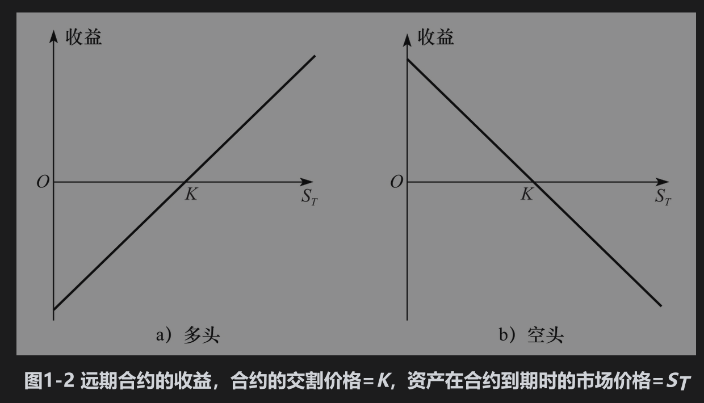

# 1.3 远期合约

一种比较简单的衍生产品是远期合约(forward contract)，它是在将来某一指定时刻以约定价格买入或卖出某一产品的合约。远期合约可以与即期合约(spot contract)对照，即期合约是指立刻就要买入或卖出资产的合约，远期合约常常是金融机构之间或金融机构与其客户之间在场外市场进行的交易。

在远期合约中，同意在将来某一时刻以约定价格买入资产的一方被称为持有多头头寸（long position，简称多头），远期合约中的另外一方同意在将来某一时刻以同一约定价格卖出资产，这一方被称为持有空头头寸（short position，简称空头）。

外汇远期合约在市场上十分流行。许多大银行既雇用了即期合约交易员，也雇用了远期合约交易员。在后面的章节里我们会看到，在远期价格、即期价格、两种货币的利率之间存在一种关系。表1-1列出的是2020年5月21日一家大型跨国银行给出的有关英镑(GBP)和美元(USD)之间汇率的买入和卖出价格，这里的汇率价格是指1英镑可兑现的美元数量。表中第1行数字表示此银行准备以每英镑1.2217美元的价格在即期市场（即马上交割）买入英镑（英镑也被称为sterling），同时也准备以每英镑1.2220美元的价格在即期市场卖出英镑；表中第2～4行表示该银行准备在1个月、3个月和6个月后分别以每英镑1.2218、1.2220和1.2224美元的价格买入英镑，同时银行也准备在1个月、3个月和6个月后分别以每英镑1.2222、1.2225和1.2230美元的价格卖出英镑。


远期合约可以用来对冲外汇风险，假定在2020年5月21日美国一家企业的资金部主管已经预料到在6个月后（2020年11月21日）需要支付100万英镑，这位主管准备对冲外汇风险，他可以同银行达成一个如表1-1所示的远期合约，在合约中约定在6个月后，这家企业必须以每英镑1.2230美元的价格买入100万英镑，在远期合约中这家企业为多头方，也就是说这家企业在2020年11月21日以122.30万美元的价格买入100万英镑，而银行在合约中处在空头方的位置，也就是说银行必须在2020年11月21日以122.30万美元的价格卖出100万英镑。企业和银行都必须履行合约。

## 1.3.1 远期合约的收益

考虑上述交易中企业持有的头寸，远期合约在签署以后会产生什么样的结果呢？在这里的远期交易中，企业有义务在6个月后以1223000美元价格买入100万英镑。当汇率上涨时，假如在6个月后1英镑值1.3000美元，这时对企业来讲，远期合约价值为+77000(=1300000-1223000)美元。远期合约保证企业可以按每英镑1.2230美元（而不是1.3000美元的价格）买入100万英镑。类似地，当在6个月后汇率降到1.2000时，对企业来讲，远期合约价值为-23000美元，这是因为由于持有远期合约而使企业比从市场直接购买英镑多花了23000美元。一般来讲，在合约到期时，对于远期合约多头方来讲，每一单位合约的收益为

```python 

           ST-K

```

这里K为合约的交割价格(delivery price)，ST为资产在合约到期时的市场价格，合约中的多头方必须以K价格买入价值为ST的资产。同样，对于远期合约的空头方来讲，合约所带来的收益为

```python 

          K-ST

```

 以上所列的两项收益均可正可负，这些收益表示在图1-2中。因为签订远期合约的费用为0，所以合约的收益也就是交易员所有的盈亏。

 


在上面的例子中，K=1.2230，企业持有多头。当ST=1.3000时，每英镑的收益为0.077美元；当ST=1.2000时，每英镑的收益为-0.023美元。1.3.

## 2 远期价格和即期价格

我们将在第5章里详细讨论远期价格和即期价格之间的关系。为了粗略地描述两者之间的关系，考虑现价为60美元的无股息股票。假定借入和借出1年期现金的利率均为5%，1年期的远期价格是多少呢？

在上面的例子中，K=1.2230，企业持有多头。当ST=1.3000时，每英镑的收益为0.077美元；当ST=1.2000时，每英镑的收益为-0.023美元。

答案是60美元以5%增长到1年后的数量，即63美元。如果股票的远期价格大于63美元，比如为67美元。你可以借入60美元资金，买进股票，然后以远期合约的价格在1年后以67美元卖出股票。在1年后偿还贷款，你可以得到4美元的盈利；如果股票的远期价格小于63美元，比如为58美元，在投资组合中持有股票的投资者可以卖出股票而获得60美元资金，然后签订在1年后以58美元买进股票的远期合约。将卖出股票所得资金以5%进行投资后可以得到3美元的利息。在1年后以58美元的价格买回股票，这样做会使投资者在1年中比保留股票的做法多赚5美元