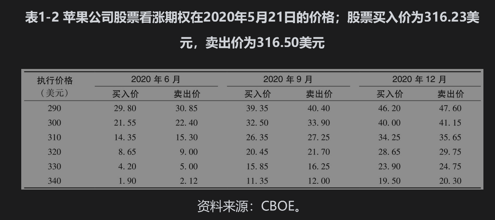
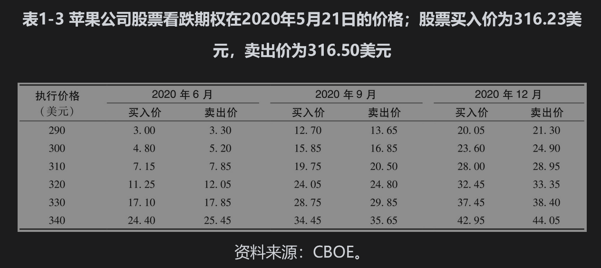
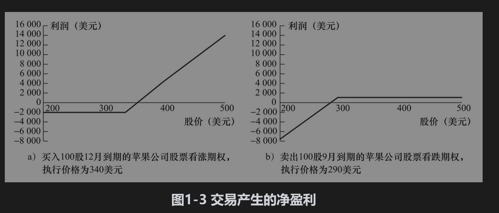

# 1.5 期权

期权产品在交易所市场和场外市场里均有交易。期权产品可以分成两种基本类型：看涨期权(call option)的持有者有权在将来某一特定时间以某一特定价格买入某种资产，看跌期权(put option)的持有者有权在将来某一特定时间以某一特定价格卖出某种资产。[注]合约中所说的特定价格叫执行价格(exercise price)或敲定价格(strike price)；期权产品所指的特定时间叫到期日(expiration date)或期限(maturity)。美式期权(American option)是指期权持有人在到期日之前任何时间都可以选择行使期权；欧式期权(European option)是指期权持有人只能在到期日才能选择是否行使期权。[注]在交易所交易的股票期权大多为美式期权。一份合约的标的资产数量通常为100股。欧式期权比美式期权分析起来要容易一些，美式期权的性质常常与相应的欧式期权的性质一样。

在这里应该强调的是期权赋予持有者去做某一项事情的权利，当然持有者可以选择不去行使这一权利。与此相比，远期和期货合约中的双方必须要买入或卖出标的资产。这里我们应该注意到，尽管承约远期或期货合约时不需要任何费用，但必须付出一定费用才能拥有期权。

芝加哥期权交易所(CBOE)是世界上最大的股票期权交易所。表1-2给出了苹果公司（股票代码为AAPL）股票看涨期权在2020年5月21日的买入价和卖出价。表1-3给出了相应的看跌期权的价格。这些报价均来自CBOE网页。苹果公司股票在报价时的买入价和卖出价分别为316.23美元和316.50美元，期权的买卖差价（作为价格的百分比）通常比其标的股票的差价要大，同时也取决于交易量。表1-2与表1-3中期权的执行价格分别为290美元、300美元、310美元、320美元、330美元和340美元。表中所示期权的到期日分别为2020年6月、2020年9月和2020年12月。期权的实际到期日为到期月的第3个星期五，6月期权的到期日为2020年6月19日，9月期权的到期日为2020年9月18日，12月期权的到期日为2020年12月18日。

这些表格显示了期权的一些性质。当执行价格增大时，看涨期权价格下降，而看跌期权价格上升。当期权期限增大时，这两种期权价值均会增大。在第11章中，我们将讨论期权的这些性质。

假如某投资者向其经纪人发出购买苹果公司股票12月看涨期权的指令，期权执行价格为340美元，经纪人会向CBOE的交易员传递购买指令，从而完成这项交易。如表1-2所示，期权的价格为20.30美元（列表中的卖出价），这一价格是指买入1股股票的期权价格。在美国，每份股票期权合约的规模为100股，因而投资者必须通过经纪人向交易所注入2030美元资金，然后交易所会将此项资金转给期权的卖出方。

在我们的例子中，投资者以2030美元的价格买入每股340美元、100股苹果公司股票的权利。如果在2020年12月18日之前苹果公司的股票价格没有高于340美元，期权持有人则不会行使权利，投资者（期权持有人）因此也就损失了2030美元。[注]但是，如果苹果公司的股票表现很好，在期权被行使时，苹果公司股票（买入）价格为400美元，这时期权持有人能够以每股340美元的价格买入每股实际价值为400美元的股票，这会给投资者带来6000美元的收益。将最初买入期权的费用考虑在内后，期权持有人的实际盈利为3970美元。[注]

另外一种情形是假定投资者以12.70美元的价格卖出了执行价格为290美元的9月看跌期权（列表中的买入价格）。出售期权后投资者会马上收入100×12.70=1270（美元）。如果苹果公司股票价格一直高于290美元，期权就不会被行使，投资者的盈利为1270美元。但是，如果股票价格下跌，当期权被行使时股票价格为250美元，投资者将会产生损失。尽管股票的价格是250美元，但是投资者必须按每股290美元的价格购买100股，从而损失4000美元，将最初的期权费用考虑在内，投资者的实际损失为2730美元。

在CBOE内交易的期权为美式期权。但为了便于讨论，我们假设这些期权为欧式期权，也就是假设只有在到期日才能行使这些期权。将投资者的盈利作为到期时股票价格的函数，我们可以在图1-3中画出期权的盈利图。

在今后的章节里我们将进一步讨论期权市场的运作机制以及交易员如何对表1-2和表1-3中的期权进行定价。我们在这里指出，期权市场上有四种参与者：

(1)看涨期权的买方；

(2)看涨期权的卖方；

(3)看跌期权的买方；

(4)看跌期权的卖方。

期权的买入方被称为持有多头，期权的卖出方被称为持有空头，卖出期权也被称为对期权承约(writing the option)。