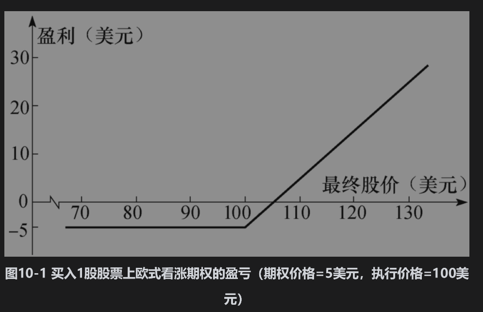
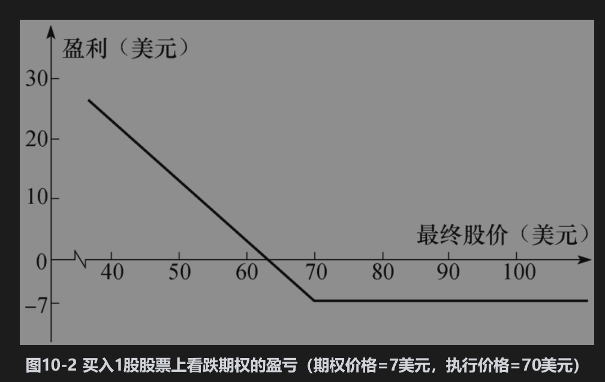

# 10.1 期权类型

如第1章所述，期权有两种基本类型：看涨期权(call option)给期权持有者在将来某个日期以一定价格买入某资产的权利，看跌期权(put option)给期权持有者在将来某个日期以一定价格卖出某资产的权利。期权合约中注明的日期叫到期日(expiration date)或满期日(maturity date)，合约中所注明的价格叫执行价格(exercise price)或敲定价格(strike price)。

期权可以是美式期权(American option)或欧式期权(European option)，这些名称与期权交易的地理位置毫无关系。美式期权可以在到期日之前的任何时刻行使，而欧式期权只能在到期日才能行使。大多数交易所交易的期权为美式期权，但一般来讲，欧式期权比美式期权更容易分析，一些美式期权的性质常常从相应欧式期权的性质中类推而来。

## 10.1.1 看涨期权

考虑以下情形：一个投资者买入执行价格为100美元、购买100股股票的看涨期权。假定股票的当前市场价格为98美元，期权到期日为4个月，购买1股股票的期权价格为5美元。持有者的最初投资为500美元。由于期权为欧式期权，因此持有者只能在到期日才能行使期权。如果在到期日，股票价格小于100美元，很明显投资者不会行使期权（没有必要以100美元的价格买入市场价格低于100美元的股票）。因此，投资者会损失全部500美元的最初投资。如果在到期日，股票价格大于100美元，期权将会被行使。假定在到期日股票价格为115美元。通过行使期权，期权持有人可以按每股100美元的价格买入100股股票，如果投资者马上将股票卖掉，则每股可以赚15美元。忽略交易费用，投资者可以挣得1500美元。将最初的期权费用考虑在内，投资者的盈利为1000美元。

图10-1展示了本例中投资者买入1股股票的看涨期权的净盈利与最终股票价格之间的关系。例如，假定在到期日的股票价格为120美元时，购买1股股票的期权盈利为15美元。需要注意的是，有时投资者在行使期权后在整体上仍有亏损。假定在本例中期权到期时股票价格为102美元，投资者会行使期权，这时收益为102-100=2美元，将最初的期权费用考虑在内，投资者的损失为300美元。可能有人会认为此时投资者不应该行使期权，但那样一来会亏损5美元，这比行使期权时3美元的亏损还要高。一般来讲，当在到期日股票价格高于执行价格时，欧式看涨期权的投资者就应该行使期权。

## 10.1.2 看跌期权

看涨期权持有者希望股票价格上涨，而看跌期权持有者则希望股票价格下跌。考虑一个能以70美元执行价格出售100股股票的看跌期权。假定股票的当前价格为65美元，期权到期日为3个月，卖出1股股票上期权的价格为7美元，投资者的最初投资为700美元。因为期权为欧式期权，因此这一期权只能在到期日股票价格低于70美元时才会被行使。假定在到期日股票价格为55美元，投资者能够以55美元的价格买入100股股票，而按照期权的约定，期权持有人可以按每股70美元的价格卖出股票，因此每股收益为15美元，总收益为1500美元（仍然忽略交易费用）。将最初的期权费用700美元考虑在内，投资者的净盈利为800美元。这里并不能保证投资者一定会盈利。如果在到期日股票价格高于70美元，看跌期权在到期时会一文不值，投资者会损失700美元。图10-2显示了该例中投资者买入看跌期权的净盈利与最终股票价格之间的关系。

## 10.1.3 提前行使期权

如上所述，交易所里交易的期权通常为美式期权而不是欧式期权。这意味着前面所述的投资者并不一定要等到到期日才行使期权，在后面我们将看到有时在到期日之前行使美式期权为最优。