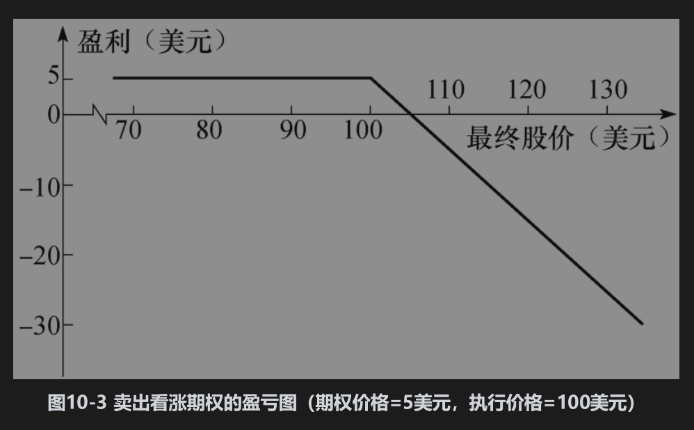
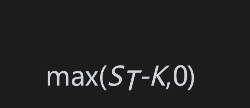
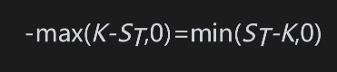
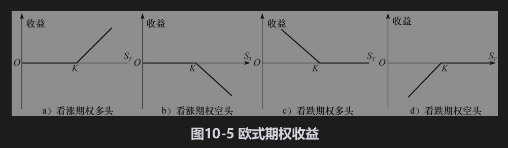

# 10.2 期权头寸

任何一个期权合约都有两方：一方为期权的多头（即买入期权方），另一方为期权的空头［即卖出期权或期权承约方(written the option)］。卖出期权的一方在最初收入期权费，但这一方在今后有潜在的义务，承约方的盈亏与买入期权一方的盈亏刚好相反。图10-3和图10-4分别是图10-1和图10-2的变形，它们显示了期权承约人的盈亏与最终股票价格之间的关系。

期权交易共有4种头寸形式：

(1)看涨期权多头；

(2)看跌期权多头；

(3)看涨期权空头；

(4)看跌期权空头。

一般来讲，以期权收益来理解欧式期权常常十分有用。这时期权的最初费用不包括在计算之中。如果K为执行价格，ST为标的资产的最终价格，欧式看涨期权多头的收益为

这反映了在$`S_T`$＞K时期权会被行使，而在ST≤K时期权将不会被行使。欧式看涨期权空头的收益为

欧式看跌期权多头的收益为

欧式看跌期权空头的收益为

图10-5展示了期权的收益。

