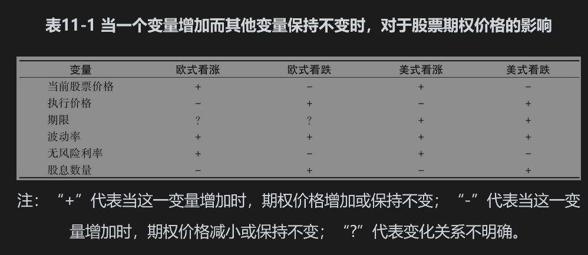
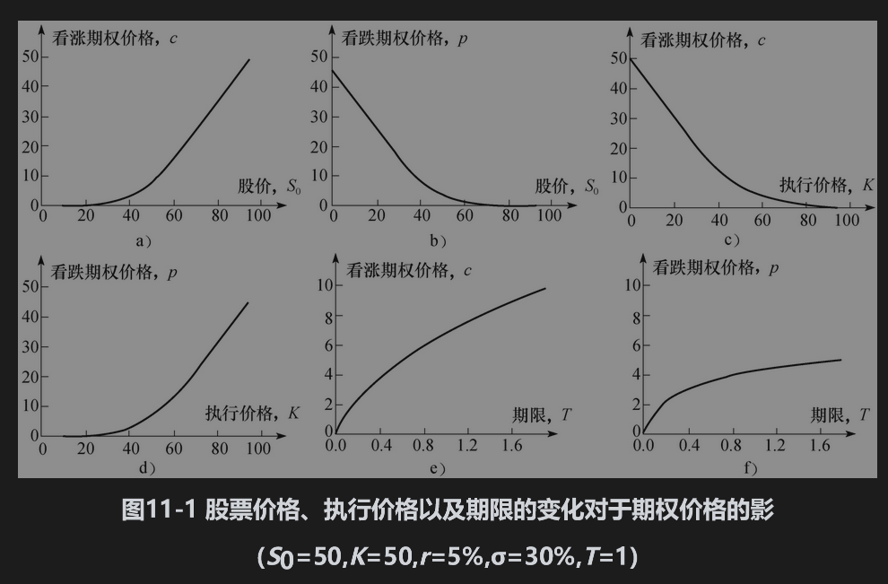
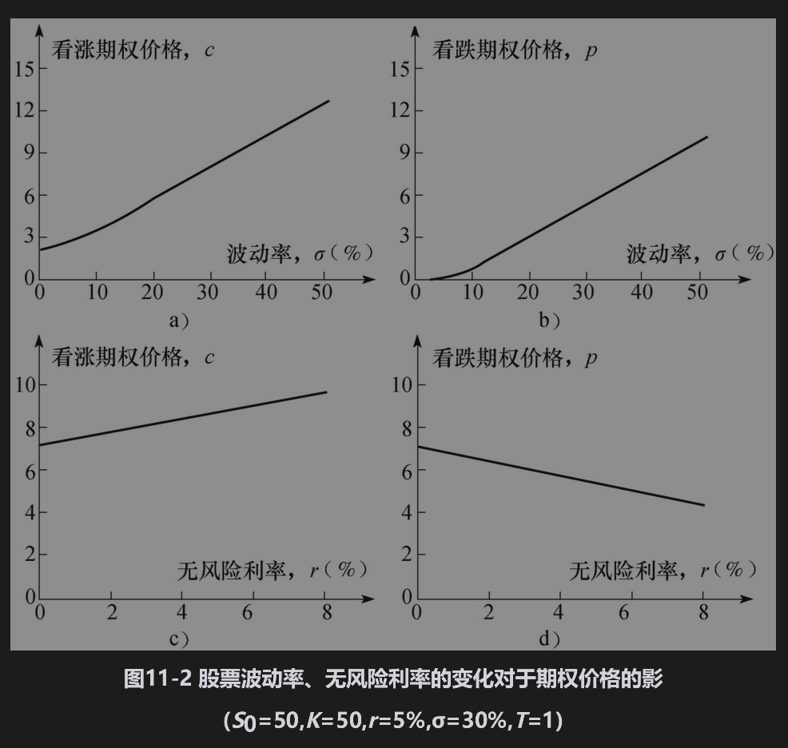

# 11.1 影响期权价格的因素

有6种因素会影响股票期权的价格：

(1)当前股票价格，$`S_0`$；

(2)执行价格，K；

(3)期权期限，T；

(4)股票价格的波动率，σ；

(5)无风险利率，r；

(6)预计支付的股息。

在这一节里我们将考虑当其中一个因素发生变化时（假定其他因素保持不变），对于期权价格的影响。表11-1总结了这些关系。

图11-1与图11-2给出了看跌期权和看涨期权价格与上面所列的前5种因素之间的关系，表中采用的参数为：$`S_0`$=50,K=50,r=5%（每年），σ=30%（每年），T=1（年），并且假定股票无股息。此时看涨期权价格为7.116，看跌期权价格为4.677。

## 11.1.1 股票价格与执行价格

如果在将来某一时刻行使看涨期权，期权收益等于股票价格与执行价格的差额。因此，随着股票价格的上升，看涨期权价值将会增大，而随着执行价格的上升，看涨期权价值将会减小。看跌期权的收益等于执行价格与股票价格的差额，因此，看跌期权的价格走向刚好与看涨期权相反：随着股票价格的上升，看跌期权价值会减小；随着执行价格的上升，看跌期权价值将会增大。图11-1a～图11-1d展示了看涨期权与看跌期权价格对标的股票价格与执行价格的依赖方式。

## 11.1.2 期权期限

现在我们考虑期限对于期权价格的影响。当期限增加时，美式看涨期权与看跌期权价值都会增加（至少不会减小）。考虑两个只是期限不同的美式看涨期权：长期限期权持有者拥有短期限期权持有者所有行使期权的机会（甚至更多机会），因此，长期限期权的价格至少不会低于短期限期权的价格。

随着期限的增加，欧式看跌期权和看涨期权的价值一般会增加（见图11-1e和图11-1f），但这一结论并非总是成立。考虑两个同一股票上的欧式期权，一个期权的到期日在1个月后，另一个期权的到期日在2个月后，假定在6个星期后股票支付一笔大额股息，因为股息会使得期权价格下降，所以短期限期权价值可能会超过长期限期权的价值。在本章里我们将会看到，有时提前行使深度实值的美式看跌期权是最优的做法。这说明在某些情形下，短期限欧式看跌期权比类似的长期限欧式看跌期权价值更高。

## 11.1.3 波动率

在第15章里我们将讨论波动率的精确定义方式。粗略地讲，股票价格的波动率(volatility)用于衡量未来股票价格变动的不确定性。当波动率增大时，股票价格大幅度上升或下降的机会将会增大。对于股票持有者而言，这两个变动常常会互相抵消，但对于看涨或看跌期权持有者而言，情况会有所不同。看涨期权的持有者不仅可以从股价上升中获利，而且当股价下跌时其损失是有限的，因为期权的最大损失只是期权费用。类似地，看跌期权持有者可以从价格下跌中获利，同时损失也会有限。因此随着波动率的增加，看涨期权及看跌期权价值都会增加（见图11-2a和图11-2b）。

## 11.1.4 无风险利率

无风险利率对期权价格的影响并不那么显然。在整个经济环境里利率增加时，投资者所要求股票收益的期望值也会增加。同时，期权持有人将来所收到现金流的贴现值会降低。以上两种效应的综合效应是看涨期权价值会增加，而看跌期权价值会降低（见图11-2c和图11-2d）。

应该强调的是，我们假定利率增大时其他变量的值保持不变。特别是在表11-1中当利率上升（下降）时，股票价格保持不变。在实际中，当利率上升（下降）时，股票价格往往会下降（上升）。利率上升与相应的股票价格下降的整体效应可以使看涨期权价值下降，而看跌期权价格上升。同理，利率下降与相应的股票价格上升的整体效应可以使看涨期权价值上升，而看跌期权价值下降。

## 11.1.5 将来的股息数量

股息会使股票价格在除息日降低。对于看涨期权的价值，这是一个坏消息，但对于看跌期权，这却是一个好消息。因此，看涨期权价值与预期股息的大小成反向关系，看跌期权的价值与预期股息的大小成正向关系。