# 11.3 期权价格的上限与下限

在这一节里我们将推导期权价格的上下限。这里的上下限不依赖于第11.1节中所述任何因素的假（r＞0除外）。当期权价格高于上限或者低于下限时，就会出现套利机会。

## 11.3.1 上限

美式看涨期权或欧式看涨期权给其持有者以指定价格买入1股股票的权利。无论发行什么情况，期权的价格都不会超出股票价格。因此，股票价格是看涨期权价格的上限

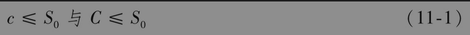

如果以上不等式不成立，那么套利者可以购买股票并同时出售期权以轻易获取无风险收益。

美式看跌期权持有者有权以价格K卖出1股股票。无论股票价格变得多么低，期权的价值都不会高于执行价格

对于欧式期权，我们知道在T时刻，期权的价值不会超出K。因此，期权的当前价格不会超过K的贴现值，即

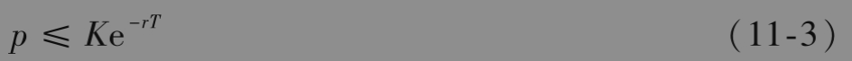

如果以上不等式不成立，那么套利者可以通过卖出一个期权，并同时将所得收入以无风险利率进行投资，这样套利者将可以获取无风险收益。

## 11.3.2 无股息股票上看涨期权的下限

不支付任何股息的股票上欧式看涨期权的下限为

在正式讨论以上结论之前，我们首先给出一个数值例子。

假定S0=20（美元），K=18（美元），r=10%（每年），T=1（年）。这时

即3.71美元。考虑欧式看涨期权价格为3美元的情形，这个价格小于理论下限3.71美元。一个套利者可以卖空股票并同时买入看涨期权，交易的现金流入为20-3=17（美元）。以10%的利率投资一年后，17美元将增长为17e0.1×1=18.79（美元）。在年末期权到期时，如果股票价格高于18美元，套利者按18美元价格行使期权，并对卖空交易进行平仓，所得盈利为

         18.79-18=0.79（美元）
         
         
如果股票价格低于18美元，套利者可以在市场上买入股票来对卖空交易进行平仓。这时套利者的盈利会更多。例如，如果股票价格为17美元，套利者的盈利为

         18.79-17=1.79（美元）

为了更正式地讨论，我们考虑以下两个投资组合：

• 组合A：一份欧式看涨期权加上在时间T提供收益K的零息债券。

• 组合B：1股股票。

在组合A中，在时间T零息债券的价值为K。在时间T，如果ST>K，投资者行使看涨期权，组合A的价值为ST。如果$`S_T`$<K，期权到期时价值为0，这时组合A的价值为K。因此，在T时刻，组合A的价值为

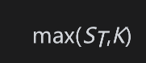

组合B在时间T的价值为ST。在时间T，组合A的价值总是不会低于组合B的价值，因此，在无套利的条件下，组合A的价值也不会低于组合B的价值。零息债券在今天的价值是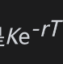，因此

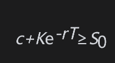

或

对于看涨期权而言，最糟的情况是期权到期时价值为0，因此期权价值不能为负值，即c≥0。因此

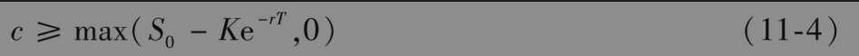

【例11-1】 考虑一份无股息股票上的欧式看涨期权，假定股票价格为51美元，期权执行价格为50美元，期权期限为6个月，无风险利率为每年12%。在本例中，$`S_0`$=51，K=50,T=0.5，r=0.12。由不等式(11-4)得出期权的下限为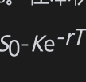，即

## 11.3.3 无股息股票上欧式看跌期权下限

对于无股息股票上的欧式看跌期权，其价格下限为

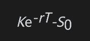

我们接下来仍先给出一个数值例子，然后再进行正式讨论。假设$`S_0`$=37（美元），K=40（美元），r=5%（每年），T=0.5（年），在这种情形下

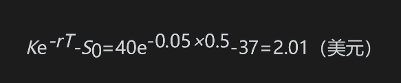

考虑欧式看跌期权价格为1美元的情形，这时期权价格小于2.01美元的理论下限值。套利者可借入38美元，借款期限为6个月，并同时买入看跌期权与股票。在6个月结束时，套利者须支付38e0.05×0.5=38.96美元。如果股票价格低于40美元，套利者行使期权，即以40美元价格卖出股票，偿还贷款，从而获利

          40-38.96=1.04（美元）

如果股票价格高于40美元，套利者放弃期权，卖出股票，偿还贷款，并获得更高盈利。例如，如果股票价格是42美元，这是套利者的盈利为42-38.96=3.04（美元）为了更正式地讨论，我们考虑以下两个投资组合：

• 组合C：一份欧式看跌期权加上1股股票。

• 组合D：在时间T收益为K的零息债券。

如果$`S_T`$<K，在到期时组合C里的期权会被行使，组合C的价值变为K；如果$`S_t`$>K，在到期时，期权价值为0，C的价值为$`S_T`$，因此在T时组合C的价值为

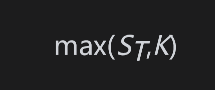

在时间T，组合D的价值为K，因此在T时刻，组合C的价值总是不会低于组合D的价值。在无套利条件下，目前组合C的价值也不会低于组合D的价值

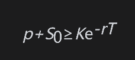

或

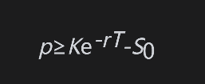

对于一个看跌期权而言，最差的情况是期权到期时价值为0，所以期权价值不能为负值。因此

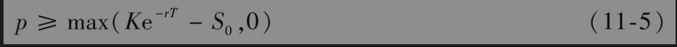

【例11-2】 考虑一份无股息股票上的欧式看跌期权，假定股票价格为38美元，期权执行价格为40美元，期权期限为3个月，无风险利率为每年10%。在本例中，S0=38，K=40,T=0.25，r=0.10。由不等式(11-5)得出期权的下限为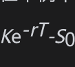，即

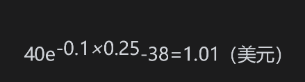
