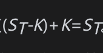
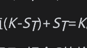
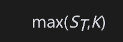
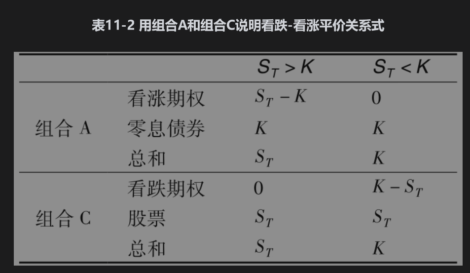
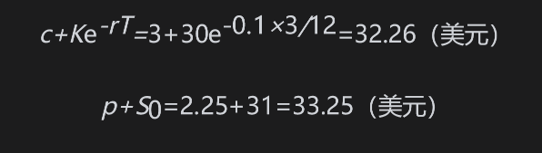
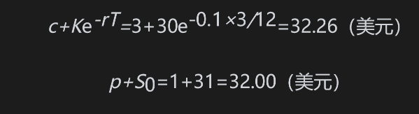
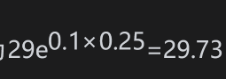
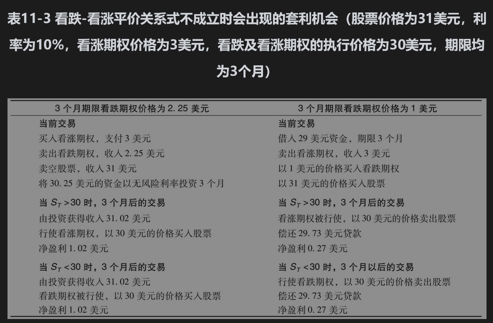
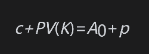
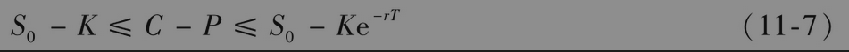

# 11.4 看跌-看涨平价关系式

我们现在推导具有同样执行价格与期限的欧式看跌期权与看涨期权价格之间的一个重要关系式。考虑下面两个在前一节里已经用过的组合：

• 组合A：一份欧式看涨期权加上在时间T提供收益K的零息债券。

• 组合C：一份欧式看跌期权加上1股股票。

我们仍然假设股票不支付股息，看涨期权与看跌期权具有相同的执行价格K与期限T。

像在上一节里讨论的那样，组合A中的零息债券在时间T的价值为K。如果在时间T，股票价格$`S_T`$>K，那么组合的期权将被行使，所以在这种情况下组合A在时间T时的价值。如果$`S_T`$<K， 那么在组合A里的看涨期权将会没有价值，因此在时间T，组合A的价值为K。

在组合C中，在时间T时股票的价值为ST。如果$`S_T`$<K， 这时在组合C中的看跌期权将会被行使，这说明在时间T，组合C的价值 。 如果$`S_T`$>K，这时在组合C中的看跌期权将会没有价值，从而在时间T，组合C的价值为ST。

表11-2总结了这些结果：当$`S_T`$>K 时，在时间T，两个组合的价值均为ST；当$`S_t`$<K 时，在时间T，两个组合的价值均为K。换句话说，在时间T，当期权到期时，两个组合的价值均为

由于组合A及组合C中的期权均为欧式期权，在到期日之前均不能行使，因此两个组合在时间T有相同的收益，从而组合A和组合C在今天必须有相同的价值。如果不是这样的话，套利者可以买入便宜的组合，而同时卖空较贵的组合。由于两个组合在时间T将会相互抵消，因此这种交易策略将会锁定无风险套利，数量等于两个组合价值的差。

组合A中期权和债券在今天的价值分别为c和Ke-rT，组合C中期权和股票在今天的价值分别为p和S0，因此

这就是所谓的看跌-看涨平价关系式。此公式表明具有某个执行价格与行使日期的欧式看涨期权价值与一个具有相同执行价格和行使日期的看跌期权价值可以相互推导出来。

为了说明当式(11-6)不成立时就会出现套利机会，假定股票价格为31美元，执行价格为30美元，无风险利率为每年10%，3个月的欧式看涨期权为3美元，3个月期的欧式看跌期权为2.25美元，这时

相对于组合A来讲，组合C的价格太高。一个套利策略是买入组合A中的证券并同时卖空组合C中的证券。在这个交易策略中包括买入看涨期权、卖出看跌期权并卖空股票，因此，今天的现金流为

        -3+2.25+31=30.25（美元）
        
        
以无风险利率进行投资，这笔现金在3个月后将变为

如果在到期日股票价格高于30美元，看涨期权将会被行使；如果股票价格低于30美元，看跌期权将被行使。在这两种情况下，投资者均可以30美元的价格买入1股股票，购入股票可用于平仓卖空的股票，因此净收益为

           31.02-30=1.02（美元）

对于另外一种情况，假定看涨期权价格为3美元，看跌期权价格为1美元

这时组合A的价值比组合C的价值高。套利者可以卖空组合A中的证券，并同时买入组合C中的证券来锁定盈利。交易策略包括卖出看涨期权、买入看跌期权与股票，最初的投资为

         31+1-3=29（美元）
         
         
当以无风险利率借入资金时，在3个月后需要偿还的金额为。

与前面的例子类似，或者看涨期权或者看跌期权将会被行使。卖出看涨期权与买入看跌期权将会使股票以30美元的价格被售出，因此净盈利为

           30-29.73=0.27（美元）

表11-3描述了以上例子。业界事例11-1说明了看跌-看涨平价关系式可以被用来解释公司的债权人及股权人之间的相互关系。

## 业界事例11-1

## 看跌-看涨平价关系式与资本结构

费希尔·布莱克(Fisher Black)、迈伦·斯科尔斯(Myron Scholes)、罗伯特·默顿(Robert Merton)是期权定价理论的先驱者。20世纪70年代初，他们还描述了如何用期权理论来刻画公司的资本结构。目前这一模型已广泛地被金融机构用于描述公司的信用风险。

为了说明这种分析，考虑一家在资本结构中含有零息债券与股票的公司。假定债券在第5年时到期，本金为K，公司不付任何股息。如果在第5年时资产价值大于K，公司股东将会选择偿还债券，如果资产价格小于K，股东则选择宣布破产。这时债券持有人将掌握公司的拥有权。

公司的股权在第5年时价值为max(AT-K,0)，其中AT为公司资产在第5年时的价值。这一关系式表示股东拥有一个在公司资产上执行价格为K的看涨期权。这时，债券持有者拥有什么呢？其收益为min(AT,K)，这一表达式等价于K-max(K-AT,0)。这表示债券价值等于K的贴现值减去一个公司资产上执行价格为K的欧式看跌期权的价值。

综上所述，令c及p分别为公司资产上看涨与看跌期权的价值，那么

             股权价值=c
             
             债券价值=PV(K)-p
             
             
将公司在当前的资产价值记为A0。资产价值等于所有构成资产成分的全部价值。这意味着公司资产的当前价值等于股票价值加上债券的价值，因此

重新组织以上表达式，我们得出

这正是由式(11-6)所述的在公司资产上看涨期权与看跌期权所满足的看跌-看涨平价关系式。

## 美式期权

虽然看跌-看涨平价关系式只对欧式期权成立，但我们也可以得出美式期权服从的一些关系式。可以证明（见练习题11.23），当没有股息时

【例11-3】 美式看涨期权的执行价格为20美元，期限为5个月，期权价值为1.5美元。假定当前股票价格为19美元，无风险利率为每年10%。由式(11-7)我们得出

即

               1≥P-C≥0.18
        
        
以上关系式表示P-C介于0.18美元与1美元之间。由于C为1.5美元，P必须介于1.68美元与2.50美元之间。换句话讲，与美式看涨期权具有相同执行价格和期限的美式看跌期权价格的上下限分别为2.50美元和1.68美元。