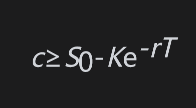
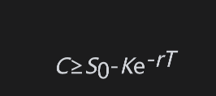
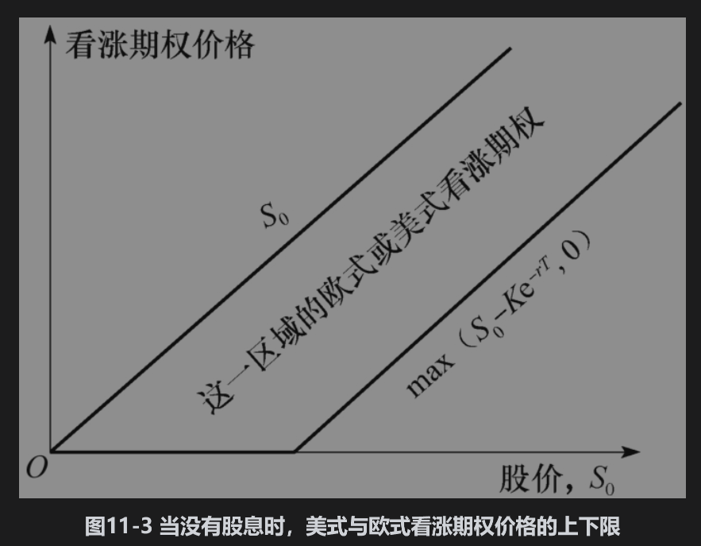
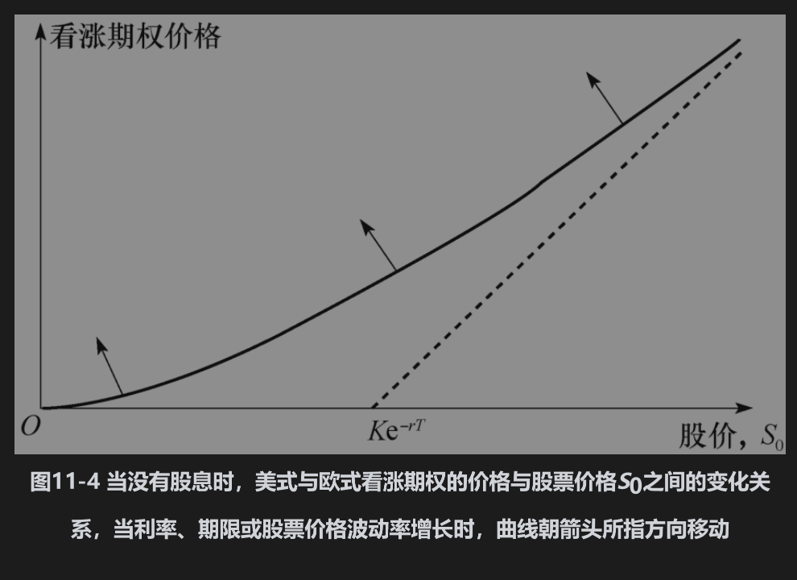

# 11.5 无股息股票上的看涨期权

在这一节里，我们将首先说明在到期之前行使无股息股票上的美式看涨期权永远不会是最佳选择。为了说明问题的基本原理，考虑一份不付股息股票上期限为1个月的美式看涨期权，股票价格为70美元，执行价格为40美元。这个期权的实值程度很大，期权的持有者可能会很想马上行使期权。但是，如果投资者计划在行使期权后将所得股票持有1个月以上，那么这不会是最佳策略。更好的方案是持有期权并在1个月后（即在到期日）行使期权，这样做可以使40美元的执行价格比马上行使晚1个月支付，因此可以挣到40美元在1个月内的利息。因为股票不付任何股息，所以投资者不会损失任何由股票带来的收入。持有期权而不马上行使期权的另一个好处是股票在1个月内有可能会低于40美元（尽管机会不大）。在这种情况下，投资者将不会行使期权，并且会很庆幸在1个月前没有提前行使期权。

以上讨论说明，如果投资者计划在期权的剩余期限内持有股票（本例中的期限为1个月），那么提前行使期权没有任何好处。但如果投资者认为股票的价格被高估了，这时是否应行使期权然后将股票卖出呢？在这种情况下，投资者应卖出期权，而不是行使期权。那些确实想持有股票的投资者将会买入期权，而这样的投资者一定会存在，否则股票的当前价格就不会是70美元。综上所述，期权价格会高于其30美元的内含价值。

为了给出一个正式的论证，我们利用式(11-4)

因为美式期权的持有者行使期权的机会包括欧式期权行使期权的机会，所以C≥c，因此

由于r＞0，当T＞0时，我们有C＞$`S_0`$-K。这说明在到期之前期权价格C总是大于其内含价值。如果提前行使期权，C将等于在行使时的内含价值，因此，提前行使期权不会是最优的。

总结上面所述，不应当提前行使期权的原因有两个：一个原因与期权所提供的保险有关。拥有期权（而不是股票）实际上是对持有者提供了股票价格不会低于执行价格的保险，一旦行使期权而将执行价格换成了股票，那么就失去了这种保险。另一个原因与货币的时间价值有关。从期权持有者的角度讲，越晚行使期权越好。

## 上下限

由于在没有股息时永远不会提前行使美式看涨期权，所以C=c。由式(11-1)和式(11-4)，期权价值的上下限分别为

这些上下限显示在图11-3中。

图11-4显示了期权价格与标的股票价格S0之间的一般关系式。随着r或T或股票价格波动率的增长，看涨期权与股票价格关系的图形会朝箭头所指方向移动。

