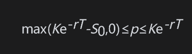
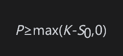
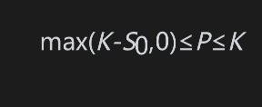
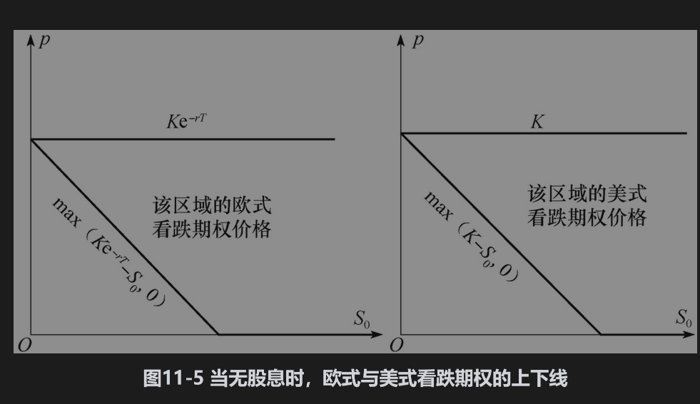
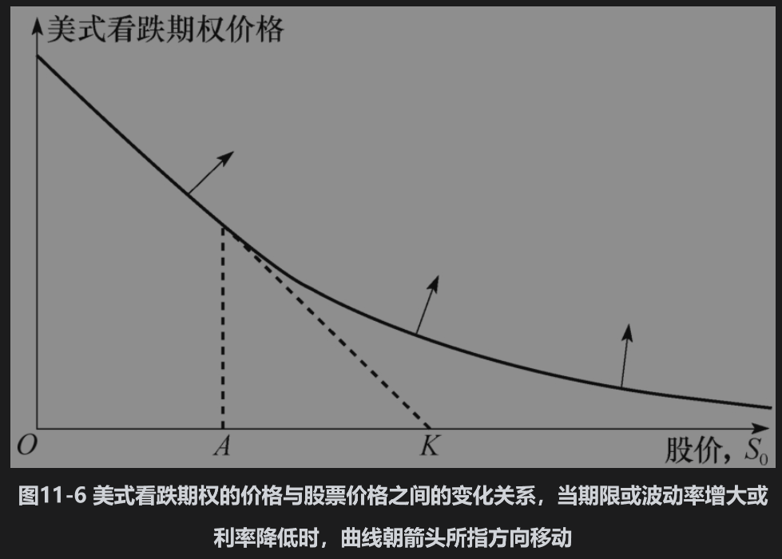
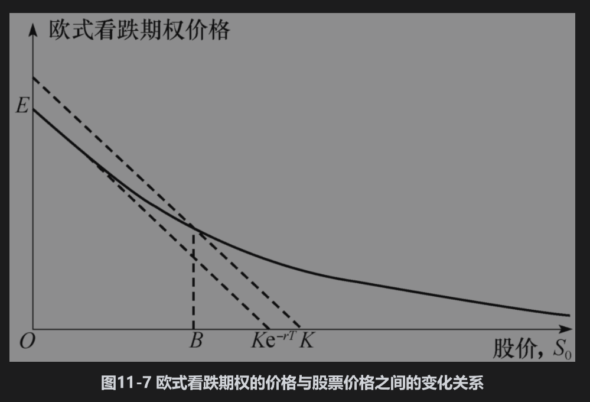

# 11.6 无股息股票上的看跌期权

提前行使无股息股票上的看跌期权有时可能是最优的。事实上，在期权期限内的任一给定时刻，当期权的实值程度足够大时，都应该提前行使期权。

为了说明这一点，考虑以下极端情形：假定执行价格为10美元，股票价格几乎为0。通过立即行使期权，投资者可以马上得到近10美元。如果投资者选择等待，行使期权的盈利可能低于10美元，但不可能高于10美元，这是因为股票的价值不可能为负值。不仅如此，在现在收到10美元要比在将来收到10美元更好，所以应该马上行使期权。

同看涨期权类似，看跌期权也可以被看作一种保险。当同时持有股票与看跌期权时，看跌期权可以为持有者在股票价格下跌到一定程度时提供保险。但与看涨期权不同的是，放弃这一保险而提前行使期权来立即实现执行价格的做法可能为最优。一般来讲，当S0减小、r增大和σ减小时，提前行使期权为最优选择的可能性也会增大。

## 上下限

在无股息的情况下，由式(11-3)与式(11-5)可知欧式看跌期权的上下限为

对于无股息股票上的美式看跌期权，由于总是可以马上行使期权，所以它永远满足

这比式(11-5)中欧式看跌期权的关系式更强。利用式(11-2)中的结果，无股息股票上的美式看跌期权的上下限为

图11-5展示了这些上下限。

图11-6说明了在一般情况下，美式看跌期权价格随S0变化的形式。只要r>0，当股票价格足够低时，立即行使美式期权的做法总是最优的。当提前行使期权是最优选择时，期权的价值为K-S0。因此当S0很小时，表示看跌期权价值的曲线与看跌期权的内含价值K-S0相重合。在图11-6中，这个S0的值由A点表示。当r减小，或波动率增大，或期限T增大时，表示看跌期权价格与股票价格之间关系的曲线会向箭头所指方向移动。

由于在某些情形下提前行使美式看跌期权是最优的，因此美式看跌期权的价格总是会高于相应的欧式看跌期权价格。而且由于美式看跌期权的价值有时等于其内含价值（见图11-6），因此欧式看跌期权的价值有时会低于内含价值，这说明表示欧式期权价格与标的股票价格之间关系的曲线将会位于相应美式期权曲线之下。

图11-7给出了欧式看跌期权价格随股票价格变化的图形。注意在图11-7的B点上，期权价格等于其内含价值，它所代表的股票价格必须大于图11-6中A点所代表的股票价格，这是因为图11-7中的曲线位于图11-6中的曲线之下。在图11-7中，E点对应于S0=0，从而看跌期权价格为的情形。

