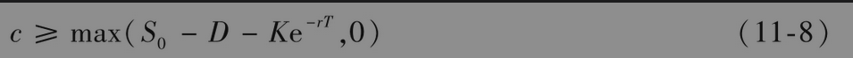
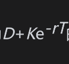
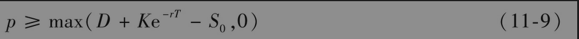
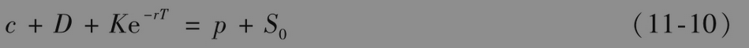
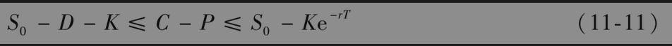

# 11.7 股息的影响

到目前为止，本章里的结论都是建立在假设标的股票不付任何股息的前提下得到的。在这一节里我们考虑股息对于期权的影响。我们假设在期权期限内股息的支付时间与数量都是已知的。因为大多数在交易所交易的期权期限都不超过1年，所以在大多数情况下这个假设并不太合理。我们用D来表示期权期限内股息的贴现值。在计算D时，我们假定股息是在除息日支付的。

## 11.7.1 看涨期权与看跌期权下限

将组合A和组合B重新定义如下：

• 组合A：一份欧式看涨期权c加上数量为D+Ke-rT的现金。

• 组合B：1股股票。

以推导式(11-4)的类似方法可以证明

将组合C和组合D重新定义如下：

• 组合C：一份欧式看跌期权p加上1股股票。

• 组合D：数量为的现金。

以推导式(11-5)的类似方法可以证明

## 11.7.2 提前行使

当预计有股息时，我们将不再有美式看涨期权不会被提前行使的结论。有时在刚好除息日之前行使美式看涨期权是最优的，而在其他时刻行使美式看涨期权则不会是最优策略。在第15.12节中我们将进一步讨论这一点。

## 11.7.3 看跌-看涨平价关系式

当存在股息时，比较经过重新定义的组合A与组合C在期权到期时间T的价值，式(11-6)所表达的看跌-看涨平价关系式变为

股息会使式(11-7)变成（见练习题11.24）

