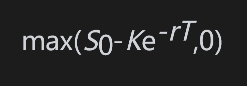
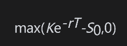
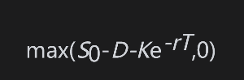
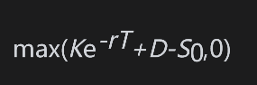
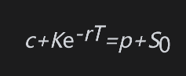

# 小结

影响股票期权价格的因素有6种：股票的当前价格、执行价格、期限、股票价格波动率、无风险利率以及在期权期限内所预期的股息。当股票的当前价格、期限、波动率以及无风险利率增长时，看涨期权的价值也会增加；当执行价格与预期股息增长时，看涨期权的价值会减小。

当执行价格、期限、波动率和预期股息增加时，看跌期权的价值一般也会增加；当股票的当前价格与无风险利率增加时，看跌期权的价值会减小。我们也可以在不对股票价格波动率做任何假设的前提下，得出一些有关期权价格的结论。例如，股票看涨期权的价格总是低于股票本身的价格。类似地，股票看跌期权的价格总是低于股票期权的执行价格。

无股息股票上的看涨期权的价格必须高于

其中S0为股票价格，K为执行价格，r为无风险利率，T为期限。无股息股票上的看跌期权的价格必须高于

假定股票所支付股息的贴现值为D，欧式看涨期权的下限为

欧式看跌期权的下限为

看跌-看涨平价关系式是同一股票上欧式看涨期权价格c和欧式看跌期权价格p之间的关系式。对于无股息股票，平价关系式为

对于支付股息的股票，平价关系式为

对于美式期权，看跌-看涨平价关系式不成立。但是，我们可以利用无套利理论获得美式看涨期权与看跌期权差价的上限和下限。

在第15章中，我们将利用对股票价格的概率分布所做的假设来对本章里的结论做出进一步分析。我们将推导欧式期权的定价公式。在第13章和第21章中我们将看到如何利用数值方法来对美式期权进行定价。