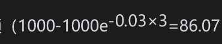

# 12.1 保本债券

在零售市场上，期权常常被用来构造保本债券(principal-protected notes)。这种产品对保守的投资者很有吸引力。投资者的收益依赖于单个股票、股指或其他风险资产的表现，但是本金却没有风险。下面的例子说明了如何构造简单的保本债券。

【例12-1】 假设连续复利的3年期利率为6%，这说明1000e-0.06×3=835.27（美元）在3年后将增长为1000美元。1000美元与835.27美元的差额是164.73美元。假设一个股票组合的价值是1000美元，提供的股息率是每年1.5%。再假设我们可以按低于164.73美元的价格买入在这个组合上的3年期平值欧式看涨期权（由DerivaGem可以验证，当组合价值的波动率小于15%时，确实如此）。一家银行可以向客户提供包含以下价值为1000美元的投资机会：

(1)面值为1000美元的3年期零息债券；

(2)此股票组合上的3年期平值欧式看涨期权。

如果组合的价值增长，那么投资者会得到这1000美元投资在组合上会增长到的价值（这是因为零息债券的收益是1000美元，这正好等于期权的执行价格）。假如组合价值下跌，期权将会没有价值，在零息债券上的收益保证了投资者可以收回所投资的1000美元本金。

保本债券的诱人之处是投资者能够在不冒本金风险的情况下，对风险资产建立头寸。可能发生的最坏情况是在债券期限内失去赚取初始投资上的利息（或其他收入，比如股息）的机会。

在市场上有许多例12-1所述产品的变形。认为资产价格将会下跌的投资者可以购买由零息债券与看跌期权组成的保本债券。3年后投资者的收益是1000美元加上看跌期权的收益。

从零售投资者的角度看，保本债券是否合算呢？当生成保本债券时，银行总是首先要将自己的盈利包含在内，这说明在例12-1中，零息债券加上看涨期权对银行的成本将会小于1000美元。另外，投资者还要承受银行无法支付保本债券收益的风险（在2008年当雷曼兄弟倒闭时，有些零售投资者在雷曼发行的保本债券上蒙受了此类损失）。因此，在某些情况下，更好的做法是投资者自己按通常的方式购买标的期权，并将剩余的本金放到无风险投资上。但情况并非总是如此：在购买期权时，同银行相比，普通投资者很可能会面临更大的买卖差价，而且所挣的利息很可能更低。因此银行有可能在自己盈利的同时，给投资者带来利益。

我们现在从银行的角度看保本债券。例12-1中组合结构的经济可行性依赖于利率水平与组合的波动率。如果利率是3%而不是6%，银行仅有的资金购买看涨期权。如果利率是6%，但波动率是25%而不是15%，期权的价格将大约是221美元。在这两种情况之下，例12-1中的产品都无法使银行盈利。但是，银行仍然有办法构造可以盈利的3年期产品。例如，可以提高期权的执行价格，使得比如只有当组合价格增长15%时投资者才会获利；可以将投资者的收益封顶；可以使投资者的收益依赖于组合的平均价格（而不是最后的价格）；可以指明一个将期权敲出的障碍水平。本书的后面部分将会讨论这里涉及的一些衍生产品（对期权加封顶对应于本章后面讨论的牛市差价期权策略）。

当利率较低或波动率较高时，一种可使银行盈利的保本债券方式是延长债券到期日。考虑例12-1的情形，其中①利率是3%而不是6%；②股票组合的波动率为15%，并且提供1.5%的股息率。DerivaGem给出的3年期平值欧式看涨期权的成本大约为119美元，这高于可以用来购买期权的金额（美元））。10年期平值欧式看涨期权的成本大约为217美元，这低于可以用来购买期权的金额），从而能够使产品盈利。当期限延长到20年时，期权的成本大约为281美元，这比可以用来购买它的资金要低得多，因此产品的盈利会更高。

在我们的例子中，对银行来讲一个关键的变量是股息率：股息率越高，产品给银行的盈利也越高；如果股息率为0，无论期限是多长，例12-1所讨论的保本债券都不会给银行带来利润（这可以由式(11-4)看出）。