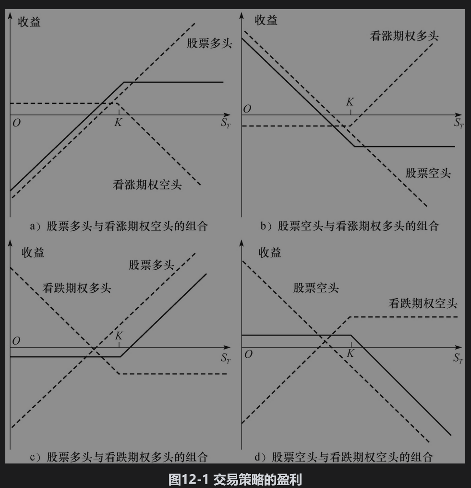
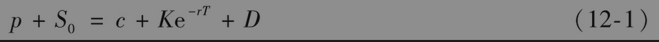
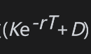

# 12.2 交易单一期权与股票的策略

方便起见，我们假设在本章剩下部分中所考虑的期权标的资产是股票（对其他标的资产，同样可以建立类似的交易策略）。我们也按通常的做法计算一个交易策略的盈利，即用最后的收益减去最初的费用，并且忽略贴现效应。

包括单个股票期权和股票本身的策略有多种不同的形式，它们的盈利形式展示在图12-1中。在本图以及本章的其他图形中，虚线代表组合中单个证券的盈利与股票价格之间的关系，而实线则代表整个组合的盈利和股票价格之间的关系。

图12-1a中的交易组合由一只股票的多头与一个欧式看涨期权的空头组成。这种交易策略称为备保看涨期权承约(writing covered call)。这里股票的多头“保护”(cover)或掩护投资者，使其免遭如果股票价格急剧上涨会给欧式看涨期权带来的损失。在图12-1b中，交易组合由一只股票的空头与一个欧式看涨期权的多头组成，其盈利形态与备保看涨期权的盈利形态相反。

在图12-1c中，交易组合包括一个看跌期权的多头与一只股票本身的多头，这种交易策略称为保护看跌期权(protective put)策略。在图12-1d中，交易组合由一个看跌期权的空头和一只股票本身的空头组成，这种交易策略的盈利形式与保护看跌期权的盈利形式相反。图12-1a～图12-1d中的盈利形式与第10章中讨论的看跌期权空头、看跌期权多头、看涨期权多头与看涨期权空头的盈利形态相似。由看跌-看涨平价关系式，我们可以理解为何如此。第11章里的看跌-看涨平价关系式为

其中p为欧式看跌期权的价格，S0为股票价格，c为欧式看涨期权的价格，K为看涨期权与看跌期权的执行价格，r为无风险利率，T为看涨期权与看跌期权的期限，D为期权期限内预期发放股息的贴现值。

式(12-1)表明，看跌期权的多头加上股票的多头等同于看涨期权的多头加上一定数量(=Ke-rT+D)的现金。这就解释了为什么图12-1c中的盈利形式与看涨期权多头的盈利形式相似。图12-1d中的头寸与图12-1c中的头寸相反，因此其盈利形式类似于看涨期权空头的盈利形式。

式(12-1)可以改写为

换句话讲，一只股票的多头与一个欧式看涨期权的空头等价于一个欧式看跌期权的空头加上一定数的现金。这个式子解释了为什么图12-1a中的盈利形式类似于看跌期权空头的盈利形式。图12-1b的头寸与图12-1a中的头寸相反，因此其盈利形式类似于看跌期权多头的盈利形式。