# 12.3 差价

差价交易策略是指将相同类型的两份或多份期权（即两份或多份看涨期权，或者两份或多份看跌期权）组合在一起的交易策略。

## 12.3.1 牛市差价

差价中最流行的一种是牛市差价(bull spread)，这种差价可以通过买入一份具有某一执行价格的欧式看涨期权，并卖出一份在同一股票上具有较高执行价格的欧式看涨期权组合而成，两份期权的期限相同。该策略展示在图12-2中。两份期权头寸各自的盈利由虚线表示，整个交易策略的盈利为两个虚线表示的盈利之和，在图中由实线表示。由于随着执行价格的上升，看涨期权的价格会下降，所以卖出的执行价格较高期权的价值总是小于买入的执行价格较低期权的价值。由此可见，建立由看涨期权组成的牛市差价时需要启动资金。

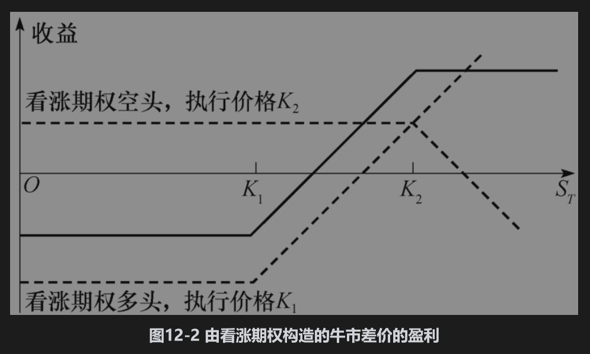

假定$`K_1`$为买入看涨期权的执行价格，$`K_2`$为卖出看涨期权的执行价格，ST为股票在期权到期日的价格。表12-1展示了牛市差价在不同情况下会实现的总收益。如果股票价格表现很好，即价格上涨并高于组合中较高的执行价格，那么牛市差价收益为两个执行价格的差，即$`K_2`$ - $`K_1`$；如果股票在到期日的价格介于两个执行价格之间，那么牛市差价的收益为$`S_T`$ - $`K_1`$ ；如果在期权到期日时，股票价格低于较低的执行价格，那么牛市差价的收益将为0。在图12-2中，盈利等于收益减去最初的投资。

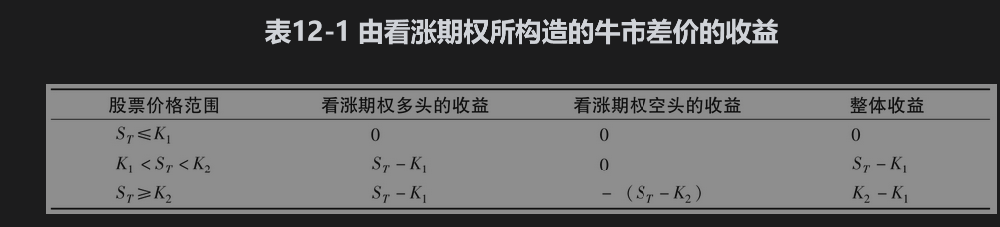

牛市差价限制了投资者的收益，但同时也控制了损失的幅度。这一策略可表达为：投资者拥有一份执行价格为K1的看涨期权，同时通过卖出执行价格为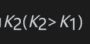的看涨期权而放弃了股票上升时的潜在盈利。作为对放弃潜在盈利的补偿，投资者获得了执行价格为K2的期权价格。在市场上有三种不同类型的牛市差价：

(1)两份看涨期权最初均为虚值期权。

(2)一份看涨期权最初为实值期权，另一份看涨期权为虚值期权。

(3)两份看涨期权最初均为实值期权。

第一种牛市差价最为激进，这一策略的成本很低，收到高收益(=K2-K1)的概率也很小。当我们从类型(1)换到类型(2)，从类型(2)换到类型(3)时，牛市差价逐渐趋于保守。

【例12-2】 投资者以3美元的价格买入了一份3个月期限、执行价格为30美元的欧式看涨期权并同时以1美元的价格卖出了一份3个月期限、执行价格为35美元的欧式看涨期权。如果股票价格高于35美元，牛市差价的收益为5美元；如果股票价格低于30美元，牛市差价的收益为0；如果股票价格介于30美元和35美元之间，牛市差价的收益为股票价格与30美元的差。这一牛市差价策略的成本为3-1=2（美元）。其盈利如下表所示。

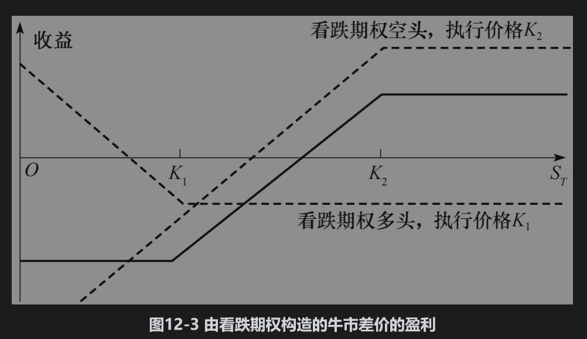

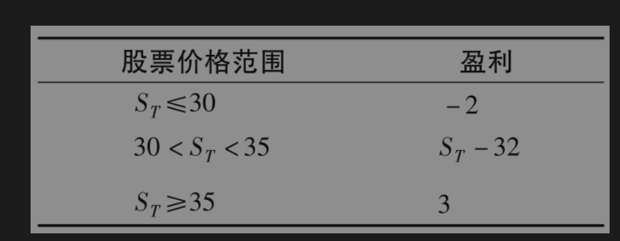

如图12-3所示，牛市差价也可以由通过买入较低执行价格的欧式看跌期权和卖出较高执行价格的欧式看跌期权构造而成。与采用看涨期权构造牛市差价不同的是，用看跌期权构造牛市差价会给投资者在最初时带来一个正的现金流，但需要保证金，而且收益为负或0。

## 12.3.2 熊市差价

持有牛市差价的投资者希望股票价格上升，与此相反，持有熊市差价(bear spread)的投资者则希望股票价格下跌。熊市差价可以由买入具有某一执行价格的看跌期权并同时卖出具有另一执行价格的看跌期权来构造。买入期权的执行价格大于卖出期权的执行价格（这与牛市差价刚好相反：牛市差价中的买入期权的执行价格总是小于卖出期权的执行价格）。在图12-4中，差价的盈利由实线表示。由看跌期权构造的熊市差价在最初会有现金流的支出，这是因为卖出期权的价格小于买入期权的价格。事实上，买入具有某一执行价格看跌期权的投资者通过卖出一个具有较低执行价格的看跌期权而放弃了一部分可能的盈利。对于放弃可能盈利的报偿是投资者收取卖出期权的价格。

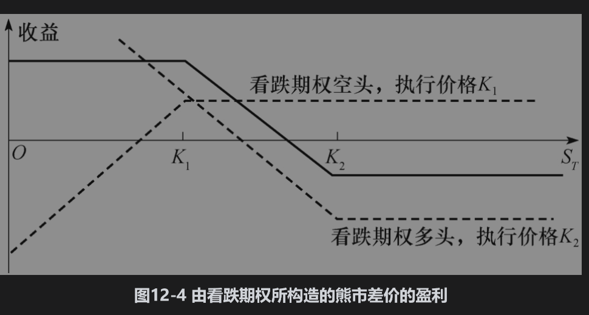

假定期权的执行价格为K1和K2，其中K1<K2。表12-2展示了在不同情况下熊市差价的收益。当股票价格大于K2时，收益为0；当股票价格低于K1时，收益为K2-K1；当股票价格介于K1与K2之间时，收益为K2-ST。交易策略的盈利等于收益减去初始费用。

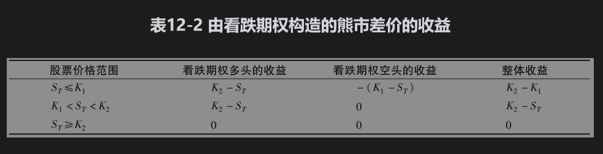

【例12-3】 投资者以3美元的价格买入了3个月期限、执行价格为35美元的欧式看跌期权，并以1美元的价格卖出了3个月期限、执行价格为30美元的欧式看跌期权。如果股票价格高于35美元，熊市差价策略的收益为0；如果股票价格低于30美元，熊市差价策略的收益为5美元；如果股票价格介于30美元与35美元之间，熊市差价的收益为35-ST。期权的最初费用为3-1=2（美元）。其盈利如下表所示。

与牛市差价类似，熊市差价限定了盈利的上限，同时也控制了损失幅度。熊市差价可以不用看跌期权而用看涨期权来构造：如图12-5所示，投资者可以买入一份具有较高执行价格的看涨期权并同时卖出一份具有较低执行价格的看涨期权。由看涨期权所构成的熊市差价在最初会有现金流入，但需要保证金，而且收益为负或0。

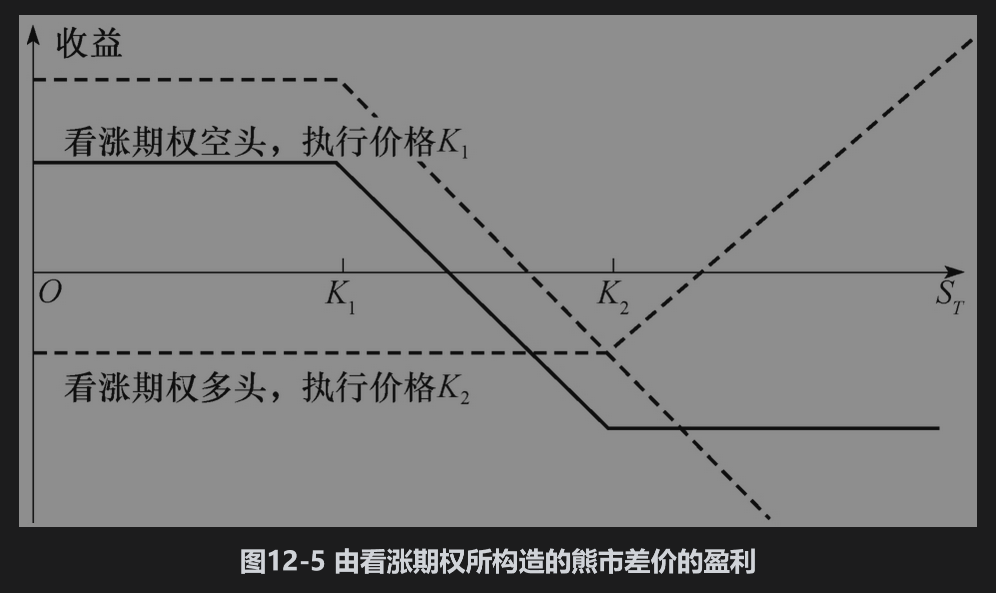

## 12.3.3 盒式差价

盒式差价(box spread)是由执行价格为K1与K2的看涨期权所构成的牛市差价与由相同执行价格的看跌期权所构成的熊市差价的组合。如表12-3所示，盒式差价的收益总是K2-K1，因此盒式差价的价值永远是此收益的贴现值，(K2-K1)e-rT。当其价值与这一数值不同时，将会产生套利机会。如果盒式差价的市场价格过低，套利者可以通过买入盒式来盈利。这种套利策略包括：买入一份具有执行价格K1的看涨期权，买入一份执行价格为K2的看跌期权，卖出一份执行价格为K2的看涨期权，并卖出一份执行价格为K1的看跌期权。如果盒式差价的市场价格过高，套利者可以采用卖出盒式来盈利。套利策略为：买入一份执行价格为K2的看涨期权，买入一份执行价格为K1的看跌期权，卖出一份执行价格为K1的看涨期权，并卖出一份执行价格为K2的看跌期权。

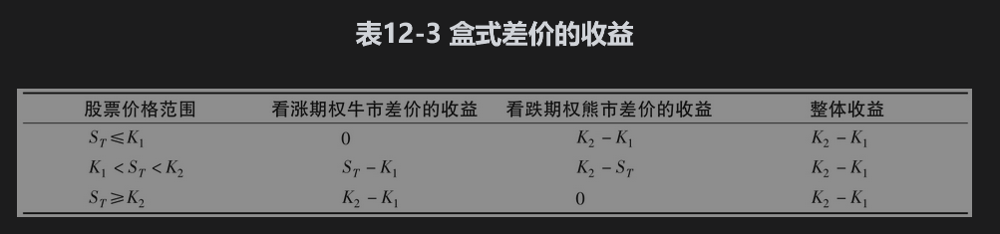

我们应当注意到盒式差价只对欧式期权适用。在交易所里交易的大多数期权为美式期权。正如业界事例12-1所示，没有经验的交易员将美式期权作为欧式期权处理时常常会遭受损失。

## 12.3.4 蝶式差价

蝶式差价(butterfly spread)策略是由三种具有不同执行价格的期权组成的。其构造方式为：买入一份具有较低执行价格K1的欧式看涨期权，买入一份具有较高执行价格K3的欧式看涨期权，并卖出两份具有执行价格K2的欧式看涨期权，其中K2为K1与K3的中间值。一般来讲，K2接近于当前股票价格。这一交易策略的盈利形式展示在图12-6中。如果股票价格保持在K2附近，蝶式差价会产生盈利；如果股票价格远远偏离K2，蝶式差价会有小量的损失。因此，蝶式差价对于那些认为股票价格不会有太大波动的投资者而言会非常合理。该策略需要少量的初始投资。表12-4给出了蝶式差价的收益。

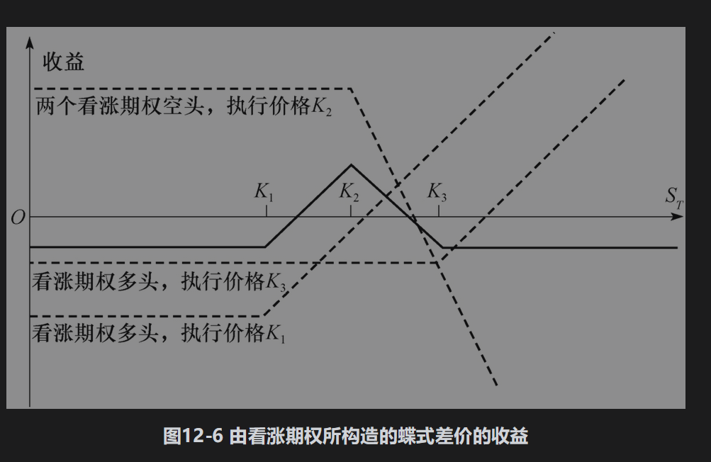

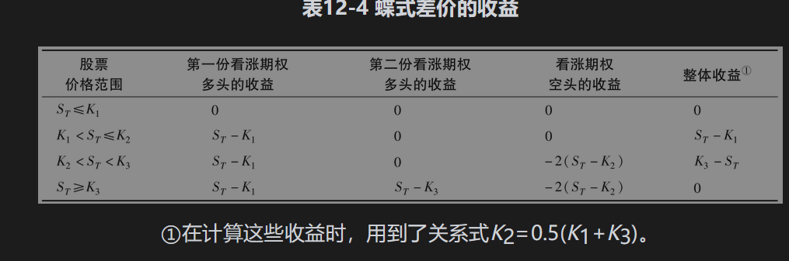

假定某股票的当前价格为61美元，某投资者认为在之后6个月股票价格不可能会发生太大变动。假定6个月期限看涨期权的市场价格如下表所示。

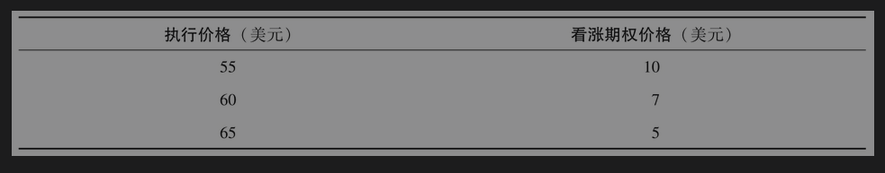

投资者可以买入一份执行价格为55美元的看涨期权，再买入一份执行价格为65美元的看涨期权，并同时卖出两份执行价格为60美元的看涨期权来构造蝶式差价。构造这一蝶式差价的费用为10+5-2×7=1（美元）。如果在6个月后，股票价格高于65美元或低于55美元，蝶式差价的收益为0，这时投资者的净损失为1美元；如果股票价格介于56美元和64美元之间，投资者会盈利。如果6个月后股票价格为60美元，投资者会有最大盈利，即4美元。

## 业界事例12-1

## 盒式差价产生的损失

假设某股票的价格为50美元，波动率为30%，无股息，无风险利率为8%。一位交易员向你提供了在CBOE上以5.10美元的价格卖出一个2个月期限盒式差价的机会。盒式差价中的执行价格分别为55美元与60美元。你该做这笔交易吗？

这个交易看起来很诱人，这时K1=55，K2=60，在2个月后的收益为固定的5美元。以5.10美元卖出盒式差价并将资金投资2个月，你可以在2个月后有足够多的资金去支付5美元的盒式差价收益。在当前，盒式差价的理论价格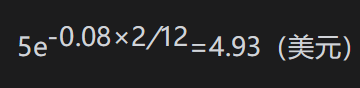。

不幸的是，这种考虑方式过于粗心大意。因为CBOE的股票期权为美式期权，而盒式差价5美元的收益建立在期权为欧式的假设上。此例中的期权价格（由DerivaGem计算得出）列在下表中。一个执行价格为55美元与60美元的牛市差价的价格为0.96-0.26=0.70（美元）（无论对欧式期权还是美式期权，这个数值相同。这是因为如第11章所示，当股票无股息时，欧式看涨期权的价格等于美式看涨期权的价格）。一个由同样执行价格的欧式看跌期权所构成的熊市差价的价格为9.46-5.23=4.23（美元），一个由同样执行价格的美式看跌期权所构成的熊市差价的价格为10-5.44=4.56（美元）。当差价由欧式期权构成时，两个差价的组合价格为0.70+4.23=4.93（美元）。这一数值刚好等于上面所计算的盒式差价的理论价格。当差价由美式期权构成时，两个差价的组合价格为0.70+4.56=5.26（美元）。以5.10美元的价格卖出由美式期权所构成的盒式差价并不合算。在交易后，你会很快认识到这一点，因为交易涉及卖出一份60美元执行价格的看跌期权，这个期权在卖出后就会马上被行使。

蝶式差价也可以由看跌期权构成：投资者可以买入一份具有较低执行价格与一份具有较高执行价格的欧式看跌期权，同时卖出两份具有中间执行价格的欧式看跌期权，如图12-7所示。上例考虑的蝶式差价可由买入一份执行价格为55美元的看跌期权，买入一份执行价格为65美元的看跌期权，并同时卖出两份执行价格为60美元的看跌期权构成。由看涨期权所构造的蝶式差价与由看跌期权所构造的蝶式差价完全相同。看跌-看涨平价关系式可用来证明最初的投资是一样的。

利用与以上相反的策略可以卖空蝶式差价。这时相当于卖出两份执行价格分别为K1及K3的期权，买入两份具有中间执行价格K2的期权。如果股票价格发生较大的变动，这种交易策略会带来一定数量的盈利。

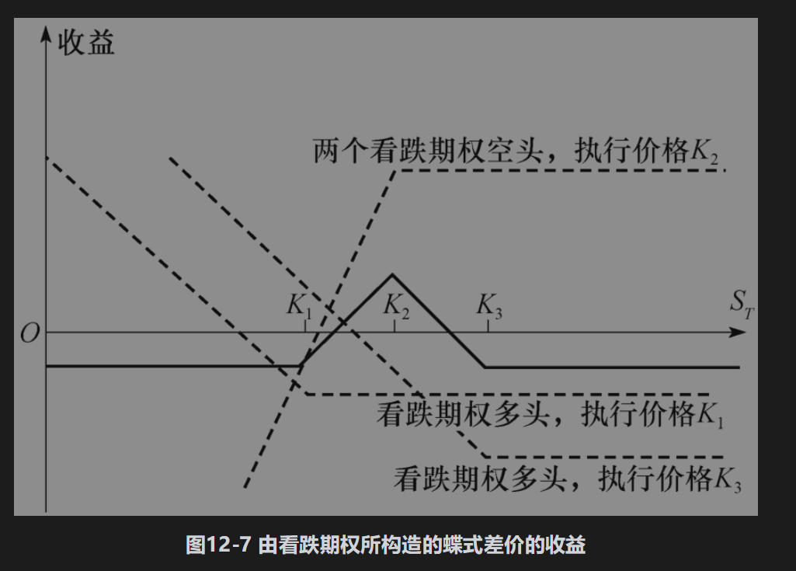

## 12.3.5 日历差价

到目前为止，我们一直假定构造差价的所有期权都具有相同的到期日。我们接下来讨论日历差价(calendar spread)：构成这一差价的期权具有相同的执行价格，却有不同的到期日。

日历差价可以由一个具有某一执行价格的欧式看涨期权空头与一个具有同样执行价格，但较长期限的欧式看涨期权多头构成。通常期权的期限越长，期权的价格也会越贵，因此日历差价需要一定的初始投资。我们在日历差价的盈利图形中通常假设日历差价的盈利实现是在短期限期权的到期日，而且同时对长期限期权清仓。图12-8展示了由看涨期权所构成的日历差价盈利形式。此盈利形式与图12-6中的蝶式差价类似。在短期限期权到期时，如果股票的价格接近短期限期权的执行价格，投资者可以获得盈利，但是如果股票价格远高于或远低于短期限期权的执行价格，投资者将会遭受损失。

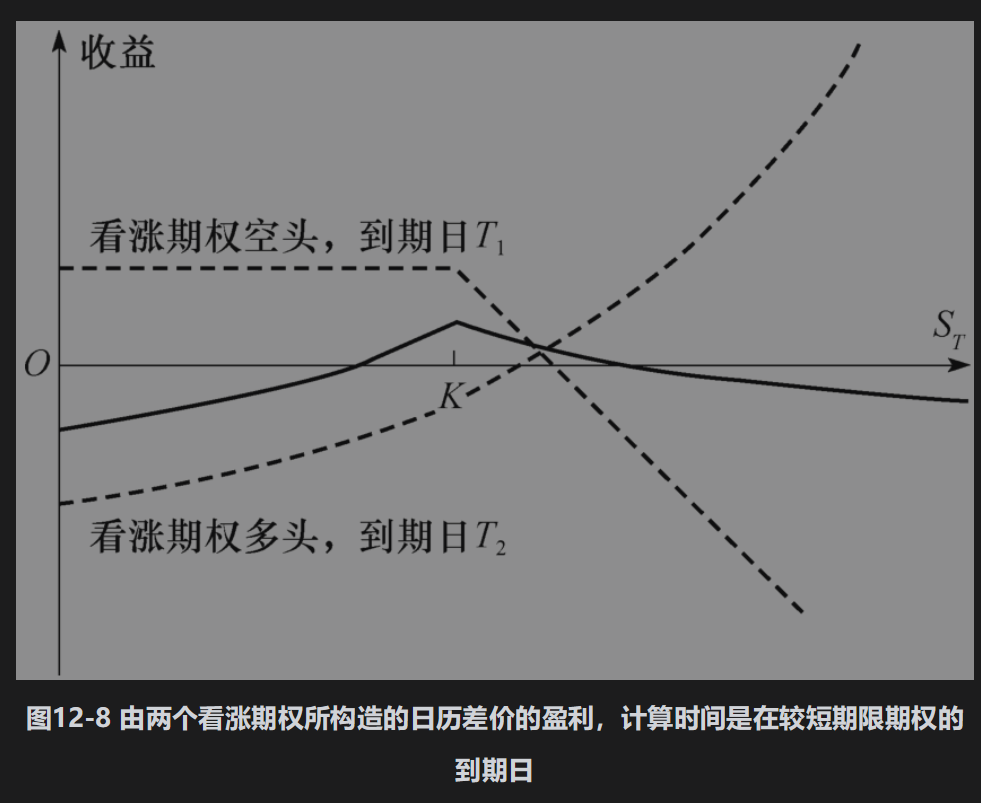

为了理解日历差价的盈利形式，我们首先考虑在短期限期权到期时，股票价格很低的情形。这时短期限期权的价值为0，长期限期权的价格也接近于0。因此，此时投资者的损失等于建立日历差价的最初费用。接下来我们考虑当短期限期权到期时，股票价格ST很高的情形。短期限期权给投资者带来的费用为ST-K，长期限期权的价值接近ST-K，这里K为期权的执行价格。这时投资者的净损失量也与建立日历差价时的初始费用很接近。如果ST接近于K，短期限期权给投资者带来的费用或者为0或者很小，但是长期限期权仍很有价值，这时投资者会得到可观的利润。

在中性日历差价(neutral calendar spread)中，选取的执行价格接近股票的当前价格。牛市日历差价(bullish calendar spread)涉及较高的执行价格，而熊市日历差价(bearish calendar spread)则涉及较低的执行价格。

日历差价也可以由看跌期权构成：投资者买入一份较长期限的看跌期权并卖出一份较短期限的看跌期权。如图12-9所示，这样构成的日历差价的盈利形式类似于由看涨期权构成的日历差价。

倒置日历差价(reverse calendar spread)的盈利正好与图12-8及图12-9的形状相反。投资者买入期限较短的期权，并同时卖出期限较长的期权。当短期限期权到期时，如果股票价格远高于或远低于短期限期权的执行价格，则投资者获得少量利润。但是当股票价格接近该执行价格时，则投资者会遭受损失。

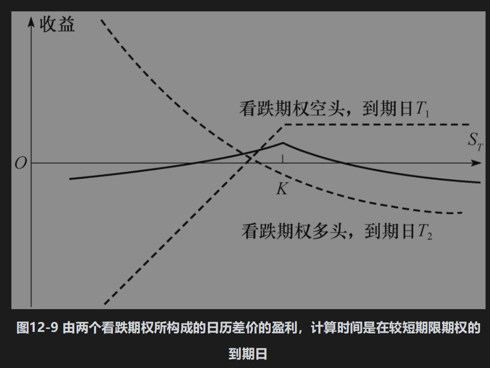

## 12.3.6 对角差价

牛市、熊市以及日历差价均可以由一个看涨期权的多头及另一个看涨期权的空头构成。对于牛市与熊市差价，两份看涨期权的执行价格不同但到期日相同；对于日历差价，期权具有相同的执行价格但不同的到期日。

在对角差价(diagonal spread)中，两份看涨期权的执行价格与到期日均不相同。这种交易策略将会产生更多形式的盈利方式。