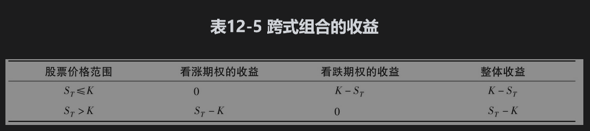
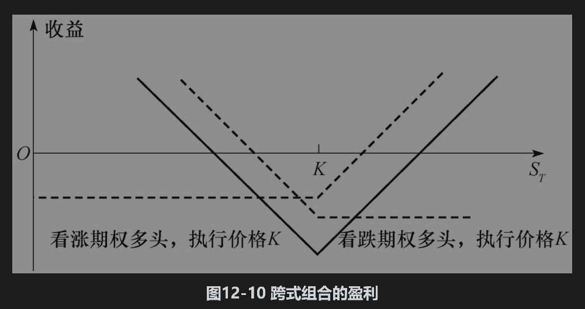
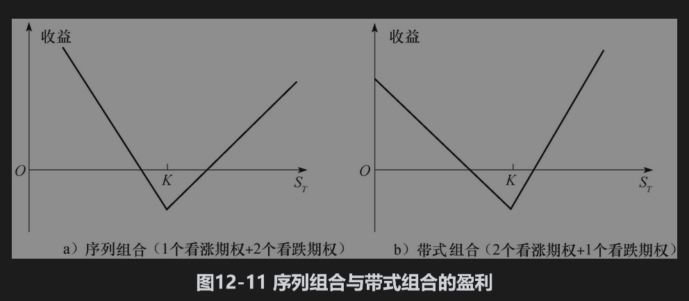
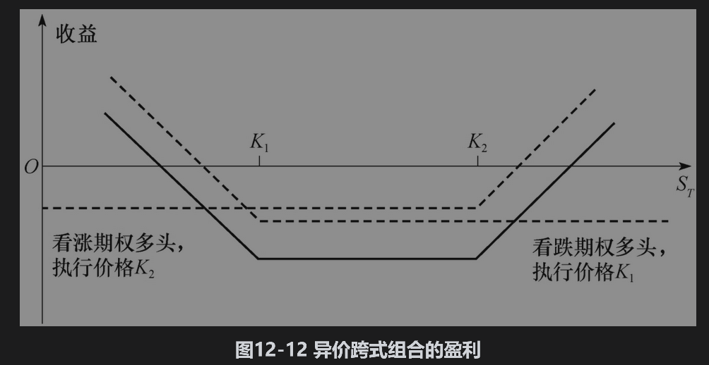
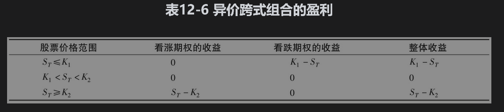

# 12.4 组合

组合是一种包括同一股票上看涨与看跌期权的交易策略。我们将要考虑的组合包括跨式组合、序列组合、带式组合以及异价跨式组合。

## 12.4.1 跨式组合

一种比较流行的组合形式是跨式组合(straddle)。该组合是买入具有同样执行价格与期限的一份看涨期权和一份看跌期权，其盈利形式展示在图12-10中。这里执行价格为K。在期权到期时，如果股票价格接近期权的执行价格，跨式组合会导致损失。但是股票价格在任何方向有足够大的变动时，跨式组合都会带来一个显著的盈利。表12-5计算了跨式组合的收益。

当投资者认为股票价格将有大幅度变化，但不能确认变化方向时，可以采用跨式组合。考虑如下情形：某投资者认为一个当前价格为69美元的股票在3个月后价格会有重大变化，该投资者可以同时买入3个月期限的看涨期权与看跌期权，期权的执行价格为70美元。假定看涨期权的成本为4美元，看跌期权的成本为3美元。如果股票价格保持在69美元不变，我们很容易得出这种交易策略给投资者带来的损失为6美元（起始投资为7美元，期权到期时，看涨期权价值为0，看跌期权价值为1美元）。如果股票价格变为70美元，则会产生7美元的损失（这是可能会发生的最差情况）。但是如果股票价格跳跃到90美元，投资可盈利13美元；如果股票价格降至55美元，投资者盈利8美元。如业界事例12-2所示，投资者在进行一个跨式组合交易之前应仔细考虑，自己所预测的价格跳跃是否已经体现在期权价格中。

## 业界事例12-2

## 如何从跨式组合交易中盈利

假设某公司成为被收购的对象，或者公司卷入了某个法律诉讼，而法律诉讼的结果即将公布。以上两种情形均会造成该公司股票价格的大幅度变动，这时你应该交易跨式组合吗？

交易跨式组合在此时看起来很合理。但是，如果你的观点与市场上其他投资者的观点一致，那么这些观点将会反映在期权价格上。这时该股票上期权的价格要远远高于类似的，但没有预期价格跳跃的股票期权价格。因此，由图12-10所示的跨式组合交易V形盈利形式图会向下移动。此时，只有股票价格的波动更大才会取得盈利。

为了使跨式组合成为有效的交易策略，你必须认为股票价格变动会很大，同时你的观点必须同其他大多数投资者的观点不同。市场价格反映了投资者的观点，要从某种投资策略中盈利，你必须同市场其他大多数投资者持不同观点，而且同时你的观点还必须是正确的。

图12-10中的跨式组合有时被称为底部跨式组合(bottom straddle)或买入跨式组合(straddle purchase)。顶部跨式组合(top straddle)或卖出跨式组合(straddle write)的情形刚好与此相反：这种交易策略由卖出具有同样执行价格与期限的一份看涨期权与一份看跌期权构成。该策略的风险很大：如果在到期日，股票价格接近执行价格，投资者会有一定的利润。但是，大的股票价格变动所带来的损失是无限的。

## 12.4.2 序列组合与带式组合

序列组合(strip)是具有相同执行价格和相同期限的一个看涨期权多头与两个看跌期权多头的组合。带式组合(strap)是具有相同执行价格和相同期限的两个看涨期权多头和一个看跌期权多头的组合。图12-11展示了序列组合与带式组合的盈利形式。在序列组合中，投资者认为股票价格会有大的变动，同时投资者认为价格下降的可能性要大于价格上升的可能性。在带式组合中，投资者也是对股票价格大幅变动进行下注，这时，投资者认为价格上升的可能性要大于价格下降的可能性。

## 12.4.3 异价跨式组合

异价跨式组合(strangle)有时也被称为底部纵向组合(bottom vertical combination)。在这一组合中，投资者买入具有相同期限但具有不同执行价格的一份看跌期权与一份看涨期权。图12-12展示了其盈利形式。这里看涨期权执行价格K2高于看跌期权执行价格K1。表12-6展示了异价跨式组合的收益。

异价跨式组合与跨式组合类似：投资者对股票价格有很大变动的可能性下注，但不能确定是上涨还是下跌。比较图12-12及图12-10，我们看到在异价跨式组合中，股票的变动要比在跨式组合中变动更大，投资者才会盈利。但是当股票价格最终介于中间价格时，异价跨式组合带来的损失会较小。

异价跨式组合的盈利形式与执行价格之间的差异有关。差异越大，潜在的损失越小，但盈利所需的价格变动越大。

有时卖出异价跨式组合也被称为顶部纵向组合(top vertical combination)。如果投资者认为股票价格不太可能有大的变动，则可以采用这种交易策略。类似于卖出跨式组合，这种交易策略的风险很大，投资者潜在的损失也是无限的。

