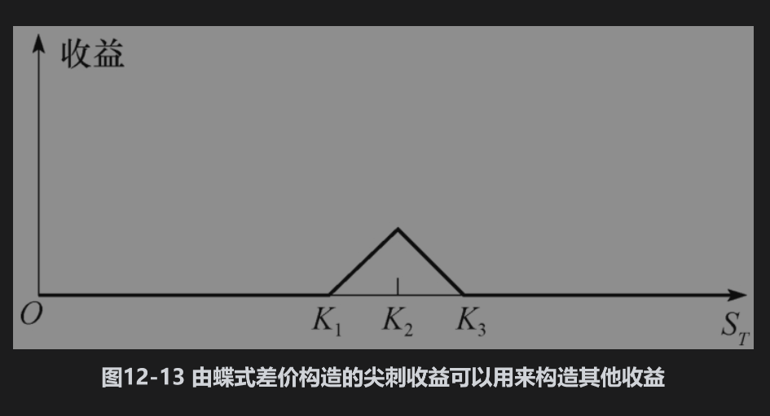

# 12.5 具有其他收益形式的组合

在本章中，我们展示了期权组合所生成的盈利与期权标的股票价格之间几种有趣的关系。如果在到期日T，任何执行价格的欧式期权均可以交易，那么从理论上讲，在时间T，我们可以取得任何形式的收益。说明这一点最简单的方式会涉及蝶式差价：蝶式差价可以通过买入具有执行价格K1与K3的期权，同时卖出两份执行价格为K2的期权来实现，其中K1＜K2＜K3并且K3-K2=K2-K1。图12-13展示了蝶式差价的收益。收益图形很像某种“尖刺”(spike)。当K1与K3离得越来越近时，这个尖刺变得越来越细。将大量具有尖刺收益形式的期权适当地组合在一起后，我们可以得到任何形式的收益。

