# 13.1 单步二叉树模型

与无套利方法我们由一个非常简单的例子入手。假设一只股票的当前价格为20美元，并且我们已知在3个月后股票的价格将会变为22美元或18美元。我们希望对3个月后能够以21美元买入股票的期权定价。这个期权在3个月后的价值将为以下两者之一：如果股票价格变为22美元，期权价值将为1美元；如果股票价格为18美元，期权价值将为0。这些情形如图13-1所示。

我们发现可以利用一种比较简单的方式来对此例中的期权定价，唯一需要的假设是在市场上没有套利机会。由股票和期权可以构造一个在3个月后价值没有不确定性的投资组合。因为这一投资组合没有任何风险，所以其收益率一定等于无风险利率。这样我们可得出构造这一投资组合的成本，并由此得出期权的价格。因为这里有两个证券（股票与股票期权），并且只有两种不同的可能性，因此我们总是可以构造出无风险投资组合。

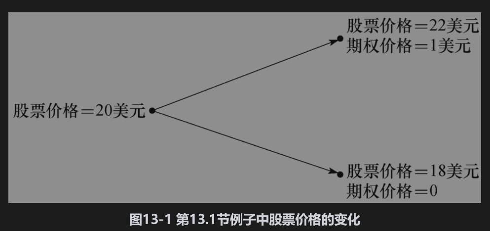

考虑一个由Δ单位的股票多头和一份看涨期权空头所构成的投资组合。我们将求出使投资组合成为无风险的Δ。当股票价格由20美元变为22美元时，所持股票的价值为22Δ，期权的价值为1美元，投资组合的总价值为22Δ-1；当股票价格由20美元变为18美元时，所持股票的价值变为18Δ，期权的价值为0，投资组合的总价值为18Δ。当投资组合在以上两种可能性下价值相等时，投资组合没有任何风险，这意味着：

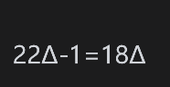

即

      Δ=0.25
      
      
因此，无风险投资组合为：

• 多头：0.25单位的股票；

• 空头：1份期权。

如果股票价格上涨为22美元，投资组合价值为

           22×0.25-1=4.5（美元）

如果股票价格下跌到18美元，投资组合价值为

           18×0.25=4.5（美元）

无论股票价格上涨还是下跌，在期权到期时投资组合的价值总是4.5美元。

在无套利机会时，无风险投资组合的收益率等于无风险利率。假设这时的（连续复利）无风险利率为每年4%，那么该投资组合在今天的价值必须为4.5美元的贴现值，即

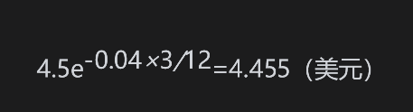

股票在今天的价格已知为20美元，如果将期权的价格记为f，那么投资组合在今天的价值是

                        20×0.25-f=5-f

因此

                           5-f=4.455

或

                            f=0.545

以上讨论说明，在无套利机会时，期权的目前价值必须为0.545美元。如果期权价值高于0.545美元，那么构造投资组合的费用就会低于4.455美元，而投资组合的收益率就会高于无风险利率；如果期权价值低于0.545美元，那么卖空这一投资组合将会提供一个低于无风险利率的借款机会。

在市场上我们无法交易0.25股股票，但是以上讨论也适用于卖出400份期权及买入100股股票的情形。一般来讲，对于每份卖出的期权，我们都要买入Δ股股票来构成无风险投资组合。在对冲期权风险时，参数Δ(delta)很重要，在本章后面的内容以及第19章里我们将对这个参数做进一步讨论。

## 13.1.1 推广

我们可以将以上无套利的论证进行推广。假定股票的价格为S0，股票期权（或以股票为标的的任何衍生产品）的价格为f。假定期权的期限为T，在期权有效期内，股票价格或者会上涨到S0u，或者会下跌到S0d，其中u>1，d<1。当股票价格上涨时，增长的比率为u-1。当股票价格下跌时，下跌的比率为1-d。假设股票价格变到S0u时相应的期权价格为fu，而股票价格变为S0d时期权价格为fd。结果如图13-2所示。

与前面相同，我们考虑一个由Δ单位股票的多头与一份期权的空头所组成的投资组合。我们可以找到一个使投资组合没有任何风险的Δ：如果股票价格上涨，在期权到期时投资组合的价值为

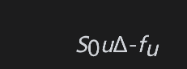

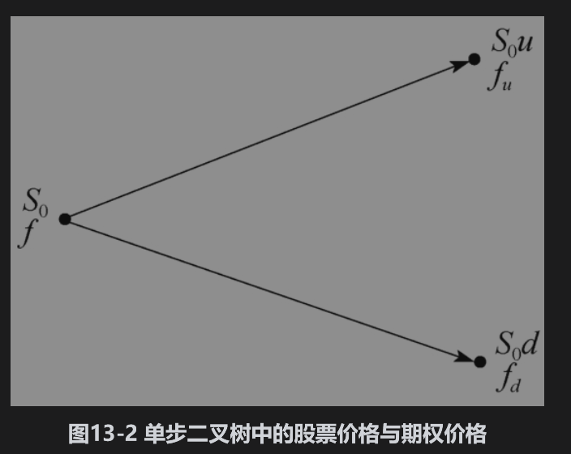

如果股票价格下跌，组合的价值为

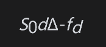

令以上两个值相等，即

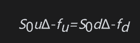

我们得出

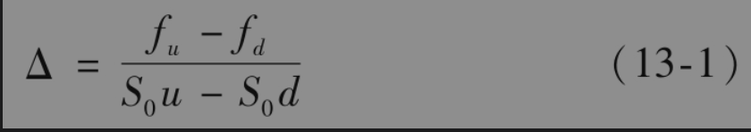

这时投资组合是无风险的。因为没有套利机会，其收益率必须等于无风险利率。式(13-1)表明，Δ为时间T时期权价格变化与股票价格变化的比率。

如果我们将无风险利率记为r，那么投资组合的现值为

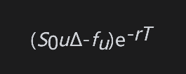

而构造投资组合的起始成本为

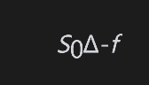

所以

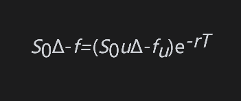

即

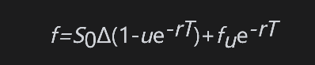

将式(13-1)中的Δ代入上式并化简，我们得出

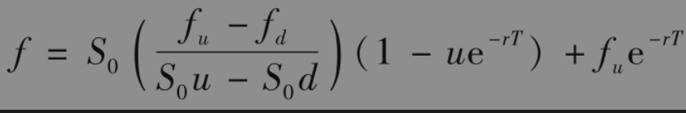

或

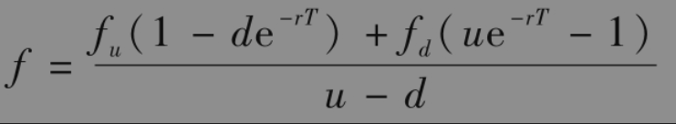

其中

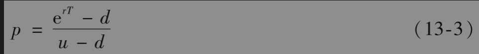

当股票价格由单步二叉树给出时，式(13-2)及式(13-3)可以用来对期权进行定价。这个公式需要的唯一假设是在市场上没有套利机会。

在前面所考虑的例子中（见图13-1），u=1.1,d=0.9,r=0.04,T=0.25,fu=1及fd=0。由式(13-3)，我们得出

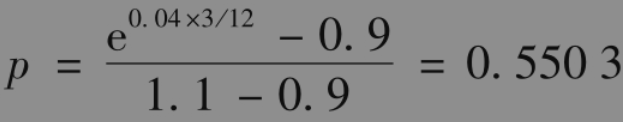

由式(13-2)，我们得出

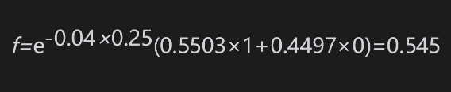

这与本节开始时所得结果是一致的。

## 13.1.2 股票期望收益的无关性

期权定价公式(13-2)中没有涉及股票价格上涨或下跌的概率。例如，按此公式计算，当股票价格上涨概率为0.5时所得的欧式期权价格与股票价格上涨概率为0.9时所得的欧式期权价格一样。这一结果有点儿令人惊讶，似乎与我们的直觉不符。我们会很自然地认为当股票价格上涨的概率增大时，这一股票上的看涨期权价格也会增大，同时这一股票上的看跌期权价格会下降。但事实并非如此。

这里的关键原因是我们并不是在一个绝对条件下对期权进行定价的。我们是根据股票价格来计算期权价格，而未来股票价格涨跌的概率已经反映在其价格之中。因此，当根据股票价格对期权定价时，我们无须再考虑股票上涨与下跌的概率。

