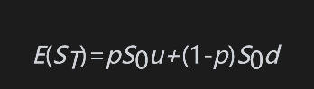
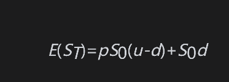
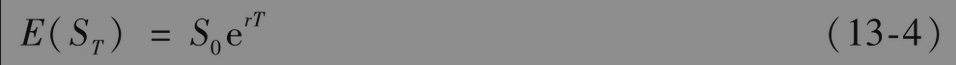
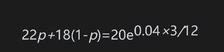
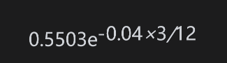
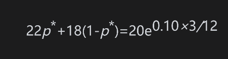
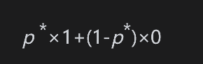

# 13.2 风险中性定价

我们现在可以引进关于衍生产品定价的一个重要原理，即所谓的风险中性定价(risk-neutral valuation)：对衍生产品定价时，我们可以假设投资者是风险中性(risk-neutral)的。这个假设是指投资的风险增长时，投资者并不需要额外的期望收益作为补偿。所有投资者都是风险中性的世界叫作风险中性世界(risk-neutral world)。当然，我们所生活的世界不是风险中性的：投资者所承受的风险越大，他们所要求的回报也会越高。但是，我们发现当假设世界是风险中性时给出的衍生产品价格不但在风险中性世界里是正确的，而且在我们所生活的世界里也是正确的。这种定价方式奇迹般地避开了我们一无所知的有关买方与卖方的风险厌恶程度。

风险中性定价方法乍看起来好像很令人吃惊。期权是风险投资，难道一个人对风险的态度不应当影响对它们的定价吗？这里的答案是当我们利用标的资产的价格对期权定价时，投资者对风险的态度是不重要的。当投资者对风险更加厌恶时，股票价格将会下跌，但是将期权价格与股票价格联系起来的公式是不变的。

风险中性世界的两个特点可以简化对衍生产品的定价：

(1)股票（或任何投资）的期望收益率等于无风险利率。

(2)对期权（或其他证券）的期望收益贴现的利率等于无风险利率。

在式(13-2)中，参数p应当理解为在风险中性世界里股票价格上涨的概率，而1-p是在这个世界里股票价格下跌的概率（假设u>erT，所以0<p<1）。表达式

则是期权在到期日的收益在风险中性世界里的期望值，因而式(13-2)可以表达为期权今天的价值等于将其收益在风险中性世界里的期望值以无风险利率贴现所得的现值。这正是风险中性定价的一个应用。

为了证明我们对p的理解是合理的，我们注意当上涨概率为p时，股票在时间T的期望收益E(ST)为

即

将式(13-3)中的p代入公式，我们得出

以上公式说明股票价格上涨概率为p时，股票价格以无风险利率的平均速度增长。换句话说，当p为价格上涨概率时，股价在风险中性世界中的变化行为完全如我们所期望的那样。

对衍生产品定价时，风险中性方法是非常重要的结果。这个结果说明当我们假设世界是风险中性时，得到的价格不但在风险中性世界里是正确的，在所有世界里也都是正确的。我们已经证明了当股票价格按简单二叉树的方式变化时，风险中性定价的正确性。可以证明，即使不做此假设，结论依然成立。

在利用风险中性方法对衍生产品定价时，我们首先计算在风险中性世界里各种不同结果发生的概率，然后由此计算衍生产品的期望收益值。衍生产品的价格等于这个期望值在无风险利率下的贴现值。

## 13.2.1 再论单步二叉树例子

我们再回到图13-1所示的例子上，并以此说明风险中性定价与无套利定价所给出的结果是一样的。在图13-1中，股票的当前价格为20美元，3个月后的股票价格可变成22美元或18美元。所考虑的期权为欧式期权，执行价格为21美元，期限为3个月，无风险利率为4%。

定义p为在风险中性世界里股票价格上涨的概率。我们可以由式(13-3)来计算p。另一种计算p的方法是利用在风险中性世界里，股票的期望收益率一定等于无风险利率，这意味着p必须满足

即

因此p=0.5503。

在第3个月后，看涨期权价值为1所对应的概率为0.5503；看涨期权价值为0所对应的概率为0.4497。因此，它的期望值为

               0.5503×1+0.4497×0=0.5503

在风险中性世界对该期望值以无风险利率进行贴现后得到期权在今天的价值为

即0.545美元。这与前面所得的值相同，这说明了无套利方法与风险中性定价所给出的结果是一致的。

## 13.2.2 现实世界与风险中性世界的区别

我们应当强调的是p为风险中性世界里股票价格上涨的概率。一般来讲，这一概率与现实世界里股票价格上涨的概率是不同的。在我们的例子中，p=0.5503。当价格上涨的概率为0.5503时，股票与期权的期望收益率为4%，等于无风险利率。假设在现实世界里股票的期望收益率为10%,p*代表在现实世界里股票价格上涨的概率。

那么

因此p*=0.6266。

在现实世界里期权的期望收益值为

即0.6266。不幸的是，找出在现实世界里应当使用的贴现率并不是件容易的事。市场对股票所要求的收益率是10%，因此在对该股票上投资的现金流期望值贴现时，应当使用这个值。期权头寸比股票头寸的风险更大，因此对于期权期望收益值的贴现率要比10%更高，但是我们不知道贴现率应当比10%高多少。[1]风险中性定价方法解决了这个问题，因为在风险中性世界里，所有资产的期望收益率（以及对期望收益的贴现率）均为无风险利率。

