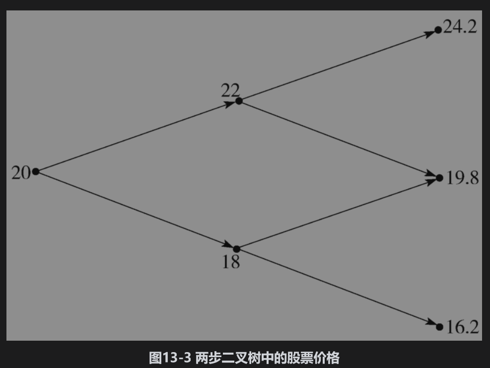
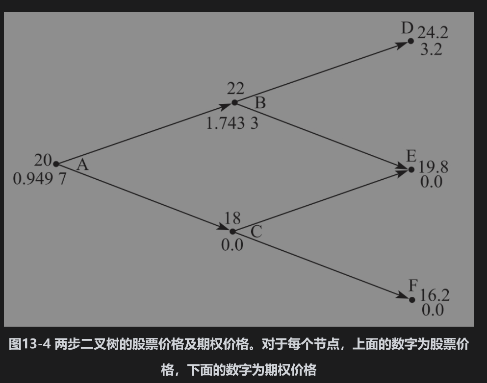
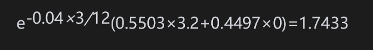
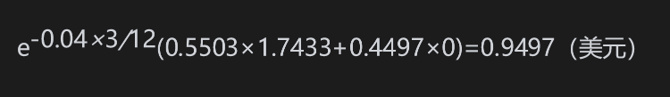
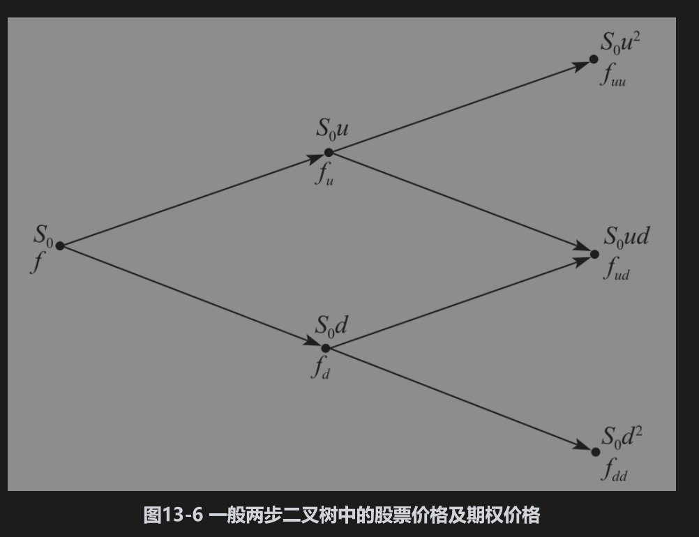
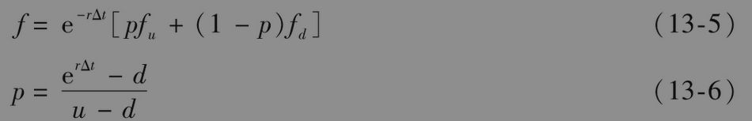
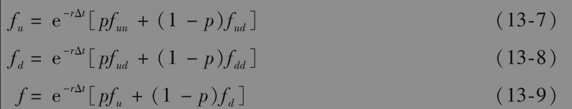

# 13.3 两步二叉树

我们可以将以上的分析推广到图13-3所示的两步二叉树情形中。这时股票起始价格为20美元，在树中的任意一步之间，股票价格或上涨10%或下跌10%。假定树中每一步的步长为3个月，无风险利率为4%。像前面一样，我们所考虑期权的期限为6个月，执行价格为21美元。

这里分析的目的是计算在起始点时的期权价格。我们可以重复利用上一节里的定价原理对这个期权定价。图13-4与图13-3的树形相似，其不同之处是在图13-4的节点上既显示了股票价格也显示了期权价格（节点上面的数字为股票价格，下面的数字为期权价格）。树中最后一层节点上的期权价格很容易求得，它们等于期权的收益：在节点D，股票价格为24.2，期权价格为24.2-21=3.2；在节点E及F上期权处于虚值状态，因此相应的期权价格为零。

在节点C，期权的价格为0。这是因为节点C的价值来自节点E和F，而在这两个节点上期权价格均为0。为了求得在节点B上的期权价格，我们考虑由图13-5所示的二叉树。利用本章前面引入的符号，u=1.1，d=0.9，r=4%和T=0.25，因此p=0.5503。由式(13-2)我们可以得出在节点B上，期权价值为

最后要计算最初始节点A上的期权价格。为此我们考虑二叉树的第一步。我们已知期权在节点B上的价格为1.7433，在节点C上的价值为0，由式(13-2)得出在节点A上期权价值为

期权的价值是0.9497美元。

注意，在以上的例子中，u与d（股票上涨与下跌的比率）在每一节点上均相同，而且树中每一步的步长也均相等。因此由式(13-3)所计算出的风险中性概率p在每一个节点上也都是相同的。

## 推广

由图13-6我们可以得出关于两步二叉树的一般结论。初始股票价格为S0。在二叉树上的每一步，股票价格或者上涨到初始价格的u倍，或者下跌到初始价格的d倍，期权价值显示在树上（例如，在股票价格上涨两次后，期权价值为fuu）。我们假定无风险利率为r，二叉树的步长为Δt年。

因为步长为Δt，式(13-2)及式(13-3)变为

重复应用式(13-5)，我们得出

将式(13-7)和式(13-8)代入式(13-9)，我们得出

以上结论与前面提到的风险中性定价理论是一致的。变量p2、2p(1-p)、(1-p)2分别对应于股票价格取上、中、下三个节点上值的概率。期权价格等于其在风险中性世界里的期望收益值以无风险利率进行贴现后所得的现值。

当我们在树形上引入更多的步数时，风险中性定价原理仍然成立，期权价格依然等于其收益在风险中性世界里的期望值以无风险利率贴现后的现值。