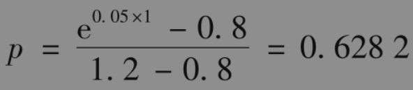
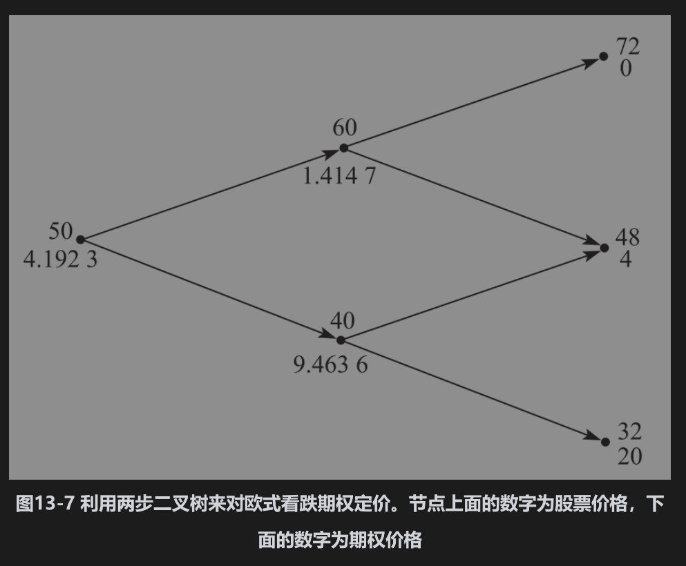
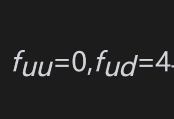
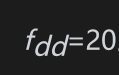
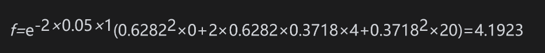

# 13.4 看跌期权的例子

本章所描述的方法既可以用于对看涨期权定价，也可以用于对看跌期权定价。考虑一个2年期执行价格为52美元的欧式看跌期权，股票的当前价格为50美元。我们假定股票价格服从步长为1年的两步二叉树。在二叉树的每一步上，股票价格或者上涨20%，或者下跌20%，我们假定无风险利率为5%。

二叉树如图13-7所示，这里u=1.2,d=0.8,Δt=1及r=0.05。由式(13-6)，我们可以得出风险中性概率p为

最终的股票价格可能为72美元、48美元或32美元。这时，与。由式(13-10)，我们有

看跌期权的价值为4.1923美元。这一结果也可以利用式(13-5)并从树的最后节点一步步向回推算得出。图13-7给出了中间节点上的期权价格.

