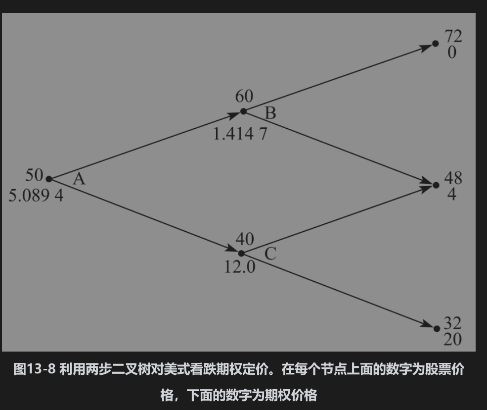
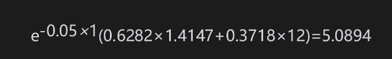

# 13.5 美式期权

到目前为止，我们考虑的期权都是欧式期权。接下来我们考虑如何利用像图13-4或图13-7中所描述的二叉树来对美式期权进行定价。定价的过程是从树的末尾出发以倒推的形式推算到树的起始点，在树的每一个节点上我们都需要检验提前行使期权是否为最优。在树的最后节点上，期权的价格等于欧式期权的价格，之前任何一个节点上期权的价格等于以下两个数量的最大值：

(1)由式(13-5)所计算的值；

(2)提前行使期权的收益。

图13-8显示了当期权为美式期权（而不是欧式期权）时，图13-7会如何变化。股票价格和上下变动的概率并没有改变，期权在最后节点上的价格也没有改变。在节点B上，式(13-5)所给出的期权价值为1.4147，而提前行使期权的相应收益为负值(=-8)。显然在节点B上提前行使期权不会是最优的，因此在该节点上，期权价格为1.4147。在节点C上，式(13-5)所给出的期权价值为9.4636，提前行使期权的收益为12。这时，提前行使期权为最优，因此在该节点上期权价值为12。在最初的节点A上，式(13-5)所计算的数量为

提前行使期权的收益为2，这时提前行使期权不为最优。因此，期权价值为5.0894美元。