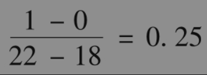
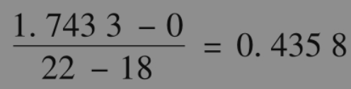
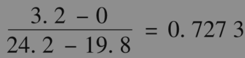
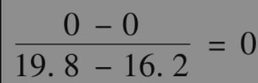
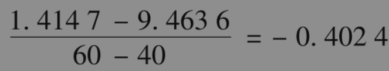
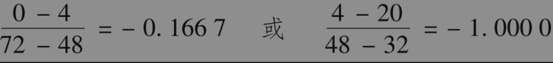

# 13.6 delta

我们现在引进delta，这个变量（有时称为希腊值）在期权定价以及对冲过程中是个很重要的参数。

一份股票期权的delta(Δ)为期权价格变化同标的股票价格变化之间的比率，它是当我们卖出一份期权时，为了构造无风险组合而需要持有的标的股票数量。这一数量与本章前面所引入的Δ相同。构造无风险投资组合有时也称为delta对冲(delta hedging)。看涨期权的delta为正，而看跌期权的delta为负。

由图13-1，我们可以计算出所考虑的看涨期权delta为

这是因为当股票由18美元变为22美元时，期权价格由0美元变为1美元（这也是第13.1节里计算出的Δ值）。

在图13-4中，对应于股票价格在第1步变化的delta为

如果在第1步后股票价格上涨，第2步的delta为

如果在第1步后股票价格下跌，在第2步的delta为

由图13-7得出，在第1步后的delta为

在第2步后delta等于

两步二叉树的例子说明了delta的值随着时间变化（在图13-4中，delta从0.4358变为0.7273或0；在图13-7中，delta从-0.4024变为-0.1667或-1.0000）。因此，采用期权和股票进行无风险对冲时，我们需要不断调整所持股票的数量。在第19章里，我们还要对期权的这一特性做进一步讨论。