# 13.7 选取u和d使二叉树与波动率吻合

为了构造步长为Δt的二叉树，我们需要确定三个参数：u、d和p。一旦u和d确定之后，我们在选取p时要确保期望收益率等于无风险利率r，我们已经证明

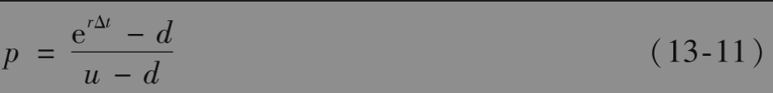

参数u和d的选取要确保波动率的吻合。股票（或任何资产）价格波动率σ的定义是使得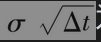为股票价格在一个长度为Δt的时间区间上收益的标准差（有关进一步的讨论，见第15章）。与此等价，回报的方差为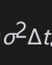。变量X的方差定义为$`E(X^2)-[E(X)]^2`$，其中E代表期望值。在每一个步长为Δt的区间内，股票收益率等于u-1的概率为p，收益率等于d-1的概率为1-p。将二叉树波动率与股票波动率进行匹配，得出

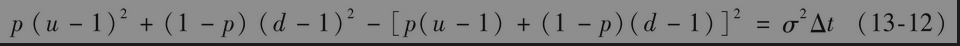

将式(13-11)的概率表达式代入以上方程并进行简化，得出

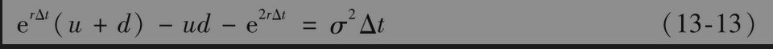

当忽略Δt2和Δt的更高阶项后，这个方程的解为[2]

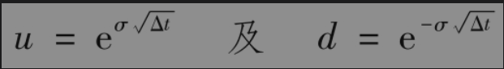

这些正是考克斯、罗斯和鲁宾斯坦(1979)对u和d所取的值。

在以上分析中，我们选择的u和d是在风险中性世界里匹配波动率的。如果我们选择在现实世界里匹配波动率，情况又会如何？我们现在证明这样做所得的结果是一样的。

假定在现实世界里价格向上移动的概率为p*，在风险中性世界里价格向上移动的概率为p。图13-9显示了不同世界里相应的概率。定义μ为现实世界回报期望值，因此

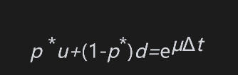

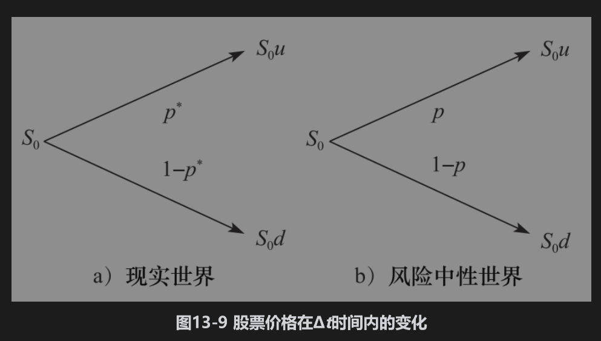

或

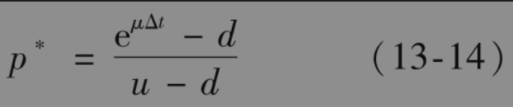

假定σ为现实世界的波动率，匹配方差会得出与式(13-12)等同的方程，其中的p被p*代替。将式(13-14)代入，得出

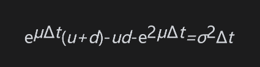

以上方程与式(13-13)几乎相同，唯一的不同是其中r被μ代替。当忽略Δt2和Δt的更高阶项后，得出方程的解与式(13-13)的解相同，为

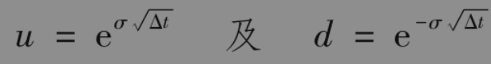

## 哥萨诺夫定理

以上结果与一个叫作哥萨诺夫定理(Girsanov's theorem)的重要结果密切相关。当我们从现实世界转换到风险中性世界时，股票价格的期望收益值将会变化，但它的波动率保持不变。一般来讲，当我们从具有一组风险偏好的世界转换到具有另一组风险偏好的世界时，变量的期望收益率会变化，但其波动率保持不变。在第28章里，我们将会更详细地探讨风险偏好对市场变量性质的影响。有时，我们也将从一组风险偏好转换到另一组风险偏好的做法称为测度变换(changing the measure)。现实世界的测度有时称为P-测度，而风险中性世界的测度则称为Q-测度。