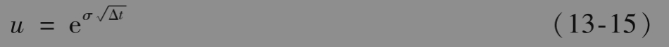
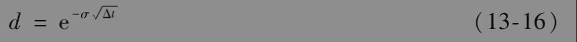
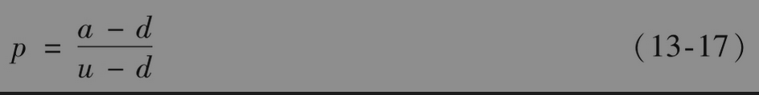
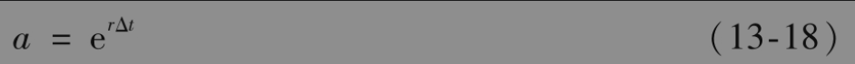
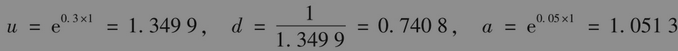
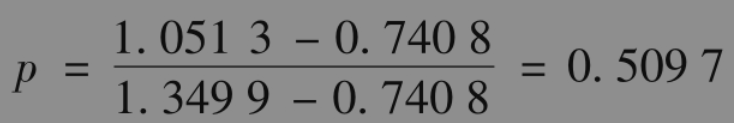

# 13.8 二叉树公式

上一节里的分析表明，当二叉树上的步长为Δt时，为了与波动率相吻合，我们取

和

而且由式(13-6)可得

其中

式(13-15)～式(13-18)定义了二叉树。

我们再考虑图13-8中的美式看跌期权，其中股票价格为50美元，执行价格为52美元，无风险利率为5%，期权期限为2年，二叉树包含两步。这时Δt=1。假定波动率为30%，由式(13-15)～式(13-18)，我们得出

以及

图13-10给出了二叉树的形状。看跌期权的价值为7.43（这与图13-8中假定u=1.2与d=0.8所得的价格是不一样的）。注意，在第一步末，当股票价格达到下方节点时，期权将会被行权。