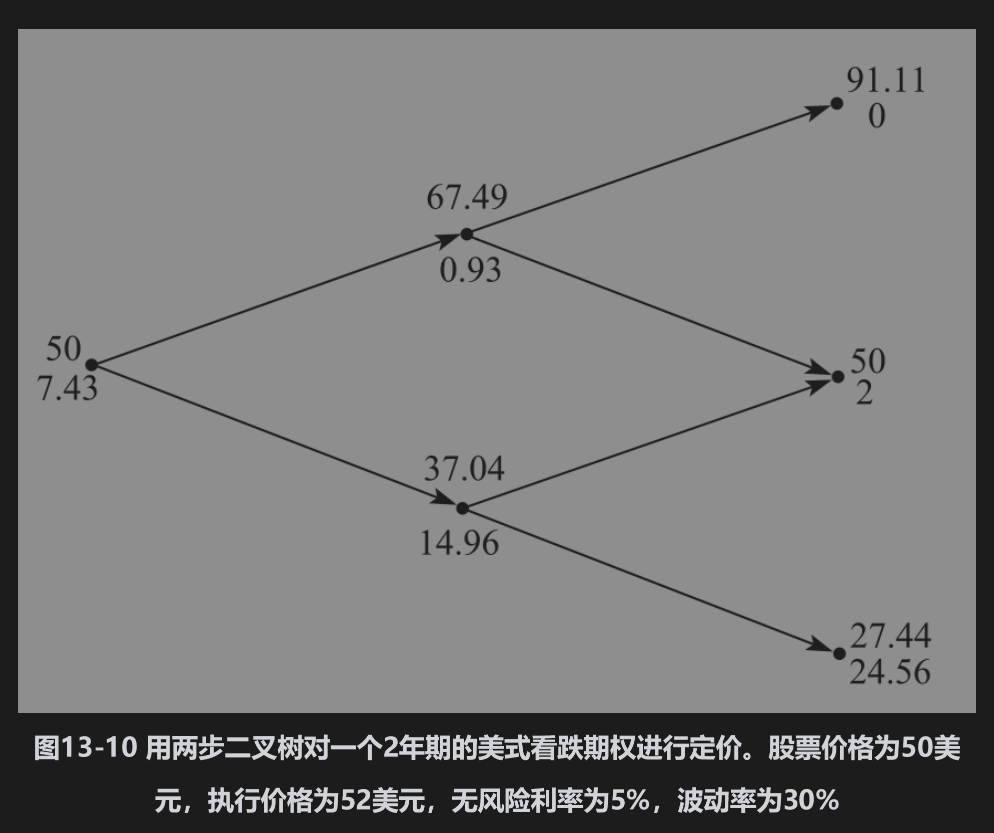
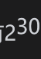
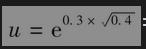
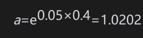

# 13.9 增加二叉树的步数

到目前为止，我们所列举的二叉树简单得不切实际。显而易见，如果假定在期权期限内价格变化由一步或两步二叉树表达，那么由此得出的期权价格将只是一个非常粗略的近似。

在实际应用二叉树时，期权的期限通常会被分割为30个或更多的时间步。在每一个时间步里，股票价格的变动由单二叉树表达。在30个时间步中，总共有31个终端股票价格，并且有，即大约10亿种可能的股票价格路径。

不管步数是多少，树形的结构都是由式(13-15)～式(13-18)定义。例如，假定图13-10中的二叉树为5步而不是2步，相应的参数Δt=2/5=0.4，r=0.05及σ=0.3。相应的参数=1.2089，d=1/1.2089=0.8272，，及p=(1.0202-0.8272)/(1.2089-0.8272)=0.5056。

当时间步数增加（从而Δt变小）时，在二叉树模型里对股票价格变化所做的假设与在第15章中引入的布莱克-斯科尔斯-默顿模型里的假设是一样的。在利用二叉树对欧式期权定价时，当步数增加时，所得价格将会收敛到布莱克-斯科尔斯-默顿价格。我们在本章的附录里将证明这个结论。