# 13.11 其他标的资产上的期权

在第10章里我们介绍了股指期权、货币期权和期货期权，在第17章和第18章中我们还要进一步讨论这些期权。事实上，我们可以采用和构造股票期权几乎一样的方法来构造二叉树，唯一的变化是对概率p的计算有所改变。像对于股票期权定价时那样，我们仍采用式(13-2)，即每一个节点上的期权价值（在提前行权的可能性被考虑之前）等于p乘以股票价格上涨时所对应的期权价值加上1-p乘以股票价格下跌时所对应的期权价值，并以无风险利率进行贴现。

## 13.11.1 支付连续股息收益率

股票的期权考虑一只支付连续股息收益率q的股票。在风险中性世界里，股息加上资本收益(capital gain)的总和等于r，股息收益为q，因此资本收益为r-q。如果股票在今天的价格为S0，步长为Δt，第一步后股价的期望值必须为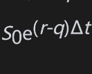，因此

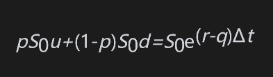

即

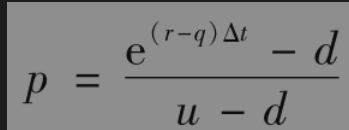

与计算无股息股票期权类似，我们将u设为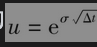，d=1/u以便使树形与波动率相吻合。这意味着我们可以利用式(13-15)～式(13-18)，而计算中唯一的改动是将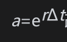改为。

## 13.11.2 股指期权

在第5章中计算股指期货价格时，我们曾假设股指中的标的股票所支付的股息收益率为q，在这里我们仍采用类似的假设。对于股指期权定价类似于对支付已知连续股息率的股票期权定价。

【例13-1】 某股指的目前水平为810，波动率为20%，股息收益率为2%，无风险利率为5%。图13-11显示了DerivaGem对于一个执行价格为800，期权为6个月的欧式看涨期权的定价结果。在计算中采用了两步二叉树。这时

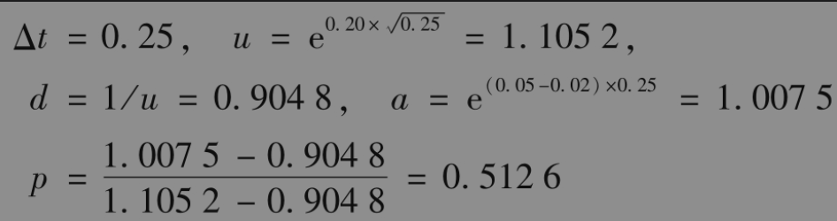

期权价值为53.39。

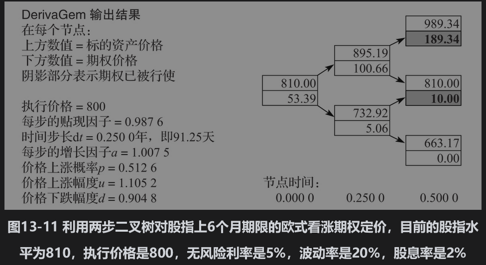
13.11.3 货币期权如第5.10节所示，外汇可以被视为提供收益率等于外币无风险利率rf的资产。同股指相比较，我们可以采用式(13-15)～式(13-18)并令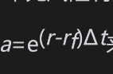来对货币期权进行定价。

【例13-2】 某一外币的当前价值为0.6100美元，汇率波动率为12%，外币的无风险利率为7%，美元的无风险利率为5%。图13-12显示了DerivaGem对于一个执行价格为0.6000，期限为3个月美式看涨期权的定价结果，在计算中采用了三步二叉树。

这时

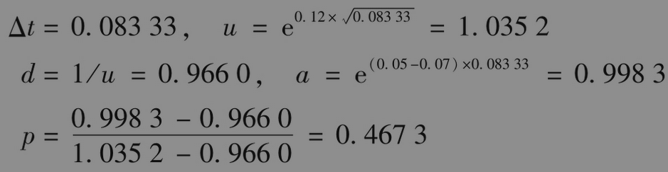

## 13.11.4 期货期权

进入期货合约的多头或空头时投资者无须支付任何费用。这说明在风险中性世界里期货价格的增长率期望应当为零（在第18.6节中我们将详细讨论这一点）。同上，我们定义p为期货价格上涨的概率，u为价格上涨的比例，d为价格下跌的比例。在开始时期货价格为F0。在第一步Δt时间后，期货价格的期望值仍然应当是F0。这意味着

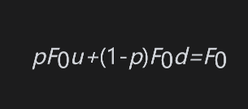

即

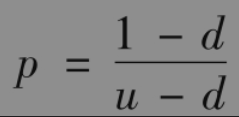

我们可以利用式(13-15)～式(13-18)以及a=1对期权进行定价。

【例13-3】 当前的期货价格为31，波动率为30%，无风险利率为5%。图13-13显示了由DerivaGem对于一个执行价格为30，期限为9个月的美式看跌期权的定价结果，计算中采用了三步二叉树。这时

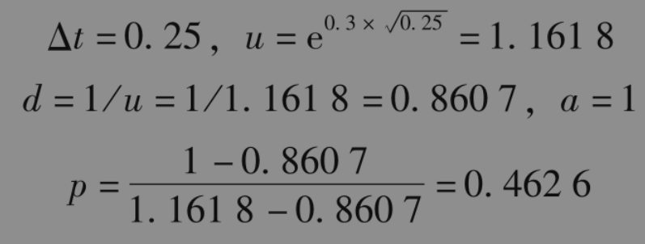

期权价值为2.84。

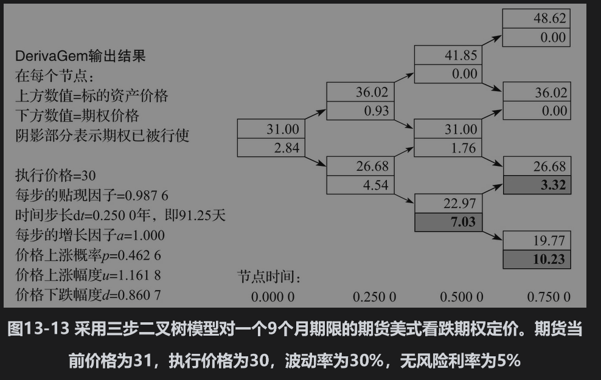