# 14.2 连续时间随机过程

我们考虑一个服从马尔可夫过程的变量，假定其当前值为10，在1年内该变量变化的分布为ϕ(0,1)，其中ϕ(m,v)代表正态概率分布，均值为m，方差为v。变量在2年内变化的概率分布是什么？

变量在2年内的变化等于2个正态随机变量的和，这里每一个变量的均值都为0，方差都为1.0。因为变量满足马尔可夫性质，所以这里的2个分布是相互独立的。2个相互独立的正态分布变量相加之和也服从正态分布，其均值等于2个独立变量均值的和，方差等于2个独立变量方差的和。因此，变量在2年内变化的均值等于0，方差等于2.0，所以变量在2年内的变化服从ϕ(0,2)，分布的标准差为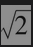。

接下来，我们考虑变量在6个月内的变化。变量1年内变化的方差等于变量在前6个月变化的方差加上变量在接下来的6个月内变化的方差。我们假定这里的前后2个变量方差相同，由此我们得出6个月内变化的方差等于0.5。与此等价，我们可以讲变量在6个月内变化的标准差等于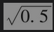，因此变量在6个月内变化的分布为ϕ(0,0.5)。

与此类似，我们可以说明变量在3个月内的变化服从ϕ(0,0.25)。更一般地，变量在任意时间段T内变化的分布服从ϕ(0,T)。特别是在很小一段时间Δt内，变量变化的分布服从ϕ(0,Δt)。

当考虑马尔可夫过程时，变量在相邻时间区间内变化的方差具有可加性，但标准差不具有可加性。例子中变量在每年内变化的方差为1.0，因此变量在2年内变化的方差为2.0，在3年内的方差为3.0，变量2年内变化和3年内变化的标准差分别为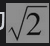和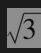。这里的结果说明了为什么有时称不确定性与时间的平方根成正比。

## 14.2.1 维纳过程

以上例子中变量所服从的过程即著名的维纳过程(Wiener process)。维纳过程是一种均值为0，方差为每年1.0的特殊马尔可夫过程。这种过程曾在物理学中用来描述一个粒子受到大量小分子碰撞后所产生的运动，有时也称为布朗运动(Brownian motion)。

采用正规的表达方式，变量z具有以下两个性质时称为服从维纳过程。

## 性质1：在一小段时间区间Δt内的变化量Δz为

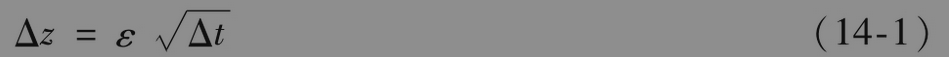

其中ε服从标准正态分布ϕ(0,1)。

## 性质2：在任何两个不相重叠的Δt时间区间内，变化量Δz之间相互独立。

第一个性质说明Δz本身服从正态分布，并且

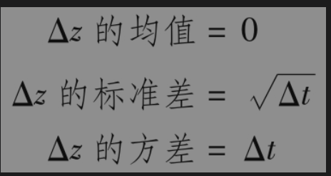

第二个性质说明变量z服从马尔可夫过程。

接下来考虑在一段相对较长的时间T内z的变化。我们可以将变化量表达为z(T)-z(0)，这一变化量可以被看成是在N个长度为Δt的小时间段内变量z变化的总和，其中

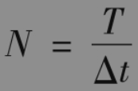

因此

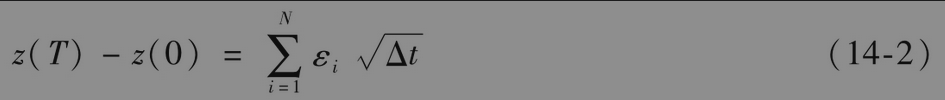

其中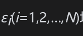均服从ϕ(0,1)分布。由维纳过程的第二个性质我们知道εi之间相互独立，由式(14-2)得出z(T)-z(0)服从正态分布，其中

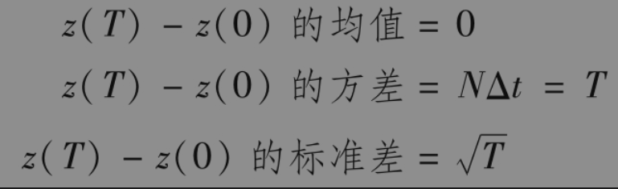

这一结果与本节前面的结论是一致的。

【例14-1】 假定变量z服从维纳过程，初始值为25，时间以年为单位。在1年年末，变量的值服从均值为25、标准差为1.0的正态分布；在5年年末，变量值服从均值为25、标准差为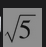（或2.236）的正态分布。变量在将来某一确定时刻由标准差来定义的不确定性与未来时间长度的平方根成正比。

在普通微积分中，我们通常在微小变化接近零时采用极限来处理。因此，我们采用符号dx=adt来代表当Δt→0时，Δx=aΔt的极限形式。在随机微积分中，我们使用类似的符号。因此，dz代表维纳过程，即dz代表当Δt→0时，Δz的极限形式，并且dz具有Δz的上述性质。

图14-1说明了当Δt→0时变量z所遵循路径的变化。注意这里的路径呈现参差不齐的形状，这是因为变量z在Δt时间内的变化的标准差等于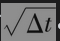。而我们知道当Δt很小时，远远大于Δt。下面我们列出两个与有关的维纳过程性质：

(1)在任意给定时间段内，变量z所遵循路径长度的期望值为无穷大。

(2)在任意给定时间段内，变量z等于任一个给定数值的次数的期望值为无穷大。

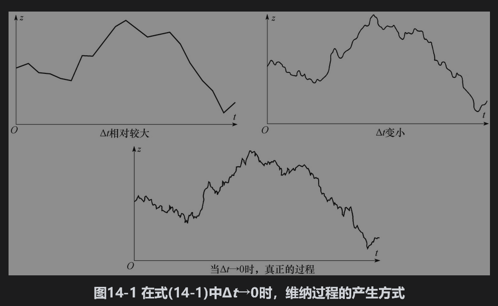

## 14.2.2 广义维纳过程

在随机过程中，变量在每单位时间内均值的变化被称为变量的漂移率(drift rate)，在每单位时间内的方差被称为变量的方差率(variance rate)。到目前为止，我们所讨论的基本维纳过程的漂移率为0，方差率为1.0。漂移率为0意味着在将来任意时刻变量z的期望值等于其当前值，方差率等于1.0意味着在长度为T的任何时间区间内，z变化的方差等于T。广义维纳过程(generalized Wiener process)x可以通过dz定义

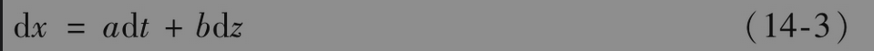

其中a和b为常数。

为了理解式(14-3)，我们可以将方程的右端分成两项来看。adt项说明变量x的单位时间漂移率为a。如果没有bdz项，以上方程变为dx=adt，即dx/dt=a。对t进行积分得出

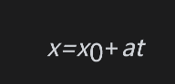

其中x0为x在0时刻的初始值。在一段时间T内，变量x的增量为aT。式(14-3)右端的bdz项可看成是附加在变量x路径上的噪声或扰动，其幅度为维纳过程的b倍。维纳过程的方差率为1.0，因此b倍维纳过程在单位时间内的方差率为b2。在短时间Δt内，由式(14-1)和式(14-3)给出的x的变化量Δx为

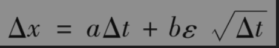

其中，如上所述，ε服从标准正态分布。因此Δx服从正态分布，并且

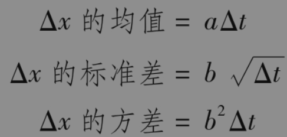

类似于以上的讨论，在任意时间T内，变量x的变化服从正态分布，而且满足

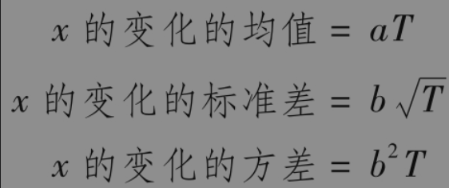

因此，式(14-3)所示广义维纳过程的期望漂移率（即单位时间内的平均漂移）为a，方差率（即单位时间内的方差）为b2，如图14-2所示。

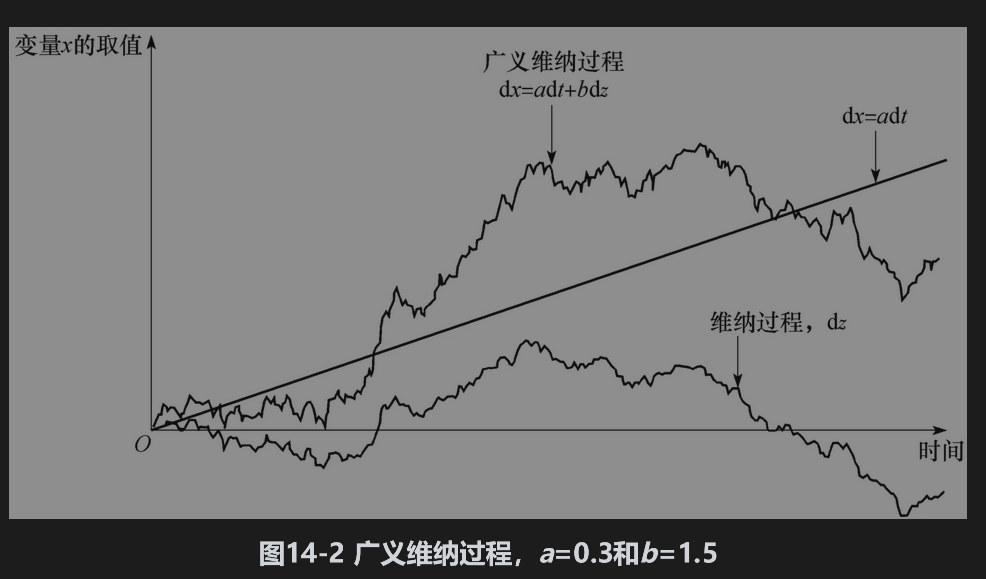

【例14-2】 考虑这样一种情况：某公司的现金头寸（以千美元计）满足广义维纳过程，漂移率为每年20，方差率为每年900。最初的现金头寸为50。在1年后的现金头寸服从均值为70、标准差为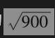（即30）的正态分布。在6个月结束时，现金头寸服从均值为60、标准差为30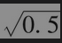=21.21的正态分布。我们对于将来现金头寸所做预测的不确定性（即标准差）与我们所考察时间长度的平方根成正比。注意，这里的现金头寸可以为负值（这种情况可以解释为公司借入资金）。

## 14.2.3 伊藤过程

我们可以进一步定义一类被称为伊藤过程(Itô process)的随机过程。伊藤过程是一种更为广义的维纳过程，其中a和b为变量x和时间t的函数。伊藤过程的表达式为

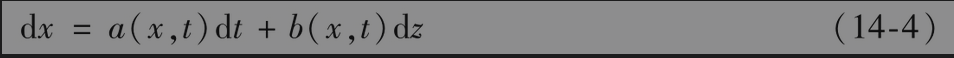

过程中的期望漂移率和方差率均会随时间变化。在任意小的时间区间t与t+Δt内，变量x变为x+Δx，其中

以上关系式是一个近似式，其中假定了在时间区间t与t+Δt内，变量x的漂移率和方差率都是常数，并且等于它们在时间t的值。

因为在式(14-4)中，x的变化只依赖于x在时间t的值（而与其历史取值无关），所以这个过程具有马尔可夫性质。如果在(14-4)中，a与b依赖于x在时间t之前的值，那么这样得到的过程将不再具有马尔可夫性质。