# 14.3 描述股票价格的过程

在这一节里，我们将讨论通常对无股息股票价格所假设的随机过程。

我们可能会想假设股票价格服从广义维纳过程，也就是说，它具有不变的期望漂移率和不变的方差率。但是，这一模型没有抓住股票价格的一个关键特性，即投资者所要求的期望收益率与股票价格无关：如果投资者在股票价格等于10美元时要求期望收益率为14%，那么在其他条件相同时，投资者在股票价格等于50美元时也同样会要求收益率为14%。

显然，期望漂移率不变的假设是不合理的，该假设应修改为期望收益率（即期望漂移率除以股票价格）为常数。如果股票在t时刻的价格为S，那么股票的漂移率应为μS，其中μ为常数。这一假设意味着在一段很短的时间Δt内，S的预期增量为μSΔt，其中μ为股票的期望收益率。

如果dz的系数是0，即没有不确定性，那么这个模型变为

                     ΔS=μSΔt

当Δt→0时，其极限形式为

                     dS=μSdt

即

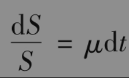

由0到T对变量t进行积分，我们得出

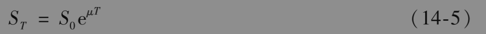

其中S0和ST分别为股票在0时刻和T时刻的价格。式(14-5)说明当方差为0时，股票价格在单位时间内的连续复利增值率为μ。

当然，实际中的股票价格存在不确定性。一个比较合理的假设是无论股票价格为多少，在一段较短的时间Δt内股票价格百分比收益的变动性都一样。换句话讲，投资者在股票价格为50美元和10美元时对股票百分比收益的不确定性有同样的观点。这意味着在很短的时间Δt后，股票价格变化的标准差应与股票价格成正比，因此得出的模型是

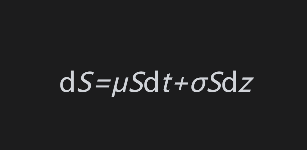

或者

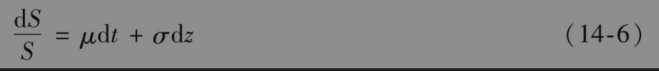

式(14-6)是描述股票价格行为时最为广泛使用的一种模型。变量μ为股票价格的期望收益率，变量σ为股票价格的波动率，而变量$`σ_2`$则为股票价格的方差率。式(14-6)可视为在现实世界里的股票价格过程。在风险中性世界里，μ等于无风险利率r。

## 14.3.1 离散时间模型

我们以上建立的关于股票价格变化的模型叫几何布朗运动(geometric Brownian motion)。模型的离散形式为

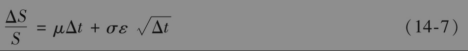

或

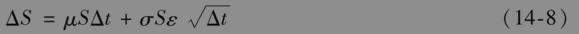

变量ΔS为股票价格S在一小段时间区间Δt内的变化，ε服从标准正态分布（即均值为0，方差为1.0的正态分布）。参数μ为股票在单位时间内的期望收益率，参数σ为股票价格的波动率。在这一章里，我们假定以上两个参数均为常数。

式(14-7)的左端是股票在短时间Δt内收益率的近似值，μΔt项是收益率的期望值，而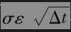是收益率的随机部分。随机部分的方差为σ2Δt，从而全部收益的方差也是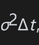。这与第13.7节里定义的波动率是一致的，即σ的值使得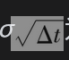为股票在短时间Δt内收益率的标准差。

式(14-7)表明ΔS/S近似地服从正态分布，均值为μΔt，标准差为，换句话讲

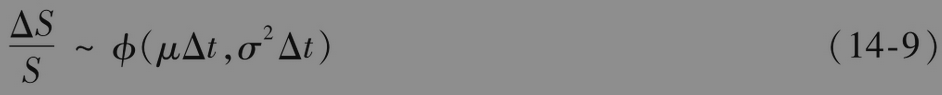

【例14-3】 考虑某只无股息股票，其波动率为每年30%，连续复利期望收益率为15%。这时，μ=0.15，σ=0.30。股票价格的过程为

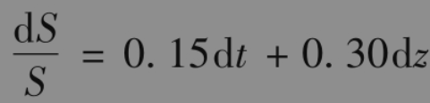

如果S是股票在某一时刻的价格，ΔS为股票价格在此后一段短时间区间内的增量，该过程的近似形式是

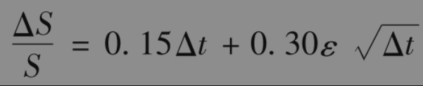

其中ε服从标准正态分布。假定时间间隔为1周（即0.0192年），那么Δt=0.0192，

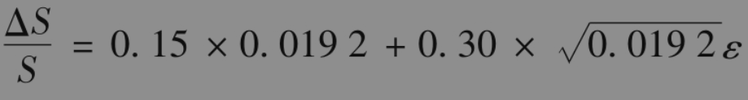

或

                ΔS=0.00288S+0.0416Sε14.3.2 

蒙特卡罗模拟随机过程的蒙特卡罗模拟是一种对过程随机抽样的程序。这种方法可以帮助我们理解式(14-6)的含义。

考虑例14-3中的情形，其中股票的期望收益率为每年15%，标准差（即波动率）为每年30%。股票价格在1周内的变化形式为

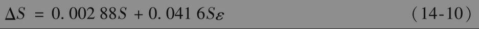

我们可以重复地从ϕ(0,1)中抽取ε的样本，并代入式(14-10)中来模拟股票价格在10周内变化的路径。Excel中的表达式=RAND()可用于产生0～1的随机数，正态分布的反函数是NORMSINV。因此从标准正态分布中取样的指令是=NORMSINV(RAND())。表14-1展示了由这种方法所产生的一条股票价格路径。股票价格的初始值为100美元。在第一段时间里，从ϕ(0,1)中抽取的随机数为0.52，由式(14-10)得出股票价格变化为

           ΔS=0.00288×100+0.0416×100×0.52=2.45

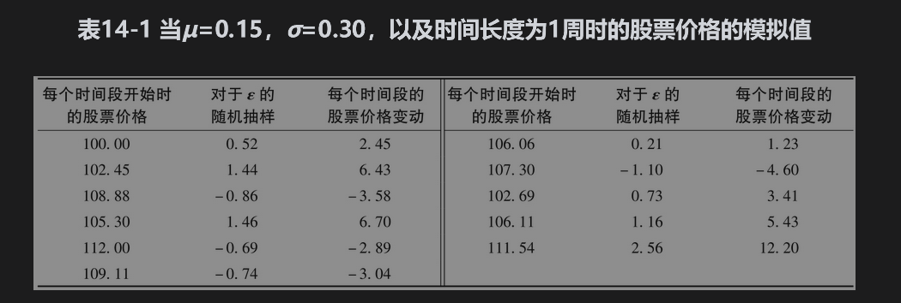

因此在第2段时间开始时，股票价格为102.45美元。在第2段时间里，ε的随机抽样为1.44。由式(14-10)得出在第2段时间内股票价格变化为

          ΔS=0.00288×102.45+0.0416×102.45×1.44=6.43

因此，在下一段时间开始时，股票价格为108.88美元等。注意，因为我们进行抽样的过程为马尔可夫过程，所以每一步对ε的抽样必须相互独立。

在表14-1中假定股票价格精确度为美分。我们应该认识到这一表格只显示了股票价格变动的一种可能方式，不同的随机抽样会产生不同的价格变动。在模拟中，我们可以采用任意小的时间步长Δt。在Δt→0的极限状态下可以取得对于随机过程的完美描述。在表14-1中，股票的最终价格111.54美元可以看成是在10周后股票价格的一个随机样本。反复进行如表14-1所示的模拟，我们可以得出在这段时间后股票价格的完整概率分布。在第21章中，我们将进一步详细描述蒙特卡罗模拟。