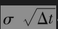

# 14.4 参数

本章所建立的描述股票价格的过程涉及两个参数：μ和σ。参数μ为投资者在很短一段时间里赚取的期望收益率（按年计）。大多数投资者在承担更大风险时将会要求更高的期望收益，因此μ将会依赖于股票收益的风险，μ的取值也应该与经济中的利率水平有关：利率水平越高，投资者对股票的期望收益也会越高。

幸运的是我们并不需要关心计算μ的细节，因为与股票有关的衍生产品价格一般与μ无关。与之相反，对于确定与股票价格有关的衍生产品价格来讲，股票价格的波动率σ是至关重要的。我们将在第15章里讨论估计σ的方法。股票价格的波动率通常介于0.15~0.60（即15%~60%）。

在一段很短的时间Δt内，股票价格百分比变化的标准差为。作为一个粗略估计，在一段较长的时间T后，股票价格百分比变化的标准差为。这意味着，作为近似估计，可以将波动率解释成股票在1年内价格变化的标准差。在第15章里，我们将说明股票价格的波动率正好等于以连续复利计算的股票价格收益率的标准差。