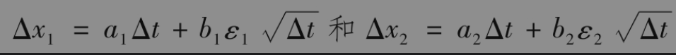
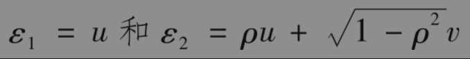

# 14.5 相关过程

到现在为止，我们所考虑的是如何表示单变量的随机过程。我们现在将这些分析推广到涉及两个或更多个相关变量的随机过程。假设两个变量x1和x2分别服从以下随机过程

其中z1和z2为维纳过程。

如前面所述，这些过程的近似离散形式是

其中ε1和ε2是标准正态分布ϕ(0,1)的样本。

对变量x1和x2，我们可以像第14.3节里所讲的那样进行抽样。如果它们之间互不相关，用来描述在一段时间Δt内变动的ε1和ε2应当是相互独立的。

如果变量x1和x2之间有非零的相关系数ρ，那么用来描述在一段时间Δt内变动的ε1和ε2应当是二元正态分布的样本。其中每个变量都服从标准正态分布，而且两个变量之间的相关系数为ρ。

在这种情形下，我们称维纳过程dz1与dz2具有相关系数ρ。在Excel表中对互不相关的标准正态变量取样时，我们需要将“=NORMSINV(RAND())”命令应用在每个单元里。当对具有相关系数ρ的标准正态变量ε1和ε2取样时，我们可以令

其中u和v是按互不相关的标准正态分布提取的样本。

应当指明的是，对于上面所假设的变量x1和x2，参数a1,a2,b1,b2可以是x1,x2和t的函数。所以a1,b1既可以是x1和t的函数也可以是x2的函数，而a2,b2既可以是x2和t的函数也可以是x1的函数。

这里的结果可以推广。当三个变量服从相关的随机过程时，我们需要抽取三个不同ε的样本。这些变量服从三元标准正态分布。当有n个相关的随机变量时，我们需要从相应的多元正态分布中提取n个不同的ε样本。对于具体做法，我们将在第21章里讨论。