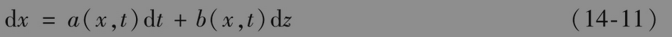
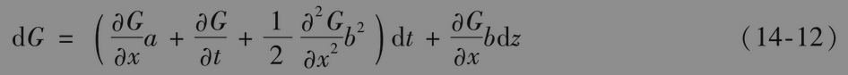
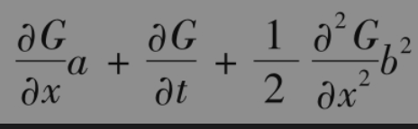
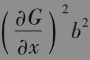
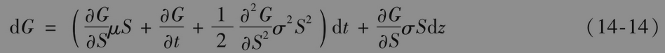
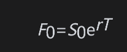
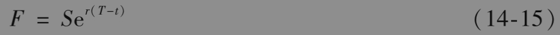
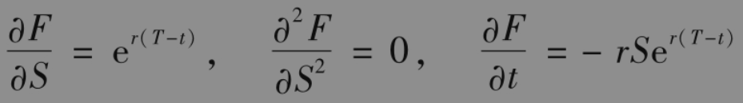
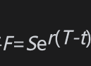
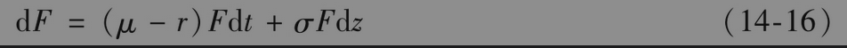

# 14.6 伊藤引理

衍生产品的价格是标的股票价格和时间的函数。更一般地讲，任意一种衍生产品的价格都是某些标的随机变量和时间的函数。想认真学习衍生产品定价的学生应该对随机变量函数的性质有所了解。在这个领域中的一个重要结论是数学家伊藤清(K.Itô)在1951年发现的伊藤引理。

假设变量x的值服从以下伊藤过程

其中dz是维纳过程，a和b为x和t的函数。变量x的漂移率为a，方差率为b2。伊藤引理说明一个x和t的函数G服从以下过程

其中dz是与式(14-11)中相同的维纳过程。因此，G也服从伊藤过程，其漂移率为

方差率为

关于伊藤引理的严格证明已经超出了本书的范围。在本章的附录中，我们将说明这个引理可以作为微积分中一个著名结论的推广。

在本章前面的部分里我们说明了为什么

是一个描述股票价格变化的合理模型，其中μ和σ为常数。由伊藤引理可知，S和t的函数G服从以下过程

注意，S和G都受同一个不确定性来源dz的影响。在推导布莱克-斯科尔斯-默顿公式时，这一点很重要。

## 应用于远期合约

为了说明伊藤引理，我们将考虑无股息股票上的远期合约。假定所有期限的无风险利率均为常数r。由式(5-1)，我们得出

其中F0为0时刻的远期价格，S0为0时刻的即期价格，T为远期合约的期限。

我们想知道远期价格如何随时间变化。定义F为t时刻的远期价格，S为t时刻的股票价格，其中t<T 。F和S满足

假设S服从式(14-13)所定义的随机过程，利用伊藤引理可以确定F所服从的随机过程。由式(14-15)，我们得出

将代入方程，上式变为

与S一样，远期价格F也服从几何布朗运动，并具有与S相同的波动率，但期望增长率为μ-r，而不是μ。