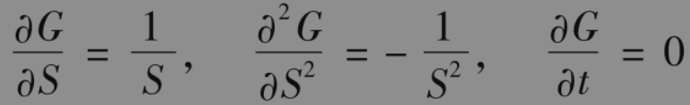
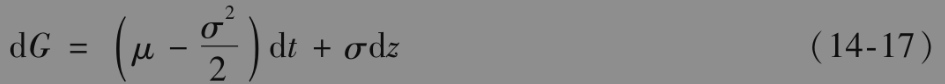
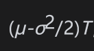
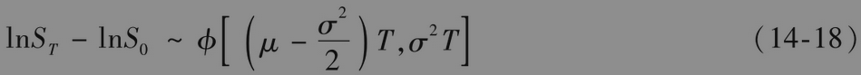
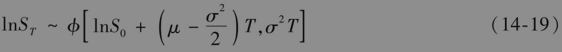
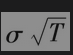

# 14.7 对数正态分布的性质

接下来，我们利用伊藤引理来推导当S服从式(14-13)时，lnS所服从的随机过程。定义

                     G=lnS

因为

由式(14-14)可知G满足

因为μ和σ为常数，以上方程说明G满足一个广义维纳过程，其漂移率为常数μ-σ2/2，方差率为常数σ2。因此lnS在0与T时刻之间的变化服从正态分布，期望值，方差为σ2T。这意味着

或者

其中ST为股票在T时刻的价格，S0为股票在0时刻的价格。与前面一样，ϕ(m,v)代表均值为m，方差为v的正态分布。

式(14-19)说明lnST服从正态分布。如果一个变量的自然对数服从正态分布，我们称该变量满足对数正态分布。本章所建立的关于股票价格的模型意味着在给定今天股票价格的前提下，股票在T时刻的价格满足对数正态分布。股票价格对数的标准差为，这一标准差与时间持有期长度的平方根成正比。