# 14.8 分数布朗运动

分数布朗运动(fractional Brownian motion)也叫分形布朗运动(fractal Brownian motion)是布朗运动以及本章前面讨论的维纳过程的推广，并被应用于对衍生产品定价的粗糙波动率模型(rough volatility model)中。后面的章节里将会讨论这些模型。

我们首先概括维纳过程的性质。假设dz是维纳过程，σ为常数。假设

                 X=σdz
                 
                 
以及X(0)=0，那么对t＞s＞0，

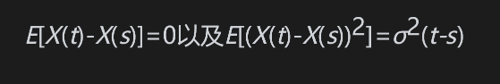

特别是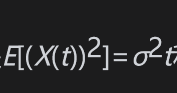和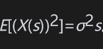。在时间s与t之间，X变化的方差为

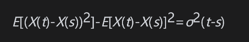

因此每单位时间的方差为常数并且等于σ2。由于维纳过程具有马尔可夫性质，X(t)-X(s)与X(s)没有相关性，因此

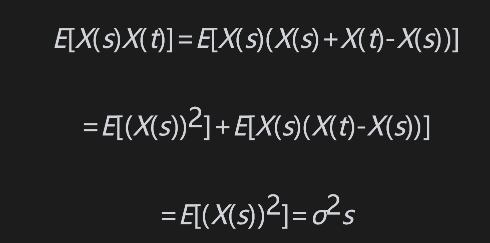

在分数布朗运动里我们假设

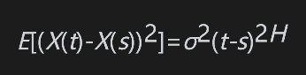

其中H称为赫斯特指数(Hurst exponent)。仍然假设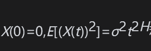和。当H=0.5时，分数布朗运动即是通常的布朗运动。

由于

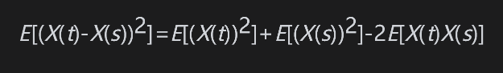

可以得出

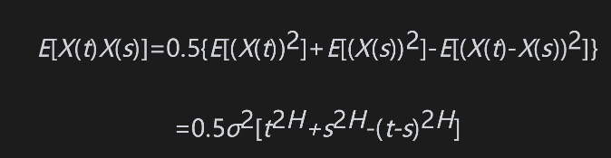

当H=0.5时，上式即为前面的维纳过程中的结果：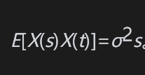。X(t)与X(s)之间的相关系数为

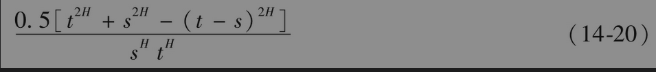

分数布朗运动不具有马尔可夫性质。如果t＞s＞u，那么

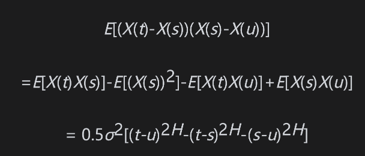

当H=0.5时，上式为0。当H＞0.5时，上式为正值（即在相邻时间段内X的变化具有正相关性）；而当H＜0.5时，上式为负值（即在相邻时间段内X的变化具有负相关性）。

在模拟分数布朗运动时，我们需要将所考虑的时间段分成许多长度为Δt的短时间段。由标准正态分布ε抽样，然后通过(14-8)来确定在一小段时间内价格的变化。当为通常的布朗运动时，ε在不同时间段上的是互不相关的。在分数布朗运动的假设下，我们必须引入满足(14-20)的相关性。第一步随机抽取ε，在选取第二步的ε时，必须使得X(2Δt)与X(Δt)之间有正确的相关性，在选取第三步的ε时，必须使得X(3Δt)与X(2Δt))和X(Δt)之间都具有正确的相关性，以此类推。第21章里介绍的Cholesky分解可以用来完成这种模拟。

图14-3展示了当H等于0.9，0.5和0.1时，分数布朗运动在一年时间内的模拟值，时间步长为0.01年。当H缩小时，分数过程变得越来越凌乱。如果将时间步长取得更小，这种现象会更显著。

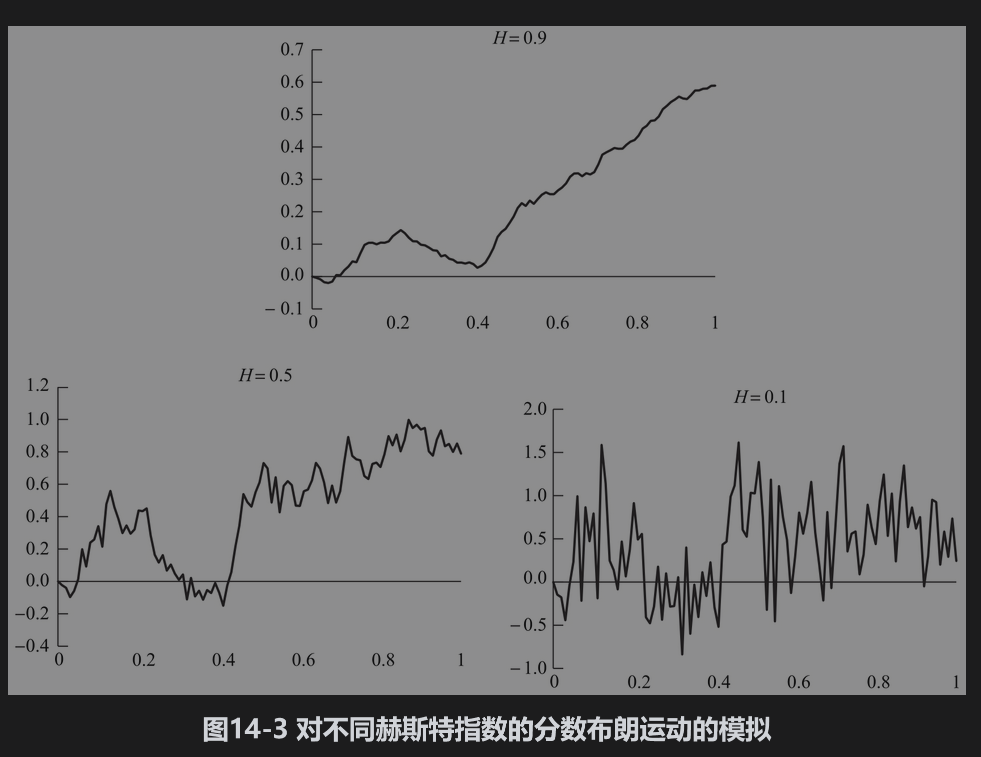

