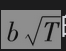

# 小结

随机过程描述了变量值随时间变化的概率分布。在马尔可夫过程中，只有变量的当前值与将来的预测值有关，而变量的历史以及如何演变到当前值的方式与预测值无关。

维纳过程dz是一个描述正态分布变量变化的马尔可夫过程。该过程的漂移率为0，在单位时间内的方差率为1.0。这意味着，如果变量在0时刻的初始值为x0，那么该变量在T时刻服从期望值为x0、标准差为的正态分布。

广义维纳过程描述了在单位时间内漂移率为a，方差为b2的正态分布变量的变化过程，其中a和b为常数。这意味着，如果变量在0时刻的值为x0，那么该变量在T时刻服从期望值为x0+aT、标准差为的正态分布。

变量x满足伊藤过程是指其漂移率和方差率均为x本身和时间t的函数。在一段很短的时间区间内，x的变化近似地服从正态分布，但在一段较长的时间后，x变化的概率分布往往是非正态的。

从直观上理解随机过程的一种方式是对变量变化进行蒙特卡罗模拟。模拟的方法是将时间分成若干小的区间，然后再对变量变化的可能路径进行抽样，这样就可以产生变量在将来时间上的概率分布。在第21章里，我们将进一步讨论蒙特卡罗模拟方法。

伊藤引理是一种由变量本身所服从随机过程来计算该变量的函数所服从随机过程的方法。在第15章里，我们将会发现对衍生产品定价时伊藤引理的重要性。该引理的关键是原始变量随机过程中的维纳过程与变量函数随机过程中的维纳过程是一样的，即两个随机过程具有相同的不确定性来源。

通常假设描述股票价格的随机过程为几何布朗运动。在这种过程中，在很小时间区间内，股票持有者的收益大约服从正态分布，而且在任意两个不相重叠的时间区间内的收益相互独立。股票价格在将来时刻的概率分布为对数正态分布。在下一章中，我们所讨论的布莱克-斯科尔斯-默顿模型就建立在几何布朗运动的假设之上。