# 15.1 股票价格的对数正态分布性质

布莱克、斯科尔斯和默顿用来描述股票价格行为的模型正是我们在第14章中建立的模型。该模型假设无股息股票在短时间内的百分比变化具有正态分布。定义

μ：股票年化的短期期望收益率；

σ：股票价格的波动率。

在Δt时间内股票收益的均值和标准差分别近似地等于μΔt和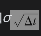，因此

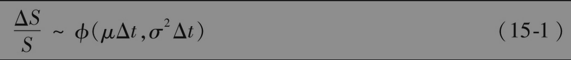

其中ΔS为股票价格在Δt时间内的变化，ϕ(m,v)代表均值为m，方差为v的正态分布。[这正是式(14-9)]。

在第14.7节中我们曾证明

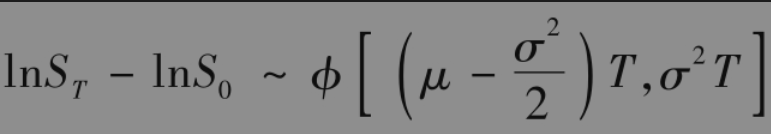

因此

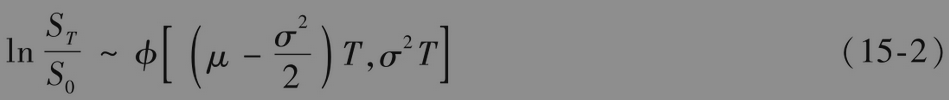

和

其中ST是在未来时间T时的股票价格，S0是在时间0的股票价格。在这里没有做任何近似。lnST服从正态分布，所以ST服从对数正态分布。lnST的均值是lnS0+(μ-σ2/2)T，标准差是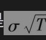。

【例15-1】 考虑一个初始价格为40美元的股票，该股票的期望收益为每年16%，波动率为每年20%。由式(15-3)我们知道，股票价格ST在6个月内的概率分布是

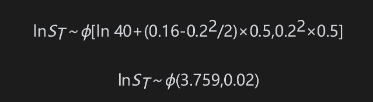

一个服从正态分布的变量取值落在与均值的距离小于1.96倍标准差范围内的概率为95%。在本例中，标准差为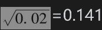，因此在95%的置信度下，我们有

           -1.96×0.141<lnST<3.759+1.96×0.141

这可以写成

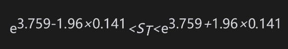

或

                32.55<ST<56.56

因此，在6个月内股票价格介于32.55～56.56范围内的概率为95%。

具有对数正态分布的变量可以取零与无穷大之间的任何值，图15-1展示了对数正态分布的形状。与正态分布不同的是，它呈偏态。因此它的均值(mean)、中位数(median)以及众数(mode)均不相等。由式(15-3)以及对数正态分布的性质，我们可以证明ST的期望值E(ST)为

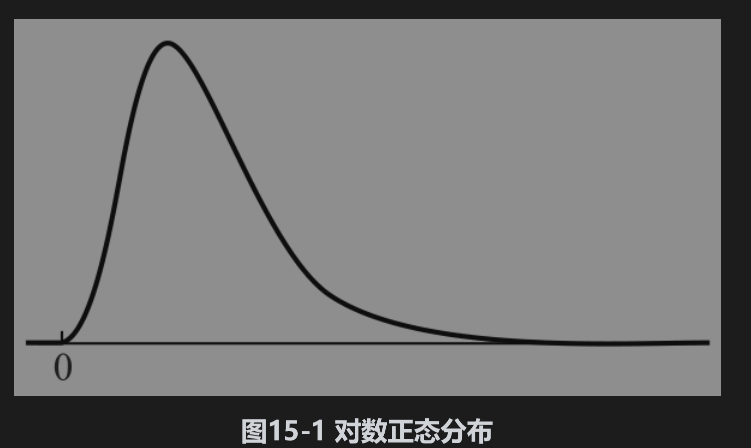

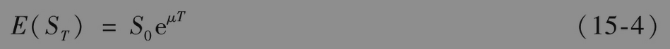

ST的方差var(ST)可以表示为

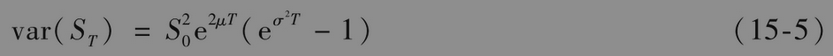

【例15-2】 假设某股票，其当前价格为20美元，期望收益为每年20%，波动率为每年40%。股票在1年内的价格期望和方差由下面的式子给出

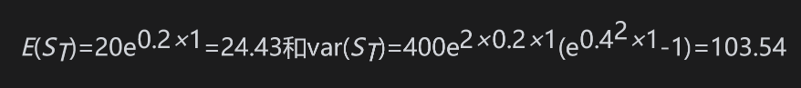

1年内股票价格的标准差为，即10.18。