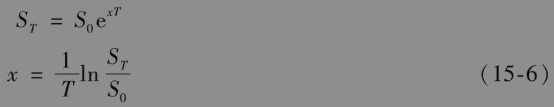
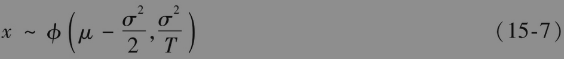
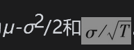
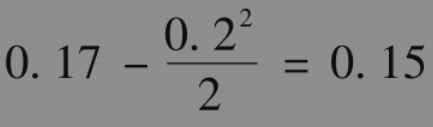
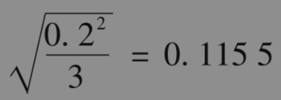

# 15.2 收益率的分布

由股票价格服从对数正态分布的性质出发，我们可以得出0与T之间连续复利收益率的概率分布。将0与T之间以连续复利的收益率记为x，那么

由式(15-2)得出

因此，连续复利收益率服从正态分布，其均值与标准差分别为。当T增大时，标准差x减小。为了理解这一点，我们可以考虑T=1和T=20两种情形：与1年的年平均收益估计相比，我们估计20年内的年平均收益比估计任意一年的平均收益更能确定。

【例15-3】 假设某一股票，其期望收益为每年17%，波动率为每年20%，在3年内实现的平均收益（以连续复利计算）服从正态分布，均值为

即每年15%，标准差为

即每年11.55%。因为一个服从正态分布的变量有95%的机会落在与其均值距离小于1.96倍标准方差的范围之内，因此，我们有95%的把握肯定在今后3年内实现的平均年收益率将会介于15-1.96×11.55=-7.6%与15+1.96×11.55=+37.6%之间。