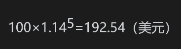
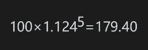
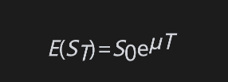
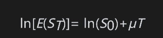
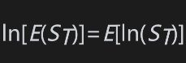

# 15.3 期望收益

投资者从股票中所寻求的期望收益率μ与该股票的风险有关。风险越大，期望收益率也会越高。它还依赖于经济中的利率：当利率越高时，投资者对股票所要求的期望收益率也会越高。庆幸的是，我们不需要关心决定μ的任何细节。事实上，当利用标的股票价格表示期权价格时，期权价格与μ毫不相干。尽管如此，股票期望收益率的一个性质常常引起混淆，因此我们会特别解释这个性质。

我们的股票定价模型定义μΔt是股票在较短时间段Δt内的平均回报，由此我们可能会很自然地假设μ是股票以连续复利的期望收益。但事实并非如此。在一段长度为T的时间内，真正实现的连续复利的收益x是根据式(15-6)得出的

而且由式(15-7)，我们知道期望值E(x)=μ-σ2/2。

以连续复利形式计算的期望收益不等于μ的原因并不是那么一目了然，但十分重要。假定我们考虑大量长度为Δt的很短时间区间。定义Si为股票在第i个时间区间末的股票价格，ΔSi为Si+1-Si。在我们对股票价格所做的假设下，在每个小区间上股票价格的算术平均收益率大约为μ。换句话说，μΔt很接近于ΔSi/Si的算术平均值。然而，当表示成以区间Δt复利时，在数据所覆盖的总区间上收益的期望接近于μ-σ2/2，而不是μ。业界事例15-1描述的有关共同基金的数值例子对此进行了说明。

## 业界事例15-1

共同基金的收益率可能会令人误解μ与μ-σ2/2的不同与共同基金收益报告存在的一个问题有密切关系。假定某共同基金经理报告过去5年内的年收益（以年复利计算）依次为15%、20%、30%、-20%和25%。

这些收益的算术平均值等于以上5个数值的总和除以5，即14%。但是如果一个投资者将资金投入该共同基金，并投资5年，那么其收益率会小于每年14%。100美元的投资在5年后的价值为

             100×1.15×1.20×1.30×0.80×1.25=179.40（美元）

而以年复利14%的收益率计算，相应值将为

在5年后，终值179.40美元所对应的收益率为12.4%，这是因为

那么，基金经理应该报告哪一个收益率呢？基金经理可能想做出以下陈述：“在过去5年，我们平均每年的收益率为14%。”虽然这种说法没有错，但它会令人产生误解，而以下陈述就不太会使人产生误解：“投资者在过去5年中将资金投入我们共同基金所得收益率为每年12.4%。”在某些地区，监管当局要求基金经理以第2种形式报告其收益率。

以上现象是数学中的一个著名结论：一组数据（不全部相等）的几何平均值总是小于算术平均值。在我们的例子中，收益每年的乘数项为1.15、1.20、1.30、0.8和1.25。这些数字的算术平均为1.140，而它们的几何平均值为1.124，即1加上年收益率在5年内的几何平均值。

为了以数学的方式解释原因，我们首先由式(15-4)开始

取对数，我们得出

我们可能会认为，并由此得出$`E[ln(S_T)]-ln(S_0)=μT`$，即$`E[ln(S_T/S_0)]=μT`$，这也就得出了E(x)=μ。但是，因为ln是非线性函数。事实上$`ln[E(S_T)]＞E[ln(S_T)]`$，因此$`E[ln(S_T/S_0)]＜μT`$，从而E(x)＜μ（如上所述，$`E(x)=μ-σ^2/2）`$。