# 15.4 波动率

股票的波动率σ用于度量股票收益所产生的不确定性。股票的波动率通常介于15%～60%。

由式(15-7)可知股票价格的波动率可以定义成按连续复利时股票在1年内所提供收益率的标准差。

当Δt很小时，式(15-1)显示σ2Δt近似地等于在Δt时间内股票价格变化百分比的方差。这说明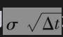近似地等于在Δt时间内股票价格变化百分比的标准差。例如，一家公司股票的价格为50美元，波动率σ=0.3，即每年30%。对应于每周价格百分比变化的标准差近似地等于

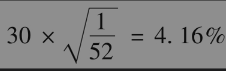

在1周内股票价格有一个标准差的变化为50×0.0416，即2.08美元。

由标准差描述股票价格变化不定性的增长速度大约为时间持有期长度的平方根（至少在近似意义下）。例如，股票价格在4周内的标准差大约为股票价格在1周内标准差的两倍。

## 15.4.1 由历史数据所估计的波动率

为了以实证的方式估计股票价格的波动率，对股票价格的观察通常是在固定的区间内（如每天、每周或每个月）。

定义

n+1：观测次数；

Si：第i个时间区间末的股票价格，i=0,1,…,n；

τ：时间区间的长度，以年为单位。

令

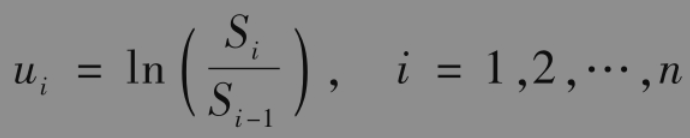

ui标准差的估计值s为

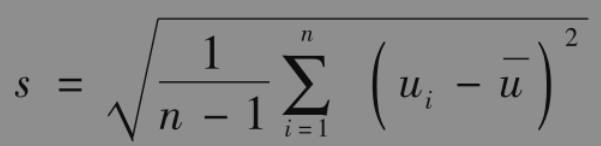

或

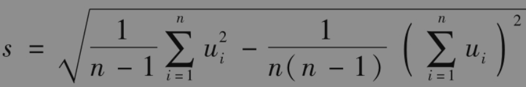

其中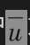为ui的均值。

由式(15-2)我们知道ui的标准差为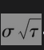。因此，变量s是的估计值。所以σ本身可以被估计为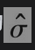，其中

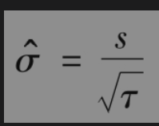

可以证明以上估计式的标准误差大约为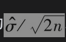。

主动交易期权的价格通常不是根据基于历史数据的波动率计算的。本章后面看到，交易员使用隐含波动率。然而，基于历史数据的波动率估计被广泛用于风险管理。风险经理通常将τ设置为一天。风险经理必须处理的一个问题是：波动率往往会随着时间的推移而变化，有高波动时期和低波动时期，这将影响用于估计波动率的数据量（即n的选择）。如果波动率是恒定的，数据越多，估计的精确度也会越高，但σ确实会随时间变化，太老的历史数据对于预测将来波动率可能不太相干。一个折中的办法是采用最近90～180天内每天的收盘价数据。另外一种约定俗成的方法是将n设定为波动率所用于的天数。因此，如果波动率是用于计算两年期的期权，在计算中我们可以采用最近两年的日收益数据。估计波动率比较复杂的方法涉及GARCH模型，在第23章中我们将对此进行讨论。

【例15-4】 表15-1给出了在21个连续交易日里的股票价格序列。这时n=20

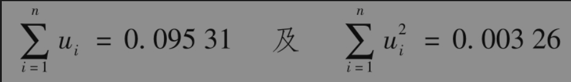

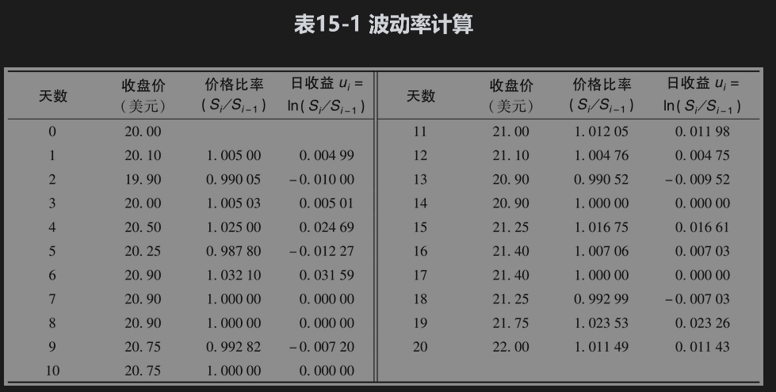

日收益率标准差的估计值为

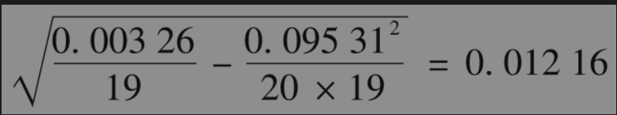

即1.216%。假设每年有252个交易日，τ=1/252，以上数据给出的波动率估计值为每年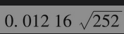=0.193，即19.3%。估计值的标准误差为

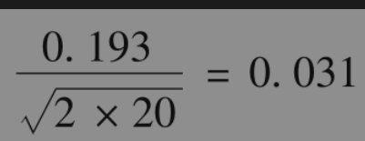

即每年3.1%。

在以上的分析中假定了股票不付股息，但这里的分析同样也适用于支付股息的股票。对应于一个包含除息日在内的时间区间，股票的收益率为

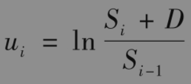

其中D为股息的数量，在其他时间区间内，股票的收益率仍为

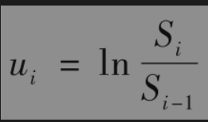

但是，由于税收因素可能会对收益率在除息日附近的计算起一定的作用，所以当我们利用每天或每周的数据进行计算时，也许最好的做法是除去包含除息日在内的时间区间里的数据。

## 15.4.2 交易日天数与日历天数

在计算和使用波动率参数时，一个很重要的问题是在度量时间时，我们究竟应该采用日历天数还是交易日天数。如业界事例15-2所示，研究结果表明交易所开盘交易时的波动率比休市时的波动率要高很多。因此，在使用历史数据计算波动率以及期权期限时，市场参与者往往会去掉交易所休市的日期。由以下公式我们可以从每个交易日的波动率来计算每年的波动率

这也正是在例15-4中利用表15-1里的数据来计算波动率时采用的公式。对于股票，每年的股票交易日天数通常假设为252天。

期权期限通常也是由交易日天数（而不是由日历天数）来度量的。结果用T年来表达，其中

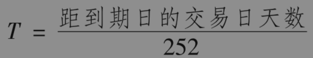

## 业界事例15-2

## 为什么价格会波动

我们很自然地假设股票的波动率是由市场所接收到的新信息引起的。这些新信息会使投资者对股票价值的观点产生改变，从而引起股票价格变化，产生波动。但是这种观点并没有得到研究结果的支持。利用连续几年中每天的股票数据，研究人员可以计算：

(1)在中间不包含非交易日时，一个交易日结束时与下一个交易日结束时股票价格收益率的方差。

(2)在星期五交易结束时与下星期一交易结束时股票价格收益率的方差。

第2项方差为3天之间收益率的方差。第1项方差对应于1天。我们也许很自然地认为第2项方差为第1项方差的3倍。法玛(1965)、弗伦奇(1980)以及弗伦奇和罗尔(1980)都证明了事实并非如此。这3项研究结果所估计的第2项方差只是分别比第1项方差高22%、19%和10.7%。

这时，你也许会说这些结果的起因是由于在交易开盘时有更多信息，但是罗尔(1984)的研究结果并不支持这一观点，罗尔检测了橙汁期货的价格：对于橙汁期货价格而言，最重要的决定因素是气候，而有关气候的信息对于任何时间都有同样的可能性。当罗尔做了一个类似于我们刚刚描述的有关股票的分析时，他发现橙汁期货的第2项（星期五至星期一）方差只是第1项方差的1.54倍。

唯一合理的结论是，在很大程度上，波动率是由交易本身引起的（交易员一般并不认为这一结论难以接受）。

