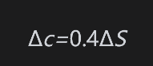
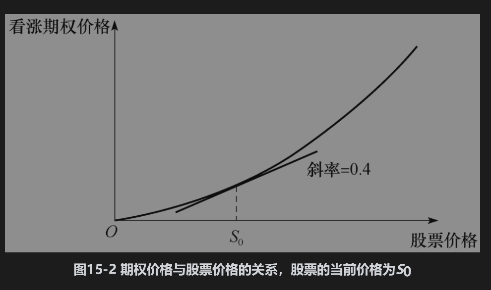

# 15.5 布莱克-斯科尔斯-默顿微分方程的概念

布莱克-斯科尔斯-默顿微分方程是每一个依赖于无股息股票的衍生产品价格必须满足的方程式。我们将在下一节中推导这个方程，在这里我们考虑布莱克-斯科尔斯-默顿方法的特性。

布莱克-斯科尔斯-默顿微分方程与第13章中利用二叉树描述股票价格时的无套利方法类似。在定价的过程中需要构造一个由衍生产品与标的股票所组成的无套利的交易组合。在无套利的条件下，这一交易组合的收益率必须为无风险利率r，由此我们可以得出布莱克-斯科尔斯-默顿微分方程。

我们之所以可以建立无风险交易组合是由于股票价格与期权价格均受同一种不定性的影响，即股票价格的变动。在任意一段短时期内，衍生产品的价格与股票价格有完美的相关性；在建立了一个适当的股票与期权的组合后，由股票所带来的盈亏总是可以抵消由期权所带来的盈亏。这样一来，交易组合在一个短时间内的价值变化也就成为已知且确定的。

例如，假定在某一特定时刻，股票价格的一个微小变动ΔS与由此所引起的欧式看涨期权价格变动Δc之间有以下关系

这意味着代表Δc与ΔS之间关系的切线斜率为0.4，如图15-2所示。无风险交易组合构造如下：

(1)40手股票的多头。

(2)100手看涨期权的空头。

假定股票价格上涨了10美分，期权价格将增长4美分。交易组合中股票的增长为40×0.1=4美元利得，这恰好等于期权短空头的100×0.04=4美元的损失。

布莱克-斯科尔斯-默顿分析与第13章里二叉树法的分析之间的一个重要的区别是：这里所建立的头寸只是在一个非常短的时间内是无风险的（从理论上讲，这种无风险只是在瞬间成立）。为了保持无风险状态，交易组合必须被频繁地调整或再平衡(rebalance)。例如，Δc与ΔS之间的关系也许会从今天的Δc=0.4ΔS变为明天的Δc=0.5ΔS。如果这种情况发生，为了保持交易组合为无风险形态，对卖出的每100手看涨期权，我们必须再买入10手股票。尽管如此，在短时间内无风险交易组合的收益率必须等于无风险利率。这是布莱克-斯科尔斯-默顿分析的关键，由此即可得出他们的定价公式。

## 假设

在推导布莱克-斯科尔斯-默顿微分方程时，我们采用以下假设：

(1)股票价格服从在第14章中所建立的过程，其中μ和σ为常数。

(2)可以卖空证券，并且可以完全使用所得收入。

(3)无交易费用和税收，所有证券均可无限分割。

(4)在期权期限内，股票不支付股息。

(5)不存在无风险套利机会。

(6)证券交易为连续进行。

(7)短期无风险利率r为常数，并对所有期限都是相同的。

我们将在后面的章节中讨论如何放宽其中一些假设。例如，σ和r可以是时间函数。只要股票价格在期权到期时的分布是对数正态，我们甚至可以让r也是随机的。