# 15.6 布莱克-斯科尔斯-默顿微分方程的推导

在本节里的定义与书中其他地方不一样，我们考虑衍生产品在一时间t（而不是时间0）时的价格。如果T是到期日，那么期权的期限是T-t。

我们假设股票价格服从在第14.3节里所建立的过程，即

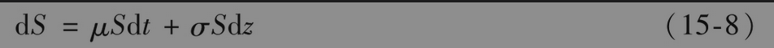

假定f为关于S的看涨期权（或其他取决于S的衍生产品价格）。变量f必须是S和t的函数。因此，由式(14-14)得出

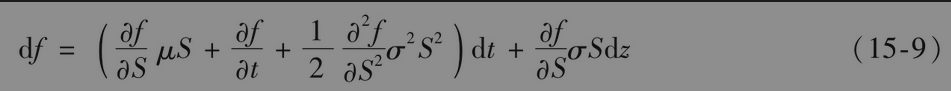

式(15-8)和式(15-9)的离散形式为

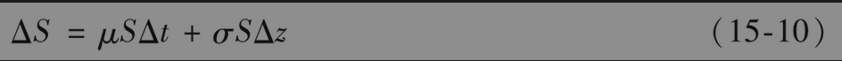

和

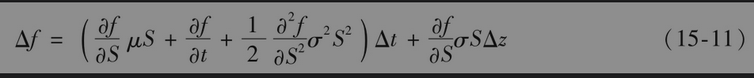

其中ΔS与Δf为S与f在一个短时间区间Δt内的变化量。回忆在第14.6节里有关伊藤引理的讨论可知f和S中的维纳过程是一样的。换句话讲，式(15-10)和式(15-11)中的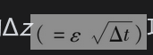项是一样的。因此，我们可以适当地选择股票与衍生产品期权组合来消除维纳过程。选取的证券组合为

-1：衍生产品

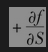：股票

以上组合含有一个衍生产品的空头与∂f/∂S数量的股票。定义Π为组合的价值，因此

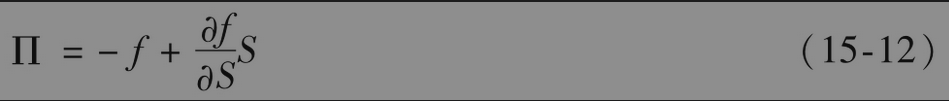

证券组合的价格在Δt时间区间内的变化由以下式子给出

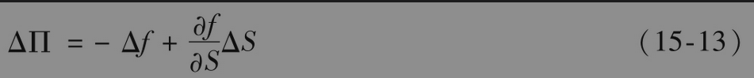

将式(15-10)和式(15-11)代入式(15-13)得出

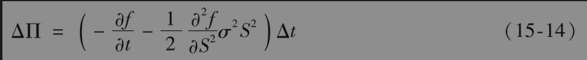

因为上面方程的右端不含Δz项，所以证券组合在Δt时间内一定是无风险的。前一节列举的假设意味着该证券组合必须赚取与其他短期无风险证券相同的瞬时收益率。如果该组合赚取的比这个收益率高，套利者可以通过借入资金买入组合而取得无风险收益；如果比这个收益率低，套利者可以卖空组合并同时买入无风险投资证券取得无风险收益。因此

其中r为无风险利率。将式(15-12)和式(15-14)代入式(15-15)会得出

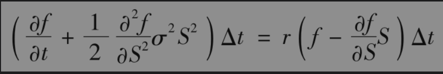

因此

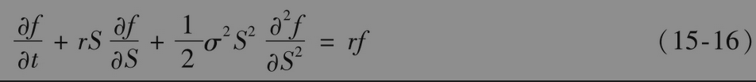

式(15-16)就是布莱克-斯科尔斯-默顿微分方程。对应于以S为标的变量的不同衍生产品，这一方程有不同的解。对于某一特定衍生产品，以上方程的解与方程的边界条件(boundary conditions)有关：边界条件定义了衍生产品在S和t的边界上的取值范围。欧式看涨期权的关键边界条件为当

                  t=T时，f=max(S-K,0)

欧式看跌期权的关键边界条件为

                  当t=T时，f=max(K-S,0)

【例15-5】 在无股息股票上的远期合约是一种依赖于这个股票的衍生产品，因此，其价格应满足式(15-16)。由式(5-5)得出，在时间t的远期合约价值与股票价格S之间关系满足

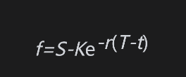

其中K为交割价格。这意味着

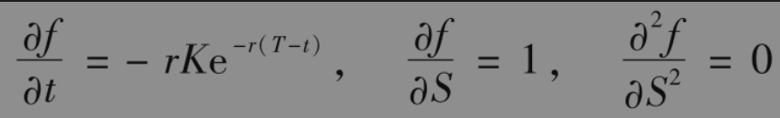

将以上方程代入式(15-6)的左端，我们得出

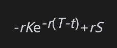

这正好等于rf。因此，对于远期合约式(15-16)确实成立。

## 15.6.1 永续衍生产品

某永续衍生产品：当股票价格第一次达到价值H时，该衍生产品收益为一个固定量Q。在这个例子中，对于任何值S，该衍生产品的价值与时间t无关，因此∂f/∂t量为零，偏微分方程式(15-16)也就变成了常微分方程。

首先假定S<H。衍生产品的边界条件是当S=0时，f=0，而当S=H时，f=Q。表达式f=QS/H满足边界条件和微分方程，因此，该表达式也就给出了衍生产品价值。

接下来假定S>H。衍生产品的边界条件是当S趋向无穷时，f=0，而当S=H时，表达式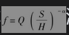满足边界条件，其中α为一个正常数，并且满足边界条件。当α满足以下方程时

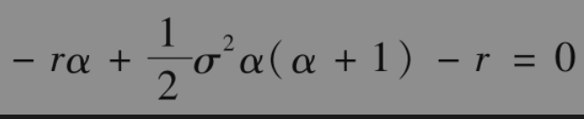

即α=2r/σ2时，以上表达式也满足微分方程。衍生产品的价值为

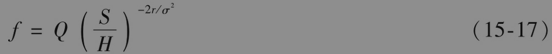

练习题15.31证明了式(15-17)可以用于对永续美式看跌期权定价。我们在第26.2节中将此处的分析推广到了当标的资产支付股息收益率为q时，如何对美式永续看涨和看跌期权定价。

## 15.6.2 可交易衍生产品的价格

任何满足式(15-16)的微分函数f(S,t)均可以作为某种可交易衍生产品(tradable derivative)的理论价格。如果以函数f(S,t)为价格的衍生产品确实存在，这个价格将不会造成任何套利机会。反之，如果函数f(S,t)不满足微分方程式(15-16)，那么在不给交易员制造套利机会的前提下，这一函数不会是衍生产品的价格。

为了说明这一点，我们首先考虑函数$`e^S`$，该函数不满足式(15-16)。它因此也不是股票价格上衍生产品的价格。如果一个价格等于$`e^S`$的产品确实存在，那么将一定会触发套利机会。在第2个例子里，函数

该函数满足微分方程式(15-16)，因此，从理论上讲，这一函数是某个可交易产品的价格（该衍生产品在T时刻的收益为$`1/S_T`$）。关于其他可交易产品，参见练习题15.19、练习题15.20、练习题15.31。