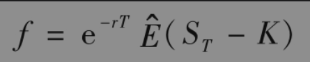
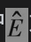
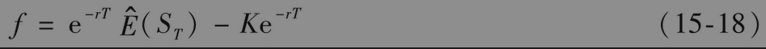
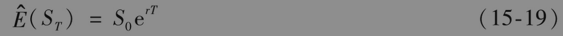
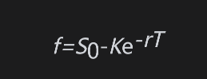

# 15.7 风险中性定价

在第13章中，我们曾利用二叉树模型引入风险中性定价的方法。毫无疑问，这是在衍生产品定价分析中一个最重要的工具。这个结果是由布莱克-斯科尔斯-默顿微分方程的一个关键性质而来的：布莱克-斯科尔斯-默顿微分方程不涉及任何受投资者风险偏好影响的变量，在方程中出现的变量包括股票的当前价格、时间、股票价格波动率和无风险利率，而它们均与风险选择无关。

如果布莱克-斯科尔斯-默顿微分方程涉及期望收益μ，那么它将不会与风险选择无关，这是因为μ的值确实与风险选择有关：投资者对风险的厌恶程度越高，对任何股票，相应的μ值也会越高。幸运的是在推导微分方程时，μ正好消失了。

由于布莱克-斯科尔斯-默顿微分方程与风险选择无关，我们可以利用下面的巧妙方法：如果风险选择在方程中不出现，那么它不会影响方程的解。因此，在计算f时，我们可以使用任何一组风险选择，尤其可以假设所有的投资者都是风险中性的。

在每一个投资者都是风险中性的世界里，所有投资的期望收益率均为无风险利率r，原因是对风险中性的投资者而言，不需要额外的回报而使他们承受风险。另外，在一个风险中性世界里，任何现金流的现值都可以通过对其期望值以无风险利率贴现得到。因此，在假设世界是风险中性时，能够大大地简化对衍生产品的分析。

考虑在某个时刻提供收益的衍生产品，我们可以利用风险中性定价原理对其定价，过程如下：

(1)假定标的资产的期望收益率为无风险利率（即假定μ=r）。

(2)计算衍生产品收益的期望。

(3)用无风险利率对期望收益进行贴现。

风险中性定价（或假设所有投资者都是风险中性）仅仅是获得期权定价公式的一个人为的工具，认识到这一点是非常重要的。我们所得到的解不仅在投资者是风险中性时成立，而且在所有世界里也都是成立的。当我们从风险中性世界换到风险厌恶世界时，两种情况将会发生：股票价格变动的增长率期望以及对衍生产品收益所必需使用的贴现率都将会变化，而这两种变化刚好相互抵消。

## 应用于股票远期合约

在第5.7节中，我们对不支付股息的股票上的远期合约做了定价，并且在例15-5中验证了定价公式满足布莱克-斯科尔斯-默顿微分方程。在这一节中，我们将利用风险中性定价方法来推导这个定价公式。我们假设利率是等于r的常数。这比第5章中的假设更强。

考虑一个期限为T的远期合约多头，交割价格为K。如图1-2所示，在合约到期时，远期合约的价值为

其中ST是股票在时间T的价格。由风险中性定价方法我们知道，远期合约在时间0的价值是其风险中性世界里在时间T的期望值以无风险利率加以贴现后的现值。将远期合约在时间0的价值记为f，这意味着

其中为风险中性世界里的期望值。由于K是常数，这个方程可以写成

在风险中性世界里，股票的收益率μ变成了r。因此，由式(15-4)我们有

将式(15-19)代入式(15-18)得到

这一结果同式(5-5)是一致的。