# 15.8 布莱克-斯科尔斯-默顿定价公式

微分方程式(15-16)最著名的解是关于看涨期权与看跌期权的定价公式。这些公式为

和

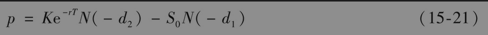

其中

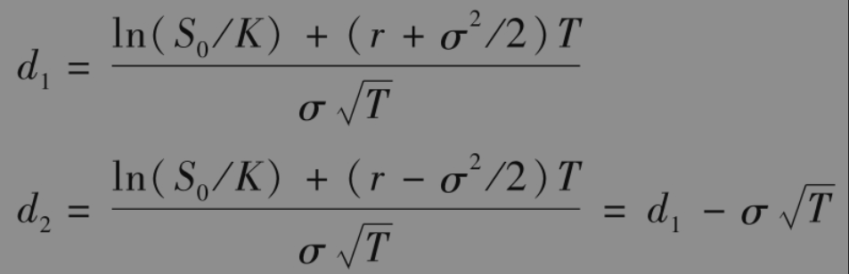

函数N(x)为标准正态分布的累积概率分布函数。换言之，这一函数等于服从标准正态分布ϕ(0,1)的随机变量小于x的概率（见图15-3）。我们对方程中的其他记号应当很熟悉：c与p分别为欧式看涨与看跌期权的价格，S0为股票在时间0的价格，K为执行价格，r为连续复利的无风险利率，σ为股票价格的波动率，T为期权的期限。

一种推导布莱克-斯科尔斯-默顿公式的方法是解微分方程式(15-16)满足在第15.6节中提到过的边界条件。（为了证明式(15-20)中的看涨期权价格满足微分方程，见练习题15.25）。另一种方法是利用风险中性定价。考虑欧式看涨期权，在风险中性世界里期权到期时的期望值是

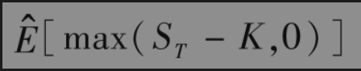

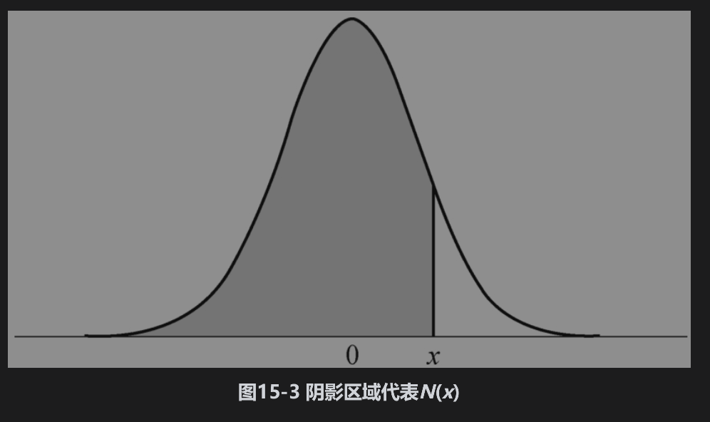

与前面相同，其中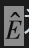为在风险中性世界里的期望值。从风险中性定价方法我们知道，欧式看涨期权的价格c等于这个期望值以无风险利率贴现后的现值，也就是说

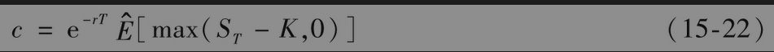

在本章的附录中，我们证明了由这个式子可以得出式(15-20)中的结果。

由于提前行使不支付股息股票上美式看涨期权永远不会是最优的（见第11.5节），所以式(15-20)也是不付股息股票上美式看涨期权的价值。不幸的是，还没有不付股息股票上美式看跌期权价值的精确解析公式。在第21章中，我们将讨论计算美式看跌期权的数值方法。

在实际中应用布莱克-斯科尔斯-默顿公式时，采用的利率r等于期限为T的无风险利率。在后面的章节中，我们将证明：当r是时间的已知函数时，在理论上公式仍然是成立的，而且只要股票价格在时间T服从对数正态分布，并且波动率参数取值适当，那么当r是随机时，这个公式也是成立的。我们在前面提到过，一般来讲，时间是按期权有效期内的交易天数除以1年内的交易天数来度量的。

## 15.8.1 如何理解N(d1)和N(d2)

我们对式(15-20)中的N(d2)有一个简单解释：它是在风险中性世界里期权被行使的概率。而我们对N(d1)却没有一个简单解释，表达式S0N(d1)erT是一个在ST>K时等于ST，在其他情（ST≤K时）等于零的变量在风险中性世界里的期望值。只有当股票价格大于执行价格K时，执行价格才会被支付，相应的概率为N(d2)，在风险中性世界里，期权在时间T的期望值等于

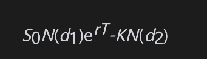

将以上表达式由时间T到时间0进行贴现，得出欧式看涨期权的布莱克-斯科尔斯-默顿公式

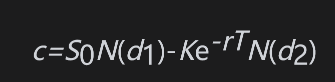

对于布莱克-斯科尔斯-默顿公式，我们还有另外一种解释。我们注意到布莱克-斯科尔斯-默顿公式也可以写成

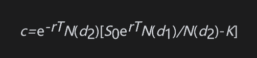

以上公式的各项有以下解释：

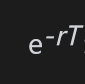：贴现因子；

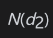：期权被行使的概率；

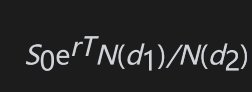：如果期权被行使，在风险中性世界里预期股票价格；

K：期权被行使时，相应的执行价格。

## 15.8.2 布莱克-斯科尔斯-默顿公式的性质

通过考虑给一些参数取极端值，我们现在证明布莱克-斯科尔斯-默顿公式具有正确的一般性质。

当股票价格S0很大时，看涨期权几乎肯定会被执行，这时期权与执行价格为K的远期合约非常相似。根据式(5-5)得出看涨期权价格应该为

事实上，以上公式正好是式(15-20)所给出的期权价格：因为当S0很大时，d1及d2均很大，因此N(d1)与N(d2)均接近于1.0。当股票价格很大时，欧式看跌期权的价格接近于0，这与式(15-21)是一致的，因为在这种情形下N(-d1)与N(-d2)均接近于0。

接着我们考虑当波动率接近于0的情形。因为股票价格几乎是无风险的，其价格在时间T将会增长到S0erT，看涨期权的收益为

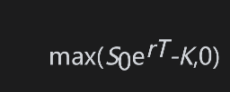

以利率r贴现，看涨期权在今天的价格是

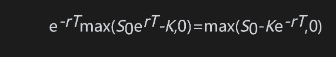

为了证明这与式(15-20)一致，首先考虑当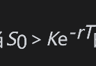的情况，这意味着ln(S0/K)+rT＞0。当σ趋于0时，d1和d2均趋向于+∞，因此N(d1)与N(d2)均趋向于1.0，式(15-20)变成了

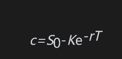

当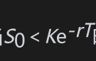时，将有ln(S0/K)+rT＜0。当σ趋向于0时，d1和d2均趋向于-∞，所以N(d1)与N(d2)均趋向于0，方程所给的看涨期权价格为0。我们可以类似地证明当σ趋于0时，看跌期权的价格总是max(Ke-rT-S0,0)。