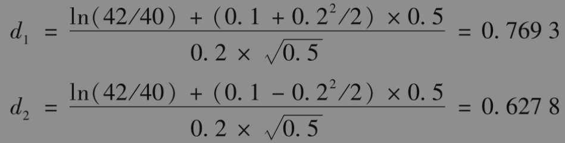
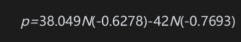
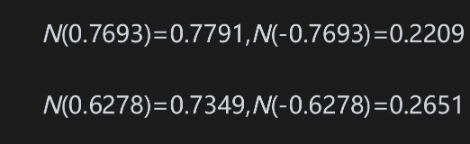

# 15.9 累积正态分布函数

在计算式(15-20)与式(15-21)时，我们需要计算标准正态分布的累积函数N(x)。本书在结尾部分提供了N(x)的表格。Excel中的NORMSDIST函数提供了一种计算N(x)的简便方式。

【例15-6】 考虑一份6个月期限的期权。股票当前价格为42美元，执行价格为40美元，无风险利率为每年10%，波动率为每年20%，也就是说S0=42，K=40,r=0.1，σ=0.2，T=0.5，因此

以及

如果该期权为欧式看涨期权，其价格c为

如果该期权为欧式看跌期权，其价格p为

采用以上多项式近似或Excel中的NORMSDIST函数

由此得出

                       c=4.76,p=0.81

当忽略货币的时间价值时，股票价格至少上涨2.76美元才能使得看涨期权的持有者盈亏均衡。类似地，股票价格至少下跌2.81美元才能使得看跌期权的持有者盈亏均衡。