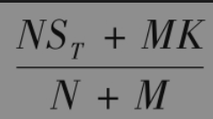
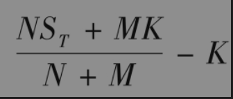
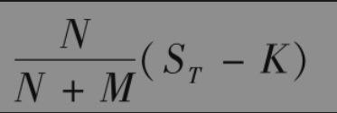
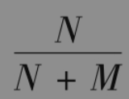
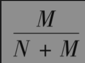
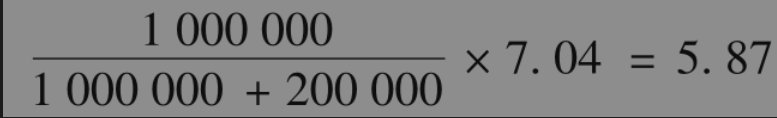

# 15.10 权证与雇员股票期权行使

一家公司的普通看涨期权对于在市场上交易的公司股票数量没有任何影响。如果期权承约者不拥有公司的股票，那么他在期权被行使时必须在市场上按通常的方式买入股票，然后按执行价格卖给期权的持有者。如在第10章中解释过的那样，权证与雇员股票期权和一般看涨期权的不同之处是在权证与雇员股票期权被行使时，公司必须首先发行更多的股票，然后再以执行价格卖给期权持有者。由于执行价格低于股票的市场价格，这些期权的行使会对市场上现有股票持有者的利益产生稀释效应。

这种潜在的稀释效应是否会影响我们对既存权证与雇员股票期权的定价方式呢？答案是否定的。假定市场是有效的，那么股票价格已经反映了已有的权证与雇员股票期权的稀释效应。业界事例15-3解释了这一点。

## 业界事例15-3

## 认股权证、雇员期权和稀释效应

考虑一家公司，该公司发行了100000股股票，每股股票的价格为50美元。公司发布了一个市场没有预料到的消息：公司将发行100000份股票期权给其雇员，期权执行价格为50美元。如果市场认为公司为了削减雇员工资而发行的期权对股东没有带来好处，并且对那些较为上进的经理也没有好处，那么股票价格会很快下跌。如果股票价格跌至45美元，期权给股东带来的稀释费用为每股5美元，整体费用为500000美元。

假定公司在3年后表现很好，届时股票价格为每股100美元。假定所有的期权将在3年末行使，雇员期权每份的收益为50美元。这时人们可能会认为期权行使会带来更多稀释效应，即100000股每股价格为100美元的股票会与100000股每股价格为50美元的股票进行合并，因此股票价格会跌至75美元，期权持有人的每份收益只有25美元。但是，以上说法是有问题的。市场预料股票期权会被行使，股票价格已经反映了这一预期。因此，每份期权的收益仍为50美元。

这个例子反映了一个普遍现象，即当市场有效时，雇员期权和认股权证被发行后，股票价格中很快会体现出这些产品的稀释效应。

接下来，我们考虑某家想发行新权证（或雇员股票期权）公司的情形。在发行新权证没能增加公司价值的假设下，公司想计算发行权证的费用。我们假定这家公司总共已经发行了数量为N的股票，每股的价格为S0，公司考虑发行M份新期权，每份期权可以使期权持有者以K的价格买入1股股票。公司在今天的市值为NS0，这一价值不受发行新权证的影响。假设在没有发行权证的前提下，股票价格在权证满期时刻T的价格为ST。这意味着，在时刻T股权和权证的价值（无论发行权证或不发行权证）的总和为NST。如果权证被行使，由执行价格所带来的资金流会使股权和权证的价值总和变为NST+MK，这一价值会在N+M股股票进行分配，因此，在权证被行使后，股票价格变为

期权持有者行使期权所得收益为

上式等于

这里讨论的期权价格等于

乘以公司股票上的普通看涨期权价格。因此，期权的总费用等于M乘以上式。由于我们假设公司并没有由于发行权证而受益，这时一旦市场知道了发行权证的决定，公司股票总值将会马上下降，下降的数量为期权的总费用。这意味着股票价格将会下降

乘以公司股票上期限为T、执行价格为K的普通看涨期权价格。

【例15-7】 某公司共现有100万股股票，每股价格为40美元，该公司正在考虑发行200000份权证，每份权证给持有者在5年后可以按每股60美元的价格买入股票的权利。公司想知道发行这样权证的费用。假定利率为每年3%，波动率为每年30%，公司不支付股息。由式(15-20)得出，5年期的期权价格为7.04美元。这时，N=1000000,M=200000，因此，每份权证的价格为

即5.87美元，发行权证的总费用为200000×5.87=117万美元。如果市场认为公司不会由于发行权证而收益，我们预计股票价格将会下降1.17美元，到38.83美元。