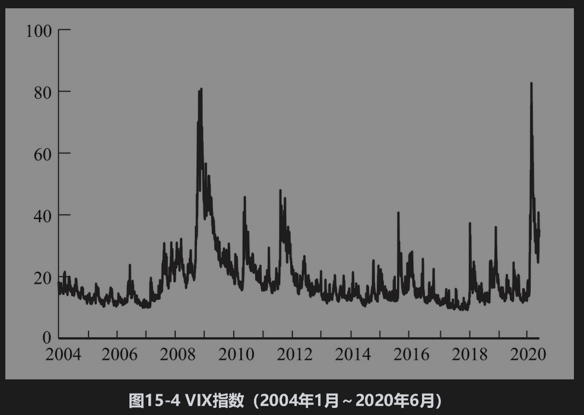

# 15.11 隐含波动率

在布莱克-斯科尔斯-默顿定价公式中，不能直接观察到的参数只有股票价格的波动率。在第15.4节中，我们已经讨论了如何由股票的历史价格来估计波动率。在实际中，交易员通常使用所谓的隐含波动率(implied volatility)。这一波动率是指由期权的市场价格所隐含的波动率。

为了说明隐含波动率是如何计算的，假设一个不付股息股票的欧式看涨期权价格为1.875，而S0=21，K=20,r=0.1和T=0.25。隐含波动率是使得式(15-20)所给期权价格c=1.875时对应的σ值。不幸的是，我们不能靠直接反解式(15-20)将σ表示成期权价格与其他变量S0、K、r、T和c的函数，但是我们可以用迭代的方式求解所隐含的值σ。例如，开始时我们令σ=0.20，对应这一波动率，期权价格c为1.76美元，这一价格太低。由于期权价格为σ的递增函数，我们需要一个较大的σ值。我们再令σ=0.30，对应的期权价格c为2.10美元，此值高于市价，这意味着σ一定介于0.2～0.3。接下来，我们令σ=0.25，此值所对应的期权价格仍太高，所以σ应该在0.20～0.25。这样继续下去，每次迭代都使σ所在的区间减半，因此我们可以计算出满足任何精确度的σ近似值。在本例中，隐含波动率σ=0.235，即每年23.5%。与二叉树结合，利用类似的方法可以计算美式期权的隐含波动率。

隐含波动率可以用来衡量市场对于某一股票波动率的观点。历史波动率（见第15.4节）是回望型(backward looking)，而隐含波动率则为前瞻型(forward looking)。通常，交易员对于期权所报出的是隐含波动率，而不是期权的价格。这样做会带来许多方便，因为波动率的变化比期权价格变化更加稳定。市场上交易较为活跃的期权隐含波动率常被交易员用来估算其他期权的隐含波动率。

## VIX指数

芝加哥期权交易所(CBOE)编制发布隐含波动率的指数。最流行的指数是SPX VIX，这是由包括标准普尔500上许多30天期限的看涨和看跌期权计算的。这一指数也被称为“恐惧指数”(fear factor)，VIX取值为15意味着对标准普尔500指数上30天期限的期权隐含波动率估计为15%。在第26.16节中有关于该指数计算方式的内容。在VIX上的期货交易是从2004年开始的，而在VIX上的期权交易是从2006年开始的，一份合约等于1000乘以指数值。

【例15-8】 假设一个交易员买了一份VIX上4月的期权合约，当时的期货价格是18.5（相当于30天标准普尔500指数波动率为18.5%），并当期货价格为19.3（相当于30天标准普尔500指数波动率为19.3%）时平仓。交易员赚了800美元。

涉及标准普尔500指数的期权是在将来的标准普尔500指数水平以及标准普尔500指数波动率两方面下赌注，与此相反，VIX上的期货或期权只是在波动率上下注。图15-4显示了在2004年1月～2020年6月的VIX指数。在2004～2007年年中，VIX指数通常保持在10～20；在2007年下半年，指数达到30；而在2008年10月与11月雷曼兄弟破产后，指数有高达80的纪录。在2010年年初，指数逐渐降到通常的水平，自2010年以来，由于金融市场的不确定性，指数出现了数次高峰。2020年，由于新冠肺炎疫情的暴发，指数又一次大幅增长。

VIX指数监控的是标准普尔500指数的波动率。芝加哥期权交易所还编制发布了其他一些波动率指数，包括股票指数、商品指数、利率、外汇以及一些股票（例如，亚马逊与高盛）上的波动率，甚至还有一个VIX上的波动率指数(VVIX)。