# 15.12 股息

到目前为止，我们一直假设期权的标的股票不付任何股息。在本节中，我们对布莱克-斯科尔斯-默顿模型加以修改，以便考虑股息。我们假设可以准确地预测在期权有效期内股息的数量与付出时间。对于短期限的期权，这个假设并不是不合理（对于长期限的期权，我们通常假设已知的是股息率，而不是股息的现金数量，这时可以按我们在第17章中所述的方法对期权定价）。股息付出日期应当是除息日，在这个日期上，股票价格下跌的幅度为股息的数量。

## 15.12.1 欧式期权

为了分析欧式期权，我们假设股票价格由以下两部分组成：对应于在期权有效期内所付股息的无风险部分与有风险部分。在任意给定时刻，无风险部分等于在期权有效期内的所有股息以无风险利率从除息日贴现到今天的现值。当期权到期时，这些股息已经被付出，从而无风险部分不再存在。因此，当S0表示为有风险部分的价格、σ为有风险部分所服从过程的波动率时，布莱克-斯科尔斯-默顿公式仍然正确。

在运作上，这意味着只要在股票价格中除去所有在期权有效期限内股息的贴现值，我们仍然可以采用布莱克-斯科尔斯-默顿模型对期权定价。在计算股息贴现值时，我们采用的贴现日期为除息日，贴现利率等于无风险利率。像已经讲过的那样，只有除息日在期权有效期内的股息才用于计算。

【例15-9】 考虑1份欧式股票看涨期权，股票在2个月与5个月后分别有一个除息日。预计在每个除息日的股息都为0.5美元。股票目前的价格为40美元，执行价格为40美元，股票价格波动率为每年30%，无风险利率为每年9%，期权期限为6个月。股息的贴现值为

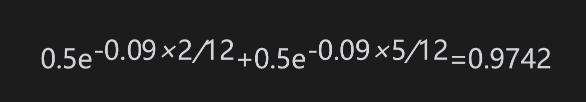

因此，期权价格可由布莱克-斯科尔斯-默顿公式求出，在公式中输入的参数为S0=40-0.9742=39.0258，K=40,r=0.09,σ=0.3和T=0.5，由此得出

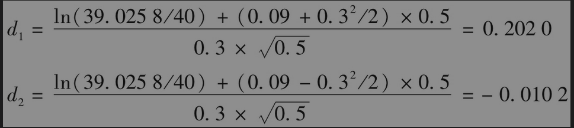

利用Excel中的NORMSDIST函数可以得出

              N(d1)=0.5800及N(d2)=0.4959

由式(15-20)得出期权价格为

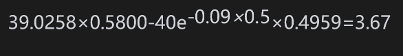

即3.67美元。

有些研究人员对于以上给出的计算有股息股票上欧式期权价格的方法提出了批评。他们认为波动率应该是适用于股票价格，而不是剔除了股息贴现值以后的股票价格。研究人员也提出了一些具体的做法。当波动率是由历史数据来估计时，采用这些做法比较合理，但是，在实践中，计算期权时所使用的波动率几乎总是由第20章讲述的由其他期权价格隐含得出。如果一个交易员采用同一个模型计算隐含波动率和期权价格，计算结果也会准确，但并不会与模型高度相关。另外重要的一点是在实践中，如第18章所述，市场参与者通常采用标的资产远期价格计算欧式期权价格，这样做可以避免直接计算资产的预期收入，远期价格的波动率等于股票价格扣除股息贴现值后的波动率。

在我们这里讨论的模型中，股票价格被分成了两个部分，这种做法是内在一致的，并在业界广泛应用。在第21章中对于美式期权定价时，我们也会采用同样的方法。

## 15.12.2 美式期权

下面我们考虑美式期权。在第11章里我们看到，在没有股息的情况下，永远不应该在到期日之前行使这个期权。将论证推广后可以证明，对于一个支付股息的美式期权，其最优行使时间可能为刚好在股票除息日之前的时刻。我们假定股票将预计在时间t1,t2,…,tn（其中t1<t2<…<tn）分发股息，在每个除息日相应的股息量分别为D1,D2,…,Dn。

我们首先考虑在最后一个除息日（即tn）前提前行使期权的可能性。如果在tn行使期权，投资者的收益为

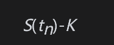

其中S(t)为股票在时间t的价格。如果没有行使期权，股票价格下跌到S(tn)-Dn。如式(11-4)所示，期权的值将大于

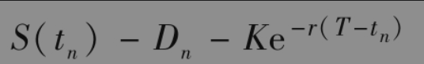

因此，如果

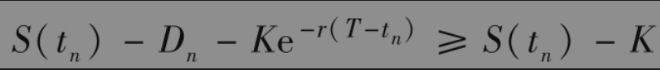

即

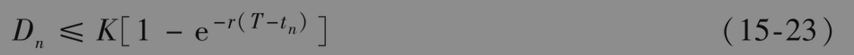

那么在tn时刻行使期权将不会是最优。反之，如果

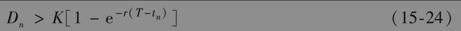

那么在对股票价格服从随机过程所做的任何合理假设之下，当S(tn)足够大时，在tn行使期权是最优的。当最后一个除息日接近期权到期日（即当T-tn很小）而且股息很大时，不等式(15-24)往往会被满足。

接下来考虑tn-1时刻，就是倒数第2个除息日。如果在tn-1时行使期权，投资者会收到

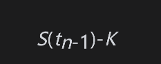

如果在tn-1时刻没有行使期权，股票价格降至S(tn-1)-Dn-1，之后最近一个可行使期权的时刻为tn。根据式(11-4)，如果在tn-1不行使期权，期权价格的下限为

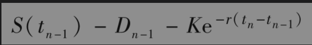

因此，如果

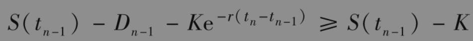

即

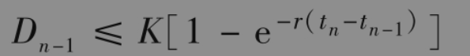

在tn-1时行使期权不会是最优选择。与此类似，对于任意i<n，如果

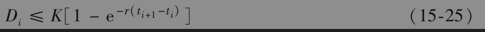

那么在ti时行使期权不会是最优选择。

不等式(15-25)近似地等价于以下不等式

假如K与当前股票价格十分接近，股息率小于无风险利率时以上不等式将会成立。通常情况是这样的。

由这一分析我们可以得出，在许多情形下，美式期权可能被提前行使的时间往往是最后一个除息日tn。再有，如果不等式(15-25)对于i=1,2,…,n-1均成立，并且不等式(15-23)也成立，那么我们可以确认提前行使期权不会为最优选择，因此美式期权也可以被看作欧式期权。

## 15.12.3 布莱克近似法

布莱克建议采用一种计算美式看涨期权的近似方法。这种方法考虑了可能提前行使期权的特征。这种近似方法包括按本节前面所述的方法计算在T和tn到期的欧式期权价格，然后令美式期权价格等于两者的最大值。这一方法是一种近似，其效果相当于期权持有人在起始时刻就要决定是否在T或tn行使期权。