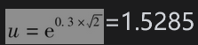
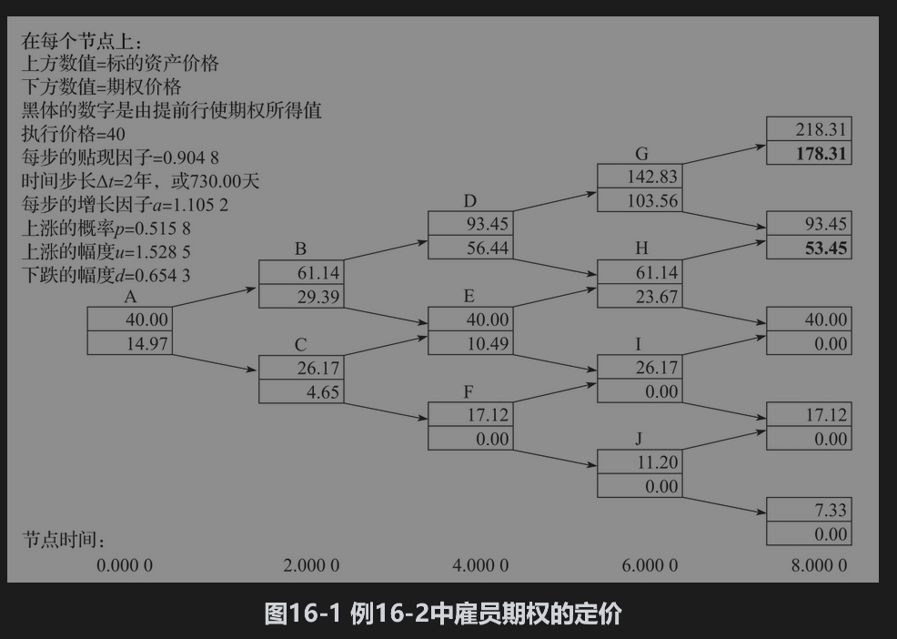
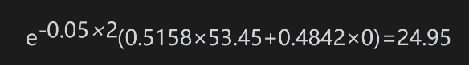
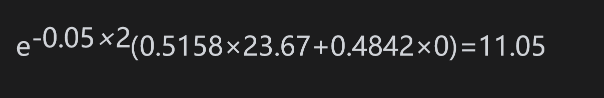

# 16.4 定价

在雇员股票期权定价方面，会计准则给予公司很大的选择余地。在本节中，我们将叙述其中的几种方法。

## 16.4.1 使用布莱克-斯科尔斯-默顿模型

常常使用的一种方法是基于所谓的预期期限(expected life)，这是指雇员在行使期权或期权到期之前持有期权的平均时间。预期期限可以近似地从雇员提前行使期权的历史数据来估计，并且反映等待期、雇员离开公司的影响以及像在第16.1节中所述的雇员股票期权比普通期权更倾向于被提前行使的影响。这种方法是在将期权有效期T设成预期期限后，使用布莱克-斯科尔斯-默顿公式。波动率一般是按第15.4节中所述的方法通过几年历史数据来估计的。

应当强调的是以这种方式应用布莱克-斯科尔斯-默顿公式是没有理论依据的。我们没有什么理由认为期限为T的欧式期权大致等于所关心的预期期限为T的美式雇员期权价值。但是这种模型所给出的价格并不是完全没有道理的。当将期权作为费用时，公司常常会提到在布莱克-斯科尔斯-默顿计算中所用的预期期限与波动率。

【例16-1】 一家公司在2021年11月1日授予其高管100万份期权。当时的股票价格是30美元，并且期权的执行价格也是30美元。期权有效期为10年，等待期为3年。公司在过去的10年内一直在发行类似的平值期权，而这些期权被行使或作废的平均时间是4.5年。因此公司决定使用4.5年的预期期限。利用5年的历史数据，公司估计出的股票价格长期波动率为25%。在今后4.5年内所付股息的现值估计为4美元，4.5年期的无风险零息利率为5%。因此，由布莱克-斯科尔斯-默顿模型对期权定价时（按第15.12节里所述的方式对股息进行调整）S0=30-4=26，K=30,r=5%,σ=25%以及T=4.5年。布莱克-斯科尔斯-默顿公式给出了一个期权的价值为6.31美元。因此，在利润表上将1000000×6.31=6310000美元列为费用。

## 16.4.2 二叉树方法

对雇员股票期权定价的一种比较先进的方法是建立像第13章中那样的二叉树，并且在倒推计算时做以下调整：①期权是否已经生效；②雇员离开公司的概率；③雇员选择行使期权的概率。期权的条款决定了在所选的二叉树节点上期权是否已经生效，人事变更方面的历史数据可以用来估计期权被提前行使或由于雇员离开公司而作废的概率，而较难数量化的是在二叉树不同节点上雇员选择行使期权的概率。显然，当股票价格与执行价格的比率增大和距离到期日越近时，这个概率也将会增加。如果有足够多的历史数据，那么可以将行使期权的概率作为这两个变量的函数而进行估计（至少可以近似地这样做）。

【例16-2】 假设一家公司所授予的股票期权延续8年，等待期为3年。股票价格与执行价格均为40美元，股票价格的波动率是30%，无风险利率是5%，而且公司不付股息。图16-1展示了如何使用一个4步二叉树来对期权定价（这只是为了演示，在实际中需要更多的步数）。在这里σ=0.3,Δt=2,r=5%。于是，使用第13章中的记号，a=e0.05×2=1.1052，，d=1/u=0.6543，以及p=(a-d)/(u-d)=0.5158。价格向上移动的概率为0.5158，而向下移动的概率是0.4842。有可能提前行使期权的三个节点是D、G和H（在节点B期权尚未生效，在其他节点上期权不是实值）。我们假设期权持有人在节点D、G和H上选择行使期权的概率（在此之前没有被行使的条件下）分别为40%、80%和30%。我们假定在每一步上雇员离开公司的概率是5%（相当于雇员更新率为大约每年2.5%）。为了方便计算，我们假定雇员离开公司的时间总是在时间段末。如果雇员在期权生效前或虚值时离开公司，那么期权将会作废。在其他情况下，必须立即行使期权。

在最后的节点上，期权价值等于内含价值。现在我们考虑对应于第6年的节点。节点I和J上很简单，由于在它们之后的节点上，期权没有价值，因此在这两个节点上，期权的价值为零。在节点H上雇员有30%的概率会选择行使期权。在选择不行使期权的情况下，雇员有5%的可能性将会由于离开公司而必须立即行使期权。因此，选择行使期权的总概率为0.3+0.7×0.05=0.335。如果期权被行使，它的价值是61.4-40=21.4。如果不被行使，它的价值是

因此在节点H上期权的值为

                 0.335×21.24+0.665×24.95=23.67

与此类似，在节点G上期权的值为

                  0.81×102.83+0.19×106.64=103.56

我们接下来考虑对应于第4年的节点。在节点F上期权的价值显然是零。在节点E上，有5%的概率由于雇员离开公司而放弃期权，95%的可能性会保留期权。在后一种情况下，期权的价值是

因此在这个节点上，期权的价值是0.95×11.05=10.49。在节点D，行使期权的概率是0.43，保留期权的概率为0.57，期权的价值是56.44。

接下来考虑对应于最初与第2年的节点。期权还没生效，而作废的概率是5%，再保留两年的概率是95%，这样就产生了图16-1中所示的定价过程。期权在最初时的价值是14.97（这可以与利用同一个二叉树所给出的普通期权价格17.98进行比较）。

## 16.4.3 行使倍数方法

赫尔和怀特提出了一种简单的模型，其中一旦期权生效并且股票价格与执行价格的比率高出某一水平，雇员将立即行使期权。他们将导致行使期权的股票价格与执行价格比率称为行使倍数(exercise multiple)。期权的价格可由二叉树或三叉树来计算。如第27.6节所述，在构造二叉树或三叉树时，保证期权被行使的股票价格位于树的节点，这是很重要的。例如，当执行价格是30美元，并且假设当股票价格与执行价格的比率达到1.5倍时，雇员将行使期权。在构造树时，应当使树上有的节点正好在股票价格为45美元的水平上。树形的计算与例16-2相似，并且将雇员离开公司的可能性考虑在内。为了估计行使倍数，我们需要从历史数据中计算在行使期权时股票与执行价格的平均倍数（在到期日行使与雇员由于终止工作而行使期权不包括在这个计算之内）。这也许比预期期限要容易估计，因为后者在很大程度上依赖于股票价格所运行的特殊轨迹。

## 16.4.4 基于市场的处理方法

对雇员股票期权定价的一种方法是看市场能对期权付什么价格。思科在2006年试用了这种方法，它提出了向机构投资者出售具有与雇员期权同样条款的期权。这种方法遭到了美国证券交易委员会(SEC)的拒绝，理由是参加对期权竞价的投资者不够广泛。

美国的Zions Bancorp提出了另一种方式。它建议在市场上变卖与雇员期权实际实现收益相同的证券。例如，某一个雇员股票期权的执行价格为40美元，而且结果是正好有1%的雇员在5年后当股票价格为60美元时行使了期权，2%的雇员在6年后当股票价格为65美元时行使了期权，等等。这样，投资者所持有证券的1%在5年后具有20美元的收益，2%在6年后具有25美元的收益，等等。

Zions Bancorp利用自己所授予雇员的期权对这一想法做了检验，并采用了一种荷兰式拍卖(Dutch auction)的形式向投资者拍卖。在这种拍卖过程中，个人或公司递交筹码，表明打算支付的价格以及准备购买的期权数量。成交价格是使得按此或更高价格购买期权的累计总数超过要卖出期权总数的最高价格。准备按高于成交价格购买期权的买主的买单首先被满足，而准备按成交价格购买期权的买主得到剩余的部分。Zions Bancorp在2007年10月宣布它所建议的市场方法已经得到了SEC的认同，然而这种方法并未被广泛应用。

## 16.4.5 稀释效应

当雇员行使期权时，公司需要发行新股，并按低于目前市场上的价格将其卖给雇员，这将在某种程度上对公司现有股票产生稀释(dilution)效应。很自然地，人们会认为稀释效应是发生在期权行使的时刻，但事实上并非如此。如第15.10节所述，当市场上第一次得到有关授予股票期权的消息时，股票价格就已经被稀释。市场上已经预料到行使期权的这种可能性，并立即体现在股票的价格上。在业界事例15-3中的例子强调了这一点。

在公布授予期权时，随后的股票价格则反映了可能的稀释效应。只要在对期权定价时使用这个价格，那么就没有必要去为了稀释效应而调整期权价格。在许多情况下，市场会预料公司将不断授予雇员股票期权，所以甚至在期权公布之前股票的市场价格就已经预料到了这种稀释作用。

如果一家公司正在考虑授予雇员使市场感到意外的期权，那么期权的费用可以用例15-7中所述的方法来计算。这项费用可以与较低的正常雇员报酬以及较少的雇员跳槽等好处相比较。